# MaintainabilityAI

[](https://github.com/AliceNN-ucdenver/MaintainabilityAI/actions)
[](LICENSE)
[](https://github.com/AliceNN-ucdenver/MaintainabilityAI/actions/workflows/codeql.yml)
[-orange)](https://owasp.org/Top10/)

> **MaintainabilityAI** — a hands-on starter kit for **security-first AI-assisted engineering**.
> Uses a bold **Tailwind** marketing site + a nested docs section, a full **OWASP A01–A10 prompt pack**, **insecure code samples** to remediate, and **checks** (CodeQL, Snyk, ESLint/Jest) to keep you honest.

**🌐 Live Site**: [maintainability.ai](https://maintainability.ai)

---

## 🚀 Quick Start

```bash
# 1) Install dependencies
npm install

# 2) Build the site & docs
npm run build

# 3) Run local dev server for the Tailwind site
npm run dev

# 4) Run tests and linters
npm test
npm run lint
```

GitHub Pages is pre-wired via Actions to publish the **Tailwind site** (at `/`) with integrated docs accessible at [maintainability.ai/docs](https://maintainability.ai/docs).

---

## 📚 OWASP Top 10 (2021) → Workshop Resources

| ID  | Category | Prompt Pack | Insecure Example | Tests | Notes |
|-----|----------|-------------|------------------|-------|-------|
| **A01** | Broken Access Control | [`/prompts/owasp/A01_broken_access_control.md`](prompts/owasp/A01_broken_access_control.md) | [`/examples/owasp/A01_broken_access_control/insecure.ts`](examples/owasp/A01_broken_access_control/insecure.ts) | [`__tests__/bac.test.ts`](examples/owasp/A01_broken_access_control/__tests__/bac.test.ts) | Deny-by-default, RBAC/ABAC checks |
| **A02** | Cryptographic Failures | [`/prompts/owasp/A02_crypto_failures.md`](prompts/owasp/A02_crypto_failures.md) | [`/examples/owasp/A02_crypto_failures/insecure.ts`](examples/owasp/A02_crypto_failures/insecure.ts) | `__tests__/crypto.test.ts` | Proper hashing, key mgmt, TLS |
| **A03** | Injection | [`/prompts/owasp/A03_injection.md`](prompts/owasp/A03_injection.md) | [`/examples/owasp/A03_injection/insecure.ts`](examples/owasp/A03_injection/insecure.ts) | [`__tests__/injection.test.ts`](examples/owasp/A03_injection/__tests__/injection.test.ts) | Parameterized queries, validation |
| **A04** | Insecure Design | [`/prompts/owasp/A04_insecure_design.md`](prompts/owasp/A04_insecure_design.md) | [`/examples/owasp/A04_insecure_design/insecure.ts`](examples/owasp/A04_insecure_design/insecure.ts) | `__tests__/design.test.ts` | Threat modeling, secure patterns |
| **A05** | Security Misconfiguration | [`/prompts/owasp/A05_security_misconfig.md`](prompts/owasp/A05_security_misconfig.md) | [`/examples/owasp/A05_security_misconfig/insecure.ts`](examples/owasp/A05_security_misconfig/insecure.ts) | `__tests__/misconfig.test.ts` | Headers, CORS, debug toggles |
| **A06** | Vulnerable Components | [`/prompts/owasp/A06_vuln_outdated.md`](prompts/owasp/A06_vuln_outdated.md) | [`/examples/owasp/A06_vuln_outdated/insecure.ts`](examples/owasp/A06_vuln_outdated/insecure.ts) | `__tests__/components.test.ts` | SCA, version pinning, lockfiles |
| **A07** | Authentication Failures | [`/prompts/owasp/A07_authn_failures.md`](prompts/owasp/A07_authn_failures.md) | [`/examples/owasp/A07_authn_failures/insecure.ts`](examples/owasp/A07_authn_failures/insecure.ts) | `__tests__/auth.test.ts` | Password policy, sessions, MFA |
| **A08** | Integrity Failures | [`/prompts/owasp/A08_integrity_failures.md`](prompts/owasp/A08_integrity_failures.md) | [`/examples/owasp/A08_integrity_failures/insecure.ts`](examples/owasp/A08_integrity_failures/insecure.ts) | `__tests__/integrity.test.ts` | Signed artifacts, supply chain |
| **A09** | Logging/Monitoring Failures | [`/prompts/owasp/A09_logging_monitoring.md`](prompts/owasp/A09_logging_monitoring.md) | [`/examples/owasp/A09_logging_monitoring/insecure.ts`](examples/owasp/A09_logging_monitoring/insecure.ts) | `__tests__/logging.test.ts` | Structured logs, PII redaction |
| **A10** | Server-Side Request Forgery | [`/prompts/owasp/A10_ssrf.md`](prompts/owasp/A10_ssrf.md) | [`/examples/owasp/A10_ssrf/insecure.ts`](examples/owasp/A10_ssrf/insecure.ts) | `__tests__/ssrf.test.ts` | Allowlist egress, metadata protection |

> **Note**: The OWASP Top 10 (2021) is the current official list. When OWASP publishes a new edition, update the table mapping and prompt titles accordingly.

---

## 🎯 MaintainabilityAI SDLC


**Key Stages**:
1. **Design Intent** → Define what you're building and why
2. **Spec + Threat Model** → Identify security requirements and threats
3. **Prompt Pack** → Use OWASP-specific prompts for secure implementation
4. **Agentic Plan** → AI agent creates implementation plan
5. **Implementation** → AI-assisted coding with security constraints
6. **Local Scans** → Fast feedback via ESLint and Jest
7. **CI/CD** → Automated security gates (CodeQL, Snyk)
8. **Human Review** → Apply Golden Rules before merge
9. **Deploy** → Ship to production
10. **Monitor** → Track security metrics
11. **Improve** → Refine prompts and patterns

---

## 🛡️ Security Pipeline

```mermaid
sequenceDiagram
    participant Dev as Developer
    participant IDE as VS Code<br/>(Claude/Copilot)
    participant Local as Local Checks<br/>(ESLint/Jest)
    participant Git as Pre-commit<br/>(Snyk Code)
    participant CI as CI/CD<br/>(CodeQL/Snyk)
    participant Human as Human Review
    participant Prod as Production

    Dev->>IDE: Write prompt with security constraints
    IDE->>Dev: Generate code suggestion
    Dev->>Local: npm test && npm run lint
    Local-->>Dev: ✅ Pass / ❌ Fail
    Dev->>Git: git commit
    Git->>Git: Run Snyk code scan
    Git-->>Dev: ✅ Pass / ❌ Fail
    Dev->>CI: git push (open PR)
    CI->>CI: CodeQL security analysis
    CI->>CI: Snyk dependency scan
    CI-->>Dev: ✅ Pass / ❌ Fail
    Dev->>Human: Request review
    Human->>Human: Apply Golden Rules checklist
    Human-->>Dev: Approve / Request changes
    Human->>Prod: Merge & Deploy
```



**Defense Layers**:
- **Layer 1 (IDE)**: AI generates secure code from security-first prompts
- **Layer 2 (Local)**: ESLint catches patterns, Jest validates behavior
- **Layer 3 (Pre-commit)**: Snyk Code SAST before commit
- **Layer 4 (CI)**: CodeQL + Snyk automated scans on PR
- **Layer 5 (Human)**: Security-focused code review with PR template

---

## 🧪 Security Workflow (Workshop Flow)

```mermaid
flowchart LR
  A[Design Intent] --> B[Security-First Prompt\n(OWASP pack)]
  B --> C[AI Suggestion\n(Claude/Copilot/ChatGPT)]
  C --> D[Local Checks\nESLint/Jest]
  D --> E[Pre-commit Scans\nSnyk Code]
  E --> F[PR + CI/CD\nCodeQL & Snyk]
  F --> G[Human Review\nGolden Rules]
  G --> H[Merge]
```

---

## 🏆 The Golden Rules of Vibe Coding (Governance)

1. **Be specific** about intent and constraints.
2. **Trust but verify** — never merge code you don't understand.
3. Treat AI like a **keen junior dev** — guide and review.
4. **Isolate AI changes** in separate commits/PRs; label them.
5. **Document rationale** (what/why), not just the code.
6. **Share winning prompts** — build a team prompt library.

> 📖 **Deep Dive**: See [maintainability.ai/docs](https://maintainability.ai/docs) for detailed examples, patterns, and the complete workshop series.

---

## 🛠️ Example: Remediate Injection (A03) with Claude Code

This walkthrough demonstrates the complete secure development workflow using VS Code + Claude Code.

### **Step 1: Understand the Vulnerable Code**

Open [`examples/owasp/A03_injection/insecure.ts`](examples/owasp/A03_injection/insecure.ts):

```typescript
// ❌ INSECURE: String concatenation leads to SQL injection
export async function searchUsers(query: string) {
  const client = new Client({});
  await client.connect();
  const sql = `SELECT id, email FROM users WHERE email LIKE '%${query}%'`;
  const res = await client.query(sql);
  await client.end();
  return res.rows;
}
```

**Vulnerabilities**:
- Direct string concatenation in SQL query
- No input validation
- No length limits
- Attacker can inject: `' OR '1'='1`, `'; DROP TABLE users--`, etc.

### **Step 2: Run Tests (They Should Fail)**

```bash
npm test -- A03_injection
```

**Expected**: Tests pass but code is vulnerable (this demonstrates the attack).

### **Step 3: Use Security-First Prompt**

Open Claude Code in VS Code and paste this prompt from [`prompts/owasp/A03_injection.md`](prompts/owasp/A03_injection.md):

```markdown
Role: You are a security engineer implementing OWASP A03:2021 - Injection.

Context:
- Node 18 + TypeScript
- PostgreSQL using `pg` library
- We must use parameterized queries only (no string concatenation)
- Validate inputs with Zod schema validation
- Apply length limits (max 100 chars) and character allowlists
- Ensure errors never leak schema details

Task:
1) Refactor `examples/owasp/A03_injection/insecure.ts` to use prepared statements with $1 placeholders
2) Add Zod validation to `searchUsers`:
   - Only allow [a-zA-Z0-9 _.-@] characters
   - Max length: 100
   - Trim whitespace
3) Sanitize error messages (never expose SQL or schema info)
4) Add TypeScript types for returned data
5) Run tests in `examples/owasp/A03_injection/__tests__/injection.test.ts` and ensure they pass

Security Checklist:
□ Parameterized queries only (pg.query with $1, $2 placeholders)
□ Input validation via Zod with allowlist regex
□ Length limits enforced (<=100 chars)
□ Output encoding if data is rendered in HTML
□ Generic error messages (no SQL/schema leaks)
□ Never log raw user input without sanitization
□ Tests pass with attack payloads blocked
```

### **Step 4: Review AI-Generated Secure Code**

Claude Code should generate something like:

```typescript
// ✅ SECURE: Parameterized query + validation
import { Client } from 'pg';
import { z } from 'zod';

const searchQuerySchema = z.string()
  .trim()
  .max(100, 'Search query too long')
  .regex(/^[a-zA-Z0-9 _.\-@]*$/, 'Invalid characters in search query');

export async function searchUsers(query: string) {
  // Validate input
  const validated = searchQuerySchema.parse(query);

  const client = new Client({});
  await client.connect();

  try {
    // Parameterized query prevents injection
    const sql = 'SELECT id, email FROM users WHERE email ILIKE $1';
    const res = await client.query(sql, [`%${validated}%`]);
    return res.rows;
  } catch (err) {
    // Generic error - never expose schema
    console.error('Database error:', err);
    throw new Error('Search failed');
  } finally {
    await client.end();
  }
}
```

**Security Improvements**:
- ✅ Parameterized query with `$1` placeholder
- ✅ Zod validation with allowlist regex
- ✅ Length limit (100 chars)
- ✅ Generic error messages
- ✅ No string concatenation in SQL

### **Step 5: Verify with Tests**

```bash
npm test -- A03_injection
npm run lint
```

**Expected**: All tests pass, ESLint clean.

### **Step 6: Commit with AI Label**

```bash
git add examples/owasp/A03_injection/
git commit -m "fix(A03): Remediate SQL injection with parameterized queries

- Add Zod input validation with character allowlist
- Use pg parameterized queries ($1 placeholder)
- Enforce 100-char length limit
- Generic error messages prevent schema leaks

🤖 AI-assisted with Claude Code using OWASP A03 prompt pack"
```

### **Step 7: Open PR and Review**

```bash
git push origin feature/fix-a03-injection
```

- CI runs CodeQL and Snyk scans
- Use [PR template](.github/PULL_REQUEST_TEMPLATE.md) to document security considerations
- Apply **Golden Rules** during human review
- Merge when CI passes and review approves

---

## 🧭 Repository Structure

```
/site-tw           # Tailwind marketing site with integrated docs
  /src             # React application source
  /public/docs     # Markdown documentation (served at /docs on site)
    workshop/      # 8-part workshop modules
    prompts/       # OWASP & maintainability prompt packs
    sdlc/          # SDLC framework documentation
  index.html
  agenda.html

/examples
  /owasp/A01..A10   # Insecure TS examples + Jest tests

/prompts            # Source prompt packs (copied to site-tw/public/docs/prompts)
  /owasp            # OWASP Top 10 prompt packs (A01-A10)
  /maintainability  # Evolutionary architecture prompts

/agents             # AI agent configurations
  /sdlc             # Phase-specific agents (design, implementation, etc.)

.github/workflows/
  pages.yml         # Build & deploy site
  codeql.yml        # Security scanning
  snyk.yml          # Dependency scanning

.eslintrc.cjs
jest.config.ts
tsconfig.json
package.json
snyk.policy
```

**Note**: All documentation is now served through the React site at [maintainability.ai/docs](https://maintainability.ai/docs). The `/prompts` and `/agents` directories in the repository root are for source control and can be cloned/downloaded for local use.

---

## 🔧 Local Dev / Build

- `npm run dev` → Vite dev server for React site (localhost:5173)
- `npm run build` → builds site into `site-tw/dist` for Pages
- `npm test` → runs Jest tests under `/examples`
- `npm run lint` → ESLint (TS)

**Note**: Markdown docs are now served directly from `site-tw/public/docs` by the React app - no separate build step needed.

---

## 📖 Workshop: Agentic Engineering, Secure by Design

This repo includes an **8-part workshop** for teams learning security-first AI-assisted development:

1. **[The Spectrum](https://maintainability.ai/docs/workshop/part1-spectrum)**: Vibe → AI-Assisted → Agentic (and the 70% problem)
2. **[Security-First Prompting](https://maintainability.ai/docs/workshop/part2-security-prompting)**: The 5-part pattern (Role → Context → Requirements → Task → Checklist)
3. **[Live Remediation](https://maintainability.ai/docs/workshop/part3-live-remediation)**: Fix A03 SQL injection (hands-on exercise)
4. **[Fitness Functions](https://maintainability.ai/docs/workshop/part4-fitness-functions)**: Automated architectural governance (complexity, dependencies, coverage, performance)
5. **Dependency Hygiene**: The 3-month rule and Renovate bot integration (coming soon)
6. **Strangler Fig Migration**: Incremental legacy modernization (coming soon)
7. **Technical Debt as Code**: Structured tracking and prioritization (coming soon)
8. **AI Agents for SDLC**: End-to-end automation (coming soon)

**Workshop Docs**: [maintainability.ai/docs/workshop](https://maintainability.ai/docs/workshop)

**Live Agenda**: [maintainability.ai/agenda.html](https://maintainability.ai/agenda.html)

---

## 🚀 Deployment

### GitHub Pages (Automated)

1. Push to `main` branch
2. GitHub Actions builds site + docs
3. Deploys to `https://<username>.github.io/MaintainabilityAI`

### Custom Domain (maintainability.ai)

1. Add `CNAME` file in `site-tw/public/` with your domain
2. Configure DNS:
   - Type: `CNAME`
   - Name: `@` or `www`
   - Value: `<username>.github.io`
3. In GitHub repo: Settings → Pages → Custom domain → Enter `maintainability.ai`

---

## 🤝 Contributing

Please read:
- [`.github/SECURITY.md`](.github/SECURITY.md) — Security policy and responsible disclosure
- [`.github/PULL_REQUEST_TEMPLATE.md`](.github/PULL_REQUEST_TEMPLATE.md) — PR checklist (includes AI disclosure)

**AI-Assisted Contributions**:
- Label commits/PRs with `🤖 AI-assisted`
- Include which tool (Claude Code, Copilot, ChatGPT)
- Reference which prompt pack you used
- Apply **Golden Rules** during review

---

## 📜 License

MIT — See [LICENSE](LICENSE) for details.

---

## 🌟 Credits

Built with:
- **Tailwind CSS** + **Vite** for site
- **CodeQL** + **Snyk** for security scanning
- **Jest** + **ESLint** for quality gates
- **OWASP Top 10 (2021)** for security framework
- **Claude Code**, **GitHub Copilot**, **ChatGPT** for AI-assisted development

Inspired by the workshop intro: [Iasa - Engineering in the Agentic Age](https://github.com/AliceNN-ucdenver/Iasa/blob/main/workshop_intro.md)

---

**Questions?** Open an issue or visit [maintainability.ai/docs](https://maintainability.ai/docs) for complete documentation.

---

## 📦 Using Prompts & Agents Locally

All prompt packs and agent configurations are available in this repository for local use:

**Clone Repository:**
```bash
git clone https://github.com/AliceNN-ucdenver/MaintainabilityAI.git
cd MaintainabilityAI
```

**Use Prompt Packs:**
```bash
# OWASP prompt packs
cat prompts/owasp/A03_injection.md | pbcopy  # Copy to clipboard (macOS)

# Maintainability prompts
cat prompts/maintainability/fitness-functions.md

# View all prompts
ls prompts/owasp/
ls prompts/maintainability/
```

**Use AI Agents:**
```bash
# SDLC phase agents
cat agents/sdlc/phase2-implementation.md

# View all agents
ls agents/sdlc/
```

These files are designed to be copy-pasted into Claude Code, GitHub Copilot Chat, or ChatGPT for AI-assisted development.
