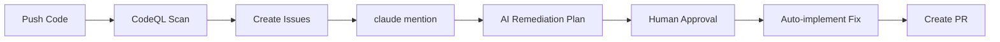

# CodeQL + Claude AI Automated Security Remediation

**Complete security automation system** that detects vulnerabilities with CodeQL and remediates them with Claude AI assistance.



## 🎯 What This Does

1. **CodeQL scans your code** for security vulnerabilities (OWASP Top 10)
2. **Automatically creates GitHub issues** with embedded security prompts
3. **Claude AI provides remediation plans** when you mention `@claude`
4. **After approval, Claude implements the fix** and creates a PR

## ⚡ Quick Start

### 1. Copy This Repository Template

```bash
# Create new repo and copy files
gh repo create my-security-demo --public --clone
cd my-security-demo
cp -r /path/to/this/folder/* .
cp -r /path/to/this/folder/.github .
git add . && git commit -m "Initial commit" && git push
```

### 2. Add Required Secret

```bash
# Add your Anthropic API key
gh secret set ANTHROPIC_API_KEY --body "sk-ant-api03-..."
```

Get your key: https://console.anthropic.com/settings/keys

### 3. Enable GitHub Actions Permissions

Go to **Settings → Actions → General → Workflow permissions**:
- ✅ Read and write permissions
- ✅ Allow GitHub Actions to create and approve pull requests

### 4. Trigger CodeQL Scan

```bash
git commit --allow-empty -m "Trigger security scan"
git push
```

Wait ~5 minutes for CodeQL to complete. Check **Issues** tab for new security issues!

### 5. Test Claude AI Remediation

On any issue with the `codeql-finding` label, comment:
```
@claude Please provide a remediation plan for this vulnerability
```

Claude will analyze and post a detailed plan. To approve:
```
@claude approved - implement this fix
```

---

## 📦 What's Included

### Vulnerable Demo Application

**`src/app.ts`** - Express API with 10+ intentional vulnerabilities:
- SQL injection (A03)
- Broken access control (A01)
- Weak cryptography (A02)
- Insecure design (A04)
- Security misconfiguration (A05)
- SSRF (A10)
- Path traversal
- And more...

**`src/auth.ts`** - Authentication failures:
- Weak password hashing (SHA1 instead of bcrypt)
- Timing attack vulnerabilities
- No rate limiting
- No MFA support

**`src/admin.ts`** - Access control issues:
- No authorization checks
- Insecure direct object references (IDOR)
- Mass assignment vulnerabilities
- Path traversal

⚠️ **For educational use only** - DO NOT use in production!

### GitHub Actions Workflows

**`.github/workflows/codeql.yml`**
- Runs CodeQL security analysis
- Triggers on: push, PR, weekly schedule
- Uploads SARIF results

**`.github/workflows/codeql-to-issues.yml`**
- Creates GitHub issues from CodeQL findings
- Embeds OWASP security prompts from [MaintainabilityAI](https://maintainability.ai)
- Applies smart labels and deduplication
- Configurable severity thresholds

**`.github/workflows/claude-remediation.yml`**
- Triggers on `@claude` mentions in issues
- Uses `anthropics/claude-code-action@v1`
- Provides remediation plans with human-in-the-loop approval
- Auto-implements approved fixes and creates PRs

### Automation Scripts

**`automation/process-codeql-results.js`** (1,150 lines)
- Parses CodeQL SARIF results
- Maps 32 CodeQL rules to OWASP categories
- Fetches security prompts from MaintainabilityAI
- Extracts code snippets from source files (fallback when SARIF lacks them)
- Creates comprehensive GitHub issues
- Implements deduplication and rate limiting
- Auto-closes resolved vulnerabilities

**`automation/prompt-mappings.json`**
- CodeQL rule → OWASP category mappings (32 total)
- Links to maintainability patterns
- Connects to STRIDE threat models

---

## 🔧 Configuration

All configuration in `.github/workflows/codeql-to-issues.yml`:

```yaml
env:
  SEVERITY_THRESHOLD: 'high'          # critical | high | medium | low
  MAX_ISSUES_PER_RUN: '10'            # Limit to prevent spam
  ENABLE_MAINTAINABILITY: 'true'      # Include code quality prompts
  ENABLE_THREAT_MODEL: 'true'         # Include STRIDE analysis
  AUTO_ASSIGN: 'security-team,alice'  # Auto-assign issues
  EXCLUDED_PATHS: 'test/,node_modules/' # Skip these paths
```

---

## 📋 Full Setup Guide

See **[SETUP.md](SETUP.md)** for:
- Detailed step-by-step instructions
- Repository configuration
- Secrets setup
- Troubleshooting guide
- Customization options
- Monitoring and logging

---

## 🧪 Example Workflow

### Scenario: SQL Injection Detected

**1. CodeQL finds vulnerability**
```typescript
// src/app.ts:25
const query = `SELECT * FROM users WHERE username = '${username}'`;
```

**2. Issue created automatically**

Title: `[Security] SQL injection in src/app.ts:25`

Labels: `codeql-finding`, `security/critical`, `owasp/a03-injection`

Body includes:
- Vulnerable code snippet
- Full OWASP A03 Injection security prompt (Role, Context, Requirements, Task, Checklist)
- Maintainability considerations (complexity reduction, DRY principle)
- Threat model analysis (tampering, elevation of privilege)
- Human review checklist

**3. Developer requests remediation**
```
@claude Please provide a remediation plan for this vulnerability
```

**4. Claude analyzes and responds**
```markdown
## 🔍 Remediation Plan

### Root Cause
String concatenation with user input creates SQL injection vulnerability.
Attacker can inject: `admin' OR '1'='1` to bypass authentication.

### Proposed Solution
Use parameterized queries with pg library:

```typescript
const query = 'SELECT * FROM users WHERE username = $1';
const result = await pool.query(query, [username]);
```

### Security Controls
- [x] Parameterized queries prevent injection
- [x] Input validation with Zod schema
- [x] Generic error messages (no schema leaks)
- [x] Least privilege database connection

### Testing Strategy
- Unit tests with malicious payloads
- Verify parameterization with query spy
- Integration tests for auth flow

### Approval Required
Please review and approve with: `@claude approved - implement this fix`
```

**5. Developer approves**
```
@claude approved - implement this fix
```

**6. Claude implements fix**
- Creates branch: `fix/issue-42-security`
- Updates `src/app.ts` with parameterized query
- Adds Zod validation
- Updates/adds tests
- Creates PR: `Fix SQL injection in login endpoint (closes #42)`

**7. Developer reviews and merges PR**

✅ Vulnerability fixed!

---

## 🎓 How It Works

### Issue Creation Process

1. **CodeQL Analysis**: Scans TypeScript/JavaScript for vulnerabilities
2. **SARIF Parsing**: Extracts findings with severity, location, code snippets
   - If SARIF lacks snippets, reads source files directly with line numbers
   - Includes 2 lines of context before/after vulnerable code
   - Marks vulnerable lines with `→` prefix
3. **OWASP Mapping**: Maps CodeQL rule IDs to OWASP Top 10 categories
4. **Prompt Fetching**: Downloads full security guidance from MaintainabilityAI
5. **Issue Creation**: Creates comprehensive issue with all context
6. **Deduplication**: Prevents duplicate issues (matches on rule + file + line)
7. **Smart Labeling**: Applies security, OWASP, and maintainability labels
8. **Auto-Close**: Closes resolved issues when vulnerability no longer detected

### Claude AI Remediation Process

1. **Trigger**: Developer mentions `@claude` in issue comment
2. **Context Loading**: Claude reads full issue body (includes vulnerability + prompts)
3. **Code Analysis**: Claude reads vulnerable code using file paths from issue
4. **Plan Generation**: Claude posts detailed remediation plan
5. **Human Review**: Developer reviews plan, provides feedback, or approves
6. **Implementation**: After approval, Claude:
   - Creates feature branch
   - Implements fix following security requirements
   - Adds/updates tests
   - Creates PR with detailed description
7. **Review & Merge**: Developer reviews PR and merges

### Security Prompts Structure (RCTRO Pattern)

Every issue includes complete security guidance:

1. **Role**: You are a security-focused engineer...
2. **Context**: Injection flaws occur when... (detailed explanation)
3. **Task**: Implement these security controls... (step-by-step)
4. **Requirements**:
   - Input validation with allowlists
   - Parameterized queries
   - Error handling
   - Least privilege
5. **Output**: Code examples, testing approach, validation checklist

---

## 📊 Supported Vulnerabilities

### Mapped CodeQL Rules (29 total)

| OWASP Category | CodeQL Rules | Count |
|----------------|--------------|-------|
| **A01 - Broken Access Control** | path-injection, missing-authorization, cors-misconfiguration | 3 |
| **A02 - Cryptographic Failures** | weak-cryptography, insecure-randomness, hardcoded-credentials | 3 |
| **A03 - Injection** | sql-injection, xss, command-injection, code-injection | 4 |
| **A04 - Insecure Design** | insufficient-rate-limiting, weak-password-reset | 2 |
| **A05 - Security Misconfiguration** | cors-misconfiguration, missing-security-headers | 2 |
| **A06 - Vulnerable Components** | prototype-pollution, untrusted-deserialization | 2 |
| **A07 - Auth Failures** | weak-password-hashing, session-fixation, timing-attack | 3 |
| **A08 - Integrity Failures** | missing-integrity-check, unsafe-code-execution | 2 |
| **A09 - Logging Failures** | sensitive-data-logging, insufficient-logging | 2 |
| **A10 - SSRF** | server-side-request-forgery, unvalidated-redirect | 2 |

See **`automation/prompt-mappings.json`** for complete list.

---

## 🛠️ Customization

### Add Your Own CodeQL Rules

Edit `automation/prompt-mappings.json`:

```json
{
  "codeql_to_owasp": {
    "js/your-custom-rule": "A03_injection"
  }
}
```

### Create Custom Security Prompts

Fork [MaintainabilityAI](https://github.com/AliceNN-ucdenver/MaintainabilityAI) and:

1. Add prompt: `site-tw/public/docs/prompts/owasp/YOUR_CATEGORY.md`
2. Update config: `automation/prompt-mappings.json`
3. Point workflow to your fork:
   ```yaml
   env:
     PROMPT_REPO: 'your-org/your-fork'
   ```

### Modify Claude Instructions

Edit `.github/workflows/claude-remediation.yml` prompt section to customize Claude's behavior.

---

## 📚 Documentation

- **[SETUP.md](SETUP.md)** - Complete setup and configuration guide (comprehensive)
- **[EXAMPLE_ISSUE.md](EXAMPLE_ISSUE.md)** - Example of generated issue with prompts
- **MaintainabilityAI Docs** - https://maintainability.ai/docs

---

## 🐛 Troubleshooting

### No issues created after CodeQL scan

```bash
# Check SARIF results
gh run download <run-id> -n codeql-sarif
cat results.sarif | jq '.runs[0].results'

# Lower severity threshold
# Edit .github/workflows/codeql-to-issues.yml
env:
  SEVERITY_THRESHOLD: 'low'
```

### Claude workflow not triggering

```bash
# Verify secret exists
gh secret list | grep ANTHROPIC

# Check issue has required label
# Ensure comment contains: @claude
```

### Permissions errors

Go to **Settings → Actions → General**:
- ✅ Read and write permissions
- ✅ Allow GitHub Actions to create and approve pull requests

See **[SETUP.md](SETUP.md)** for complete troubleshooting guide.

---

## 🎯 Use Cases

### 1. Security Training
- Use vulnerable demo app to learn OWASP Top 10
- Practice secure remediation with AI guidance
- Understand attack vectors and mitigations

### 2. Existing Codebase Security
- Deploy to existing repository
- Replace demo app with your code
- Gradually fix detected vulnerabilities

### 3. Security-First Development
- Enable on all repositories
- Catch vulnerabilities in PRs
- Automated security guidance for developers

### 4. Team Education
- Review Claude's remediation plans as a team
- Discuss security tradeoffs
- Build internal security knowledge

---

## 📊 Metrics & Monitoring

After each run, view statistics:

```bash
gh run download <run-id> -n codeql-processing-logs
cat automation/logs/summary.json | jq
```

Example output:
```json
{
  "timestamp": "2025-10-13T14:30:00Z",
  "total": 15,
  "created": 8,
  "updated": 3,
  "skipped": 4,
  "by_severity": {"critical": 2, "high": 6, "medium": 5, "low": 2},
  "by_owasp": {"A03_injection": 4, "A01_broken_access_control": 3}
}
```

---

## 🤝 Contributing

Improvements welcome!

- Add more CodeQL rule mappings
- Create additional security prompts
- Improve issue templates
- Enhance Claude instructions

---

## 📄 License

MIT License - Part of the [MaintainabilityAI](https://maintainability.ai) project.

**Vulnerable code is for educational purposes only.**

---

## 🔗 Links

- **MaintainabilityAI**: https://maintainability.ai
- **OWASP Top 10**: https://owasp.org/Top10/
- **CodeQL**: https://codeql.github.com
- **Claude Code Action**: https://github.com/anthropics/claude-code-action
- **Security Prompts**: https://maintainability.ai/docs/prompts/owasp/

---

**🤖 Built with Claude AI** - This system demonstrates AI-assisted security remediation following the MaintainabilityAI framework's "Golden Rules of Vibe Coding."

**Questions?** Open an issue or check [SETUP.md](SETUP.md) for detailed documentation.
