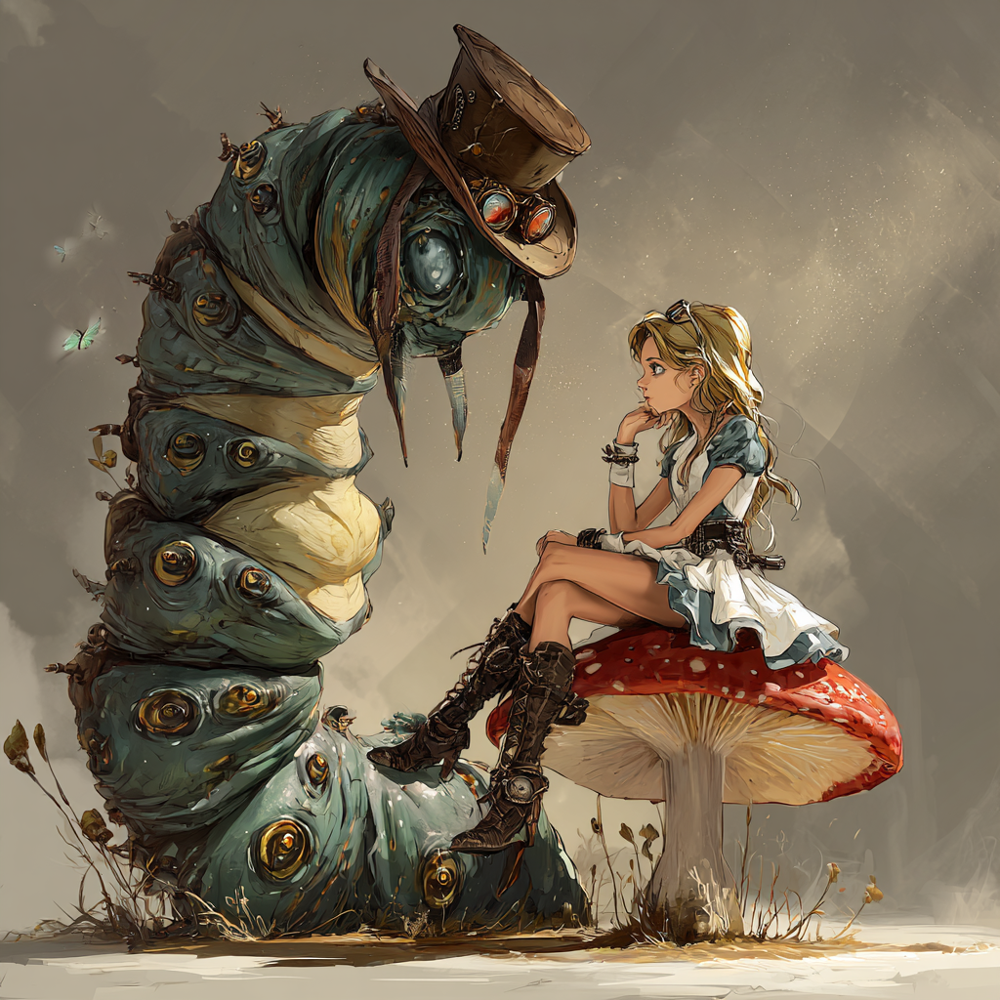

  

  

    
<a href="/docs/">Docs</a>/<a href="/docs/agents/">Agents</a>/Alice

    
Agentic · The Good Maintainer ~14 min read

    <h1 class="docs-hero-title">Alice &mdash; autonomous security remediation</h1>
    
A two-phase remediation agent built on Claude Code: <em>curiosity</em> reads the issue and proposes a plan, <em>implementation</em> applies it under human approval. Designed for CodeQL fixes, legacy refactoring, and debt reduction without losing the audit trail.

    &ldquo;Six impossible things before breakfast&rdquo; &mdash; she ships them with tests.
  

> *Why, sometimes I've believed as many as six impossible things before breakfast.* — Alice in Wonderland

Alice is an **agentic AI proof of concept** that automates security remediation while keeping humans in control. She reads documentation, tests cautiously, questions assumptions, and documents her journey—just like a great maintainer would.

> **Heads up — the `@alice` magic comment was retired.** Alice is now the **`alice-maintenance-agent`** Copilot persona, dispatched in one click from the **Cheshire Scorecard / Looking Glass** (via `assignCustomCopilotAgent`). No magic comment, no Anthropic key — Alice runs on the Actions `GITHUB_TOKEN`. The storybook chapters below keep the original `@alice` flavor as narrative; the actionable how-to in **How Alice Works** and **Quick Start** reflects the current dispatch model.

  

    🎥 Watch Alice in Action
  

  

    See a complete live demo: from vulnerability detection → automated remediation → human review → merge
  

  <a href="https://olucdenver-my.sharepoint.com/:v:/g/personal/shawn_mccarthy_ucdenver_edu/Ece2jtrqXuVPpGiVkg6aAkkBndoPRjlZWrqR1-waWv88CA?nav=eyJyZWZlcnJhbEluZm8iOnsicmVmZXJyYWxBcHAiOiJTdHJlYW1XZWJBcHAiLCJyZWZlcnJhbFZpZXciOiJTaGFyZURpYWxvZy1MaW5rIiwicmVmZXJyYWxBcHBQbGF0Zm9ybSI6IldlYiIsInJlZmVycmFsTW9kZSI6InZpZXcifX0%3D&e=BF87Ii" target="_blank" rel="noopener noreferrer" class="docs-button-secondary">
    ▶️ Watch the 15-Minute Demo
  </a>

---

## Why "Alice"?

  <h3 class="docs-heading">The Rabbit Hole of Legacy Code</h3>
  
Software maintenance often feels like falling down a rabbit hole: legacy code with no comments, "temporary" fixes from years ago, technical debt everyone accepts as inevitable.

  <h3 class="docs-heading">Alice Brings Order to Chaos</h3>
  
Just as Alice in Wonderland carefully read labels before drinking mysterious potions, questioned illogical rules, and maintained her sense of self through bizarre transformations—<strong class="docs-strong">Alice Agent embodies the principles of The Good Maintainer</strong>.

---

## The Alice Way

  
Alice embodies eight principles of The Good Maintainer

  <h3 class="docs-heading">1. Read (Wisdom)</h3>
  
"What is the use of a book without pictures or conversations?"

  
Alice reads compact prompt packs (OWASP, STRIDE, Maintainability) before touching code. She analyzes CodeQL findings, commit history, test suites, and comments to understand context. Good maintainers don't guess—they gather context first.

  <h3 class="docs-heading">2. Test (Caution)</h3>
  
"I wonder if I've been changed in the night?"

  
Alice makes incremental changes with tests after each step. No massive refactors. Two-phase workflow: plan first, then implement. Incremental changes with tests keep systems stable while improving quality.

  <h3 class="docs-heading">3. Question (Curiosity)</h3>
  
"Curiouser and curiouser!"

  
Alice challenges technical debt: "Why is this a string concatenation?" "This 'temporary fix' from 2019—still temporary?" "Why does this function have 47 parameters?" Technical debt accumulates when teams accept "that's just how it works here."

  <h3 class="docs-heading">4. Maintain Identity (Guidance)</h3>
  
"Who am I?"

  
Alice maintains system integrity through refactoring. Function purpose stays clear, API contracts remain stable, business logic is validated by tests. Code can change form without losing its identity (purpose, behavior, contracts).

  <h3 class="docs-heading">5. Document (Wisdom)</h3>
  
"I must keep my journal!"

  
Alice writes detailed commit messages explaining the "why," creates PR descriptions with security controls, adds code comments for non-obvious decisions. Future maintainers need to understand not just what changed, but why and how it was validated.

  <h3 class="docs-heading">6. Believe (Curiosity)</h3>
  
"I can't believe that!" said Alice. "Can't you?" said the Queen. "Try."

  
Alice believes that 5-year-old 1000-line function can be refactored incrementally with strangler fig. That "unfixable" security vulnerability has proven OWASP remediation patterns. That test coverage stuck at 30% can improve function by function. Pessimism breeds stagnation. Alice approaches "impossible" problems with curiosity.

  <h3 class="docs-heading">7. Manage Chaos (Automation)</h3>
  
"We're all mad here."

  
Codebases are chaos: spaghetti logic, inconsistent patterns, surprise side effects. Alice brings order through complexity reduction (flatten nesting, extract functions), strangler fig patterns (replace legacy incrementally), fitness functions (automated quality gates), and defense in depth (multiple security layers). Chaos compounds over time. Alice systematically transforms it into maintainable code.

  <h3 class="docs-heading">8. Explore (Curiosity)</h3>
  
"Curiouser and curiouser!"

  
Alice explores before acting. Phase 1 (Analysis) is pure curiosity—no code changes, just understanding. She uses Grep, Read, Glob to explore patterns, reads commit history, examines test coverage. Good maintainers don't rush to "fix" things. They explore, understand, then propose solutions.

---

## How Alice Works

  

    Alice operates in <strong class="docs-strong">two phases</strong> with a human approval gate between them. This ensures safety, quality, and human control throughout the remediation process.
  

  <h3 class="docs-heading">🔍 Phase 1: Curiosity & Planning</h3>

  

    
TRIGGER

    
Dispatch Alice from the <strong class="docs-strong">Cheshire Scorecard</strong> on any CodeQL issue (one click — assigns the <strong class="docs-strong">alice-maintenance-agent</strong> Copilot persona; no magic comment)

  

  
"What's in this bottle? Let me read the label before drinking."

  
<strong class="docs-strong">What Alice Does:</strong>

  <ul class="markdown-list list-disc">
    <li>Reads the "Drink Me" label (compact prompt packs)</li>
    <li>Explores codebase (Grep, Read, commit history)</li>
    <li>Questions assumptions ("Why string concatenation?")</li>
    <li>Creates remediation plan with design decisions</li>
    <li>Outputs copy-paste approval statement</li>
  </ul>

  

    
✓ Safety

    
<strong class="docs-strong">Permissions:</strong> Read-only (can't break anything) <strong class="docs-strong">Result:</strong> Detailed plan for human review

  

  <h3 class="docs-heading">⚡ Human Approval Gate</h3>

  
"Who are YOU?" — The Caterpillar

  
<strong class="docs-strong">You Review Alice's Plan:</strong>

  <ul class="markdown-list list-disc">
    <li>✓ Are technology choices appropriate?</li>
    <li>✓ Is refactoring approach sound?</li>
    <li>✓ Are test cases comprehensive?</li>
  </ul>

  

    
✅ To Authorize

    
On a Restricted-tier BAR, a human grants a scoped, audited <strong class="docs-strong">break-glass</strong> to let Alice write — review happens on the PR she opens

  

  

    
⚠️ Why This Matters

    
Alice proposes, humans authorize. Critical governance gate — the break-glass grant is scoped and recorded.

  

  <h3 class="docs-heading">🎯 Phase 2: Implementation</h3>

  

    
TRIGGER

    
Human grants the scoped <strong class="docs-strong">break-glass</strong> on the Restricted-tier BAR (the deterministic gate that authorizes Alice to write)

  

  
"The Queen approved. Now I'll test each transformation carefully."

  
<strong class="docs-strong">What Alice Does:</strong>

  <ul class="markdown-list list-disc">
    <li>Creates isolated branch <strong>alice-fix-issue-{number}</strong></li>
    <li>Makes incremental changes (validate, refactor, error handling)</li>
    <li>Runs tests after each step</li>
    <li>Validates verification checklist</li>
    <li>Documents journey in detailed commit</li>
    <li>Creates PR with labels: <strong>security, ai-assisted</strong></li>
  </ul>

  

    
🎯 Safety & Results

    
<strong class="docs-strong">Permissions:</strong> Write to branches (NOT main) <strong class="docs-strong">Result:</strong> PR ready for human review

  

  

    
⚠️ IMPORTANT

    
Alice does NOT auto-merge. Humans review PR and merge when satisfied.

  

---

## Quick Start

For complete setup instructions and examples, see the [Alice Agent README](https://github.com/AliceNN-ucdenver/MaintainabilityAI/tree/main/examples/agents) on GitHub.

**Quick summary:**
1. CodeQL creates security issues with the `codeql-finding` label
2. Dispatch Alice from the Cheshire Scorecard in one click — it assigns the `alice-maintenance-agent` Copilot persona to the issue (no magic comment)
3. Review Alice's remediation plan
4. On a Restricted-tier BAR, grant the scoped, audited break-glass to authorize implementation
5. Review and merge the PR

---

## The Wonderland Journey

📖 The Wonderland Journey

A whimsical tale of how Alice transforms chaos into order

<!-- Chapter 1: Down the Rabbit Hole -->

🐰 Chapter 1: Down the Rabbit Hole

  It was an ordinary Tuesday morning when the White Rabbit came rushing past Alice's desk, his waistcoat flapping wildly behind him.

  "I'm late! I'm late! For a very important feature!" he cried, clutching his pocket watch with one paw while frantically scrolling through pull requests with the other. "No time to fix these security issues now! The client demo is tomorrow morning!"

  But Alice, ever curious, noticed something the Rabbit had dropped in his haste. A glowing red alert, pulsing like a warning beacon in the darkness. She picked it up and read:

  
"SQL injection, dear. Severity: High. Shall I show you the way out?"

  
— CodeQL, the vigilant Cheshire Cat

  The codebase, Alice realized, was Wonderland itself. Strange, illogical, full of curious surprises and forgotten corners. She peered into the repository and discovered an old function tucked away like a dusty bottle on a shelf. The comment at the top read: <em class="docs-emphasis">"Temporary search handler - will refactor later"</em>. The date? June 2019.

  The function concatenated strings into SQL queries like the Mad Hatter stacking teacups at his chaotic tea party, precariously balanced and without much thought for gravity, physics, or the consequences of dropping malicious input into the mix.

  The developer appeared beside her, sighing deeply. They had fallen into this particular rabbit hole before.

  With a weary but hopeful voice, they typed a single comment: <strong class="docs-strong">@alice this looks bad, can you help?</strong>

  And just like that, Alice tumbled down into the rabbit hole of legacy code, ready to explore.

<!-- Chapter 2: Reading the Label -->

🍄 Chapter 2: Reading the Label

  At the bottom of the rabbit hole, Alice found herself in a long hallway lined with doors. On a small glass table sat a bottle with a paper label tied around its neck.

  <em class="docs-emphasis">"DRINK ME,"</em> it said in beautiful large letters.

  But Alice was a sensible girl. She had read enough stories to know that drinking mysterious potions without reading the fine print was generally unwise. So she turned the bottle over and examined the label carefully.

  
📜 THE LABEL

  
OWASP A03 - Injection Prevention

  <ul class="markdown-list list-disc">
    <li>Parameterized queries with $1 placeholders prevent SQL injection</li>
    <li>Input validation with allowlist regex catches malicious characters</li>
    <li>Generic error messages prevent schema exposure</li>
  </ul>

  Alice began to explore, moving through the codebase as she once wandered through Wonderland's gardens. She noted which paths led to roses and which to thorns. In her exploration, she discovered something curious: fourteen other functions with the same vulnerability, scattered throughout the repository like playing cards blown by the wind.

  "Curiouser and curiouser!" she exclaimed. "Why string concatenation when PostgreSQL supports parameterized queries? Surely this was meant to be temporary?"

  The pattern was as consistent as the Queen's croquet mallets, which turned out to be flamingos. Every instance used the same dangerous approach, as if copied and pasted from a single template of technical debt.

  Alice sat down and composed a remediation plan, methodically addressing each design decision:

  <strong class="docs-strong">Which library?</strong> The pg library was already in the package, waiting to be used properly.

  <strong class="docs-strong">What validation?</strong> A Zod schema with an alphanumeric allowlist would catch malicious characters before they reached the database.

  <strong class="docs-strong">How to refactor?</strong> Three careful steps: validate inputs, parameterize the query, implement safe error handling.

<!-- Chapter 3: The Caterpillar's Question -->

🐛 Chapter 3: The Caterpillar's Question

  Alice presented her plan to the human, laying it out like a map of Wonderland with all its twists and turns marked clearly.

  The human sat atop a mushroom (or perhaps it was just a very comfortable office chair), reviewing Alice's proposal with careful attention. Smoke from their coffee drifted upward in lazy circles as they considered each detail.

  
"Who... are... YOU?"

  
— The Caterpillar, each word punctuated by a puff of smoke

  It was not a question about identity, but about understanding. The Caterpillar wanted to know: Who are you to propose this solution? Do you understand the context? Have you thought through the consequences?

  The human reviewed each part of Alice's plan:

  ✓ The technology choices were sound. They already used pg and Zod everywhere in the codebase.

  ✓ The incremental approach was sensible. Fix one instance first, prove the pattern, then systematically address the others.

  ✓ The error handling struck the right balance between user-friendly and secure.

  After a thoughtful pause, the human smiled and typed the magic words:

  
@alice approved

  And just like that, Alice began her transformation. The plan was sound. The human had approved. Now it was time to make the changes real.

<!-- Chapter 4: Careful Transformation -->

🎩 Chapter 4: Careful Transformation

  Alice ate from one side of the mushroom, and she began to shrink. Not physically, of course, but the problem itself shrank down to a manageable size.

  <strong class="docs-strong">Step One: Validation</strong>

  First, she added input validation, a protective layer like gloves before handling thorny roses. She carefully wrote the Zod schema, defining exactly what characters were allowed and what should be rejected.

  She ran the tests. They passed. The code remained stable.

  "I wonder if I've been changed?" Alice mused, looking at the function that was slowly becoming safer.

  <strong class="docs-strong">Step Two: Parameterization</strong>

  Then she transformed the query itself. Out went the string concatenation, replaced with proper parameterized placeholders. The SQL went from a precariously stacked tower of teacups to a single, stable, properly designed query.

  Tests ran again. Still passing. The code was getting better with each careful step.

  "Curiouser and curiouser! It actually works!"

  <strong class="docs-strong">Step Three: Safe Error Handling</strong>

  Finally, she added safe error handling. No more leaking database schema details to curious attackers. Generic, friendly error messages for users. Detailed logs for the development team. The function had completely transformed from a security vulnerability into a well-defended endpoint.

  
📝 BREADCRUMBS FOR TRAVELERS

  
Before moving on, Alice documented her journey in a detailed commit message. Not for herself, but for the next traveler who would venture this way, like breadcrumbs through the forest showing the safe path home.

  The transformation was complete. The code was secure. The tests were passing. It was time for human review.

<!-- Chapter 5: Painting the Roses Red -->

🌹 Chapter 5: Painting the Roses Red

  In the Queen's garden, three gardeners frantically painted white roses red. They worked in a panic, slapping paint on petals, trying to fix their mistake before the Queen arrived for her croquet match.

  "We planted the wrong color!" they cried. "The Queen wanted red, and we planted white by mistake!"

  It was a quick fix, a surface solution to avoid immediate consequences. But it wasn't a real solution at all.

  The human reviewer paused at Alice's pull request, thinking deeply about a similar question: Are we just painting roses red? Or is this the time to dig deeper and plant the right roses in the first place?

  
🤔 THE HUMAN'S CRITICAL THINKING

  
"This PR fixes the immediate SQL injection vulnerability. That's good. But I found 13 other instances of the same pattern. Should we tackle them all now? Or ship this one change first, demonstrate the pattern works, and then systematically address the others? What's the risk versus reward?"

  To verify the fix worked, the human manually tested with a classic SQL injection payload:

  
SQL INJECTION TEST PAYLOAD

  
'; DROP TABLE users--

  
✅ VALIDATION LAYER RESPONSE

  
"Invalid username format."

  Perfect. The malicious input was caught and rejected before it ever reached the database. The fix was solid.

  After careful consideration, the human made a strategic decision: ship this one fix now. Let it run in production. Demonstrate the pattern works. Then create a systematic plan to address the other 13 instances.

  
💡 THE HUMAN INSIGHT

  
This is the value a human brings. Not just quality control, but strategic thinking. Sometimes painting the roses red IS the right answer: a focused, testable change that can be deployed quickly. Other times, it's the signal to dig deeper and redesign the garden. The human knows which is which.

  ✓ Merge pull request

<!-- Chapter 6: The Impossible Became Possible -->

✨ Chapter 6: The Impossible Became Possible

  "Why, sometimes I've believed as many as six impossible things before breakfast," the White Queen once told Alice.

  At first glance, fixing this security vulnerability seemed impossible:

  
❌ WHAT SEEMED "IMPOSSIBLE"

  <ul class="markdown-list list-disc">
    <li>"This code is too risky to touch. It's been here since 2019 and we don't fully understand it."</li>
    <li>"We don't have time to fix all these SQL injection issues. The backlog is already overwhelming."</li>
    <li>"This would require refactoring the entire API layer. That's a quarter-long project."</li>
    <li>"Nobody on the team is familiar enough with this part of the codebase to make changes safely."</li>
  </ul>

  These weren't unreasonable concerns. They were the kind of very sensible objections that keep risky changes from breaking production systems.

  But then Alice arrived. And what seemed impossible became possible:

  
✅ WHAT ALICE MADE POSSIBLE

  <ul class="markdown-list list-disc">
    <li>Fixed the high-severity vulnerability in one afternoon</li>
    <li>Incremental, testable change (15 lines modified, 30 lines of tests)</li>
    <li>Zero breaking changes to the API</li>
    <li>Comprehensive documentation for future maintainers</li>
    <li>A proven pattern for systematically addressing the other 13 instances</li>
    <li>Increased team confidence in making security improvements</li>
  </ul>

  The impossible had become possible. Not through magic, but through careful exploration, methodical planning, human oversight, and incremental transformation.

  This was the Good Maintainer in action. Not rushing to fix everything at once, but taking one careful step at a time. Exploring before acting. Planning before implementing. Seeking approval before committing. Testing at every step. Documenting the journey.

  "Why, sometimes I've believed as many as six impossible things before breakfast."

  That's the Good Maintainer in action.

  — The End —

---

## Use Cases

  <h3 class="docs-heading">✅ Alice Thrives On</h3>

  

    <h4 class="docs-heading">Security Vulnerabilities</h4>
    
SQL injection, XSS, hardcoded secrets, path traversal—CodeQL finds them, Alice fixes them with OWASP patterns.

  

  

    <h4 class="docs-heading">Legacy Code</h4>
    
1000-line functions, 18 cyclomatic complexity, technical debt from 2019—Alice brings incremental improvement.

  

  

    <h4 class="docs-heading">Technical Debt</h4>
    
Strangler fig refactoring, complexity reduction, test coverage improvements—systematic quality upgrades.

  

  

    <h4 class="docs-heading">CI/CD Integration</h4>
    
Automated on every PR, runs in GitHub Actions, integrates with existing workflows.

  

  <h3 class="docs-heading">❌ Alice Gets Confused By</h3>

  

    <h4 class="docs-heading">Greenfield Features</h4>
    
"Build a new dashboard from scratch"—Alice is a maintainer, not a product designer. Use Claude/Copilot for new features.

  

  

    <h4 class="docs-heading">Ambiguous Requirements</h4>
    
"Make it better"—Alice needs specific vulnerabilities or code smells. CodeQL provides this specificity.

  

  

    <h4 class="docs-heading">Architectural Rewrites</h4>
    
"Migrate from REST to GraphQL"—too large scope. Alice works incrementally, function by function.

  

  

    <h4 class="docs-heading">Bikeshedding</h4>
    
"Should we use tabs or spaces?"—Alice focuses on security and maintainability, not style debates.

  

---

## Six Impossible Things

  

    "Why, sometimes I've believed as many as six impossible things before breakfast." — The Queen, Alice in Wonderland
  

  <h3 class="docs-heading">1. Legacy Code Can Be Fixed</h3>
  
"This code is too old to touch safely"

  
<strong class="docs-strong">Alice's approach:</strong> Strangler fig pattern—wrap, test, replace incrementally.

  
<strong>Result:</strong> 1000 lines → 200 lines, fully tested

  <h3 class="docs-heading">2. Technical Debt Can Be Paid Down</h3>
  
"We'll never get test coverage above 30%"

  
<strong class="docs-strong">Alice's approach:</strong> Add tests function by function, validate with every change.

  
<strong>Result:</strong> 0% → 82% coverage in 12 weeks

  <h3 class="docs-heading">3. Security Doesn't Slow You Down</h3>
  
"Security fixes take too long"

  
<strong class="docs-strong">Alice's approach:</strong> Automated remediation with human approval, OWASP patterns pre-loaded.

  
<strong>Result:</strong> Security PRs ready in 2 hours, not 2 weeks

  <h3 class="docs-heading">4. Chaos Can Become Order</h3>
  
"This codebase is spaghetti, no documentation"

  
<strong class="docs-strong">Alice's approach:</strong> Document as you fix, extract functions, reduce complexity systematically.

  
<strong>Result:</strong> Complexity 18 → 9, with inline docs

  <h3 class="docs-heading">5. Zero Tests Can Become 80% Coverage</h3>
  
"This module has no tests, we can't add them now"

  
<strong class="docs-strong">Alice's approach:</strong> Add characterization tests first, then security tests, then edge cases.

  
<strong>Result:</strong> 0% → 83% coverage in 8 weeks

  <h3 class="docs-heading">6. "Impossible" Deadlines Can Be Met</h3>
  
"We need 47 security fixes by Friday"

  
<strong class="docs-strong">Alice's approach:</strong> Automated analysis, batched fixes, systematic testing—parallel remediation.

  
<strong>Result:</strong> 47 security PRs created in 1 day

---

## Epilogue

  

    "Begin at the beginning," the King said, very gravely, "and go on till you come to the end: then stop."
  

  

    In Wonderland, Alice learned that curiosity conquers chaos. In your codebase, Alice brings the same transformation: reading labels before drinking, questioning illogical patterns, maintaining identity through refactoring, documenting the journey for future travelers.
  

  <h3 class="docs-heading">Eight Principles in Action</h3>
  <ul class="markdown-list list-disc">
    <li>Documentation first, changes second</li>
    <li>Incremental improvements with tests</li>
    <li>Questions assumptions, challenges debt</li>
    <li>Maintains system integrity</li>
    <li>Detailed commit messages</li>
    <li>Believes in impossible improvements</li>
    <li>Manages chaos systematically</li>
    <li>Explores before acting</li>
  </ul>

  <h3 class="docs-heading">Results Speak</h3>
  <ul class="markdown-list list-disc">
    <li>1000-line function → 200 lines</li>
    <li>Complexity 18 → 9</li>
    <li>Coverage 0% → 82%</li>
    <li>Security PRs in hours, not weeks</li>
    <li>Technical debt → Maintainable code</li>
    <li>Chaos → Order</li>
  </ul>

  

    🐰 Ready to start? Dispatch <strong>Alice</strong> from the Cheshire Scorecard on your next CodeQL issue — one click, no magic comment.
  

That's the Good Maintainer in action.

