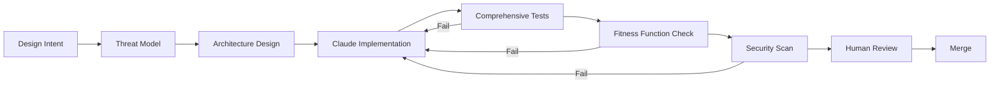

# Claude - MaintainabilityAI Guide

> **Purpose**: Claude-specific guidance for security-first AI-assisted development in the MaintainabilityAI framework.

This guide shows you how to effectively use Claude (including Claude Code) with OWASP prompt packs, evolutionary architecture principles, and comprehensive refactoring capabilities.

---

## Quick Start

### Using Claude Code with Prompt Packs

Claude Code excels at complex, multi-file refactoring with security constraints:

```markdown
I need to refactor the authentication module following OWASP A07 best practices.

Context:
- Repository: Node 18 + TypeScript + Express + PostgreSQL
- Files: src/auth/*.ts, src/middleware/auth.ts
- Security: Must comply with OWASP Top 10 (2021)

Reference prompt pack:
[Reference /prompts/owasp/A07_authn_failures.md]

Steps:
1. Analyze current implementation for vulnerabilities
2. Refactor with security controls
3. Generate comprehensive tests
4. Verify complexity ≤10 per function
```

**Key Benefits**:
- Claude understands large codebases and multi-file dependencies
- Handles complex refactoring patterns safely
- Generates comprehensive test suites with attack vectors
- Provides detailed explanations of security decisions

---

## Security-First Development with Claude

### 1. Complex Refactoring with OWASP Compliance

**Pattern**: Always provide full context with security constraints

```markdown
Task: Secure refactoring of user data access layer

Context:
- Files: src/repositories/UserRepository.ts, src/models/User.ts
- Database: PostgreSQL with pg library
- Security: OWASP A01 (Access Control) + A03 (Injection)

Current Issues:
1. SQL injection vulnerability in search function
2. Missing authorization checks
3. No input validation

Reference:
[Reference /prompts/owasp/A01_broken_access_control.md]
[Reference /prompts/owasp/A03_injection.md]

Requirements:
- Parameterized queries only
- RBAC authorization on all methods
- Zod validation for all inputs
- Generic error messages
- Comprehensive tests with attack vectors

Please:
1. Analyze current code for all vulnerabilities
2. Provide detailed refactoring plan
3. Implement secure version
4. Generate test suite
```

### 2. Multi-File Feature Implementation

Claude excels at coordinating changes across multiple files:

```markdown
Feature: Implement document sharing with end-to-end security

Files to create/modify:
- src/routes/sharing.ts (new)
- src/services/SharingService.ts (new)
- src/middleware/ownership.ts (modify)
- src/__tests__/sharing.test.ts (new)

OWASP Categories:
- A01: Authorization (ownership verification)
- A03: Injection (parameterized queries)
- A08: Integrity (tamper detection)
- A09: Logging (audit trail)

Maintainability:
- Complexity ≤10 per function
- Test coverage ≥80%
- Dependencies: use existing libraries only

Reference: /prompts/owasp/ for each category

Generate:
1. Architecture design with security controls
2. Implementation across all files
3. Migration script if needed
4. Comprehensive test suite
5. Documentation
```

### 3. Comprehensive Test Generation

```markdown
Generate comprehensive Jest test suite for the authentication module:

Files to test:
- src/auth/login.ts
- src/auth/register.ts
- src/middleware/authenticate.ts

Test categories:
1. Positive cases (happy path)
2. Negative cases (invalid input)
3. Security cases (attack vectors):
   - SQL injection attempts
   - Password brute force
   - Session hijacking
   - Token forgery
4. Edge cases (race conditions, timeouts)
5. Performance cases (response time)

For each test:
- Use descriptive names: "should block SQL injection in login"
- Include comments explaining attack vector
- Verify security controls work (logging, rate limiting)
- Check error messages are generic
- Validate audit trail is created

Coverage target: ≥80%, 100% on security-critical paths
```

---

## Integration with Fitness Functions

### Architectural Fitness Functions

Use Claude to implement and verify evolutionary architecture principles:

#### Example 1: Complexity Fitness Function

```markdown
Implement cyclomatic complexity fitness function for this codebase.

Reference: /prompts/maintainability/fitness-functions.md

Requirements:
1. Use ts-morph to analyze TypeScript AST
2. Calculate complexity per function
3. Fail CI if any function >10 complexity
4. Generate report with violations
5. Suggest refactoring patterns for complex functions

Create:
- tests/fitness-functions/complexity.test.ts
- scripts/check-complexity.ts (for CI)
- .github/workflows/fitness-functions.yml
- Documentation on fixing violations
```

#### Example 2: Dependency Freshness

```markdown
Implement 3-month dependency freshness rule.

Reference: /prompts/maintainability/dependency-hygiene.md

Task:
1. Analyze package.json for packages >90 days old
2. Check each for:
   - Security vulnerabilities (npm audit, Snyk)
   - Breaking changes in newer versions
   - Compatibility with current Node version
3. Generate upgrade plan prioritized by:
   - Security fixes (high priority)
   - Major version changes (low priority)
4. Create automated script that:
   - Upgrades one package at a time
   - Runs tests after each upgrade
   - Reverts on failure
   - Logs results

Output:
- scripts/check-dependency-freshness.ts
- UPGRADE-PLAN.md with step-by-step guide
- CI workflow integration
```

---

## OWASP Top 10 Integration

### Using Prompt Packs with Claude

For each OWASP category, provide the full prompt pack and your specific context:

| OWASP Category | Claude Command Pattern |
|----------------|------------------------|
| **A01: Broken Access Control** | Reference `site-tw/public/docs/prompts/owasp/A01_broken_access_control.md` + "Implement RBAC for [feature]" |
| **A02: Cryptographic Failures** | Reference `site-tw/public/docs/prompts/owasp/A02_crypto_failures.md` + "Add secure encryption to [module]" |
| **A03: Injection** | Reference `site-tw/public/docs/prompts/owasp/A03_injection.md` + "Refactor with parameterized queries" |
| **A04: Insecure Design** | Reference `site-tw/public/docs/prompts/owasp/A04_insecure_design.md` + "Review architecture for [feature]" |
| **A05: Security Misconfiguration** | Reference `site-tw/public/docs/prompts/owasp/A05_security_misconfig.md` + "Harden server configuration" |
| **A06: Vulnerable Components** | Reference `site-tw/public/docs/prompts/owasp/A06_vuln_outdated.md` + "Audit and upgrade dependencies" |
| **A07: Authentication Failures** | Reference `site-tw/public/docs/prompts/owasp/A07_authn_failures.md` + "Implement secure authentication" |
| **A08: Integrity Failures** | Reference `site-tw/public/docs/prompts/owasp/A08_integrity_failures.md` + "Add integrity verification" |
| **A09: Logging/Monitoring** | Reference `site-tw/public/docs/prompts/owasp/A09_logging_monitoring.md` + "Add security logging" |
| **A10: SSRF** | Reference `site-tw/public/docs/prompts/owasp/A10_ssrf.md` + "Secure external API calls" |

---

## Maintainability Prompt Packs

### Hybrid Security + Maintainability Prompts

**Example: Secure API with Maintainability Constraints**

```markdown
Implement secure user profile API with maintainability constraints.

Security (OWASP):
[Reference /prompts/owasp/A01_broken_access_control.md]
[Reference /prompts/owasp/A07_authn_failures.md]

Maintainability (Fitness Functions):
[Reference /prompts/maintainability/fitness-functions.md]

Requirements:
- OWASP A01: RBAC with ownership verification
- OWASP A07: JWT authentication, bcrypt hashing
- Complexity: ≤10 per function
- Coverage: ≥80% with attack vectors
- Performance: p95 latency <200ms
- Dependencies: Use latest stable versions

Generate:
1. Route handlers (src/routes/profile.ts)
2. Authorization middleware (src/middleware/rbac.ts)
3. Validation schemas (src/schemas/profile.ts)
4. Comprehensive tests (src/__tests__/profile.test.ts)
5. Fitness function tests (tests/fitness/profile-complexity.test.ts)
```

**Example: Dependency Upgrade with Security**

```markdown
Upgrade Express from 4.17.1 to 4.19.2 following security best practices.

Reference:
[Reference /prompts/maintainability/dependency-hygiene.md]
[Reference /prompts/owasp/A06_vuln_outdated.md]

Process:
1. Analyze CHANGELOG for breaking changes
2. Run npm audit to identify CVEs in current version
3. Create upgrade plan with:
   - Breaking changes to address
   - Code modifications needed
   - Test scenarios to verify
4. Implement upgrade with:
   - Package.json update (exact version pinning)
   - Code changes for API compatibility
   - Test suite updates
5. Verification:
   - Run full test suite
   - CodeQL security scan
   - Snyk vulnerability scan
   - Performance baseline check

Provide:
- Detailed upgrade guide
- Code changes with explanations
- Test plan
- Rollback procedure
```

---

## Evolutionary Architecture with Claude

### Incremental Refactoring Pattern

Claude excels at safe, incremental refactoring:

```markdown
Incremental refactoring: Legacy authentication → Modern OWASP-compliant system

Current State:
- MD5 password hashing (insecure)
- No input validation
- Direct SQL queries (injection risk)
- No rate limiting
- No audit logging

Goal State:
- bcrypt password hashing (cost 12)
- Zod input validation
- Parameterized queries
- Express rate-limit middleware
- Structured security logging

Constraints:
- Cannot break existing API (backward compatibility required)
- Must maintain 99.9% uptime (zero-downtime migration)
- 100K active users (cannot force password reset)

Create phased migration plan:

Phase 1: Add new auth system (parallel run)
- Implement new system alongside old
- Dual-write passwords (MD5 + bcrypt)
- Use feature flag to route 10% traffic to new system

Phase 2: Gradual migration
- Increase traffic to new system: 10% → 50% → 100%
- On login, migrate user to bcrypt (opportunistic upgrade)
- Monitor error rates and rollback triggers

Phase 3: Deprecate old system
- After 90 days, force remaining users to reset password
- Remove MD5 code
- Clean up feature flags

For each phase:
- Provide implementation code
- Risk mitigation strategy
- Rollback procedure
- Monitoring and alerting setup
- Test plan (including chaos scenarios)

Reference: /docs/maintainability/evolutionary-architecture.md
```

---

## Workflow Integration

### SDLC Phase Alignment

Claude fits into the MaintainabilityAI SDLC at specific phases:



**Best Practices**:
1. **Design Phase**: Use Claude to create architecture with security controls
2. **Implementation Phase**: Multi-file refactoring with OWASP compliance
3. **Verification Phase**: Generate comprehensive test suites with attack vectors
4. **Governance Phase**: Document AI decisions, create audit trail

---

## Advanced Claude Patterns

### Pattern 1: Test-Driven Security Development

```markdown
Generate security tests BEFORE implementation (TDD approach).

Feature: Document access control

Step 1: Generate comprehensive tests based on OWASP A01
- Authorized user can read own documents (200 OK)
- Unauthorized user blocked (403 Forbidden)
- Invalid document ID handled (404 Not Found)
- IDOR attack prevented (403 + security event logged)
- Admin can read all documents (200 OK)
- SQL injection in document ID blocked (400 + generic error)

Step 2: Implement code to make tests pass
- Use tests as security specification
- Implement only what tests require
- Ensure all security controls are tested

Step 3: Verify
- All tests pass
- Coverage ≥80%
- CodeQL scan clean
- Complexity ≤10
```

### Pattern 2: Security Code Review

```markdown
Perform comprehensive security review of existing codebase.

Files to review:
[List all files]

Review against OWASP Top 10:
For each file, identify:
1. Security vulnerabilities (map to OWASP category)
2. Missing security controls
3. Compliance gaps
4. Code quality issues (complexity, error handling)

Provide:
1. Vulnerability inventory (JSON format)
2. Risk assessment (High/Medium/Low)
3. Remediation plan (prioritized)
4. Code examples for fixes
5. Test cases to verify fixes

Format each finding:
{
  "file": "src/auth/login.ts",
  "line": 42,
  "category": "A07 - Authentication Failures",
  "issue": "Plain text password comparison",
  "risk": "High",
  "fix": "Use bcrypt.compare() with constant-time comparison",
  "test": "should reject login with incorrect password (timing attack resistant)"
}
```

### Pattern 3: Architecture Fitness Functions

```markdown
Implement automated architecture compliance checks.

Reference: /prompts/maintainability/fitness-functions.md

Create fitness functions for:

1. Layered Architecture:
   - No controllers importing repositories directly
   - Service layer required between routes and data access
   - Check: AST analysis for forbidden imports

2. Security Boundaries:
   - All routes have authentication middleware
   - All database access uses parameterized queries
   - Check: Regex search for raw SQL

3. Error Handling:
   - All async functions have try-catch
   - All errors logged with context
   - No stack traces in responses
   - Check: AST + runtime monitoring

4. Dependency Rules:
   - No circular dependencies
   - Core modules have zero external dependencies
   - Check: Madge or dependency-cruiser

Generate:
- Fitness function test suite
- CI integration
- Violation reporting
- Remediation guides
```

---

## Best Practices

### 1. Provide Complete Context

```markdown
# ❌ Vague
"Fix the security issues in this file"

# ✅ Specific
"Security review and refactoring: src/auth/login.ts

Context:
- Node 18 + TypeScript + Express + PostgreSQL
- Current issues: SQL injection, plain text passwords, no rate limiting
- OWASP categories: A03 (Injection), A07 (Authentication)

Reference:
[Reference /prompts/owasp/A03_injection.md]
[Reference /prompts/owasp/A07_authn_failures.md]

Requirements:
- Parameterized queries with pg
- bcrypt password hashing (cost 12)
- Express rate-limit (5 attempts/15min)
- Zod input validation
- Generic error messages
- Security event logging
- Tests with attack vectors

[Paste current code]"
```

### 2. Leverage Multi-File Understanding

```markdown
Refactor authentication across multiple files:

Files involved:
- src/auth/login.ts (main vulnerability)
- src/auth/register.ts (password hashing)
- src/middleware/authenticate.ts (JWT validation)
- src/models/User.ts (database schema)
- src/config/security.ts (security constants)

Dependencies:
- login.ts uses authenticate.ts for token generation
- register.ts uses User.ts for database access
- All use security.ts for constants (JWT secret, bcrypt cost)

Task: Ensure OWASP A07 compliance across all files while maintaining consistency.
```

### 3. Request Explanations

```markdown
After generating the secure code, explain:
1. Why each security control is necessary (reference OWASP)
2. How the refactoring prevents specific attacks
3. Performance implications of security controls
4. Maintenance considerations (when to rotate secrets, update dependencies)
5. Testing strategy (how to verify security works)

This helps me understand and maintain the code.
```

---

## Golden Rules Integration

Apply the [Golden Rules](/docs/governance/vibe-golden-rules) with Claude:

1. **Be Specific**: Provide complete context, OWASP categories, tech stack
2. **Trust But Verify**: Review Claude's output against security checklists
3. **Treat as Senior Dev**: Give Claude complex tasks, expect thorough work
4. **Isolate AI Changes**: Commit with `🤖 AI-assisted with Claude` label
5. **Document Rationale**: Ask Claude to explain security decisions
6. **Share Prompts**: Save successful patterns to `/prompts/team/`

---

## Common Pitfalls

### 1. Insufficient Context

**Problem**: Claude can't find files or understand codebase structure

**Solution**:
```markdown
Provide explicit file structure:

Repository layout:
/src
  /auth
    login.ts
    register.ts
  /middleware
    authenticate.ts
  /repositories
    UserRepository.ts
  /models
    User.ts

Current working on: src/auth/login.ts
Dependencies: UserRepository, authenticate middleware
```

### 2. Vague Security Requirements

**Problem**: "Make it secure" is too broad

**Solution**:
```markdown
Specific security requirements:
- OWASP A01: Implement RBAC with ownership checks
- OWASP A03: Use parameterized queries, Zod validation
- OWASP A07: bcrypt (cost 12), rate limiting (5/15min)
- OWASP A09: Log all security events (auth failures, IDOR attempts)

Each requirement maps to specific implementation details.
```

### 3. Skipping Test Generation

**Problem**: Code without tests can't verify security works

**Solution**:
```markdown
Generate implementation AND tests in same session:

Implementation:
- Secure version of the function

Tests:
- Positive cases (happy path)
- Negative cases (invalid input)
- Attack cases (SQL injection, IDOR, etc.)
- Edge cases (race conditions, timeouts)
- Performance cases (response time baselines)

All tests must pass before considering task complete.
```

---

## Measuring Success

Track these metrics to optimize Claude usage:

### Quality Metrics
- **Security Scan Pass Rate**: % of Claude code passing CodeQL/Snyk first try
- **Test Coverage**: % coverage on generated code (target ≥80%)
- **Complexity Adherence**: % of functions ≤10 complexity
- **OWASP Compliance**: % of checklist items addressed without re-prompting

### Efficiency Metrics
- **Refactoring Speed**: Time to secure multi-file feature vs. manual
- **Test Generation Speed**: Comprehensive test suite creation time
- **Context Switches**: Reduced need to reference external docs

### Maintainability Metrics
- **Code Quality**: ESLint violations, code smells
- **Dependency Health**: % of dependencies <90 days old
- **Technical Debt**: Rate of debt accumulation vs. resolution

---

## Example: Complete Workflow

### Scenario: Secure A03 Injection Vulnerability

**Step 1: Analyze Current Code**

```markdown
Security analysis: src/search/users.ts

Context:
- Node 18 + TypeScript + Express + PostgreSQL
- Suspected SQL injection vulnerability

Please:
1. Review code for OWASP A03 (Injection) vulnerabilities
2. Identify all injection points
3. Assess risk level (High/Medium/Low)
4. Map to specific attack vectors

[Paste vulnerable code]
```

**Step 2: Implement Secure Refactoring**

```markdown
Refactor with OWASP A03 compliance:

Reference:
[Reference /prompts/owasp/A03_injection.md]

Requirements:
- Parameterized queries (pg with $1, $2 placeholders)
- Zod validation (length ≤100, alphanumeric + space only)
- Generic error messages (no schema leaks)
- Security event logging
- Complexity ≤10

Provide:
1. Secure implementation
2. Explanation of each security control
3. Before/after comparison
```

**Step 3: Comprehensive Testing**

```markdown
Generate Jest test suite:

Test categories:
1. Valid inputs (should work)
2. Attack vectors (should block):
   - ' OR '1'='1
   - '; DROP TABLE users--
   - UNION SELECT * FROM secrets
3. Invalid inputs (should reject):
   - >100 characters
   - Special characters (<, >, &, etc.)
4. Edge cases:
   - Empty string
   - Null/undefined
   - Unicode characters

Each test should:
- Have descriptive name
- Include comment explaining attack
- Verify error message is generic
- Check security event is logged
```

**Step 4: Fitness Function Verification**

```markdown
Verify refactored code meets fitness functions:

1. Complexity check:
   - Calculate cyclomatic complexity
   - Must be ≤10

2. Test coverage:
   - Run Jest with coverage
   - Must be ≥80%

3. Security scan:
   - Simulate CodeQL analysis
   - No high-severity findings

4. Performance:
   - Estimate query performance
   - Should be <50ms p95

Report any violations with remediation steps.
```

---

## Further Reading

### Security Prompts
- [OWASP Prompt Packs](/docs/prompts/owasp/)
- [Golden Rules of Vibe Coding](/docs/governance/vibe-golden-rules)
- [SDLC Framework](/docs/sdlc/)
- [Security Workflow](/docs/framework)

### Maintainability Prompts
- [Fitness Functions Prompt Pack](/docs/prompts/maintainability/fitness-functions)
- [Dependency Hygiene Prompt Pack](/docs/prompts/maintainability/dependency-hygiene)
- [Strangler Fig Prompt Pack](/docs/prompts/maintainability/strangler-fig)
- [Technical Debt Prompt Pack](/docs/prompts/maintainability/technical-debt)
- [Evolutionary Architecture Guide](/docs/maintainability/evolutionary-architecture)

---

**Next Steps**:
1. Review OWASP prompt packs in `/prompts/owasp/`
2. Review maintainability prompt packs in `/prompts/maintainability/`
3. Try security review of your codebase
4. Practice multi-file refactoring with security constraints
5. Implement fitness functions for your project
6. Share successful prompts with your team
