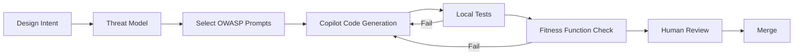

# GitHub Copilot - MaintainabilityAI Guide

> **Purpose**: GitHub Copilot-specific guidance for security-first AI-assisted development in the MaintainabilityAI framework.

This guide shows you how to effectively use GitHub Copilot (including Chat and Workspace features) with security constraints, OWASP prompt packs, and evolutionary architecture principles.

---

## Quick Start

### Using #codebase Patterns

GitHub Copilot Chat supports `#codebase` context to understand your entire repository structure. Use this for security-aware code generation:

```markdown
#codebase I need to implement user authentication following OWASP A07 best practices.
Review /prompts/owasp/A07_authn_failures.md and generate secure authentication middleware.
```

**Key Benefits**:
- Copilot understands existing security patterns in your repo
- References OWASP prompt packs automatically
- Maintains consistency with established conventions

---

## Security-First Coding with Copilot

### 1. Reference OWASP Prompts Directly

**Pattern**: Always reference the specific OWASP prompt pack for your task.

```markdown
#file:/prompts/owasp/A03_injection.md

Using the security requirements above, refactor this function to use parameterized queries:

[paste insecure code]
```

**Why This Works**:
- Gives Copilot explicit security constraints
- Ensures compliance with OWASP Top 10 (2021)
- Creates consistent security patterns across your codebase

### 2. Use Workspace Agent for Architecture Decisions

The Copilot Workspace agent can help with architectural fitness functions:

```markdown
@workspace Review the codebase and identify:
1. Functions with cyclomatic complexity > 10
2. Modules violating the 3-month dependency freshness rule
3. Files missing error handling patterns
4. Security vulnerabilities matching OWASP A01-A10

Reference: /docs/maintainability/fitness-functions.md
```

### 3. Inline Completions with Security Context

When writing code, add comments to guide Copilot's inline suggestions:

```typescript
// SECURITY: OWASP A01 - Implement RBAC authorization check
// - Verify user is authenticated
// - Check requester owns resource OR has admin role
// - Log authorization failures
// - Return generic error (no info leakage)
export function getUserDocument(requester: User, ownerId: string) {
  // [Copilot will generate secure implementation]
}
```

---

## Integration with Fitness Functions

### Architectural Fitness Functions

Use Copilot to enforce evolutionary architecture principles:

#### Example 1: Complexity Fitness Function

```markdown
@workspace Create a custom ESLint rule that:
- Flags functions with cyclomatic complexity > 15
- Suggests refactoring patterns
- Integrates with our CI/CD pipeline

Reference: /docs/maintainability/fitness-functions.md (complexity section)
```

#### Example 2: Dependency Freshness

```markdown
#codebase Review package.json and identify dependencies older than 3 months.
For each outdated package:
1. Check for security vulnerabilities
2. Suggest upgrade path
3. Identify breaking changes
4. Generate migration guide

Reference: /docs/maintainability/evolutionary-architecture.md (3-month rule)
```

---

## OWASP Top 10 Integration

### Using Prompt Packs with Copilot Chat

For each OWASP category, reference the prompt pack before generating code:

| OWASP Category | Copilot Command Pattern |
|----------------|-------------------------|
| **A01: Broken Access Control** | `#file:/prompts/owasp/A01_broken_access_control.md Implement RBAC for [endpoint]` |
| **A02: Cryptographic Failures** | `#file:/prompts/owasp/A02_crypto_failures.md Add secure password hashing to [function]` |
| **A03: Injection** | `#file:/prompts/owasp/A03_injection.md Refactor SQL query with parameterization` |
| **A04: Insecure Design** | `#file:/prompts/owasp/A04_insecure_design.md Review threat model for [feature]` |
| **A05: Security Misconfiguration** | `#file:/prompts/owasp/A05_security_misconfig.md Add security headers to Express app` |
| **A06: Vulnerable Components** | `#file:/prompts/owasp/A06_vuln_outdated.md Audit dependencies for CVEs` |
| **A07: Authentication Failures** | `#file:/prompts/owasp/A07_authn_failures.md Implement MFA for login` |
| **A08: Integrity Failures** | `#file:/prompts/owasp/A08_integrity_failures.md Add signature verification` |
| **A09: Logging/Monitoring** | `#file:/prompts/owasp/A09_logging_monitoring.md Add structured logging with PII redaction` |
| **A10: SSRF** | `#file:/prompts/owasp/A10_ssrf.md Validate external URLs before fetch` |

---

## Maintainability Prompt Packs

### Evolutionary Architecture Integration

Use these maintainability prompt packs alongside OWASP security prompts for production-grade code:

| Maintainability Pattern | Copilot Command Pattern |
|-------------------------|-------------------------|
| **Fitness Functions** | `#file:/prompts/maintainability/fitness-functions.md Create complexity test: fail if any function >10` |
| **Dependency Hygiene** | `#file:/prompts/maintainability/dependency-hygiene.md Implement 3-month freshness rule with Renovate bot` |
| **Strangler Fig Migration** | `#file:/prompts/maintainability/strangler-fig.md Create proxy layer for incremental service migration` |
| **Technical Debt Tracking** | `#file:/prompts/maintainability/technical-debt.md Generate TECHNICAL-DEBT.yml with automated detection` |

### Hybrid Prompts (Security + Maintainability)

**Example: Secure API Endpoint with Maintainability Constraints**

```markdown
#file:/prompts/owasp/A01_broken_access_control.md
#file:/prompts/owasp/A07_authn_failures.md
#file:/prompts/maintainability/fitness-functions.md

Implement secure user profile endpoint with:

Security (OWASP):
- A01: RBAC authorization (user owns resource OR admin role)
- A07: JWT authentication with bcrypt password hashing
- Generic error messages (no info leakage)
- Structured logging (PII redacted)

Maintainability (Fitness Functions):
- Cyclomatic complexity ≤10 per function
- Test coverage ≥80% (include attack vectors)
- Dependencies: bcrypt ≥5.1.0, jsonwebtoken ≥9.0.0
- Performance: p95 latency <200ms

Generate:
- src/routes/users.ts (implementation)
- src/__tests__/users.test.ts (security + performance tests)
- tests/fitness-functions/users-complexity.test.ts (complexity check)
```

**Example: Dependency Upgrade with Security Validation**

```markdown
#file:/prompts/maintainability/dependency-hygiene.md
#file:/prompts/owasp/A06_vuln_outdated.md

Upgrade express from 4.17.1 to 4.18.2:

1. Review CHANGELOG for breaking changes
2. Run npm audit to check for CVEs in current version
3. Upgrade with npm install express@4.18.2 --save-exact
4. Update all route handlers for API changes
5. Run full test suite
6. Run CodeQL and Snyk scans to verify no new vulnerabilities
7. Update TECHNICAL-DEBT.yml to mark DEBT-XXX as resolved

Reference: 3-month dependency freshness rule
```

---

## Evolutionary Architecture Principles

### Incremental Change Pattern

**Principle**: Make small, verifiable changes aligned with fitness functions.

```markdown
@workspace I want to refactor the authentication module incrementally.

Phase 1: Add TypeScript strict mode types
Phase 2: Implement input validation with Zod
Phase 3: Add unit tests (>80% coverage)
Phase 4: Integrate with CodeQL security scanning

For each phase:
- Generate code changes
- Run tests
- Verify fitness functions pass
- Commit with clear message

Reference: /docs/maintainability/evolutionary-architecture.md
```

### Technical Debt Tracking

```markdown
#codebase Analyze the codebase and create a technical debt backlog:

1. Security debt: OWASP violations, missing auth checks
2. Complexity debt: Functions >15 cyclomatic complexity
3. Dependency debt: Packages >3 months old with CVEs
4. Test debt: Modules <80% coverage
5. Documentation debt: Undocumented public APIs

Format as GitHub issues with priority labels.
```

---

## Workflow Integration

### SDLC Phase Alignment

Copilot fits into the MaintainabilityAI SDLC at specific phases:



**Best Practices**:
1. **Design Phase**: Use `@workspace` to understand requirements
2. **Implementation Phase**: Reference OWASP prompts for secure code
3. **Verification Phase**: Generate tests with security attack vectors
4. **Governance Phase**: Document AI-assisted changes in commits

---

## Security Constraints

### Always Include in Prompts

Every security-related prompt should include:

```markdown
#file:/prompts/owasp/[category].md

Context:
- Tech stack: [Node 18, TypeScript, Express, PostgreSQL]
- Security level: Production (strict mode)
- Compliance: OWASP Top 10 (2021)

Security Checklist:
□ Input validation (Zod schemas)
□ Parameterized queries (no string concatenation)
□ Error handling (generic messages, no info leakage)
□ Logging (structured, PII redacted)
□ Authentication/authorization enforced
□ Tests include attack vectors

Generate code that passes:
- ESLint security rules
- Jest tests (including negative cases)
- CodeQL security scanning
```

---

## Example: Complete Workflow

### Scenario: Implement A03 Injection Prevention

**Step 1: Reference Prompt Pack**

```markdown
#file:/prompts/owasp/A03_injection.md

Review the security requirements for SQL injection prevention.
```

**Step 2: Generate Secure Code**

```markdown
#file:/examples/owasp/A03_injection/insecure.ts

Refactor this function following the A03 prompt pack:
1. Use parameterized queries
2. Add Zod validation
3. Implement length limits (100 chars)
4. Generic error messages
5. Add tests with attack payloads
```

**Step 3: Verify with Fitness Functions**

```markdown
@workspace Run fitness function checks:
- Cyclomatic complexity < 10
- All inputs validated
- Test coverage > 80%
- CodeQL security scan clean
```

**Step 4: Generate Tests**

```markdown
Generate Jest tests for searchUsers() including:
- Valid input (passes)
- SQL injection attempts (blocked)
- Excessively long input (rejected)
- Invalid characters (rejected)
- Empty input (handled gracefully)
```

---

## Copilot Agent Mode

GitHub Copilot's Agent mode can handle multi-step tasks autonomously:

### Example: Upgrade All Dependencies

```markdown
@workspace Task: Upgrade all dependencies following the "Upgrade All The Things" kata

Steps:
1. Audit package.json for packages >3 months old
2. Check each for security vulnerabilities (npm audit)
3. Review changelogs for breaking changes
4. Upgrade patch versions first, then minors, then majors
5. Run tests after each upgrade
6. If tests fail, revert and document reason
7. Generate upgrade report with:
   - Packages upgraded
   - Security fixes applied
   - Breaking changes handled
   - Tests status

Reference: /docs/sdlc/phase6-evolution.md (dependency management)
```

---

## Best Practices

### 1. Be Explicit About Security

```markdown
# ❌ Vague
"Add authentication to the API"

# ✅ Specific
"#file:/prompts/owasp/A07_authn_failures.md
Implement authentication middleware with:
- bcrypt password hashing (cost 12)
- Rate limiting (5 attempts/15min)
- Secure session cookies (httpOnly, secure, sameSite)
- Generic error messages (no username enumeration)"
```

### 2. Reference Existing Code Patterns

```markdown
#file:/examples/owasp/A01_broken_access_control/

Use the authorization pattern from this example to protect the new /api/reports endpoint.
Ensure ownership checks prevent IDOR attacks.
```

### 3. Validate with Tests

```markdown
After generating the code, create Jest tests that verify:
1. Authorized users can access (200 OK)
2. Unauthorized users are blocked (403 Forbidden)
3. Invalid tokens are rejected (401 Unauthorized)
4. IDOR attempts are logged and denied
```

---

## Golden Rules Integration

Apply the [Golden Rules of Vibe Coding](/docs/governance/vibe-golden-rules.md) with Copilot:

1. **Be Specific**: Reference OWASP prompts, tech stack, and constraints
2. **Trust But Verify**: Review every line Copilot generates
3. **Treat as Junior Dev**: Give detailed guidance, review output
4. **Isolate AI Changes**: Commit with `🤖 AI-assisted with Copilot` label
5. **Document Rationale**: Add comments explaining security decisions
6. **Share Prompts**: Add successful patterns to `/prompts/team/`

---

## Common Pitfalls

### 1. Over-Trusting Autocomplete

**Problem**: Accepting inline suggestions without review

**Solution**:
- Read every line before accepting
- Verify security constraints are met
- Test with attack vectors

### 2. Vague Prompts

**Problem**: "Fix the security issue"

**Solution**:
```markdown
#file:/prompts/owasp/A03_injection.md
The searchUsers function is vulnerable to SQL injection.
Refactor using parameterized queries and add Zod validation per the prompt pack.
```

### 3. Skipping Tests

**Problem**: Generating code without test verification

**Solution**:
```markdown
Generate secure implementation AND comprehensive tests:
- Unit tests for happy path
- Security tests for attack vectors (from OWASP examples)
- Integration tests with real database
All tests must pass before committing.
```

---

## Measuring Success

Track these metrics to optimize Copilot usage:

- **Acceptance Rate**: % of Copilot suggestions accepted without modification
- **Security Scan Pass Rate**: % of AI-generated code passing CodeQL/Snyk
- **Time to Implementation**: Speed of feature delivery with security maintained
- **Test Coverage**: % coverage on AI-generated code
- **Prompt Reuse**: Frequency of OWASP prompt pack references

---

## Further Reading

### Security Prompts
- [GitHub Copilot Documentation](https://docs.github.com/en/copilot)
- [OWASP Prompt Packs](/prompts/owasp/)
- [Golden Rules of Vibe Coding](/docs/governance/vibe-golden-rules.md)
- [SDLC Framework](/docs/sdlc/)

### Maintainability Prompts
- [Fitness Functions Prompt Pack](/prompts/maintainability/fitness-functions.md)
- [Dependency Hygiene Prompt Pack](/prompts/maintainability/dependency-hygiene.md)
- [Strangler Fig Prompt Pack](/prompts/maintainability/strangler-fig.md)
- [Technical Debt Prompt Pack](/prompts/maintainability/technical-debt.md)
- [Evolutionary Architecture Guide](/docs/maintainability/evolutionary-architecture.md)

---

**Next Steps**:
1. Install GitHub Copilot extension in VS Code
2. Review OWASP prompt packs in `/prompts/owasp/`
3. Review Maintainability prompt packs in `/prompts/maintainability/`
4. Try the [A03 Injection example](/examples/owasp/A03_injection/)
5. Practice with `#file:` and `@workspace` patterns for hybrid security + maintainability prompts
6. Share successful prompts with your team
