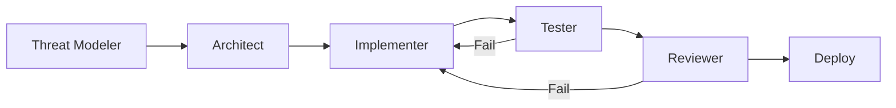
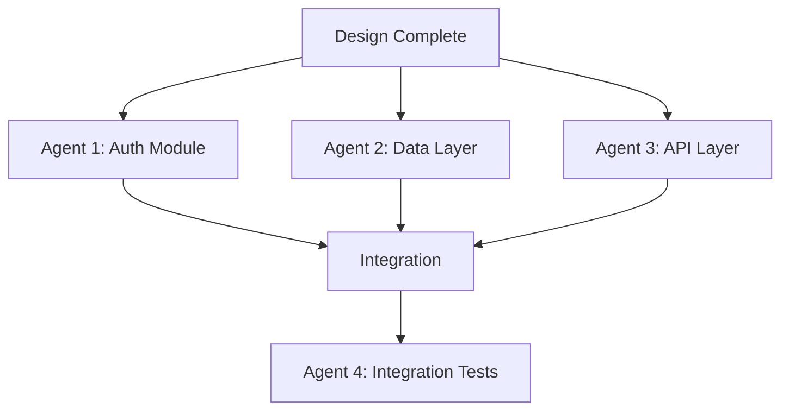
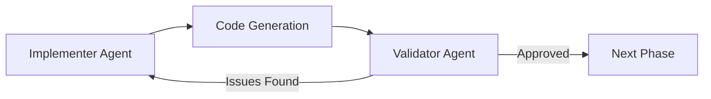
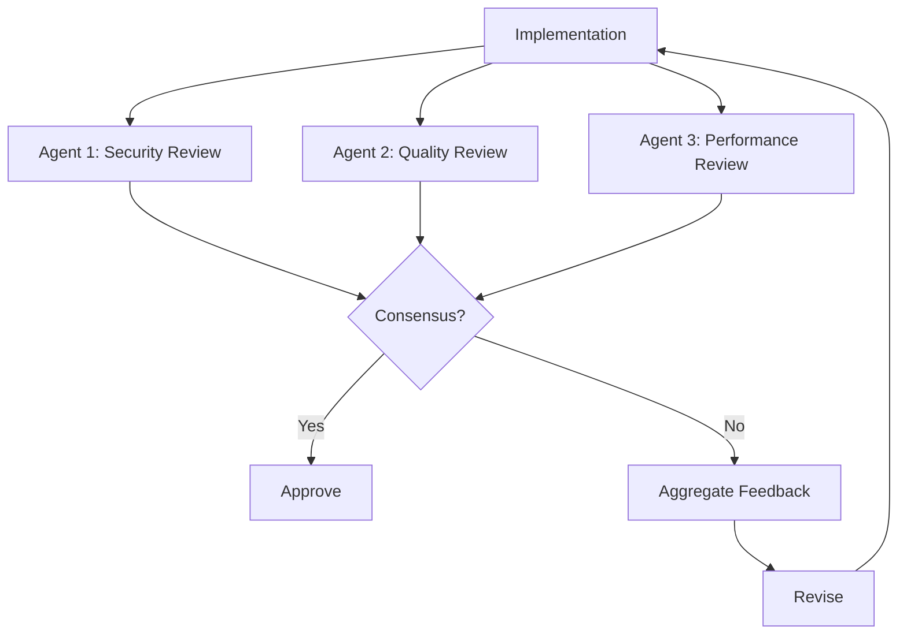
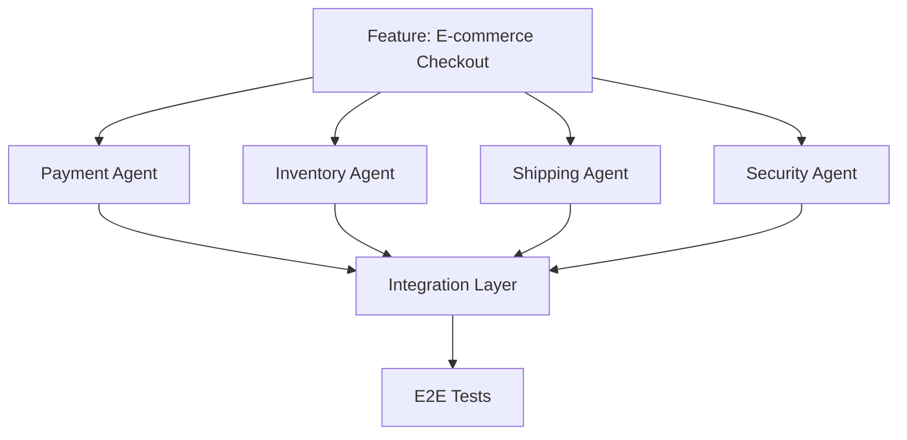

# Multi-Agent Orchestration - MaintainabilityAI Guide

> **Purpose**: Coordinate multiple AI agents for complex security-first development workflows.

This guide shows you how to orchestrate multiple AI agents (Claude, Copilot, ChatGPT, and specialized agents) in coordinated workflows that leverage each agent's strengths while maintaining security and quality.

---

## Overview

### Why Multi-Agent Orchestration?

Modern AI-assisted development often requires:
- **Specialized expertise**: Different agents excel at different tasks
- **Parallel workstreams**: Multiple features developed simultaneously
- **Verification loops**: One agent validates another's output
- **Complex workflows**: Multi-phase tasks requiring coordination

**Example**: Building a secure authentication system requires:
1. Threat modeling agent (identifies risks)
2. Implementation agent (writes secure code)
3. Testing agent (creates attack vector tests)
4. Review agent (validates security controls)

---

## Core Multi-Agent Patterns

### Pattern 1: Sequential Pipeline

**Use Case**: Linear workflow where each agent builds on previous work.



**Example: A03 Injection Prevention**

```markdown
Agent 1 (Threat Modeler - ChatGPT):
Task: Analyze searchUsers() function for injection threats.
Output: Threat model with attack vectors

Agent 2 (Security Architect - Claude):
Input: Threat model from Agent 1
Task: Design mitigation strategy (parameterized queries, validation)
Output: Architecture document with security controls

Agent 3 (Code Implementer - Copilot):
Input: Architecture from Agent 2
Task: Implement secure searchUsers() function
Output: TypeScript implementation

Agent 4 (Test Engineer - Claude):
Input: Implementation from Agent 3
Task: Generate comprehensive tests including attack vectors
Output: Jest test suite

Agent 5 (Security Reviewer - ChatGPT):
Input: All above artifacts
Task: Review against OWASP A03 checklist
Output: Approval or change requests
```

### Pattern 2: Parallel Execution

**Use Case**: Independent tasks that can run simultaneously.



**Example: Microservice Development**

```markdown
Agent 1 (Copilot - Authentication):
Task: Implement OWASP A07-compliant authentication
Prompt: site-tw/public/docs/prompts/owasp/A07_authn_failures.md
Output: Auth middleware + unit tests

Agent 2 (Claude - Data Access):
Task: Implement OWASP A03-compliant data layer
Prompt: site-tw/public/docs/prompts/owasp/A03_injection.md
Output: Database repository + unit tests

Agent 3 (ChatGPT - API Routes):
Task: Implement OWASP A01-compliant API endpoints
Prompt: site-tw/public/docs/prompts/owasp/A01_broken_access_control.md
Output: Express routes + unit tests

Agent 4 (Claude - Integration):
Input: Modules from Agents 1-3
Task: Create integration tests and verify OWASP compliance
Output: Integration test suite + security report
```

### Pattern 3: Validator Loop

**Use Case**: One agent generates, another validates in tight feedback loop.



**Example: Security Hardening**

```markdown
Implementer Agent (Copilot):
Task: Generate login function
Output: Initial implementation

Validator Agent (ChatGPT with OWASP checklist):
Task: Review against OWASP A07 requirements
Output: Security checklist with issues

[Loop until validator approves]

Final Output: OWASP-compliant, validated implementation
```

---

## The Threat Modeler → Implementer → Validator Pattern

This is the **gold standard** pattern for security-critical features.

### Phase 1: Threat Modeling

**Agent: ChatGPT** (excels at structured analysis and STRIDE methodology)

```markdown
Role: Security Threat Modeler

Task: Analyze the following feature for security threats using STRIDE methodology.

Feature: User profile update endpoint
- Allows users to update email, name, password
- Must validate ownership
- Must log changes for audit
- Must notify user of security-relevant changes

For each STRIDE category:
1. Identify specific threats
2. Map to OWASP Top 10 categories
3. Rate risk (High/Medium/Low)
4. Suggest mitigations

Output format:
- Threat inventory (JSON)
- OWASP category mapping
- Mitigation requirements
```

**Output**: Structured threat model

```json
{
  "threats": [
    {
      "id": "T1",
      "category": "Spoofing",
      "description": "Attacker could update another user's profile",
      "owasp": "A01 - Broken Access Control",
      "risk": "High",
      "mitigation": "Verify requester ID matches profile owner ID"
    },
    {
      "id": "T2",
      "category": "Tampering",
      "description": "SQL injection in profile update query",
      "owasp": "A03 - Injection",
      "risk": "High",
      "mitigation": "Use parameterized queries, Zod validation"
    }
  ]
}
```

### Phase 2: Implementation

**Agent: Copilot** (excels at code generation with context)

```markdown
#file:site-tw/public/docs/prompts/owasp/A01_broken_access_control.md
#file:site-tw/public/docs/prompts/owasp/A03_injection.md

Threat Model Input:
[Paste threat model JSON from Phase 1]

Task: Implement updateUserProfile() function that mitigates all identified threats.

Requirements from Threat Model:
- [T1] Verify requester owns profile (A01)
- [T2] Use parameterized queries (A03)
- [T3] Log security events (A09)
- [T4] Rate limit updates (A07)

Generate:
1. Function implementation
2. Zod validation schemas
3. Authorization middleware
4. Audit logging

All code must address threats T1-T4.
```

**Output**: Secure implementation with threat mapping

```typescript
/**
 * SECURITY: Addresses threats T1, T2, T3, T4 from threat model
 * OWASP: A01 (Access Control), A03 (Injection), A09 (Logging)
 */
export async function updateUserProfile(
  requesterId: string,
  profileId: string,
  updates: ProfileUpdate
) {
  // T1: Authorization check (OWASP A01)
  if (requesterId !== profileId) {
    logger.securityEvent('unauthorized_profile_update', { requesterId, profileId });
    throw new UnauthorizedError('Access denied');
  }

  // T2: Input validation (OWASP A03)
  const validated = profileUpdateSchema.parse(updates);

  // T2: Parameterized query (OWASP A03)
  const result = await db.query(
    'UPDATE users SET email = $1, name = $2 WHERE id = $3',
    [validated.email, validated.name, profileId]
  );

  // T3: Audit logging (OWASP A09)
  logger.auditEvent('profile_updated', { userId: profileId, changes: validated });

  return result;
}
```

### Phase 3: Validation

**Agent: Claude** (excels at comprehensive analysis and test generation)

```markdown
Role: Security Validator

Inputs:
- Threat Model: [paste JSON from Phase 1]
- Implementation: [paste code from Phase 2]
- OWASP Prompt Packs: site-tw/public/docs/prompts/owasp/A01, A03, A09

Task: Validate implementation against threat model and OWASP requirements.

Verification Steps:
1. Checklist Review: Verify each threat (T1-T4) is mitigated
2. OWASP Compliance: Check against A01, A03, A09 requirements
3. Code Quality: Assess complexity, error handling, logging
4. Test Generation: Create tests for each threat + attack vectors

Output:
- Validation report (Pass/Fail per threat)
- Missing security controls (if any)
- Comprehensive test suite
- Recommendation: Approve / Request Changes
```

**Output**: Validation report + tests

```markdown
Validation Report:

✅ T1 (Spoofing - A01): PASS
- Authorization check present (line 8)
- Ownership verification correct
- Generic error message (no info leakage)

✅ T2 (Tampering - A03): PASS
- Zod validation present (line 14)
- Parameterized query used (line 17)
- No string concatenation

✅ T3 (Information Disclosure - A09): PASS
- Security events logged (line 10)
- Audit trail created (line 22)

❌ T4 (Denial of Service - A07): FAIL
- No rate limiting implemented
- Missing: Express rate-limit middleware

Recommendation: REQUEST CHANGES
Add rate limiting before approval.

[Generated test suite attached]
```

### Phase 4: Iteration

**Agent: Copilot** (fixes issues identified by validator)

```markdown
Validation Feedback:
[Paste validation report from Phase 3]

Task: Address the failing check (T4 - Rate Limiting).

Add express-rate-limit middleware:
- 10 profile updates per hour per user
- Return 429 status on limit exceeded
- Log rate limit violations

Update implementation to include rate limiting.
```

**Output**: Complete, validated implementation

```typescript
import rateLimit from 'express-rate-limit';

// T4: Rate limiting (OWASP A07)
const profileUpdateLimiter = rateLimit({
  windowMs: 60 * 60 * 1000, // 1 hour
  max: 10, // 10 updates per hour
  message: 'Too many profile updates, please try again later',
  handler: (req, res) => {
    logger.securityEvent('rate_limit_exceeded', { userId: req.user.id });
    res.status(429).json({ error: 'Too many requests' });
  }
});

// Apply to route
app.post('/profile/:id', profileUpdateLimiter, updateUserProfile);
```

---

## Agent Communication Protocols

### Structured Handoff Format

When passing work between agents, use this format:

```markdown
===== AGENT HANDOFF =====

FROM: [Agent Name/Role]
TO: [Next Agent Name/Role]
PHASE: [Phase Name]

CONTEXT:
- Feature: [Feature description]
- OWASP Categories: [A01, A03, etc.]
- Tech Stack: [Node 18, TypeScript, etc.]

INPUT ARTIFACTS:
1. [Artifact 1 name and location]
2. [Artifact 2 name and location]

TASK:
[Specific task for next agent]

SUCCESS CRITERIA:
□ [Criterion 1]
□ [Criterion 2]

CONSTRAINTS:
- [Constraint 1]
- [Constraint 2]

REFERENCES:
- /prompts/owasp/[category].md
- /docs/maintainability/[document].md

===== END HANDOFF =====
```

### Example Handoff

```markdown
===== AGENT HANDOFF =====

FROM: Threat Modeler (ChatGPT)
TO: Security Architect (Claude)

PHASE: Design → Architecture

CONTEXT:
- Feature: Document sharing between users
- OWASP Categories: A01 (Access Control), A08 (Integrity)
- Tech Stack: Node 18, TypeScript, Express, PostgreSQL

INPUT ARTIFACTS:
1. Threat Model JSON (attached below)
2. Feature Requirements Doc
3. Existing User/Document data models

TASK:
Design secure document sharing architecture that mitigates all threats identified in the threat model.

SUCCESS CRITERIA:
□ Address all 8 threats from threat model
□ Define authorization model (who can share with whom)
□ Specify integrity checks (prevent document tampering)
□ Design audit trail for compliance
□ Consider performance (10k+ shares per day)

CONSTRAINTS:
- Must use existing User/Document tables
- Cannot break existing document access API
- Maintain <200ms response time for share operations

REFERENCES:
- /prompts/owasp/A01_broken_access_control.md
- /prompts/owasp/A08_integrity_failures.md
- /docs/maintainability/fitness-functions.md

===== END HANDOFF =====

[Threat Model JSON]
{...}
```

---

## Agent Selection Guide

Choose the right agent for each task:

### ChatGPT
**Strengths**:
- Structured analysis (threat modeling, STRIDE)
- Long-form explanations and documentation
- Multi-turn refinement conversations
- Educational responses (explaining "why")

**Best For**:
- Threat modeling (STRIDE methodology)
- Security architecture reviews
- Creating documentation
- Explaining complex security concepts
- Generating test case scenarios

### Claude (Code)
**Strengths**:
- Deep code understanding and refactoring
- Complex multi-file changes
- Comprehensive test generation
- Security-focused code review
- Evolutionary architecture guidance

**Best For**:
- Large-scale refactoring
- Multi-file feature implementation
- Comprehensive test suite generation
- Code review with security checklists
- Technical debt analysis

### GitHub Copilot
**Strengths**:
- IDE-integrated (VS Code)
- Real-time code completion
- Understands codebase context (#codebase)
- Fast iteration on single files
- Boilerplate generation

**Best For**:
- In-editor code generation
- Quick fixes and refactoring
- Single-function implementation
- Following established patterns
- Real-time security constraint enforcement

### Specialized Agents
**CodeQL Agent** (via GitHub Actions):
- Static security analysis
- Custom query development
- Vulnerability detection

**Snyk Agent** (via CLI/API):
- Dependency vulnerability scanning
- License compliance checking
- Fix PR generation

---

## Advanced Orchestration Patterns

### Pattern 4: Consensus Validation

Multiple agents review the same code and must reach consensus.



**Example**:

```markdown
Code to Review:
[paste implementation]

Agent 1 (ChatGPT - Security):
Review against OWASP Top 10. Identify any security issues.

Agent 2 (Claude - Code Quality):
Review for maintainability:
- Cyclomatic complexity <10
- Function length <50 lines
- Clear error handling
- Comprehensive tests

Agent 3 (Copilot Workspace - Performance):
Review for performance issues:
- Database query efficiency
- Memory leaks
- N+1 query problems
- Caching opportunities

[Aggregate all feedback, address issues, repeat until all agents approve]
```

### Pattern 5: Specialization Tree

Complex feature branches to specialized agents by domain.



**Example: E-commerce Checkout**

```markdown
Feature: Secure checkout flow

Sub-Task 1 (Payment Agent - ChatGPT):
Implement PCI-DSS compliant payment processing
- OWASP A02 (Crypto), A08 (Integrity)
- Stripe integration
- Tokenization, no raw card data storage

Sub-Task 2 (Inventory Agent - Claude):
Implement ACID-compliant inventory reservation
- Prevent overselling
- Handle concurrent reservations
- Rollback on payment failure

Sub-Task 3 (Shipping Agent - Copilot):
Calculate shipping costs and validate addresses
- OWASP A10 (SSRF - address validation API)
- Rate limiting on external API calls

Sub-Task 4 (Security Agent - ChatGPT):
Threat model entire checkout flow
- Identify attack surface
- Validate all agents' security controls
- Generate attack vector tests

Integration Agent (Claude):
Combine all components with:
- Distributed transaction handling
- Comprehensive error recovery
- E2E test suite
```

---

## Handoff Patterns Between Agents

### Pattern: Requirements → Design → Implementation → Validation

```markdown
STEP 1: Requirements Analysis (ChatGPT)
Input: User story
Output: Detailed requirements + acceptance criteria + OWASP mapping

HANDOFF TO STEP 2
---

STEP 2: Threat Modeling (ChatGPT)
Input: Requirements from Step 1
Output: Threat model (STRIDE) + security requirements

HANDOFF TO STEP 3
---

STEP 3: Architecture Design (Claude)
Input: Requirements + Threat model
Output: Architecture design + fitness functions + security controls

HANDOFF TO STEP 4
---

STEP 4: Implementation (Copilot)
Input: Architecture from Step 3
Output: Code implementation

HANDOFF TO STEP 5
---

STEP 5: Test Generation (Claude)
Input: Implementation + Threat model
Output: Comprehensive tests (unit + integration + security)

HANDOFF TO STEP 6
---

STEP 6: Security Review (ChatGPT)
Input: All artifacts from Steps 1-5
Output: Security approval or change requests

IF APPROVED: HANDOFF TO DEPLOYMENT
IF REJECTED: HANDOFF TO STEP 4 with feedback
```

### Pattern: Parallel Review and Merge

```markdown
Implementation Complete → Trigger Parallel Reviews

REVIEW 1 (ChatGPT - Security):
- OWASP compliance check
- Threat coverage verification
- Security test adequacy

REVIEW 2 (Claude - Code Quality):
- Complexity analysis
- Test coverage check
- Maintainability score

REVIEW 3 (CodeQL - Static Analysis):
- Automated security scanning
- CWE detection
- Dataflow analysis

MERGE REVIEWS:
All three must pass:
✅ Security: OWASP compliant
✅ Quality: Fitness functions pass
✅ Static: No high-severity findings

→ APPROVE FOR MERGE
```

---

## Coordination Tools

### Agent Task Board

Use a simple markdown table to track multi-agent workflows:

```markdown
| Task | Agent | Status | Input | Output | Blocker |
|------|-------|--------|-------|--------|---------|
| Threat Model | ChatGPT | Done | User story | threat-model.json | - |
| Architecture | Claude | In Progress | threat-model.json | architecture.md | - |
| Auth Module | Copilot | Waiting | architecture.md | - | Need architecture |
| Data Layer | Copilot | Waiting | architecture.md | - | Need architecture |
| Tests | Claude | Not Started | - | - | Need implementation |
| Review | ChatGPT | Not Started | - | - | Need tests |
```

### Agent Communication Log

Keep a log of agent interactions for traceability:

```markdown
## Multi-Agent Session Log
Feature: User Authentication
Date: 2025-10-10

### 10:00 - Threat Modeling (ChatGPT)
Input: Feature requirements
Output: threat-model.json (8 threats identified)
OWASP Categories: A07, A02, A09

### 10:30 - Architecture Design (Claude)
Input: threat-model.json
Output: auth-architecture.md
Decisions: bcrypt, JWT, Redis sessions

### 11:00 - Implementation (Copilot)
Input: auth-architecture.md, /prompts/owasp/A07_authn_failures.md
Output: auth.ts, auth.middleware.ts
Status: Initial implementation complete

### 11:30 - Test Generation (Claude)
Input: auth.ts, threat-model.json
Output: auth.test.ts (24 tests, including 12 attack vectors)
Coverage: 95%

### 12:00 - Security Review (ChatGPT)
Input: All artifacts
Findings:
- ❌ Missing rate limiting (T4 from threat model)
- ✅ All other threats mitigated
Action: HANDOFF to Copilot for rate limiting implementation

### 12:30 - Rate Limiting Fix (Copilot)
Input: Review feedback
Output: rate-limit.middleware.ts, updated auth.ts
Status: Complete

### 13:00 - Final Review (ChatGPT)
Input: Updated implementation
Result: ✅ APPROVED - All OWASP A07 requirements met
```

---

## Real-World Workflow Examples

### Example 1: OWASP A01 Remediation Across Microservices

**Scenario**: 50 API endpoints need authorization checks added.

```markdown
PHASE 1: Pattern Definition (Claude)
Task: Analyze existing auth patterns and define standard middleware
Output: authorization.middleware.ts (RBAC + ownership check)
Duration: 30 minutes

PHASE 2: Parallel Implementation (3 Copilot Instances)
Agent 1: Endpoints 1-17 (User service)
Agent 2: Endpoints 18-34 (Product service)
Agent 3: Endpoints 35-50 (Order service)
Each uses: #file:authorization.middleware.ts pattern
Duration: 1 hour (parallel)

PHASE 3: Test Generation (Claude)
Task: Generate security tests for all 50 endpoints
Input: All implementations from Phase 2
Output: Comprehensive test suite with IDOR attack tests
Duration: 45 minutes

PHASE 4: Validation (ChatGPT)
Task: Review all changes against OWASP A01 checklist
Input: All code + tests from Phases 2-3
Output: Validation report per endpoint
Duration: 30 minutes

TOTAL: 2 hours 45 minutes (vs. estimated 20 hours manual)
```

### Example 2: Dependency Upgrade ("Upgrade All The Things")

```markdown
PHASE 1: Audit (Snyk Agent + ChatGPT)
Snyk: Scan package.json for vulnerabilities
ChatGPT: Analyze Snyk output and prioritize upgrades
Output: Upgrade plan with risk assessment

PHASE 2: Compatibility Analysis (Claude)
Task: Review changelogs for breaking changes
Input: Upgrade plan from Phase 1
Output: Migration guide per package

PHASE 3: Sequential Upgrades (Copilot)
For each package in priority order:
  - Copilot: Update package.json + code changes
  - Run tests (automated)
  - If pass: Commit
  - If fail: Revert and flag for human review

PHASE 4: Verification (CodeQL + Claude)
CodeQL: Scan for new vulnerabilities
Claude: Review test coverage on changed code
Output: Security verification report
```

---

## Best Practices

### 1. Clear Handoffs
- Always use structured handoff format
- Include all necessary context
- Define success criteria
- Specify constraints

### 2. Agent Strengths
- ChatGPT: Analysis, threat modeling, long explanations
- Claude: Complex refactoring, comprehensive testing, reviews
- Copilot: In-editor generation, pattern following, quick fixes

### 3. Verification Loops
- Never skip validation step
- Use different agent for validation than implementation
- Include automated checks (CodeQL, Snyk, ESLint)

### 4. Traceability
- Maintain agent communication log
- Label commits with agent used
- Document agent decisions in code comments

### 5. Human Oversight
- Human reviews final output from all agents
- Human resolves conflicts between agents
- Human makes final approval decision

---

## Common Pitfalls

### Pitfall 1: No Clear Handoff
**Problem**: Next agent lacks context from previous agent

**Solution**: Use structured handoff format with explicit inputs/outputs

### Pitfall 2: Wrong Agent for Task
**Problem**: Using ChatGPT for code generation when Copilot would be faster

**Solution**: Follow agent selection guide (strengths/weaknesses)

### Pitfall 3: Skipping Validation
**Problem**: Accepting first agent's output without verification

**Solution**: Always include validator agent in workflow

### Pitfall 4: Context Loss
**Problem**: Agents working in isolation, duplicating effort

**Solution**: Maintain shared context document updated after each phase

---

## Integration with SDLC

Multi-agent patterns fit into each SDLC phase:

| SDLC Phase | Primary Agent | Supporting Agents | Output |
|------------|---------------|-------------------|--------|
| **Design** | ChatGPT (Threat Model) | Claude (Architecture) | Threat model + design docs |
| **Implementation** | Copilot (Code Gen) | Claude (Refactoring) | Secure implementation |
| **Verification** | Claude (Test Gen) | CodeQL, Snyk | Test suite + scan results |
| **Governance** | ChatGPT (Review) | Human | Approval decision |
| **Deployment** | GitHub Actions | - | Production deployment |
| **Evolution** | Claude (Refactor) | ChatGPT (Analysis) | Technical debt reduction |

---

## Measuring Multi-Agent Effectiveness

### Metrics to Track

**Efficiency**:
- Time to delivery (multi-agent vs. single agent vs. manual)
- Number of iterations required
- Handoff overhead time

**Quality**:
- Security scan pass rate
- Test coverage percentage
- Defects in production (AI vs. manual code)

**Collaboration**:
- Handoff clarity score (1-5, reviewer-rated)
- Context loss incidents
- Agent agreement rate (consensus patterns)

---

## Quick Reference: Agent Workflows

### Secure Feature Development
1. ChatGPT: Threat model
2. Claude: Architecture design
3. Copilot: Implementation
4. Claude: Test generation
5. ChatGPT: Security review

### Large-Scale Refactoring
1. Claude: Analyze codebase, create plan
2. Multiple Copilot instances: Parallel implementation
3. Claude: Integration and test generation
4. CodeQL: Static analysis
5. ChatGPT: Final review

### Security Remediation
1. Snyk/CodeQL: Identify vulnerabilities
2. ChatGPT: Categorize by OWASP, prioritize
3. Copilot: Fix individual vulnerabilities
4. Claude: Generate security tests
5. ChatGPT: Validate fixes

### Dependency Upgrades
1. Snyk: Vulnerability scan
2. ChatGPT: Upgrade plan + risk assessment
3. Claude: Breaking change analysis
4. Copilot: Code updates
5. Claude: Regression test verification

---

## Further Reading

- [COPILOT.md](COPILOT.md) - GitHub Copilot-specific guidance
- [CHATGPT.md](CHATGPT.md) - ChatGPT-specific guidance
- [CLAUDE.md](CLAUDE.md) - Claude Code-specific guidance
- [SDLC Framework](/docs/sdlc/) - How agents fit into each phase
- [Golden Rules](/docs/governance/vibe-golden-rules.md) - Governance principles

---

**Next Steps**:
1. Try the Threat Modeler → Implementer → Validator pattern
2. Set up agent task board for your next feature
3. Practice structured handoffs between agents
4. Measure efficiency gains with metrics
5. Build your team's multi-agent playbook
