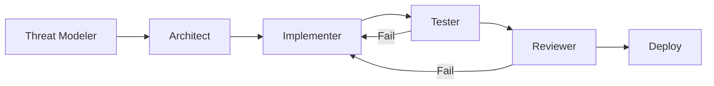
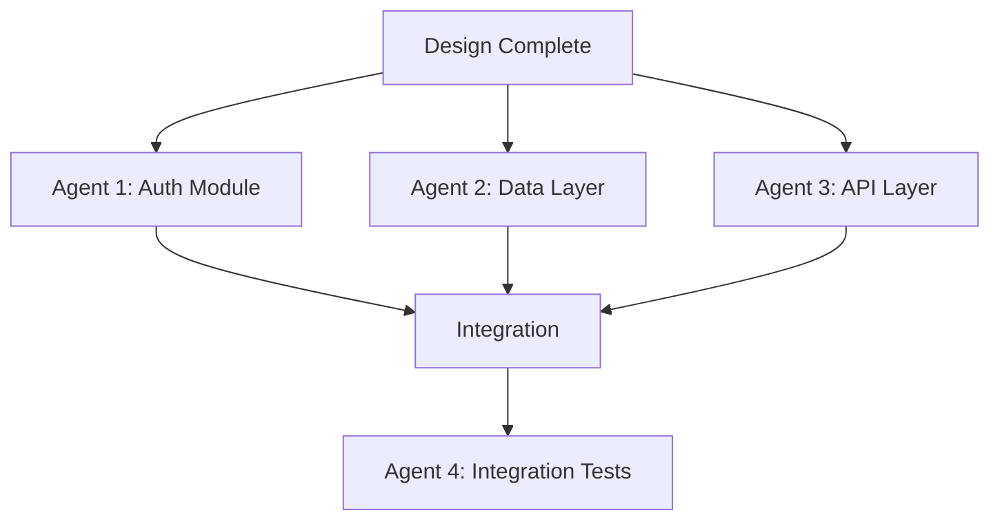
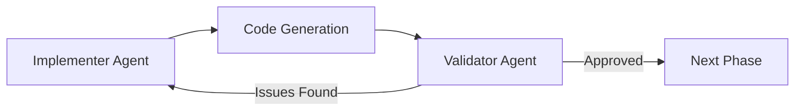
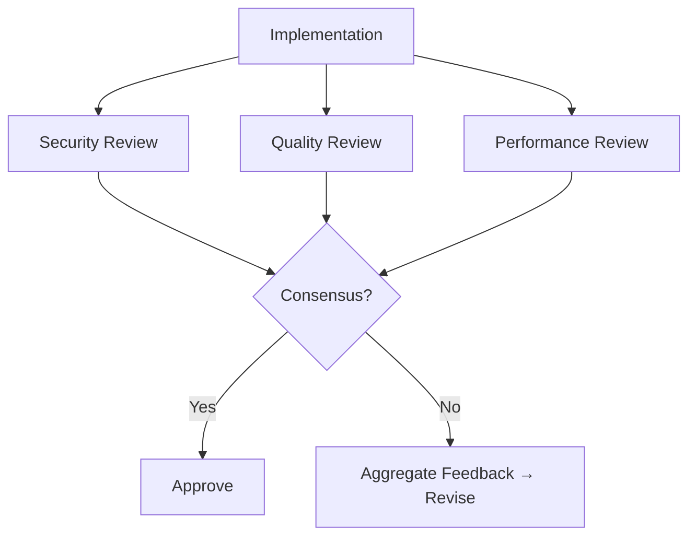

# Multi-Agent Orchestration Guide

> Coordinate multiple AI agents for complex security-first development workflows. Each agent has specialized strengths — orchestration gets you the best of all of them.

---

## Why Multi-Agent?

Complex tasks often require:
- **Specialized expertise**: Different agents excel at different things
- **Verification loops**: One agent validates another's output
- **Parallel workstreams**: Multiple features developed simultaneously
- **Phased workflows**: Threat model → design → implement → test → review

---

## Core Patterns

### Pattern 1: Sequential Pipeline

Each agent builds on the previous agent's output.

```mermaid
flowchart LR
    A[Threat Modeler] --> B[Architect]
    B --> C[Implementer]
    C --> D[Tester]
    D --> E[Reviewer]
    E --> F[Deploy]
    D --Fail--> C
    E --Fail--> C
```

**Typical assignment**: Claude Code (architecture + tests) → Copilot (implementation) → Claude Code Action or Copilot Coding Agent (automated review)

### Pattern 2: Parallel Execution

Independent tasks run simultaneously, then merge.

```mermaid
flowchart TD
    A[Design Complete] --> B[Agent 1: Auth Module]
    A --> C[Agent 2: Data Layer]
    A --> D[Agent 3: API Layer]
    B --> E[Integration]
    C --> E
    D --> E
    E --> F[Agent 4: Integration Tests]
```

**When to use**: Microservice development, multi-module features with clear boundaries.

### Pattern 3: Validator Loop

One agent generates, another validates — tight feedback until approval.

```mermaid
flowchart LR
    A[Implementer Agent] --> B[Code Generation]
    B --> C[Validator Agent]
    C -->|Issues Found| A
    C -->|Approved| D[Next Phase]
```

**When to use**: Security-critical features where implementation and review must be separate concerns.

### Pattern 4: Consensus Validation

Multiple agents review the same code from different angles. All must approve.

```mermaid
flowchart TD
    A[Implementation] --> B[Security Review]
    A --> C[Quality Review]
    A --> D[Performance Review]
    B --> E{Consensus?}
    C --> E
    D --> E
    E -->|Yes| F[Approve]
    E -->|No| G[Aggregate Feedback → Revise]
```

**When to use**: High-risk changes where security, quality, and performance all matter.

---

## The Gold Standard: Threat Model → Implement → Validate

This is the recommended pattern for security-critical features.

### Phase 1: Threat Modeling (Claude Code)

**Role:** You are a threat modeling specialist using STRIDE methodology.

**Context:**
Feature: User profile update endpoint — users can update email, name, password. Must validate ownership, log changes, notify on security-relevant updates.

**Task:**
Analyze this feature for threats using STRIDE. For each category: identify threats, map to OWASP, rate risk, suggest mitigations.

**Output:**
Threat inventory as JSON with OWASP category mapping (e.g., T1: Spoofing → A01, T2: Injection → A03).

### Phase 2: Implementation (Copilot or Claude Code)

**Role:** You are a security engineer implementing threat mitigations.

**Context:**
Threat model from Phase 1: [JSON input]
Reference: [A01 prompt pack](/docs/prompts/owasp/A01_broken_access_control), [A03 prompt pack](/docs/prompts/owasp/A03_injection)

**Task:**
Implement updateUserProfile() that mitigates all identified threats:
- \[T1\] Verify requester owns profile (A01)
- \[T2\] Use parameterized queries (A03)
- \[T3\] Log security events (A09)
- \[T4\] Rate limit updates (A07)

**Output:**
Implementation with threat mitigations mapped in code comments.

### Phase 3: Validation (Claude Code)

**Role:** You are a security validator performing independent review.

**Context:**
Inputs: Threat model from Phase 1, implementation from Phase 2.

**Task:**
Verify each threat mitigation and generate security tests.

**Requirements:**
1. Each threat (T1-T4) is mitigated in the implementation
2. OWASP compliance per category
3. Complexity ≤10, coverage ≥80%
4. Generate tests for each threat + attack vectors

**Output:**
Validation report (Pass/Fail per threat) + test suite. If any threat fails, provide specific feedback for the implementer.

### Phase 4: Iteration

The validator identifies gaps (e.g., "T4: No rate limiting"). The implementer fixes specifically what was flagged. Re-validate until all threats pass.

---

## Structured Handoff Format

When passing work between agents, use this template to prevent context loss:

===== AGENT HANDOFF ===== 
FROM: [Agent Name/Role] 
TO: [Next Agent Name/Role] 
PHASE: [Current → Next] 
 
CONTEXT: 
- Feature: [description] 
- OWASP Categories: [A01, A03, etc.] 
- Tech Stack: [Node 18, TypeScript, etc.] 
 
INPUT ARTIFACTS: 
1. [Artifact 1 — name and location] 
2. [Artifact 2 — name and location] 
 
TASK: [Specific task for next agent] 
 
SUCCESS CRITERIA: 
□ [Criterion 1] 
□ [Criterion 2] 
 
CONSTRAINTS: 
- [Constraint 1] 
- [Constraint 2] 
===== END HANDOFF =====

---

## Mixing In-Editor and Agentic Agents

The two-tier model creates powerful orchestration possibilities:

| Phase | Agent Type | Agent | Why |
|-------|-----------|-------|-----|
| **Design** | In-editor | Claude Code | Interactive threat modeling with human |
| **Implement** | In-editor | Copilot | Fast coding with human review |
| **Automated Review** | Agentic | Claude Code Action | Governed review against CALM model |
| **Bulk Fixes** | Agentic | Alice Agent | Autonomous remediation with approval gates |
| **Cross-Repo Validation** | Agentic | Claude Code Action | Interface contract enforcement via Red Queen |

**Key insight**: Use in-editor agents for creative work (design, implementation) and agentic agents for enforcement and review. The Red Queen governs agentic agents deterministically — they can't bypass architecture constraints.

---

## Quick Reference Workflows

<h3 style="color: #6366f1; margin-top: 0; font-size: 16px; font-weight: 700;">Secure Feature Development</h3>

1. Claude Code: Threat model (interactive) 
2. Copilot: Implementation (in-editor) 
3. Claude Code: Test generation (interactive) 
4. Claude Code Action: Automated security review (governed)

<h3 style="color: #10b981; margin-top: 0; font-size: 16px; font-weight: 700;">Large-Scale Refactoring</h3>

1. Claude Code: Analyze codebase, create plan 
2. Multiple agents in parallel: Implementation 
3. Claude Code: Integration tests 
4. Claude Code Action: Governance validation

<h3 style="color: #f59e0b; margin-top: 0; font-size: 16px; font-weight: 700;">Security Remediation</h3>

1. CodeQL/Snyk: Identify vulnerabilities 
2. Alice Agent: Autonomous fixes with human approval 
3. Claude Code: Generate security tests 
4. Claude Code Action: Validate against CALM model

<h3 style="color: #8b5cf6; margin-top: 0; font-size: 16px; font-weight: 700;">Dependency Upgrades</h3>

1. Claude Code: Breaking change analysis 
2. Copilot: Code updates per package 
3. Claude Code: Regression tests 
4. Claude Code Action: Security scan validation

---

## Best Practices

Clear handoffs

Use the structured format. Context loss is the #1 failure mode.

Different agent for validation

Never use the same agent to implement and validate.

Automated checks in the loop

Include CodeQL, Snyk, ESLint as non-agent validators.

Label everything

Commits include which agent was used for traceability.

Human final review

Humans resolve conflicts between agents and make final approval.

---

## Further Reading

- [Claude Code (In-Editor)](/docs/agents/claude) — Interactive refactoring guide
- [Copilot (In-Editor)](/docs/agents/copilot) — In-editor code generation
- [Claude Code Action](/docs/agents/claude-code-action) — Autonomous governed agent
- [Copilot Coding Agent](/docs/agents/copilot-coding-agent) — Autonomous governed agent
- [Alice Agent](/docs/agents/alice) — Autonomous security remediation
- [SDLC Framework](/docs/sdlc/) — How agents fit into each phase
