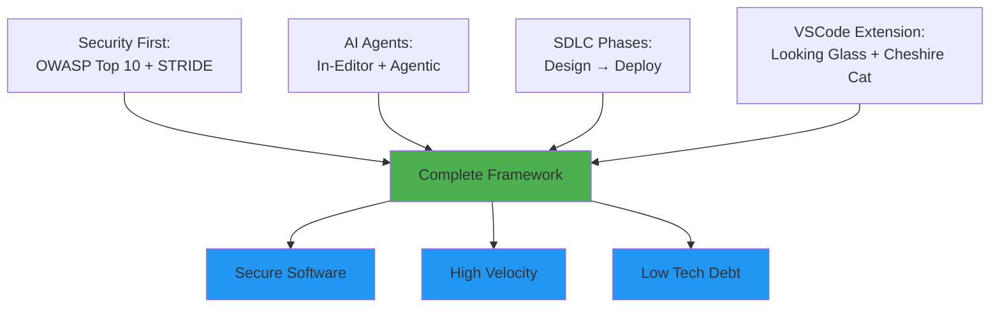
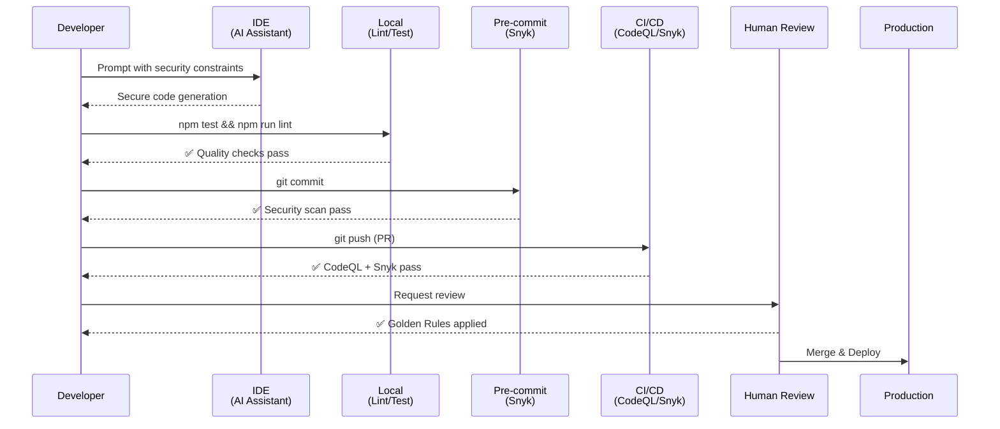

# MaintainabilityAI: Complete Integration Framework

> **The comprehensive security-first AI-assisted development framework that integrates OWASP Top 10, Evolutionary Architecture, Multi-Agent Orchestration, and the complete SDLC.**

---

## Framework Overview

MaintainabilityAI provides an end-to-end methodology for building secure, maintainable software with AI assistance:


```mermaid
flowchart TD
    A[Security First:<br/>OWASP Top 10 + STRIDE] --> E[Complete Framework]
    B[AI Agents:<br/>In-Editor + Agentic] --> E
    C[SDLC Phases:<br/>Design → Deploy] --> E
    D[VSCode Extension:<br/>Looking Glass + Cheshire Cat] --> E

    E --> F[Secure Software]
    E --> G[High Velocity]
    E --> H[Low Tech Debt]

    style E fill:#4CAF50
    style F fill:#2196F3
    style G fill:#2196F3
    style H fill:#2196F3
```

The framework follows a **continuous 6-phase lifecycle** integrating security, AI agents, and quality gates at every phase. A [VSCode extension](/docs/sdlc/#maintainabilityai--the-vscode-extension) brings it all into your editor, and the [SDLC Overview](/docs/sdlc/) provides the complete phase-by-phase guide.

---

## Framework Components

<!-- Supporting Framework Elements -->
<div style="display: grid; grid-template-columns: repeat(auto-fit, minmax(300px, 1fr)); gap: 24px; margin: 40px 0;">

<div style="background: linear-gradient(135deg, #1e293b 0%, #0f172a 100%); border-left: 4px solid #ef4444; border-radius: 12px; padding: 28px;">
  <div style="font-size: 22px; font-weight: 700; color: #f1f5f9; margin-bottom: 8px;">OWASP Top 10</div>
  <div style="color: #cbd5e1; font-size: 14px; line-height: 1.7; margin-bottom: 16px;">
    10 comprehensive prompt packs covering all OWASP categories. Each follows RCTRO format: Role → Context → Task → Requirements → Output.
  </div>
  <div style="color: #94a3b8; font-size: 12px; margin-bottom: 16px;">
    A01–A10 • Attack scenarios • Secure patterns • Validation checklists
  </div>
  <a href="/docs/prompts/owasp/" style="color: #fca5a5; font-size: 14px; text-decoration: none; font-weight: 600;">Browse OWASP Packs →</a>
</div>

<div style="background: linear-gradient(135deg, #1e293b 0%, #0f172a 100%); border-left: 4px solid #8b5cf6; border-radius: 12px; padding: 28px;">
  <div style="font-size: 22px; font-weight: 700; color: #f1f5f9; margin-bottom: 8px;">STRIDE Threat Modeling</div>
  <div style="color: #cbd5e1; font-size: 14px; line-height: 1.7; margin-bottom: 16px;">
    AI-powered security design with Microsoft's STRIDE methodology. Maps threats to OWASP vulnerabilities in minutes.
  </div>
  <div style="color: #94a3b8; font-size: 12px; margin-bottom: 16px;">
    Spoofing • Tampering • Repudiation • Info Disclosure • DoS • Elevation
  </div>
  <a href="/docs/sdlc/phase1-design" style="color: #c4b5fd; font-size: 14px; text-decoration: none; font-weight: 600;">Phase 1: Design →</a>
</div>

<div style="background: linear-gradient(135deg, #1e293b 0%, #0f172a 100%); border-left: 4px solid #10b981; border-radius: 12px; padding: 28px;">
  <div style="font-size: 22px; font-weight: 700; color: #f1f5f9; margin-bottom: 8px;">Fitness Functions</div>
  <div style="color: #cbd5e1; font-size: 14px; line-height: 1.7; margin-bottom: 16px;">
    Automated quality gates that prevent architectural erosion. Standards enforced in CI/CD, not just in reviewers' heads.
  </div>
  <div style="color: #94a3b8; font-size: 12px; margin-bottom: 16px;">
    Complexity ≤10 • Coverage ≥80% • Deps &lt;90 days • p95 &lt;200ms
  </div>
  <a href="/docs/maintainability/" style="color: #86efac; font-size: 14px; text-decoration: none; font-weight: 600;">Maintainability Docs →</a>
</div>

<div style="background: linear-gradient(135deg, #1e293b 0%, #0f172a 100%); border-left: 4px solid #6366f1; border-radius: 12px; padding: 28px;">
  <div style="font-size: 22px; font-weight: 700; color: #f1f5f9; margin-bottom: 8px;">AI Agent Orchestration</div>
  <div style="color: #cbd5e1; font-size: 14px; line-height: 1.7; margin-bottom: 16px;">
    Two modes: <strong style="color: #93c5fd;">In-Editor</strong> (Claude Code | Copilot) for human-guided implementation, and <strong style="color: #c4b5fd;">Agentic</strong> (Claude Code Action | Copilot Coding Agent) for autonomous, governance-enforced workflows.
  </div>
  <div style="color: #94a3b8; font-size: 12px; margin-bottom: 16px;">
    In-Editor • Agentic • Multi-agent review boards • RCTRO-formatted issues
  </div>
  <a href="/docs/agents/" style="color: #a5b4fc; font-size: 14px; text-decoration: none; font-weight: 600;">Agent Guides →</a>
</div>

</div>

---

## Security Pipeline: Defense in Depth

MaintainabilityAI implements a **6-layer security pipeline** that catches vulnerabilities at every stage of development:


```mermaid
sequenceDiagram
    participant Dev as Developer
    participant IDE as IDE<br/>(AI Assistant)
    participant Local as Local<br/>(Lint/Test)
    participant Git as Pre-commit<br/>(Snyk)
    participant CI as CI/CD<br/>(CodeQL/Snyk)
    participant Human as Human Review
    participant Prod as Production

    Dev->>IDE: Prompt with security constraints
    IDE-->>Dev: Secure code generation
    Dev->>Local: npm test && npm run lint
    Local-->>Dev: ✅ Quality checks pass
    Dev->>Git: git commit
    Git-->>Dev: ✅ Security scan pass
    Dev->>CI: git push (PR)
    CI-->>Dev: ✅ CodeQL + Snyk pass
    Dev->>Human: Request review
    Human-->>Dev: ✅ Golden Rules applied
    Human->>Prod: Merge & Deploy
```

### The Six Layers

**Example: Building a Document Sharing Feature** — *"Users should share documents with different permission levels"*

Click any layer to see how it applies to this real feature:

<div style="display: grid; gap: 16px; margin: 24px 0;">

<details style="background: linear-gradient(135deg, #1e293b 0%, #0f172a 100%); border-radius: 12px; padding: 20px; color: #f1f5f9; cursor: pointer; border-left: 4px solid #ef4444;">
  <summary style="font-size: 24px; font-weight: 700; margin-bottom: 8px; cursor: pointer; list-style: none;">Layer 1: IDE Security — Prevention at the Source</summary>
  <div style="color: #cbd5e1; font-size: 14px; margin: 16px 0 12px 0;">Use security-first prompts with OWASP categories. <strong>Prevents 60-70% of vulnerabilities</strong> before they're written.</div>

  <div style="background: rgba(239, 68, 68, 0.1); border-left: 3px solid #ef4444; border-radius: 8px; padding: 20px; margin: 16px 0;">
    <div style="color: #f1f5f9; font-size: 15px; font-weight: 600; margin-bottom: 16px;">RCTRO Prompt for Document Sharing:</div>

```
Role: Security engineer implementing secure document sharing.

Context:
- Node.js + TypeScript + PostgreSQL
- JWT authentication, permissions: read, write, admin
- OWASP categories: A01, A03, A09

Task:
Generate createShare() with full security controls, tests with
attack scenarios, and security event logging.

Requirements:
1. **Parameterized Queries**
   - Use pg $1 placeholders, never string concatenation
   - Validation: All queries use parameterized placeholders

2. **Input Validation**
   - Zod schemas with email format, permission enum
   - Validation: All user input validated before processing

3. **Authorization Controls**
   - Verify userId owns documentId before sharing
   - Validation: Non-owners receive 403 with generic message

4. **Audit Logging**
   - Log share created, auth failures, validation errors
   - Validation: Every mutation has audit trail

Output:
Complete TypeScript implementation with Jest test suite
including attack vector tests (SQL injection, IDOR).
```

  </div>

  <div style="font-size: 14px; line-height: 1.7; color: #cbd5e1;">
    <strong style="color: #f1f5f9;">What AI generates:</strong> Code with authorization checks, parameterized queries, input validation, and audit logs built in from the start.
  </div>
</details>

<details style="background: linear-gradient(135deg, #1e293b 0%, #0f172a 100%); border-radius: 12px; padding: 20px; color: #f1f5f9; cursor: pointer; border-left: 4px solid #f97316;">
  <summary style="font-size: 24px; font-weight: 700; margin-bottom: 8px; cursor: pointer; list-style: none;">Layer 2: Local Checks — Fast Feedback Loop</summary>
  <div style="color: #cbd5e1; font-size: 14px; margin: 16px 0 12px 0;">ESLint catches dangerous patterns. Jest validates security controls with attack payloads.</div>

  <div style="background: rgba(255, 255, 255, 0.1); border-radius: 8px; padding: 16px; margin: 16px 0;">
    <pre style="background: rgba(0,0,0,0.4); padding: 12px; border-radius: 6px; font-size: 13px; line-height: 1.6; color: #f1f5f9;">npm run lint
✅ No eval() usage, no type-unsafe operations
✅ Complexity: Max 8 (threshold: 10)

npm test
✅ SQL injection blocked: "'; DROP TABLE--"
✅ IDOR attack blocked: Different user's doc
✅ Permission escalation blocked
✅ Coverage: 95% (threshold: 80%)</pre>
  </div>
</details>

<details style="background: linear-gradient(135deg, #1e293b 0%, #0f172a 100%); border-radius: 12px; padding: 20px; color: #f1f5f9; cursor: pointer; border-left: 4px solid #eab308;">
  <summary style="font-size: 24px; font-weight: 700; margin-bottom: 8px; cursor: pointer; list-style: none;">Layer 3: Pre-commit Hooks — Last Defense Before Repo</summary>
  <div style="color: #cbd5e1; font-size: 14px; margin: 16px 0 12px 0;">Snyk scans for hardcoded secrets and vulnerable patterns. Blocks commits that introduce risks.</div>

  <div style="background: rgba(255, 255, 255, 0.1); border-radius: 8px; padding: 16px; margin: 16px 0;">
    <pre style="background: rgba(0,0,0,0.4); padding: 12px; border-radius: 6px; font-size: 13px; line-height: 1.6; color: #f1f5f9;">git commit -m "feat: add document sharing"

Running pre-commit hooks...
✅ No hardcoded secrets detected
✅ No vulnerable patterns found
✅ All dependencies clean

[main abc123] feat: add document sharing</pre>
  </div>
</details>

<details style="background: linear-gradient(135deg, #1e293b 0%, #0f172a 100%); border-radius: 12px; padding: 20px; color: #f1f5f9; cursor: pointer; border-left: 4px solid #22c55e;">
  <summary style="font-size: 24px; font-weight: 700; margin-bottom: 8px; cursor: pointer; list-style: none;">Layer 4: CI/CD Gates — Automated Deep Analysis</summary>
  <div style="color: #cbd5e1; font-size: 14px; margin: 16px 0 12px 0;">CodeQL deep analysis, Snyk CVE scanning, fitness function validation.</div>

  <div style="background: rgba(255, 255, 255, 0.1); border-radius: 8px; padding: 16px; margin: 16px 0;">
    <pre style="background: rgba(0,0,0,0.4); padding: 12px; border-radius: 6px; font-size: 13px; line-height: 1.6; color: #f1f5f9;"><strong>CodeQL Security Analysis:</strong>
✅ SQL injection: None detected
✅ Access control: All checks present
✅ Hardcoded secrets: None

<strong>Snyk Dependency Scan:</strong>
✅ 0 high/critical CVEs
✅ All packages &lt;2 months old

<strong>Fitness Functions:</strong>
✅ Complexity ≤10: Pass
✅ Coverage ≥80%: Pass (95%)
✅ Performance p95 &lt;200ms: Pass (145ms)</pre>
  </div>
</details>

<details style="background: linear-gradient(135deg, #1e293b 0%, #0f172a 100%); border-radius: 12px; padding: 20px; color: #f1f5f9; cursor: pointer; border-left: 4px solid #06b6d4;">
  <summary style="font-size: 24px; font-weight: 700; margin-bottom: 8px; cursor: pointer; list-style: none;">Layer 5: Human Review — Critical Thinking</summary>
  <div style="color: #cbd5e1; font-size: 14px; margin: 16px 0 12px 0;">Apply Golden Rules: trust but verify, understand every line, validate business logic.</div>

  <div style="background: rgba(255, 255, 255, 0.1); border-radius: 8px; padding: 16px; margin: 16px 0;">
    <div style="font-size: 13px; line-height: 1.8; color: #cbd5e1;">
      ✅ <strong style="color: #f1f5f9;">Understand every line:</strong> Can explain code to teammate<br/>
      ✅ <strong style="color: #f1f5f9;">Verify security controls:</strong> Authorization, validation, error handling present<br/>
      ✅ <strong style="color: #f1f5f9;">Check edge cases:</strong> What if email invalid? User deleted? Doc already shared?<br/>
      ✅ <strong style="color: #f1f5f9;">AI disclosure:</strong> Commit labeled AI-assisted with tool and prompt pack<br/>
      ✅ <strong style="color: #f1f5f9;">Business logic:</strong> Does this actually solve the user's problem securely?
    </div>
  </div>
</details>

<details style="background: linear-gradient(135deg, #1e293b 0%, #0f172a 100%); border-radius: 12px; padding: 20px; color: #f1f5f9; cursor: pointer; border-left: 4px solid #8b5cf6;">
  <summary style="font-size: 24px; font-weight: 700; margin-bottom: 8px; cursor: pointer; list-style: none;">Layer 6: Production Monitoring — Runtime Protection</summary>
  <div style="color: #cbd5e1; font-size: 14px; margin: 16px 0 12px 0;">Monitor security events, alert on anomalies, feed learnings back into prompts.</div>

  <div style="background: rgba(255, 255, 255, 0.1); border-radius: 8px; padding: 16px; margin: 16px 0;">
    <pre style="background: rgba(0,0,0,0.4); padding: 12px; border-radius: 6px; font-size: 13px; line-height: 1.6; color: #f1f5f9;"><strong>Week 1 Production Metrics:</strong>
🎉 1,200+ documents shared/day
⚡ p95 latency: 145ms (threshold: 200ms)

<strong>Security Events:</strong>
🛡️ 23 IDOR attempts/day → All blocked
🛡️ 5 SQL injection attempts/day → All blocked
🛡️ 0 unauthorized data access

<strong>Action Items:</strong>
→ Update A01 prompt with real attack patterns
→ Add alert for IDOR attempts &gt;50/day</pre>
  </div>
</details>

</div>

**Key Principle**: Each layer provides overlapping protection. If one layer misses a vulnerability, subsequent layers catch it. This defense-in-depth approach is essential when using AI code generation.

---

## The VSCode Extension — Framework in Your Editor

Everything above lives in documentation until you bring it into the developer workflow. The **MaintainabilityAI VSCode extension** does exactly that — two panels that operationalize the entire framework.

<div style="display: grid; grid-template-columns: repeat(auto-fit, minmax(300px, 1fr)); gap: 20px; margin: 24px 0;">

<div style="background: linear-gradient(135deg, #1e293b 0%, #0f172a 100%); border-left: 4px solid #3b82f6; border-radius: 12px; padding: 24px;">
  <div style="font-size: 18px; font-weight: 700; color: #93c5fd; margin-bottom: 8px;">The Looking Glass — Governance & Architecture</div>
  <div style="color: #cbd5e1; font-size: 14px; line-height: 1.7; margin-bottom: 12px;">
    Portfolio → Platform → BAR hierarchy with live governance scoring across four pillars. Interactive CALM architecture diagrams with ELK.js auto-layout. Absolem AI assistant for drift analysis, gap detection, and architecture questions.
  </div>
  <a href="/docs/sdlc/#looking-glass" style="color: #93c5fd; font-size: 14px; text-decoration: none; font-weight: 600;">Looking Glass details →</a>
</div>

<div style="background: linear-gradient(135deg, #1e293b 0%, #0f172a 100%); border-left: 4px solid #a78bfa; border-radius: 12px; padding: 24px;">
  <div style="font-size: 18px; font-weight: 700; color: #c4b5fd; margin-bottom: 8px;">The Cheshire Cat — Code & Security</div>
  <div style="color: #cbd5e1; font-size: 14px; line-height: 1.7; margin-bottom: 12px;">
    One-command SDLC scaffolding with CLAUDE.md, CodeQL workflows, and OWASP prompt packs. RCTRO-formatted issue generation with embedded prompt pack guidance. Six-metric security scorecard with one-click remediation.
  </div>
  <a href="/docs/sdlc/#cheshire-cat" style="color: #c4b5fd; font-size: 14px; text-decoration: none; font-weight: 600;">Cheshire Cat details →</a>
</div>

</div>

<div style="margin-top: 20px; background: linear-gradient(135deg, rgba(239, 68, 68, 0.08) 0%, rgba(168, 85, 247, 0.08) 100%); border: 1px solid rgba(239, 68, 68, 0.25); border-radius: 12px; padding: 20px 24px; display: flex; align-items: center; gap: 20px; flex-wrap: wrap;">
  
  <div style="flex: 1; min-width: 240px;">
    <div style="font-size: 15px; font-weight: 700; color: #fca5a5; margin-bottom: 6px;">Coming Next: The Red Queen</div>
    <p style="color: #cbd5e1; font-size: 13px; line-height: 1.6; margin: 0 0 12px 0;">
      Prompts are advisory. Agents can ignore them. The Red Queen adds <strong style="color: #f87171;">deterministic governance enforcement</strong> — an MCP server for architecture awareness, NeMo Guardrails for constraint enforcement, and a policy engine that ties agent autonomy to governance scores.
    </p>
    <a href="/docs/impossible-things#whats-coming-the-red-queen---governance-enforced-agent-intelligence" style="color: #f87171; font-size: 13px; font-weight: 600; text-decoration: none;">Read the Red Queen roadmap →</a>
  </div>
</div>

---

## Framework Resources

<div style="display: grid; grid-template-columns: repeat(auto-fit, minmax(250px, 1fr)); gap: 16px; margin: 24px 0;">

<div style="background: linear-gradient(135deg, #1e293b 0%, #334155 100%); border-radius: 12px; padding: 20px; border: 1px solid rgba(100, 116, 139, 0.3);">
  <div style="font-size: 15px; font-weight: 700; color: #f1f5f9; margin-bottom: 8px;">Core Documentation</div>
  <div style="color: #cbd5e1; font-size: 13px; line-height: 1.8;">
    <a href="/docs/sdlc/" style="color: #93c5fd; text-decoration: none;">SDLC Overview</a> — 6-phase lifecycle<br/>
    <a href="/docs/maintainability/" style="color: #93c5fd; text-decoration: none;">Maintainability</a> — Fitness functions<br/>
    <a href="/docs/prompts/owasp/" style="color: #93c5fd; text-decoration: none;">OWASP Packs</a> — Security prompts<br/>
    <a href="/docs/governance/vibe-golden-rules" style="color: #93c5fd; text-decoration: none;">Golden Rules</a> — AI governance
  </div>
</div>

<div style="background: linear-gradient(135deg, #1e293b 0%, #334155 100%); border-radius: 12px; padding: 20px; border: 1px solid rgba(100, 116, 139, 0.3);">
  <div style="font-size: 15px; font-weight: 700; color: #f1f5f9; margin-bottom: 8px;">Learning Resources</div>
  <div style="color: #cbd5e1; font-size: 13px; line-height: 1.8;">
    <a href="/docs/workshop/" style="color: #93c5fd; text-decoration: none;">Workshop</a> — 8-part training<br/>
    <a href="/docs/agents/" style="color: #93c5fd; text-decoration: none;">AI Agents</a> — In-Editor & Agentic guides<br/>
    <a href="/docs/prompts/maintainability/" style="color: #93c5fd; text-decoration: none;">Maintainability Packs</a> — Architecture prompts
  </div>
</div>

<div style="background: linear-gradient(135deg, #1e293b 0%, #334155 100%); border-radius: 12px; padding: 20px; border: 1px solid rgba(100, 116, 139, 0.3);">
  <div style="font-size: 15px; font-weight: 700; color: #f1f5f9; margin-bottom: 8px;">Extension & Vision</div>
  <div style="color: #cbd5e1; font-size: 13px; line-height: 1.8;">
    <a href="/docs/sdlc/#maintainabilityai--the-vscode-extension" style="color: #93c5fd; text-decoration: none;">VSCode Extension</a> — Looking Glass + Cheshire Cat<br/>
    <a href="/docs/impossible-things" style="color: #93c5fd; text-decoration: none;">Impossible Things</a> — Art of the Possible<br/>
    <a href="/docs/agents/alice" style="color: #93c5fd; text-decoration: none;">Alice</a> — Agentic AI proof of concept
  </div>
</div>

</div>

---

**Ready to build secure, maintainable software with AI? Start with [Phase 1: Design →](/docs/sdlc/phase1-design)**
