# MaintainabilityAI: Complete Integration Framework

> **The comprehensive security-first AI-assisted development framework that integrates OWASP Top 10, Evolutionary Architecture, Multi-Agent Orchestration, and the complete SDLC.**

---

## Framework Overview

MaintainabilityAI provides an end-to-end methodology for building secure, maintainable software with AI assistance:

```mermaid
flowchart TD
    A[Security First:<br/>OWASP Top 10] --> E[Complete Framework]
    B[AI Agents:<br/>Claude, Copilot, ChatGPT] --> E
    C[SDLC Phases:<br/>Design → Deploy] --> E
    D[Maintainability:<br/>Fitness Functions] --> E

    E --> F[Secure Software]
    E --> G[High Velocity]
    E --> H[Low Tech Debt]

    style E fill:#4CAF50
    style F fill:#2196F3
    style G fill:#2196F3
    style H fill:#2196F3
```



---

## Three Integration Layers

### Layer 1: Security Foundation (OWASP)

**OWASP Top 10 (2021)** provides the security framework:

| Category | Prompt Pack | Integration Point | Fitness Function |
|----------|-------------|-------------------|------------------|
| **A01** | [Broken Access Control](/prompts/owasp/A01_broken_access_control.md) | Phase 2: Implementation | Authorization checks enforced |
| **A02** | [Cryptographic Failures](/prompts/owasp/A02_crypto_failures.md) | Phase 2: Implementation | No hardcoded secrets |
| **A03** | [Injection](/prompts/owasp/A03_injection.md) | Phase 2: Implementation | Parameterized queries only |
| **A04** | [Insecure Design](/prompts/owasp/A04_insecure_design.md) | Phase 1: Design | Threat model complete |
| **A05** | [Security Misconfiguration](/prompts/owasp/A05_security_misconfig.md) | Phase 5: Deployment | Secure headers enforced |
| **A06** | [Vulnerable Components](/prompts/owasp/A06_vuln_outdated.md) | Phase 6: Evolution | Dependencies <3mo old |
| **A07** | [Authentication Failures](/prompts/owasp/A07_authn_failures.md) | Phase 2: Implementation | MFA enforced |
| **A08** | [Integrity Failures](/prompts/owasp/A08_integrity_failures.md) | Phase 5: Deployment | Signed artifacts |
| **A09** | [Logging/Monitoring](/prompts/owasp/A09_logging_monitoring.md) | Phase 3: Verification | Security events logged |
| **A10** | [SSRF](/prompts/owasp/A10_ssrf.md) | Phase 2: Implementation | URL allowlist enforced |

---

### Layer 2: AI Agent Orchestration

**Use the AI agents available to you** — this framework works with Claude Code, GitHub Copilot, ChatGPT, or any LLM assistant.

**Simple recommendation**: Use whatever AI tool you have access to. All major AI assistants can:
- Generate secure code from OWASP prompt packs
- Create tests from specifications
- Refactor complex code
- Perform STRIDE threat analysis

**If you have multiple tools**, here's when each excels:

| Your Task | Best Tool | Why |
|-----------|-----------|-----|
| **Threat modeling** (design phase) | ChatGPT or Claude | Structured analysis and documentation |
| **Real-time coding** (inside IDE) | GitHub Copilot | Autocomplete as you type |
| **Large refactoring** or test generation | Claude Code | Handles large codebases and complex edits |
| **Code review** and checklists | ChatGPT or Claude | Structured validation against requirements |

**Key principle**: AI tool choice matters far less than using **security-first prompts**. A generic "write login code" prompt produces insecure code in any AI tool. An OWASP A07 prompt pack produces secure code in any AI tool.

See [SDLC Phases](/docs/sdlc/) for detailed agent usage in each phase.

---

### Layer 3: Maintainability & Evolution

**Evolutionary Architecture** with **Fitness Functions** ensures long-term health:

```mermaid
flowchart TD
    A[Code Change] --> B{Fitness Functions}

    B --> C[Complexity ≤10]
    B --> D[Coverage ≥80%]
    B --> E[Dependencies <3mo]
    B --> F[Security Clean]

    C -->|Pass| G[Merge]
    D -->|Pass| G
    E -->|Pass| G
    F -->|Pass| G

    C -->|Fail| H[Refactor]
    D -->|Fail| I[Add Tests]
    E -->|Fail| J[Upgrade Deps]
    F -->|Fail| K[Fix Vuln]

    H --> A
    I --> A
    J --> A
    K --> A

    G --> L[Monitor]
    L --> M{Degradation?}
    M -->|Yes| N[Tech Debt Backlog]
    M -->|No| L

    N --> A
```



See [Maintainability Framework](maintainability/) for details.

---

## STRIDE Threat Modeling with LLMs

**STRIDE** is Microsoft's threat modeling methodology that systematically identifies security threats across six categories. When combined with Large Language Models (LLMs), threat modeling becomes accessible to all developers — not just security specialists.

### What is STRIDE?

STRIDE is an acronym for six threat categories:

| Threat | Description | Example | OWASP Mapping |
|--------|-------------|---------|---------------|
| **S**poofing | Pretending to be someone/something else | Fake login page, session hijacking | A07 (Authentication) |
| **T**ampering | Modifying data or code | SQL injection, man-in-the-middle | A03 (Injection), A08 (Integrity) |
| **R**epudiation | Denying actions without proof | User denies making transaction, no logs | A09 (Logging) |
| **I**nformation Disclosure | Exposing sensitive information | SQL errors leaking schema, directory listing | A01 (Access Control), A02 (Crypto) |
| **D**enial of Service | Making system unavailable | Resource exhaustion, algorithmic complexity attacks | A04 (Insecure Design) |
| **E**levation of Privilege | Gaining unauthorized permissions | IDOR, broken access control, privilege escalation | A01 (Access Control) |

**Why STRIDE matters**: It provides a **checklist approach** to threat modeling — instead of asking "what could go wrong?" you systematically check each threat category against each system component.

---

### LLM-Powered STRIDE Analysis

**Traditional problem**: Threat modeling requires security expertise and is time-consuming (4-8 hours per system)

**LLM solution**: AI assistants can generate comprehensive STRIDE analyses in minutes, making threat modeling accessible during design phase

#### Example: STRIDE Analysis for Document Sharing System

**System Description**:
```
Web application where users can upload documents and share them with other users.
- Frontend: React SPA
- Backend: Node.js + Express
- Database: PostgreSQL
- Storage: AWS S3
- Auth: JWT tokens
```

**ChatGPT Prompt for STRIDE Analysis**:

````markdown
Role: You are a security architect performing STRIDE threat modeling.

Context:
- System: Document sharing web application
- Tech stack: React, Node.js/Express, PostgreSQL, AWS S3, JWT auth
- Users can: upload documents, share with other users, download shared documents

Task:
Perform a complete STRIDE analysis for this system. For each STRIDE category:
1. Identify 3-5 specific threats
2. Map to OWASP Top 10 category
3. Suggest concrete mitigation (not generic advice)
4. Prioritize as High/Medium/Low risk

Output format:
## Spoofing Threats
- **T1**: [Threat description]
  - OWASP: [Category]
  - Risk: [High/Medium/Low]
  - Mitigation: [Specific control]

[Repeat for T, R, I, D, E]
````

**ChatGPT Output Example**:

```markdown
## Spoofing Threats

### T1: JWT Token Forgery
- **Description**: Attacker forges JWT tokens to impersonate other users
- **OWASP**: A07 (Authentication Failures)
- **Risk**: High
- **Mitigation**:
  - Use strong secret (≥256 bits, store in env var, not code)
  - Set short expiration (15 minutes access token, refresh token for renewal)
  - Verify signature on every request with jwt.verify()
  - Use RS256 (asymmetric) instead of HS256 if tokens issued by multiple services

### T2: Session Hijacking via XSS
- **Description**: Attacker steals JWT from localStorage via XSS attack
- **OWASP**: A03 (Injection)
- **Risk**: High
- **Mitigation**:
  - Store JWT in HttpOnly cookie (not localStorage)
  - Set SameSite=Strict on cookie
  - Implement Content Security Policy (CSP)
  - Escape all user input in React (use {variable}, not dangerouslySetInnerHTML)

## Tampering Threats

### T3: SQL Injection in Search
- **Description**: Attacker modifies database queries via search input
- **OWASP**: A03 (Injection)
- **Risk**: High
- **Mitigation**:
  - Use parameterized queries: db.query('SELECT * FROM docs WHERE name ILIKE $1', [input])
  - Validate input with Zod schema (alphanumeric + space only)
  - Limit query length (≤100 chars)

### T4: File Upload Tampering
- **Description**: Attacker uploads malicious file (executable, XSS payload)
- **OWASP**: A03 (Injection), A04 (Insecure Design)
- **Risk**: High
- **Mitigation**:
  - Validate Content-Type header AND file magic bytes (not just extension)
  - Allowlist: image/*, application/pdf only
  - Store in S3 with restricted bucket policy (no public access)
  - Generate random filename (UUID), never use user-supplied name
  - Scan uploads with ClamAV or AWS Macie

## Repudiation Threats

### T5: No Audit Trail for Document Access
- **Description**: User denies accessing sensitive document
- **OWASP**: A09 (Logging Failures)
- **Risk**: Medium
- **Mitigation**:
  - Log every document access: {userId, documentId, action: 'view', timestamp, ip}
  - Store logs in append-only table or external system (DataDog, CloudWatch)
  - Retain logs for 90 days (compliance requirement)

## Information Disclosure Threats

### T6: SQL Error Leaks Schema
- **Description**: Database error messages expose table/column names
- **OWASP**: A05 (Security Misconfiguration)
- **Risk**: Medium
- **Mitigation**:
  - Catch all database errors
  - Return generic message to client: "Search failed"
  - Log full error server-side (not client)
  - Never use console.log in production

### T7: IDOR in Download Endpoint
- **Description**: Attacker accesses others' documents by changing documentId in URL
- **OWASP**: A01 (Broken Access Control)
- **Risk**: High
- **Mitigation**:
  - Verify ownership: SELECT * FROM docs WHERE id=$1 AND (ownerId=$2 OR $2 IN (SELECT userId FROM shares WHERE docId=$1))
  - Deny-by-default: no access unless explicitly shared
  - Test with automated access control tests

## Denial of Service Threats

### T8: Unbounded File Uploads
- **Description**: Attacker uploads 10GB file, exhausting storage/bandwidth
- **OWASP**: A04 (Insecure Design)
- **Risk**: Medium
- **Mitigation**:
  - Set max file size: 25MB (enforce in Express middleware)
  - Rate limit uploads: 10 uploads per hour per user
  - Use streaming uploads (multer-s3) to avoid buffering in memory

### T9: Algorithmic Complexity Attack
- **Description**: Attacker sends regex DoS payload in search
- **OWASP**: A04 (Insecure Design)
- **Risk**: Low
- **Mitigation**:
  - Use simple regex with no nested quantifiers
  - Set query timeout (e.g., 5 seconds)
  - Limit input length (≤100 chars)

## Elevation of Privilege Threats

### T10: Horizontal Privilege Escalation
- **Description**: User modifies another user's document by guessing documentId
- **OWASP**: A01 (Broken Access Control)
- **Risk**: High
- **Mitigation**: (Same as T7 IDOR mitigation)

### T11: Admin Role Escalation
- **Description**: User modifies their own role to 'admin' via tampered JWT or API
- **OWASP**: A01 (Broken Access Control)
- **Risk**: High
- **Mitigation**:
  - Store role in database, not JWT payload (JWT can be decoded by client)
  - Fetch role from DB on every request: SELECT role FROM users WHERE id=$1
  - Never trust client-supplied role
  - Admin role assignment requires 2FA + approval workflow
```

**Time saved**: Traditional threat model = 4 hours. LLM-assisted = 15 minutes + 30 minutes human review.

---

### Visualizing Threats with Mermaid Architecture Diagrams

Use Mermaid's architecture diagram syntax to visualize system components and data flows:


**Threat Flow Diagram**:


**Component-Threat Mapping**:


---

### Best Practices: LLM-Assisted Threat Modeling

#### 1. Start with Architecture Diagram
Before running STRIDE analysis, create a clear architecture diagram:

```mermaid
architecture-beta
    group client(cloud)[Client Tier]
    group app(cloud)[Application Tier]
    group data(database)[Data Tier]
    group external(internet)[External Services]

    service mobile(tablet)[Mobile App] in client
    service web(internet)[Web App] in client

    service lb(server)[Load Balancer] in app
    service api(server)[API Gateway] in app
    service worker(server)[Background Workers] in app

    service cache(disk)[Redis Cache] in data
    service db(database)[PostgreSQL] in data
    service queue(server)[Message Queue] in data

    service auth0(server)[Auth0] in external
    service stripe(server)[Stripe] in external
    service aws(cloud)[AWS S3] in external

    mobile:R --> L:lb
    web:R --> L:lb
    lb:R --> L:api
    api:T --> B:cache
    api:R --> L:db
    api:B --> T:worker
    worker:R --> L:queue
    api:R --> L:auth0
    api:R --> L:stripe
    api:R --> L:aws
```



**Why this matters**: Clear diagrams help LLMs understand your system topology, leading to more accurate threat identification.

#### 2. Iterate with Follow-Up Prompts

After initial STRIDE analysis, drill down on high-risk threats:

```markdown
"For threat T3 (SQL Injection), provide:
1. Complete secure code example in Node.js with pg library
2. Zod validation schema
3. Unit test covering the attack payload
4. Integration test for database layer"
```

#### 3. Map Threats to Implementation Tasks

Convert STRIDE output into actionable GitHub Issues:

```markdown
## Issue: [HIGH] T3 - SQL Injection in Search Endpoint

**Threat Category**: Tampering (STRIDE), A03 Injection (OWASP)

**Description**: Current search endpoint concatenates user input into SQL query, allowing injection attacks.

**Vulnerable Code**:
```typescript
const sql = `SELECT * FROM docs WHERE name LIKE '%${req.query.q}%'`;
```

**Mitigation Tasks**:
- [ ] Replace with parameterized query ($1 placeholder)
- [ ] Add Zod validation (alphanumeric + space only)
- [ ] Set max length 100 chars
- [ ] Add test with payload: "'; DROP TABLE--"
- [ ] Update prompt pack: /prompts/owasp/A03_injection.md

**Prompt Pack**: Use [A03_injection.md](/prompts/owasp/A03_injection.md)

**Assigned To**: @developer
**Priority**: P0 (block release)
**OWASP**: A03
**STRIDE**: Tampering
```

#### 4. Validate with Human Security Review

LLMs can miss threats or suggest imperfect mitigations. Always apply human review:

**Review Checklist**:
- [ ] Are all data flows identified in the diagram?
- [ ] Did LLM miss any obvious threats? (check each STRIDE category)
- [ ] Are mitigations **specific** (not "use encryption" but "AES-256-GCM with key rotation every 90 days")?
- [ ] Are mitigations **testable**? (can we write a unit test proving it works?)
- [ ] Are threats prioritized correctly? (High = exploitable + high impact)

---

### STRIDE + OWASP Integration

Map STRIDE threats back to OWASP prompt packs for implementation:

| STRIDE Category | Primary OWASP | Secondary OWASP | Prompt Pack |
|-----------------|---------------|-----------------|-------------|
| **Spoofing** | A07 (Authentication) | A02 (Crypto) | [A07_authn_failures.md](/prompts/owasp/A07_authn_failures.md) |
| **Tampering** | A03 (Injection) | A08 (Integrity) | [A03_injection.md](/prompts/owasp/A03_injection.md) |
| **Repudiation** | A09 (Logging) | - | [A09_logging_monitoring.md](/prompts/owasp/A09_logging_monitoring.md) |
| **Information Disclosure** | A01 (Access Control) | A02 (Crypto), A05 (Misconfig) | [A01_broken_access_control.md](/prompts/owasp/A01_broken_access_control.md) |
| **Denial of Service** | A04 (Insecure Design) | A05 (Misconfig) | [A04_insecure_design.md](/prompts/owasp/A04_insecure_design.md) |
| **Elevation of Privilege** | A01 (Access Control) | A07 (Authentication) | [A01_broken_access_control.md](/prompts/owasp/A01_broken_access_control.md) |

**Workflow**:
1. **Design Phase**: Run STRIDE analysis with ChatGPT → identify threats
2. **Implementation Phase**: Use OWASP prompt pack → implement mitigations
3. **Verification Phase**: Write tests for each threat → ensure mitigation works
4. **Governance Phase**: Review all HIGH threats addressed → approve release

---

### Tools & Resources

**LLM Tools for Threat Modeling**:
- **ChatGPT**: Best for structured STRIDE analysis and documentation
- **Claude**: Best for analyzing large architecture diagrams and complex systems
- **GitHub Copilot**: Best for generating mitigation code inline

**Threat Modeling Tools**:
- **Microsoft Threat Modeling Tool**: Desktop app with STRIDE templates
- **OWASP Threat Dragon**: Open-source, web-based threat modeling
- **IriusRisk**: Commercial tool with automated threat libraries

**Further Reading**:
- [Microsoft STRIDE Documentation](https://learn.microsoft.com/en-us/azure/security/develop/threat-modeling-tool-threats)
- [OWASP Threat Modeling Cheat Sheet](https://cheatsheetseries.owasp.org/cheatsheets/Threat_Modeling_Cheat_Sheet.html)
- [Pure Storage Blog: LLMs for STRIDE](https://blog.purestorage.com/purely-technical/leveraging-large-language-models-for-stride-threat-modeling/)

---

## Complete Workflow: Feature Development

### End-to-End Example: Secure Document Sharing

**Starting Point**: User story
**Ending Point**: Production deployment with monitoring

---

#### Phase 1: Design Intent (ChatGPT + Claude)

**Step 1: Requirements** (ChatGPT)
```markdown
Feature: Users can share documents with other users

Functional Requirements:
- FR1: Share document via email
- FR2: Permissions: read, write, admin
- FR3: Revoke share anytime

Security Requirements:
- OWASP A01: Verify ownership before share
- OWASP A03: Validate email input
- OWASP A09: Audit trail for compliance
```

**Step 2: Threat Model** (ChatGPT with STRIDE)
```markdown
Threats Identified:
- T1: JWT forgery (A07)
- T3: Permission escalation (A01)
- T4: SQL injection (A03)
- T5: No audit trail (A09)
- T6: IDOR attacks (A01)
- T7: Info disclosure (A01)
- T8: DoS via flooding (A04)
- T9: Re-sharing escalation (A01)

OWASP Categories: A01, A03, A07, A09
```

**Step 3: Architecture** (Claude)
```typescript
// Data model, API design, security controls
CREATE TABLE document_shares (
  id UUID PRIMARY KEY,  // Non-sequential (T6)
  document_id UUID,
  owner_id UUID,
  shared_with_email VARCHAR(255),  // Validated (T4)
  permission VARCHAR(10),  // Immutable (T3)
  created_at TIMESTAMP  // Audit (T5)
);
```

**Output**: Design document, threat model, OWASP mapping

**Duration**: 2 hours

---

#### Phase 2: Implementation (Copilot)

**Prompt** (using OWASP packs):
```markdown
#file:/prompts/owasp/A01_broken_access_control.md
#file:/prompts/owasp/A03_injection.md

Context: Document sharing feature, threats T1-T9 from threat model

Implement createShare() function:
1. Verify ownership (T3, T6, T9)
2. Validate email with Zod (T4)
3. Parameterized query (T4)
4. Audit log (T5)
5. Generic errors (T7)
```

**Generated Code**:
```typescript
export async function createShare(
  documentId: string,
  requesterId: string,
  data: ShareInput
) {
  // T3, T6, T9: Authorization
  await verifyOwnership(documentId, requesterId);

  // T4: Input validation
  const validated = shareSchema.parse(data);

  // T4: Parameterized query
  const share = await db.query(
    'INSERT INTO document_shares (document_id, owner_id, shared_with_email, permission) VALUES ($1, $2, $3, $4) RETURNING *',
    [documentId, requesterId, validated.email, validated.permission]
  );

  // T5: Audit logging
  await auditLog('share_created', { shareId: share.id, userId: requesterId });

  return share;
}
```

**Local Tests**:
```bash
npm run lint  # ESLint: Pass
npm test      # Jest: 42 tests pass, 95% coverage
```

**Output**: Implementation + tests

**Duration**: 3 hours

---

#### Phase 3: Verification (Claude + CodeQL + Snyk)

**Gate 1: ESLint & Jest** (local)
```bash
✅ Complexity: Max 8 (threshold 10)
✅ Coverage: 95% (threshold 80%)
```

**Gate 2: CodeQL** (CI)
```bash
✅ SQL injection: None detected
✅ Access control: All checks present
✅ Hardcoded secrets: None
```

**Gate 3: Snyk** (CI)
```bash
✅ Dependencies: 0 high/critical CVEs
✅ Freshness: All packages <2 months old
```

**Gate 4: Attack Vector Tests** (Claude generates)
```typescript
it('should block SQL injection (T4)', async () => {
  await expect(
    createShare('doc-123', 'owner-456', {
      email: "'; DROP TABLE users--",
      permission: 'read'
    })
  ).rejects.toThrow(ValidationError);
});

it('should prevent IDOR (T6)', async () => {
  await expect(
    createShare('doc-victim', 'attacker', { ... })
  ).rejects.toThrow(UnauthorizedError);
});
```

**Output**: Verification report (all gates passed)

**Duration**: 1 hour (automated)

---

#### Phase 4: Governance (Human + ChatGPT)

**PR Template**:
```markdown
## OWASP Categories: A01, A03, A09
## Threats Mitigated: T1, T3, T4, T5, T6, T7, T8, T9 ✅

## AI Disclosure
- Tool: GitHub Copilot
- Prompts: A01, A03, A09 prompt packs
- Human review: Complete

## Golden Rules
✅ Specific prompts used
✅ Code reviewed and understood
✅ AI treated as junior dev
✅ Commits labeled with 🤖
✅ Security rationale documented
✅ Prompts shared with team
```

**Human Review** (ChatGPT assists):
```markdown
ChatGPT validates OWASP checklists:
✅ A01: Authorization checks present
✅ A03: Parameterized queries only
✅ A09: Audit logging comprehensive

Human verifies:
✅ Manual testing passed
✅ All threats mitigated
✅ Code quality acceptable

APPROVED FOR MERGE
```

**Output**: Approved PR

**Duration**: 30 minutes

---

#### Phase 5: Deployment (GitHub Actions)

**CI/CD Pipeline**:
```yaml
1. Build ✅
2. Security re-scan (CodeQL, Snyk) ✅
3. Deploy to staging ✅
4. Smoke tests ✅
5. Deploy to production ✅
6. Monitor for errors ✅
```

**Health Check**:
```bash
curl https://app.example.com/health
> {"status": "healthy", "version": "1.2.3"}
```

**Output**: Production deployment

**Duration**: 15 minutes (automated)

---

#### Phase 6: Evolution (Ongoing)

**Metrics Collection**:
```markdown
Week 1:
- Share creation: 1,245/day
- Failed attempts (T6): 23/day (blocked)
- Performance (p95): 145ms

Analysis:
✅ All security controls working
✅ Performance within threshold (<200ms)
⚠️  High IDOR attempt rate → Investigate

Action:
- Add monitoring alert for IDOR attempts >50/day
- Update A01 prompt with real attack examples
```

**Prompt Refinement**:
```markdown
A01 Prompt Pack v4:

Added to checklist:
□ Non-sequential IDs (UUID) for IDOR prevention
□ Rate limiting on share operations
□ Monitoring alerts for authorization failures

Success rate: v3 (87%) → v4 (projected 95%)
```

**Dependency Upgrades**:
```bash
Monday: npm outdated
> express: 4.18.2 → 4.19.0 (2 months old)
> pg: 8.11.0 → 8.11.3 (1 month old)

Tuesday: Upgrade patches
> npm update
> npm test ✅
> git commit -m "chore: upgrade dependencies"
```

**Output**: Improved prompts, updated dependencies, reduced tech debt

**Duration**: Ongoing (weekly tasks)

---

## How Design → Security → Governance Flow Works


**Key Integration Points**:

1. **Design → OWASP**: Threat model identifies which OWASP categories apply
2. **OWASP → Implementation**: Prompt packs guide secure code generation
3. **Implementation → Verification**: Security scans validate OWASP compliance
4. **Verification → Governance**: Human review confirms requirements met
5. **Governance → Deployment**: Approved code ships to production
6. **Production → Evolution**: Metrics inform prompt improvements

---

## Where Each Agent Fits in the SDLC

### ChatGPT: Analysis & Validation


**When to Use ChatGPT**:
- Threat modeling with STRIDE
- OWASP checklist validation
- Documentation generation
- Metrics analysis and insights

**How to Use**: See [CHATGPT.md](/CHATGPT.md)

---

### Copilot: In-Editor Implementation


**When to Use Copilot**:
- Single-function implementation
- Following established patterns
- Boilerplate generation
- Quick fixes and refactoring

**How to Use**: See [COPILOT.md](/COPILOT.md)

---

### Claude: Complex Refactoring


**When to Use Claude**:
- Comprehensive test generation
- Multi-file refactoring
- Large-scale code analysis
- Technical debt reduction

**How to Use**: See [CLAUDE.md](/CLAUDE.md)

---

## How Prompts Guide Each Phase

### Phase-Prompt Mapping

| SDLC Phase | Prompt Type | Example | Output |
|------------|-------------|---------|--------|
| **Phase 1: Design** | Threat modeling template | "Perform STRIDE analysis on auth feature" | Threat model JSON |
| **Phase 2: Implementation** | OWASP prompt packs | Use `/prompts/owasp/A03_injection.md` | Secure implementation |
| **Phase 3: Verification** | Test generation prompt | "Generate attack vector tests for A03" | Jest test suite |
| **Phase 4: Governance** | Review checklist prompt | "Validate against OWASP A01 requirements" | Compliance report |
| **Phase 5: Deployment** | Monitoring prompt | "Create alerts for security events" | Alert configuration |
| **Phase 6: Evolution** | Refactoring prompt | "Refactor for complexity <10" | Improved code |

**Prompt Library**:
- `/prompts/owasp/` - OWASP Top 10 security prompts
- `/prompts/team/` - Team-specific patterns (build your own!)

---

## Framework Integration Flow

**High-Level View**: How all pieces connect


**What happens in each phase**:
- **Design**: Run STRIDE analysis with ChatGPT/Claude → identify threats → map to OWASP categories
- **Implementation**: Use OWASP prompt packs with your AI assistant → generate secure code
- **Verification**: Run fitness functions (complexity, coverage, performance) + automated scans (CodeQL, Snyk)
- **Review**: Human applies Golden Rules checklist → validates security assumptions
- **Deploy**: GitHub Actions builds and deploys → monitors security metrics
- **Monitor**: Fitness functions track degradation → alerts on threshold violations
- **Evolution**: Refactor violations → update baselines → cycle back to design for next feature

---

## Success Metrics

Track these metrics across the framework:

### Security Metrics
- **OWASP Coverage**: % of applicable categories addressed (target: 100%)
- **Vulnerability Remediation Time**: Discovery → fix (target: <7 days)
- **Security Scan Pass Rate**: First-try CodeQL/Snyk pass (target: >90%)

### Velocity Metrics
- **Time to Delivery**: Feature start → production (target: <5 days)
- **AI Acceptance Rate**: % AI suggestions merged (target: >85%)
- **Cycle Time**: Implementation → merge (target: <24 hours)

### Quality Metrics
- **Fitness Function Compliance**: % commits passing (target: >95%)
- **Test Coverage**: Overall coverage (target: >80%)
- **Defect Density**: Bugs per 1000 LOC (target: <5)

### Process Metrics
- **Prompt Reuse Rate**: % work using prompt library (target: >70%)
- **Review Time**: Human review duration (target: <30 min)
- **Tech Debt Reduction**: Debt items closed per sprint (target: >5)

---

## Getting Started with the Framework

### 1. Repository Setup

```bash
# Clone or initialize repository
git clone https://github.com/your-org/your-project

# Install dependencies
npm install

# Copy framework files
cp -r /prompts ./prompts
cp .eslintrc.cjs jest.config.ts tsconfig.json ./
```

### 2. Configure Tools

```yaml
# .github/workflows/ci.yml
name: Security CI

on: [push, pull_request]

jobs:
  security:
    runs-on: ubuntu-latest
    steps:
      - uses: github/codeql-action/analyze@v3
      - uses: snyk/actions/node@master
      - run: npm run fitness-check
```

### 3. Team Training

1. **Read**: [Golden Rules](governance/vibe-golden-rules.md)
2. **Practice**: [Workshop modules](workshop/)
3. **Try**: [OWASP examples](/examples/owasp/)
4. **Review**: Agent guides ([COPILOT.md](/COPILOT.md), [CHATGPT.md](/CHATGPT.md), [CLAUDE.md](/CLAUDE.md))

### 4. Start First Feature

1. **Phase 1**: Use ChatGPT for threat modeling
2. **Phase 2**: Use Copilot with OWASP prompts
3. **Phase 3**: Run fitness functions
4. **Phase 4**: Human review with Golden Rules
5. **Phase 5**: Deploy with monitoring
6. **Phase 6**: Collect metrics, refine prompts

### 5. Iterate and Improve

- Weekly: Upgrade dependencies
- Monthly: Review metrics, update prompts
- Quarterly: Evolutionary architecture review

---

## Key Takeaways

1. **Security First**: OWASP Top 10 guides every phase
2. **AI as Accelerator**: Agents handle 70%, humans harden the 30%
3. **Automated Quality Gates**: Fitness functions enforce standards
4. **Evolutionary Change**: Incremental improvements over rewrites
5. **Measurable Outcomes**: Track security, velocity, and quality metrics
6. **Continuous Learning**: Refine prompts and processes based on data

---

## Framework Resources

### Core Documentation
- **[SDLC Overview](sdlc/)** - 6-phase development lifecycle
- **[Maintainability Framework](maintainability/)** - Fitness functions and evolutionary architecture
- **[OWASP Prompt Packs](/prompts/owasp/)** - Security-first prompts

### Agent Guides
- **[COPILOT.md](/COPILOT.md)** - GitHub Copilot integration
- **[CHATGPT.md](/CHATGPT.md)** - ChatGPT workflows
- **[CLAUDE.md](/CLAUDE.md)** - Claude Code usage
- **[AGENTS.md](/AGENTS.md)** - Multi-agent orchestration

### Governance
- **[Golden Rules](governance/vibe-golden-rules.md)** - Core principles
- **[Security Workflow](security-workflow.md)** - Defense-in-depth pipeline

### Learning
- **[Workshop](workshop/)** - 8-part training modules
- **[Examples](/examples/owasp/)** - Hands-on OWASP remediation

---

**Ready to build secure, maintainable software with AI? Start with [Phase 1: Design →](sdlc/phase1-design.md)**
