# MaintainabilityAI: Complete Integration Framework

> **The comprehensive security-first AI-assisted development framework that integrates OWASP Top 10, Evolutionary Architecture, Multi-Agent Orchestration, and the complete SDLC.**

---

## Framework Overview

MaintainabilityAI provides an end-to-end methodology for building secure, maintainable software with AI assistance:

```mermaid
flowchart TD
    A[Security First:<br/>OWASP Top 10] --> E[Complete Framework]
    B[AI Agents:<br/>Claude, Copilot, ChatGPT] --> E
    C[SDLC Phases:<br/>Design → Deploy] --> E
    D[Maintainability:<br/>Fitness Functions] --> E

    E --> F[Secure Software]
    E --> G[High Velocity]
    E --> H[Low Tech Debt]

    style E fill:#4CAF50
    style F fill:#2196F3
    style G fill:#2196F3
    style H fill:#2196F3
```



---

## Framework Components

The framework follows a **continuous lifecycle** that integrates security, AI agents, and quality gates at every phase:

<div style="background: linear-gradient(135deg, #1e293b 0%, #0f172a 100%); border-radius: 16px; padding: 40px; margin: 40px 0; border: 1px solid rgba(100, 116, 139, 0.3);">

<!-- SDLC Flow -->
<div style="text-align: center; margin-bottom: 32px;">
  <div style="font-size: 28px; font-weight: 700; color: #f1f5f9; margin-bottom: 16px;">🔄 The Complete SDLC</div>
  <div style="font-size: 15px; color: #cbd5e1; margin-bottom: 32px;">Six phases that work together in a continuous feedback loop</div>
</div>

<div style="display: grid; grid-template-columns: repeat(auto-fit, minmax(280px, 1fr)); gap: 20px; margin-bottom: 32px;">

<div style="background: rgba(79, 70, 229, 0.15); border-left: 4px solid #6366f1; border-radius: 8px; padding: 20px;">
  <div style="font-size: 40px; margin-bottom: 8px;">🎯</div>
  <div style="font-size: 18px; font-weight: 700; color: #f1f5f9; margin-bottom: 8px;">Design</div>
  <div style="font-size: 13px; color: #cbd5e1; line-height: 1.6;">STRIDE threat modeling, OWASP mapping, fitness function definitions</div>
  <a href="/docs/sdlc/phase1-design" style="color: #a5b4fc; font-size: 13px; text-decoration: none; margin-top: 8px; display: inline-block;">→ Phase 1 Details</a>
</div>

<div style="background: rgba(124, 58, 237, 0.15); border-left: 4px solid #8b5cf6; border-radius: 8px; padding: 20px;">
  <div style="font-size: 40px; margin-bottom: 8px;">💻</div>
  <div style="font-size: 18px; font-weight: 700; color: #f1f5f9; margin-bottom: 8px;">Implementation</div>
  <div style="font-size: 13px; color: #cbd5e1; line-height: 1.6;">Security-first prompts with AI agents, OWASP prompt packs, local testing</div>
  <a href="/docs/sdlc/phase2-implementation" style="color: #c4b5fd; font-size: 13px; text-decoration: none; margin-top: 8px; display: inline-block;">→ Phase 2 Details</a>
</div>

<div style="background: rgba(16, 185, 129, 0.15); border-left: 4px solid #10b981; border-radius: 8px; padding: 20px;">
  <div style="font-size: 40px; margin-bottom: 8px;">✅</div>
  <div style="font-size: 18px; font-weight: 700; color: #f1f5f9; margin-bottom: 8px;">Verification</div>
  <div style="font-size: 13px; color: #cbd5e1; line-height: 1.6;">CodeQL security scanning, Snyk CVE checks, fitness function validation</div>
  <a href="/docs/sdlc/phase3-verification" style="color: #86efac; font-size: 13px; text-decoration: none; margin-top: 8px; display: inline-block;">→ Phase 3 Details</a>
</div>

<div style="background: rgba(234, 88, 12, 0.15); border-left: 4px solid #f97316; border-radius: 8px; padding: 20px;">
  <div style="font-size: 40px; margin-bottom: 8px;">👥</div>
  <div style="font-size: 18px; font-weight: 700; color: #f1f5f9; margin-bottom: 8px;">Governance</div>
  <div style="font-size: 13px; color: #cbd5e1; line-height: 1.6;">PR review with Golden Rules, OWASP compliance, human-in-the-loop checks</div>
  <a href="/docs/sdlc/phase4-governance" style="color: #fdba74; font-size: 13px; text-decoration: none; margin-top: 8px; display: inline-block;">→ Phase 4 Details</a>
</div>

<div style="background: rgba(14, 165, 233, 0.15); border-left: 4px solid #06b6d4; border-radius: 8px; padding: 20px;">
  <div style="font-size: 40px; margin-bottom: 8px;">🚀</div>
  <div style="font-size: 18px; font-weight: 700; color: #f1f5f9; margin-bottom: 8px;">Deployment</div>
  <div style="font-size: 13px; color: #cbd5e1; line-height: 1.6;">CI/CD security gates, smoke tests, monitoring and alerting setup</div>
  <a href="/docs/sdlc/phase5-deployment" style="color: #67e8f9; font-size: 13px; text-decoration: none; margin-top: 8px; display: inline-block;">→ Phase 5 Details</a>
</div>

<div style="background: rgba(234, 179, 8, 0.15); border-left: 4px solid #eab308; border-radius: 8px; padding: 20px;">
  <div style="font-size: 40px; margin-bottom: 8px;">📈</div>
  <div style="font-size: 18px; font-weight: 700; color: #f1f5f9; margin-bottom: 8px;">Evolution</div>
  <div style="font-size: 13px; color: #cbd5e1; line-height: 1.6;">Metrics analysis, dependency updates, tech debt paydown, prompt iteration</div>
  <a href="/docs/sdlc/phase6-evolution" style="color: #fde047; font-size: 13px; text-decoration: none; margin-top: 8px; display: inline-block;">→ Phase 6 Details</a>
</div>

</div>

<div style="text-align: center; padding: 24px; background: rgba(99, 102, 241, 0.1); border-radius: 12px; border: 1px solid rgba(99, 102, 241, 0.3);">
  <div style="color: #cbd5e1; font-size: 14px; line-height: 1.7; margin-bottom: 16px;">
    <strong style="color: #f1f5f9;">Continuous Feedback Loop:</strong> Insights from production (Phase 6) feed back into design decisions (Phase 1), creating an evolving system that becomes more secure and efficient over time.
  </div>
  <a href="/docs/sdlc/" style="display: inline-block; background: rgba(99, 102, 241, 0.2); color: #a5b4fc; padding: 12px 24px; border-radius: 8px; font-weight: 600; text-decoration: none; font-size: 14px; border: 1px solid rgba(99, 102, 241, 0.4);">
    Explore Complete SDLC →
  </a>
</div>

</div>

<!-- Supporting Framework Elements -->
<div style="display: grid; grid-template-columns: repeat(auto-fit, minmax(300px, 1fr)); gap: 24px; margin: 40px 0;">

<div style="background: linear-gradient(135deg, #1e293b 0%, #0f172a 100%); border-left: 4px solid #ef4444; border-radius: 12px; padding: 28px;">
  <div style="font-size: 48px; margin-bottom: 12px;">🛡️</div>
  <div style="font-size: 22px; font-weight: 700; color: #f1f5f9; margin-bottom: 8px;">OWASP Top 10</div>
  <div style="color: #cbd5e1; font-size: 14px; line-height: 1.7; margin-bottom: 16px;">
    10 comprehensive prompt packs covering all OWASP categories. Each includes attack scenarios, secure patterns, and validation checklists.
  </div>
  <div style="color: #94a3b8; font-size: 12px; margin-bottom: 16px;">
    A01–A10 • Role → Context → Task → Checklist
  </div>
  <a href="/docs/prompts/owasp/" style="color: #fca5a5; font-size: 14px; text-decoration: none; font-weight: 600;">Browse OWASP Packs →</a>
</div>

<div style="background: linear-gradient(135deg, #1e293b 0%, #0f172a 100%); border-left: 4px solid #8b5cf6; border-radius: 12px; padding: 28px;">
  <div style="font-size: 48px; margin-bottom: 12px;">🎯</div>
  <div style="font-size: 22px; font-weight: 700; color: #f1f5f9; margin-bottom: 8px;">STRIDE Threat Modeling</div>
  <div style="color: #cbd5e1; font-size: 14px; line-height: 1.7; margin-bottom: 16px;">
    AI-powered security design with Microsoft's STRIDE methodology. Maps threats to OWASP vulnerabilities in minutes.
  </div>
  <div style="color: #94a3b8; font-size: 12px; margin-bottom: 16px;">
    Spoofing • Tampering • Repudiation • Info Disclosure • DoS • Elevation
  </div>
  <a href="/docs/prompts/threat-modeling/" style="color: #c4b5fd; font-size: 14px; text-decoration: none; font-weight: 600;">Browse STRIDE Packs →</a>
</div>

<div style="background: linear-gradient(135deg, #1e293b 0%, #0f172a 100%); border-left: 4px solid #10b981; border-radius: 12px; padding: 28px;">
  <div style="font-size: 48px; margin-bottom: 12px;">📊</div>
  <div style="font-size: 22px; font-weight: 700; color: #f1f5f9; margin-bottom: 8px;">Fitness Functions</div>
  <div style="color: #cbd5e1; font-size: 14px; line-height: 1.7; margin-bottom: 16px;">
    Automated quality gates that prevent architectural erosion. Standards enforced in CI/CD, not just in reviewers' heads.
  </div>
  <div style="color: #94a3b8; font-size: 12px; margin-bottom: 16px;">
    Complexity ≤10 • Coverage ≥80% • Deps &lt;90 days • p95 &lt;200ms
  </div>
  <a href="/docs/prompts/maintainability/" style="color: #86efac; font-size: 14px; text-decoration: none; font-weight: 600;">Browse Maintainability Packs →</a>
</div>

<div style="background: linear-gradient(135deg, #1e293b 0%, #0f172a 100%); border-left: 4px solid #6366f1; border-radius: 12px; padding: 28px;">
  <div style="font-size: 48px; margin-bottom: 12px;">💬</div>
  <div style="font-size: 22px; font-weight: 700; color: #f1f5f9; margin-bottom: 8px;">ChatGPT</div>
  <div style="color: #cbd5e1; font-size: 14px; line-height: 1.7; margin-bottom: 16px;">
    Conversational AI for threat modeling, OWASP validation, and metrics analysis. Excels at strategic thinking and architectural decisions.
  </div>
  <div style="color: #94a3b8; font-size: 12px; margin-bottom: 16px;">
    Threat Modeling • Security Analysis • Metrics Review
  </div>
  <a href="/docs/agents/chatgpt" style="color: #a5b4fc; font-size: 14px; text-decoration: none; font-weight: 600;">ChatGPT Agent Guide →</a>
</div>

<div style="background: linear-gradient(135deg, #1e293b 0%, #0f172a 100%); border-left: 4px solid #8b5cf6; border-radius: 12px; padding: 28px;">
  <div style="font-size: 48px; margin-bottom: 12px;">🧑‍💻</div>
  <div style="font-size: 22px; font-weight: 700; color: #f1f5f9; margin-bottom: 8px;">GitHub Copilot</div>
  <div style="color: #cbd5e1; font-size: 14px; line-height: 1.7; margin-bottom: 16px;">
    In-editor AI assistant for implementation, pattern following, and boilerplate generation. Real-time suggestions as you code.
  </div>
  <div style="color: #94a3b8; font-size: 12px; margin-bottom: 16px;">
    Code Completion • Pattern Following • Quick Fixes
  </div>
  <a href="/docs/agents/copilot" style="color: #c4b5fd; font-size: 14px; text-decoration: none; font-weight: 600;">Copilot Agent Guide →</a>
</div>

<div style="background: linear-gradient(135deg, #1e293b 0%, #0f172a 100%); border-left: 4px solid #06b6d4; border-radius: 12px; padding: 28px;">
  <div style="font-size: 48px; margin-bottom: 12px;">🤖</div>
  <div style="font-size: 22px; font-weight: 700; color: #f1f5f9; margin-bottom: 8px;">Claude Code</div>
  <div style="color: #cbd5e1; font-size: 14px; line-height: 1.7; margin-bottom: 16px;">
    Agentic AI for complex refactoring, comprehensive test generation, and multi-file changes. Deep understanding of codebases.
  </div>
  <div style="color: #94a3b8; font-size: 12px; margin-bottom: 16px;">
    Refactoring • Test Generation • Multi-File Edits
  </div>
  <a href="/docs/agents/claude" style="color: #67e8f9; font-size: 14px; text-decoration: none; font-weight: 600;">Claude Agent Guide →</a>
</div>

</div>

---

## Security Pipeline: Defense in Depth

MaintainabilityAI implements a **6-layer security pipeline** that catches vulnerabilities at every stage of development:


### The Six Layers

**Example: Building a Document Sharing Feature** — *"Users should share documents with different permission levels"*

Click any layer to see how it applies to this real feature:

<div style="display: grid; gap: 16px; margin: 24px 0;">

<details style="background: linear-gradient(135deg, #1e293b 0%, #0f172a 100%); border-radius: 12px; padding: 20px; color: #f1f5f9; cursor: pointer; border-left: 4px solid #ef4444;">
  <summary style="font-size: 24px; font-weight: 700; margin-bottom: 8px; cursor: pointer; list-style: none;">▶ Layer 1: IDE Security — Prevention at the Source</summary>
  <div style="color: #cbd5e1; font-size: 14px; margin: 16px 0 12px 0;">Use security-first prompts with OWASP categories. <strong>Prevents 60-70% of vulnerabilities</strong> before they're written.</div>

  <div style="background: rgba(255, 255, 255, 0.1); border-radius: 8px; padding: 16px; margin: 16px 0; font-size: 14px; line-height: 1.7;">
    <strong style="display: block; margin-bottom: 8px;">📋 User Story: Document Sharing</strong>
    <strong>Requirement:</strong> Users can share documents via email with read/write/admin permissions<br/>
    <strong>Threats Identified:</strong> IDOR attacks, SQL injection, permission escalation, no audit trail
  </div>

  <div style="background: rgba(239, 68, 68, 0.1); border-left: 3px solid #ef4444; border-radius: 8px; padding: 20px; margin: 16px 0;">
    <div style="color: #f1f5f9; font-size: 15px; font-weight: 600; margin-bottom: 16px;">📋 Copy this prompt and paste it into your AI coding assistant:</div>

```
Role: Security engineer implementing secure document sharing

Context:
- Node.js + TypeScript + PostgreSQL
- User authentication via JWT (user ID available)
- Document permissions: read, write, admin
- OWASP categories: A01 (Access Control), A03 (Injection), A09 (Logging)

Functional Requirements:
1. Implement createShare(documentId, recipientEmail, permission, userId)
2. Verify userId owns documentId before sharing (prevent IDOR)
3. Validate recipientEmail exists in users table
4. Insert share record with permission level
5. Return share ID on success

Non-Functional Requirements (Security & Quality):
- Use parameterized queries ($1, $2 placeholders) to prevent SQL injection
- Validate all inputs with Zod (email format, permission enum)
- Verify resource ownership before any operation (horizontal access control)
- Log security events: share created, authorization failures, validation errors
- Return generic error messages to client, detailed logs server-side only
- Cyclomatic complexity ≤10 per function
- Test coverage ≥80% including attack payloads (SQL injection, IDOR, invalid inputs)

Fitness Functions to Satisfy:
- Dependency freshness: All packages <90 days old
- No eval() or type-unsafe operations
- All async operations have try-catch error handling
- No secrets hardcoded (use environment variables)

Task:
Generate createShare() function with full security controls, comprehensive tests with attack scenarios, and security event logging.
```

<div style="margin-top: 12px; font-size: 13px; color: #cbd5e1;">
      <strong style="color: #fca5a5;">Related Prompt Packs:</strong>
      <a href="/docs/prompts/owasp/A01_broken_access_control" style="color: #fca5a5; text-decoration: underline; margin-left: 8px;">A01</a> •
      <a href="/docs/prompts/owasp/A03_injection" style="color: #fca5a5; text-decoration: underline; margin-left: 4px;">A03</a> •
      <a href="/docs/prompts/owasp/A09_logging_monitoring" style="color: #fca5a5; text-decoration: underline; margin-left: 4px;">A09</a> •
      <a href="/docs/prompts/maintainability/dependency-hygiene" style="color: #86efac; text-decoration: underline; margin-left: 4px;">Dependency Hygiene</a>
    </div>
  </div>

  <div style="font-size: 14px; line-height: 1.7; color: #cbd5e1;">
    <strong style="color: #f1f5f9;">What AI generates:</strong> Code with authorization checks, parameterized queries, input validation, and audit logs built in from the start — without requiring security knowledge on every PR.
  </div>
</details>

<details style="background: linear-gradient(135deg, #1e293b 0%, #0f172a 100%); border-radius: 12px; padding: 20px; color: #f1f5f9; cursor: pointer; border-left: 4px solid #f97316;">
  <summary style="font-size: 24px; font-weight: 700; margin-bottom: 8px; cursor: pointer; list-style: none;">▶ Layer 2: Local Checks — Fast Feedback Loop</summary>
  <div style="color: #cbd5e1; font-size: 14px; margin: 16px 0 12px 0;">ESLint catches dangerous patterns. Jest validates security controls with attack payloads.</div>

  <div style="background: rgba(255, 255, 255, 0.1); border-radius: 8px; padding: 16px; margin: 16px 0;">
    <strong style="display: block; margin-bottom: 12px; font-size: 16px;">✅ Running Local Tests:</strong>
    <pre style="background: rgba(0,0,0,0.4); padding: 12px; border-radius: 6px; font-size: 13px; line-height: 1.6; color: #f1f5f9;">npm run lint
✅ No eval() usage
✅ No type-unsafe operations
✅ Complexity: Max 8 (threshold: 10)

npm test
✅ SQL injection blocked: "'; DROP TABLE--"
✅ IDOR attack blocked: Different user's doc
✅ Permission escalation blocked
✅ Coverage: 95% (threshold: 80%)</pre>
  </div>

  <div style="font-size: 14px; line-height: 1.7; color: #cbd5e1;">
    <strong style="color: #f1f5f9;">Outcome:</strong> Immediate feedback — if security controls aren't working, you know before committing.
  </div>
</details>

<details style="background: linear-gradient(135deg, #1e293b 0%, #0f172a 100%); border-radius: 12px; padding: 20px; color: #f1f5f9; cursor: pointer; border-left: 4px solid #eab308;">
  <summary style="font-size: 24px; font-weight: 700; margin-bottom: 8px; cursor: pointer; list-style: none;">▶ Layer 3: Pre-commit Hooks — Last Defense Before Repo</summary>
  <div style="color: #cbd5e1; font-size: 14px; margin: 16px 0 12px 0;">Snyk scans for hardcoded secrets and vulnerable patterns. Blocks commits that introduce risks.</div>

  <div style="background: rgba(255, 255, 255, 0.1); border-radius: 8px; padding: 16px; margin: 16px 0;">
    <strong style="display: block; margin-bottom: 12px; font-size: 16px;">🔍 Pre-commit Scan:</strong>
    <pre style="background: rgba(0,0,0,0.4); padding: 12px; border-radius: 6px; font-size: 13px; line-height: 1.6; color: #f1f5f9;">git commit -m "feat: add document sharing"

Running pre-commit hooks...
✅ No hardcoded secrets detected
✅ No vulnerable patterns found
✅ All dependencies clean

[main abc123] feat: add document sharing</pre>
  </div>

  <div style="font-size: 14px; line-height: 1.7; color: #cbd5e1;">
    <strong style="color: #f1f5f9;">Outcome:</strong> Can't accidentally commit API keys, passwords, or known vulnerable code.
  </div>
</details>

<details style="background: linear-gradient(135deg, #1e293b 0%, #0f172a 100%); border-radius: 12px; padding: 20px; color: #f1f5f9; cursor: pointer; border-left: 4px solid #22c55e;">
  <summary style="font-size: 24px; font-weight: 700; margin-bottom: 8px; cursor: pointer; list-style: none;">▶ Layer 4: CI/CD Gates — Automated Deep Analysis</summary>
  <div style="color: #cbd5e1; font-size: 14px; margin: 16px 0 12px 0;">CodeQL deep analysis, Snyk CVE scanning, fitness function validation.</div>

  <div style="background: rgba(255, 255, 255, 0.1); border-radius: 8px; padding: 16px; margin: 16px 0;">
    <strong style="display: block; margin-bottom: 12px; font-size: 16px;">🤖 CI Pipeline (GitHub Actions):</strong>
    <pre style="background: rgba(0,0,0,0.4); padding: 12px; border-radius: 6px; font-size: 13px; line-height: 1.6; color: #f1f5f9;"><strong>CodeQL Security Analysis:</strong>
✅ SQL injection: None detected
✅ Access control: All checks present
✅ Hardcoded secrets: None

<strong>Snyk Dependency Scan:</strong>
✅ 0 high/critical CVEs
✅ All packages &lt;2 months old

<strong>Fitness Functions:</strong>
✅ Complexity ≤10: Pass
✅ Coverage ≥80%: Pass (95%)
✅ Performance p95 &lt;200ms: Pass (145ms)</pre>
  </div>

  <div style="font-size: 14px; line-height: 1.7; color: #cbd5e1;">
    <strong style="color: #f1f5f9;">Outcome:</strong> Deep semantic analysis finds issues local tools miss. Code quality enforced automatically.
  </div>
</details>

<details style="background: linear-gradient(135deg, #1e293b 0%, #0f172a 100%); border-radius: 12px; padding: 20px; color: #f1f5f9; cursor: pointer; border-left: 4px solid #06b6d4;">
  <summary style="font-size: 24px; font-weight: 700; margin-bottom: 8px; cursor: pointer; list-style: none;">▶ Layer 5: Human Review — Critical Thinking</summary>
  <div style="color: #cbd5e1; font-size: 14px; margin: 16px 0 12px 0;">Apply Golden Rules: trust but verify, understand every line, validate business logic.</div>

  <div style="background: rgba(255, 255, 255, 0.1); border-radius: 8px; padding: 16px; margin: 16px 0;">
    <strong style="display: block; margin-bottom: 12px; font-size: 16px;">👤 Reviewer Checklist:</strong>
    <div style="font-size: 13px; line-height: 1.8; color: #cbd5e1;">
      ✅ <strong style="color: #f1f5f9;">Understand every line:</strong> Can explain code to teammate<br/>
      ✅ <strong style="color: #f1f5f9;">Verify security controls:</strong> Authorization, validation, error handling present<br/>
      ✅ <strong style="color: #f1f5f9;">Check edge cases:</strong> What if email invalid? User deleted? Doc already shared?<br/>
      ✅ <strong style="color: #f1f5f9;">AI disclosure:</strong> Commit labeled 🤖 AI-assisted with Copilot using A01, A03<br/>
      ✅ <strong style="color: #f1f5f9;">Business logic:</strong> Does this actually solve the user's problem securely?
    </div>
  </div>

  <div style="font-size: 14px; line-height: 1.7; color: #cbd5e1;">
    <strong style="color: #f1f5f9;">Outcome:</strong> AI validates technical controls. Human validates if it's the right solution.
  </div>
</details>

<details style="background: linear-gradient(135deg, #1e293b 0%, #0f172a 100%); border-radius: 12px; padding: 20px; color: #f1f5f9; cursor: pointer; border-left: 4px solid #8b5cf6;">
  <summary style="font-size: 24px; font-weight: 700; margin-bottom: 8px; cursor: pointer; list-style: none;">▶ Layer 6: Production Monitoring — Runtime Protection</summary>
  <div style="color: #cbd5e1; font-size: 14px; margin: 16px 0 12px 0;">Monitor security events, alert on anomalies, log for forensics and compliance.</div>

  <div style="background: rgba(255, 255, 255, 0.1); border-radius: 8px; padding: 16px; margin: 16px 0;">
    <strong style="display: block; margin-bottom: 12px; font-size: 16px;">📊 Week 1 Production Metrics:</strong>
    <pre style="background: rgba(0,0,0,0.4); padding: 12px; border-radius: 6px; font-size: 13px; line-height: 1.6; color: #f1f5f9;"><strong>Feature Performance:</strong>
🎉 1,200+ documents shared/day
⚡ p95 latency: 145ms (threshold: 200ms)

<strong>Security Events:</strong>
🛡️ 23 IDOR attempts/day → <strong>All blocked</strong>
🛡️ 5 SQL injection attempts/day → <strong>All blocked</strong>
🛡️ 0 unauthorized data access

<strong>Action Items:</strong>
→ Update A01 prompt with real attack patterns
→ Add alert for IDOR attempts &gt;50/day</pre>
  </div>

  <div style="font-size: 14px; line-height: 1.7; color: #cbd5e1;">
    <strong style="color: #f1f5f9;">Outcome:</strong> Real attacks improve your prompts. Team gets better at security over time.
  </div>
</details>

</div>

### PR Security Review Checklist

When reviewing AI-assisted code, apply these checks to ensure security requirements are met:

<div style="background: linear-gradient(135deg, #1e293b 0%, #0f172a 100%); border-radius: 16px; padding: 32px; margin: 24px 0; border: 1px solid rgba(100, 116, 139, 0.3);">

<div style="display: grid; grid-template-columns: repeat(auto-fit, minmax(280px, 1fr)); gap: 20px;">

<div>
  <div style="font-size: 18px; font-weight: 700; color: #ef4444; margin-bottom: 12px;">🔒 Security Controls</div>
  <div style="color: #cbd5e1; font-size: 14px; line-height: 1.8;">
    <strong style="color: #f1f5f9;">Input Validation:</strong> Allowlist validation, length limits, type checking<br/>
    <strong style="color: #f1f5f9;">Output Encoding:</strong> Context-appropriate encoding (HTML, SQL, JSON)<br/>
    <strong style="color: #f1f5f9;">Auth/Authz:</strong> Horizontal & vertical access control verified<br/>
    <strong style="color: #f1f5f9;">Error Handling:</strong> Generic messages, detailed server-side logs
  </div>
</div>

<div>
  <div style="font-size: 18px; font-weight: 700; color: #f97316; margin-bottom: 12px;">🧪 Testing</div>
  <div style="color: #cbd5e1; font-size: 14px; line-height: 1.8;">
    <strong style="color: #f1f5f9;">Attack Scenarios:</strong> SQL injection, XSS, IDOR payloads tested<br/>
    <strong style="color: #f1f5f9;">Edge Cases:</strong> Empty input, null/undefined, service failures<br/>
    <strong style="color: #f1f5f9;">Coverage:</strong> Critical paths ≥80%, positive + negative cases
  </div>
</div>

<div>
  <div style="font-size: 18px; font-weight: 700; color: #eab308; margin-bottom: 12px;">🤖 AI Disclosure</div>
  <div style="color: #cbd5e1; font-size: 14px; line-height: 1.8;">
    <strong style="color: #f1f5f9;">Commit Label:</strong> 🤖 AI-assisted with [tool] using [pack]<br/>
    <strong style="color: #f1f5f9;">Prompt Quality:</strong> OWASP categories referenced, constraints specified<br/>
    <strong style="color: #f1f5f9;">Understanding:</strong> Can you explain every line to a teammate?
  </div>
</div>

<div>
  <div style="font-size: 18px; font-weight: 700; color: #22c55e; margin-bottom: 12px;">✅ Approval Criteria</div>
  <div style="color: #cbd5e1; font-size: 14px; line-height: 1.8;">
    <strong style="color: #10b981;">Approve:</strong> All controls present, tests comprehensive, code understandable<br/>
    <strong style="color: #ef4444;">Block:</strong> Vulnerabilities found, missing security tests, CI failing<br/>
    <strong style="color: #94a3b8;">Comment:</strong> Minor improvements, edge case suggestions
  </div>
</div>

</div>

</div>

**Key Principle**: Each layer provides overlapping protection. If one layer misses a vulnerability, subsequent layers catch it. This defense-in-depth approach is essential when using AI code generation.

---

## Success Metrics Dashboard

Monitor framework health with these key metrics across security, quality, velocity, and AI effectiveness:

<div style="background: linear-gradient(135deg, #1e293b 0%, #0f172a 100%); border-radius: 16px; padding: 40px; margin: 40px 0; border: 1px solid rgba(100, 116, 139, 0.3);">

<!-- Dashboard Header -->
<div style="text-align: center; margin-bottom: 32px;">
  <div style="font-size: 28px; font-weight: 700; color: #f1f5f9; margin-bottom: 8px;">📊 Framework Health Metrics</div>
  <div style="font-size: 14px; color: #94a3b8;">Track these indicators to measure security posture, code quality, and team velocity</div>
</div>

<!-- Metrics Grid -->
<div style="display: grid; grid-template-columns: repeat(auto-fit, minmax(240px, 1fr)); gap: 20px; margin-bottom: 32px;">

<!-- Security -->
<div style="background: rgba(239, 68, 68, 0.1); border-left: 3px solid #ef4444; border-radius: 8px; padding: 20px;">
  <div style="font-size: 32px; margin-bottom: 8px;">🛡️</div>
  <div style="font-size: 16px; font-weight: 700; color: #fca5a5; margin-bottom: 12px;">Security</div>
  <div style="font-size: 13px; color: #cbd5e1; line-height: 1.8;">
    <strong style="color: #f1f5f9;">OWASP Coverage:</strong> 100%<br/>
    <strong style="color: #f1f5f9;">Vuln Remediation:</strong> &lt;7 days<br/>
    <strong style="color: #f1f5f9;">Scan Pass Rate:</strong> &gt;90%<br/>
    <strong style="color: #f1f5f9;">Pre-Code Detection:</strong> 93%
  </div>
</div>

<!-- Quality -->
<div style="background: rgba(99, 102, 241, 0.1); border-left: 3px solid #6366f1; border-radius: 8px; padding: 20px;">
  <div style="font-size: 32px; margin-bottom: 8px;">🏗️</div>
  <div style="font-size: 16px; font-weight: 700; color: #a5b4fc; margin-bottom: 12px;">Quality</div>
  <div style="font-size: 13px; color: #cbd5e1; line-height: 1.8;">
    <strong style="color: #f1f5f9;">Complexity:</strong> ≤10 per function<br/>
    <strong style="color: #f1f5f9;">Test Coverage:</strong> ≥80%<br/>
    <strong style="color: #f1f5f9;">Performance:</strong> p95 &lt;200ms<br/>
    <strong style="color: #f1f5f9;">Dependencies:</strong> &lt;90 days old
  </div>
</div>

<!-- Velocity -->
<div style="background: rgba(16, 185, 129, 0.1); border-left: 3px solid #10b981; border-radius: 8px; padding: 20px;">
  <div style="font-size: 32px; margin-bottom: 8px;">⚡</div>
  <div style="font-size: 16px; font-weight: 700; color: #86efac; margin-bottom: 12px;">Velocity</div>
  <div style="font-size: 13px; color: #cbd5e1; line-height: 1.8;">
    <strong style="color: #f1f5f9;">Time to Delivery:</strong> &lt;5 days<br/>
    <strong style="color: #f1f5f9;">Cycle Time:</strong> &lt;24 hours<br/>
    <strong style="color: #f1f5f9;">PR Review Time:</strong> &lt;2 hours<br/>
    <strong style="color: #f1f5f9;">Build Success:</strong> &gt;95%
  </div>
</div>

<!-- AI Effectiveness -->
<div style="background: rgba(139, 92, 246, 0.1); border-left: 3px solid #8b5cf6; border-radius: 8px; padding: 20px;">
  <div style="font-size: 32px; margin-bottom: 8px;">🤖</div>
  <div style="font-size: 16px; font-weight: 700; color: #c4b5fd; margin-bottom: 12px;">AI Effectiveness</div>
  <div style="font-size: 13px; color: #cbd5e1; line-height: 1.8;">
    <strong style="color: #f1f5f9;">Acceptance Rate:</strong> &gt;85%<br/>
    <strong style="color: #f1f5f9;">Prompt Reuse:</strong> &gt;70%<br/>
    <strong style="color: #f1f5f9;">Time Saved/Feature:</strong> 4hrs<br/>
    <strong style="color: #f1f5f9;">STRIDE Coverage:</strong> 6/6
  </div>
</div>

<!-- Governance -->
<div style="background: rgba(234, 88, 12, 0.1); border-left: 3px solid #f97316; border-radius: 8px; padding: 20px;">
  <div style="font-size: 32px; margin-bottom: 8px;">✅</div>
  <div style="font-size: 16px; font-weight: 700; color: #fdba74; margin-bottom: 12px;">Governance</div>
  <div style="font-size: 13px; color: #cbd5e1; line-height: 1.8;">
    <strong style="color: #f1f5f9;">Golden Rules Applied:</strong> 100%<br/>
    <strong style="color: #f1f5f9;">AI Disclosure Rate:</strong> 100%<br/>
    <strong style="color: #f1f5f9;">Human Review:</strong> All PRs<br/>
    <strong style="color: #f1f5f9;">Rollback Rate:</strong> &lt;2%
  </div>
</div>

<!-- Pipeline Health -->
<div style="background: rgba(6, 182, 212, 0.1); border-left: 3px solid #06b6d4; border-radius: 8px; padding: 20px;">
  <div style="font-size: 32px; margin-bottom: 8px;">🔄</div>
  <div style="font-size: 16px; font-weight: 700; color: #67e8f9; margin-bottom: 12px;">Pipeline Health</div>
  <div style="font-size: 13px; color: #cbd5e1; line-height: 1.8;">
    <strong style="color: #f1f5f9;">CodeQL Pass Rate:</strong> &gt;95%<br/>
    <strong style="color: #f1f5f9;">Snyk Clean:</strong> 0 high/crit<br/>
    <strong style="color: #f1f5f9;">Fitness Functions:</strong> All pass<br/>
    <strong style="color: #f1f5f9;">Deploy Frequency:</strong> Daily
  </div>
</div>

</div>

<!-- Key Insights -->
<div style="background: rgba(99, 102, 241, 0.1); border-radius: 12px; padding: 24px; border: 1px solid rgba(99, 102, 241, 0.3);">
  <div style="font-size: 18px; font-weight: 700; color: #f1f5f9; margin-bottom: 12px;">💡 Key Insights</div>
  <div style="color: #cbd5e1; font-size: 14px; line-height: 1.8;">
    <strong style="color: #a5b4fc;">Security + Velocity are NOT in conflict:</strong> When AI generates secure code from the start using OWASP prompts, you save time on remediation and ship faster. Teams typically see 4 hours saved per feature and 93% of threats identified before code is written.<br/><br/>
    <strong style="color: #a5b4fc;">Track in your CI/CD:</strong> Integrate these metrics into your existing dashboards (GitHub Actions, Jenkins, GitLab CI) to monitor framework adoption and effectiveness over time.
  </div>
</div>

</div>

---

## Quick Start: First Feature in 1 Hour

Apply this framework to your next feature using this practical workflow:

<div style="background: linear-gradient(135deg, #1e293b 0%, #334155 100%); border-radius: 16px; padding: 32px; margin: 32px 0; border: 1px solid rgba(100, 116, 139, 0.3);">

<div style="display: grid; gap: 24px;">

<div style="background: rgba(99, 102, 241, 0.1); border-left: 4px solid #6366f1; padding: 20px; border-radius: 8px;">
  <div style="font-size: 18px; font-weight: 700; color: #f1f5f9; margin-bottom: 12px;">⏱️ 5 min — Threat Model</div>
  <div style="color: #cbd5e1; font-size: 14px; line-height: 1.7; margin-bottom: 12px;">
    Ask ChatGPT: <em>"Run STRIDE analysis on [your feature]. Map threats to OWASP categories."</em>
  </div>
  <div style="background: rgba(255, 255, 255, 0.05); padding: 12px; border-radius: 6px; font-size: 13px; color: #94a3b8;">
    <strong style="color: #f1f5f9;">You get:</strong> List of threats + which OWASP prompt packs to use
  </div>
</div>

<div style="background: rgba(124, 58, 237, 0.1); border-left: 4px solid #7c3aed; padding: 20px; border-radius: 8px;">
  <div style="font-size: 18px; font-weight: 700; color: #f1f5f9; margin-bottom: 12px;">⏱️ 30 min — Implement Securely</div>
  <div style="color: #cbd5e1; font-size: 14px; line-height: 1.7; margin-bottom: 12px;">
    Open <a href="/docs/prompts/owasp" style="color: #a78bfa;">OWASP prompt pack</a> (e.g., A01, A03). Copy prompt into Copilot/Claude with your requirements.
  </div>
  <div style="background: rgba(255, 255, 255, 0.05); padding: 12px; border-radius: 6px; font-size: 13px; color: #94a3b8;">
    <strong style="color: #f1f5f9;">You get:</strong> Code with security controls built in from the start
  </div>
</div>

<div style="background: rgba(14, 165, 233, 0.1); border-left: 4px solid #0ea5e9; padding: 20px; border-radius: 8px;">
  <div style="font-size: 18px; font-weight: 700; color: #f1f5f9; margin-bottom: 12px;">⏱️ 10 min — Validate Locally</div>
  <div style="color: #cbd5e1; font-size: 14px; line-height: 1.7; margin-bottom: 12px;">
    Run <code style="background: rgba(0,0,0,0.3); padding: 2px 6px; border-radius: 4px;">npm run lint && npm test</code>. Tests should include attack payloads.
  </div>
  <div style="background: rgba(255, 255, 255, 0.05); padding: 12px; border-radius: 6px; font-size: 13px; color: #94a3b8;">
    <strong style="color: #f1f5f9;">You get:</strong> Immediate feedback if security controls fail
  </div>
</div>

<div style="background: rgba(16, 185, 129, 0.1); border-left: 4px solid #10b981; padding: 20px; border-radius: 8px;">
  <div style="font-size: 18px; font-weight: 700; color: #f1f5f9; margin-bottom: 12px;">⏱️ 15 min — Human Review</div>
  <div style="color: #cbd5e1; font-size: 14px; line-height: 1.7; margin-bottom: 12px;">
    Review your own code using <a href="/docs/governance/vibe-golden-rules" style="color: #5eead4;">Golden Rules checklist</a>. Can you explain every line?
  </div>
  <div style="background: rgba(255, 255, 255, 0.05); padding: 12px; border-radius: 6px; font-size: 13px; color: #94a3b8;">
    <strong style="color: #f1f5f9;">You get:</strong> Confidence that AI didn't introduce hidden issues
  </div>
</div>

</div>

<div style="text-align: center; margin-top: 32px; padding-top: 24px; border-top: 1px solid rgba(100, 116, 139, 0.3);">
  <div style="color: #22c55e; font-size: 24px; font-weight: 700; margin-bottom: 8px;">✅ Ship to Production</div>
  <div style="color: #94a3b8; font-size: 14px;">CI/CD re-validates everything. Security monitoring tracks real attacks. You're done.</div>
</div>

</div>

**What You Just Learned**:
1. Threat modeling takes minutes with AI (not hours)
2. OWASP prompts prevent vulnerabilities before they're written
3. Automated + human checks catch what each other misses
4. The whole process is faster than traditional "write then fix" workflows

---

## Framework Resources

### Core Documentation
- **[SDLC Overview](/docs/sdlc/)** - 6-phase development lifecycle
- **[Maintainability Framework](/docs/maintainability/)** - Fitness functions and evolutionary architecture
- **[OWASP Prompt Packs](/docs/prompts/owasp/)** - Security-first prompts
- **[Maintainability Prompt Packs](/docs/prompts/maintainability/)** - Evolutionary architecture patterns

### Governance & Best Practices
- **[Golden Rules](/docs/governance/vibe-golden-rules)** - Core principles and AI governance
- **[Security Workflow](/docs/security-workflow)** - 6-layer defense-in-depth pipeline

### Learning Resources
- **[Workshop](/docs/workshop/)** - 8-part training modules
- **[AI Agents Guide](/docs/agents/)** - Multi-agent orchestration strategies

---

**Ready to build secure, maintainable software with AI? Start with [Phase 1: Design →](/docs/sdlc/phase1-design)**
