# MaintainabilityAI: Complete Integration Framework

> **The comprehensive security-first AI-assisted development framework that integrates OWASP Top 10, Evolutionary Architecture, Multi-Agent Orchestration, and the complete SDLC.**

---

## Framework Overview

MaintainabilityAI provides an end-to-end methodology for building secure, maintainable software with AI assistance:

```mermaid
flowchart TD
    A[Security First:<br/>OWASP Top 10] --> E[Complete Framework]
    B[AI Agents:<br/>Claude, Copilot, ChatGPT] --> E
    C[SDLC Phases:<br/>Design → Deploy] --> E
    D[Maintainability:<br/>Fitness Functions] --> E

    E --> F[Secure Software]
    E --> G[High Velocity]
    E --> H[Low Tech Debt]

    style E fill:#4CAF50
    style F fill:#2196F3
    style G fill:#2196F3
    style H fill:#2196F3
```

---

## Framework Components

The framework integrates three core pillars that work together throughout the software development lifecycle:

<!-- SDLC Section -->

  

    
🔄

    

      
Software Development Lifecycle (SDLC)

      
6 phases from design to evolution

    

  

  

    
The Six Phases:

    

      
<strong>1. Design</strong> — Threat modeling with STRIDE, OWASP mapping

      
<strong>2. Implementation</strong> — Security-first prompts with AI agents

      
<strong>3. Verification</strong> — CodeQL, Snyk, fitness function validation

      
<strong>4. Governance</strong> — PR review with Golden Rules checklist

      
<strong>5. Deployment</strong> — CI/CD security gates, smoke tests

      
<strong>6. Evolution</strong> — Metrics, dependency updates, tech debt paydown

    

  

  

    Each phase integrates AI assistance, security controls, and automated validation. The lifecycle is continuous — insights from production monitoring (Phase 6) feed back into design decisions (Phase 1). This creates a feedback loop where your development process becomes more secure and efficient over time.
  

  <a href="/docs/sdlc/" style="display: inline-block; background: rgba(255, 255, 255, 0.2); color: #f1f5f9; padding: 14px 28px; border-radius: 8px; font-weight: 600; text-decoration: none; font-size: 15px; border: 1px solid rgba(255, 255, 255, 0.3); transition: background 0.2s;">
    Explore SDLC Phases →
  </a>

<!-- OWASP Section -->

  

    
🛡️

    

      
OWASP Top 10 Security

      
10 comprehensive prompt packs for secure AI development

    

  

  

    
Complete Coverage:

    

      
✓ A01 — Broken Access Control

      
✓ A02 — Cryptographic Failures

      
✓ A03 — Injection

      
✓ A04 — Insecure Design

      
✓ A05 — Security Misconfiguration

      
✓ A06 — Vulnerable Components

      
✓ A07 — Authentication Failures

      
✓ A08 — Integrity Failures

      
✓ A09 — Logging/Monitoring

      
✓ A10 — Server-Side Request Forgery

    

  

  

    Every prompt pack follows the proven 5-component pattern: Role → Context → Requirements → Task → Checklist. Use these with Claude Code, GitHub Copilot, or ChatGPT to generate secure code by default. Each pack includes attack scenarios, secure patterns, and validation checklists so AI generates code that's secure from the start.
  

  <a href="/docs/prompts/owasp/" style="display: inline-block; background: rgba(255, 255, 255, 0.2); color: #f1f5f9; padding: 14px 28px; border-radius: 8px; font-weight: 600; text-decoration: none; font-size: 15px; border: 1px solid rgba(255, 255, 255, 0.3); transition: background 0.2s;">
    Browse OWASP Prompt Packs →
  </a>

<!-- Maintainability Section -->

  

    
📊

    

      
Evolutionary Architecture & Maintainability

      
Automated fitness functions prevent architectural erosion

    

  

  

    
Automated Quality Gates:

    

      
<strong>Complexity ≤10</strong> — Cyclomatic complexity per function

      
<strong>Coverage ≥80%</strong> — Test coverage on critical paths

      
<strong>Deps &lt;90 days</strong> — No packages older than 3 months

      
<strong>p95 &lt;200ms</strong> — Performance regression detection

    

  

  

    Fitness functions are automated checks that protect your architecture from decay. Without them, quality standards exist only in reviewers' heads. With them, standards are enforced in CI/CD before merge. Includes prompt packs for implementing complexity analyzers, dependency freshness checks, the Strangler Fig migration pattern, and systematic technical debt management.
  

  <a href="/docs/prompts/maintainability/" style="display: inline-block; background: rgba(255, 255, 255, 0.2); color: #f1f5f9; padding: 14px 28px; border-radius: 8px; font-weight: 600; text-decoration: none; font-size: 15px; border: 1px solid rgba(255, 255, 255, 0.3); transition: background 0.2s;">
    Browse Maintainability Prompt Packs →
  </a>

<!-- Threat Modeling Section -->

  

    
🎯

    

      
STRIDE Threat Modeling

      
AI-powered security design with Microsoft's STRIDE methodology

    

  

  

    
Six Threat Categories:

    

      
<strong>S</strong>poofing — Identity impersonation

      
<strong>T</strong>ampering — Data manipulation

      
<strong>R</strong>epudiation — Denying actions

      
<strong>I</strong>nformation Disclosure — Data leaks

      
<strong>D</strong>enial of Service — Availability attacks

      
<strong>E</strong>levation of Privilege — Unauthorized access

    

  

  

    STRIDE helps you systematically identify security threats during design — before writing code. Use ChatGPT or Claude to analyze your architecture diagram and generate comprehensive threat models in minutes. Each STRIDE category maps to specific OWASP vulnerabilities, creating a clear path from threat identification to secure implementation.
  

  <a href="/docs/prompts/threat-modeling/" style="display: inline-block; background: rgba(255, 255, 255, 0.2); color: #f1f5f9; padding: 14px 28px; border-radius: 8px; font-weight: 600; text-decoration: none; font-size: 15px; border: 1px solid rgba(255, 255, 255, 0.3); transition: background 0.2s;">
    Browse STRIDE Prompt Packs →
  </a>

**How They Work Together**: Start with SDLC Phase 1 (Design) using STRIDE threat modeling. Apply OWASP prompt packs in Phase 2 (Implementation) to generate secure code. Validate with fitness functions in Phase 3 (Verification). This integrated approach ensures security and maintainability are built in from day one, not bolted on later.

---

## Security Pipeline: Defense in Depth

MaintainabilityAI implements a **6-layer security pipeline** that catches vulnerabilities at every stage of development:

### The Six Layers

**Example: Building a Document Sharing Feature** — *"Users should share documents with different permission levels"*

Click any layer to see how it applies to this real feature:

  
▶ Layer 1: IDE Security — Prevention at the Source

  
Use security-first prompts with OWASP categories. <strong>Prevents 60-70% of vulnerabilities</strong> before they're written.

  

    <strong style="display: block; margin-bottom: 8px;">📋 User Story: Document Sharing</strong>
    <strong>Requirement:</strong> Users can share documents via email with read/write/admin permissions 
    <strong>Threats Identified:</strong> IDOR attacks, SQL injection, permission escalation, no audit trail
  

  

    <strong style="display: block; margin-bottom: 12px; font-size: 16px;">💡 The Prompt:</strong>
    <pre style="background: rgba(0,0,0,0.3); padding: 12px; border-radius: 6px; overflow-x: auto; font-size: 13px; line-height: 1.6; color: #f1f5f9;">
<strong>Role:</strong> Security engineer implementing secure document sharing

<strong>Context:</strong>
- Node.js + TypeScript + PostgreSQL
- User authentication via JWT (user ID available)
- Document permissions: read, write, admin
- OWASP categories: A01 (Access Control), A03 (Injection), A09 (Logging)

<strong>Functional Requirements:</strong>
1. Implement createShare(documentId, recipientEmail, permission, userId)
2. Verify userId owns documentId before sharing (prevent IDOR)
3. Validate recipientEmail exists in users table
4. Insert share record with permission level
5. Return share ID on success

<strong>Non-Functional Requirements (Security & Quality):</strong>
- Use parameterized queries ($1, $2 placeholders) - <a href="/docs/prompts/owasp/A03_injection" style="color: #fca5a5;">OWASP A03</a>
- Validate all inputs with Zod (email format, permission enum)
- Verify resource ownership before any operation - <a href="/docs/prompts/owasp/A01_broken_access_control" style="color: #fca5a5;">OWASP A01</a>
- Log security events (share created, failures) - <a href="/docs/prompts/owasp/A09_logging_monitoring" style="color: #fca5a5;">OWASP A09</a>
- Generic error messages to client, detailed logs server-side
- Cyclomatic complexity ≤10 per function
- Test coverage ≥80% with attack payloads

<strong>Fitness Functions to Satisfy:</strong>
- Dependency freshness <90 days - <a href="/docs/prompts/maintainability/dependency-hygiene" style="color: #86efac;">See prompt pack</a>
- No eval() or type-unsafe operations
- All async operations have error handling

<strong>Task:</strong>
Generate createShare() function with full security controls and tests.</pre>
  

  

    <strong>What AI generates:</strong> Code with authorization checks, parameterized queries, input validation, and audit logs built in from the start.
  

  
▶ Layer 2: Local Checks — Fast Feedback Loop

  
ESLint catches dangerous patterns. Jest validates security controls with attack payloads.

  

    <strong style="display: block; margin-bottom: 12px; font-size: 16px;">✅ Running Local Tests:</strong>
    <pre style="background: rgba(0,0,0,0.3); padding: 12px; border-radius: 6px; font-size: 13px; line-height: 1.6; color: #f1f5f9;">
npm run lint
✅ No eval() usage
✅ No type-unsafe operations
✅ Complexity: Max 8 (threshold: 10)

npm test
✅ SQL injection blocked: "'; DROP TABLE--"
✅ IDOR attack blocked: Different user's doc
✅ Permission escalation blocked
✅ Coverage: 95% (threshold: 80%)</pre>
  

  

    <strong>Outcome:</strong> Immediate feedback — if security controls aren't working, you know before committing.
  

  
▶ Layer 3: Pre-commit Hooks — Last Defense Before Repo

  
Snyk scans for hardcoded secrets and vulnerable patterns. Blocks commits that introduce risks.

  

    <strong style="display: block; margin-bottom: 12px; font-size: 16px;">🔍 Pre-commit Scan:</strong>
    <pre style="background: rgba(0,0,0,0.3); padding: 12px; border-radius: 6px; font-size: 13px; line-height: 1.6; color: #f1f5f9;">
git commit -m "feat: add document sharing"

Running pre-commit hooks...
✅ No hardcoded secrets detected
✅ No vulnerable patterns found
✅ All dependencies clean

[main abc123] feat: add document sharing</pre>
  

  

    <strong>Outcome:</strong> Can't accidentally commit API keys, passwords, or known vulnerable code.
  

  
▶ Layer 4: CI/CD Gates — Automated Deep Analysis

  
CodeQL deep analysis, Snyk CVE scanning, fitness function validation.

  

    <strong style="display: block; margin-bottom: 12px; font-size: 16px;">🤖 CI Pipeline (GitHub Actions):</strong>
    <pre style="background: rgba(0,0,0,0.3); padding: 12px; border-radius: 6px; font-size: 13px; line-height: 1.6; color: #f1f5f9;">
<strong>CodeQL Security Analysis:</strong>
✅ SQL injection: None detected
✅ Access control: All checks present
✅ Hardcoded secrets: None

<strong>Snyk Dependency Scan:</strong>
✅ 0 high/critical CVEs
✅ All packages &lt;2 months old

<strong>Fitness Functions:</strong>
✅ Complexity ≤10: Pass
✅ Coverage ≥80%: Pass (95%)
✅ Performance p95 &lt;200ms: Pass (145ms)</pre>
  

  

    <strong>Outcome:</strong> Deep semantic analysis finds issues local tools miss. Code quality enforced automatically.
  

  
▶ Layer 5: Human Review — Critical Thinking

  
Apply Golden Rules: trust but verify, understand every line, validate business logic.

  

    <strong style="display: block; margin-bottom: 12px; font-size: 16px;">👤 Reviewer Checklist:</strong>
    

      ✅ <strong>Understand every line:</strong> Can explain code to teammate 
      ✅ <strong>Verify security controls:</strong> Authorization, validation, error handling present 
      ✅ <strong>Check edge cases:</strong> What if email invalid? User deleted? Doc already shared? 
      ✅ <strong>AI disclosure:</strong> Commit labeled 🤖 AI-assisted with Copilot using A01, A03 
      ✅ <strong>Business logic:</strong> Does this actually solve the user's problem securely?
    

  

  

    <strong>Outcome:</strong> AI validates technical controls. Human validates if it's the right solution.
  

  
▶ Layer 6: Production Monitoring — Runtime Protection

  
Monitor security events, alert on anomalies, log for forensics and compliance.

  

    <strong style="display: block; margin-bottom: 12px; font-size: 16px;">📊 Week 1 Production Metrics:</strong>
    <pre style="background: rgba(0,0,0,0.3); padding: 12px; border-radius: 6px; font-size: 13px; line-height: 1.6; color: #f1f5f9;">
<strong>Feature Performance:</strong>
🎉 1,200+ documents shared/day
⚡ p95 latency: 145ms (threshold: 200ms)

<strong>Security Events:</strong>
🛡️ 23 IDOR attempts/day → <strong>All blocked</strong>
🛡️ 5 SQL injection attempts/day → <strong>All blocked</strong>
🛡️ 0 unauthorized data access

<strong>Action Items:</strong>
→ Update A01 prompt with real attack patterns
→ Add alert for IDOR attempts &gt;50/day</pre>
  

  

    <strong>Outcome:</strong> Real attacks improve your prompts. Team gets better at security over time.
  

### PR Security Review Checklist

When reviewing AI-assisted code, apply these checks to ensure security requirements are met:

  
🔒 Security Controls

  

    <strong style="color: #f1f5f9;">Input Validation:</strong> Allowlist validation, length limits, type checking 
    <strong style="color: #f1f5f9;">Output Encoding:</strong> Context-appropriate encoding (HTML, SQL, JSON) 
    <strong style="color: #f1f5f9;">Auth/Authz:</strong> Horizontal & vertical access control verified 
    <strong style="color: #f1f5f9;">Error Handling:</strong> Generic messages, detailed server-side logs
  

  
🧪 Testing

  

    <strong style="color: #f1f5f9;">Attack Scenarios:</strong> SQL injection, XSS, IDOR payloads tested 
    <strong style="color: #f1f5f9;">Edge Cases:</strong> Empty input, null/undefined, service failures 
    <strong style="color: #f1f5f9;">Coverage:</strong> Critical paths ≥80%, positive + negative cases
  

  
🤖 AI Disclosure

  

    <strong style="color: #f1f5f9;">Commit Label:</strong> 🤖 AI-assisted with [tool] using [pack] 
    <strong style="color: #f1f5f9;">Prompt Quality:</strong> OWASP categories referenced, constraints specified 
    <strong style="color: #f1f5f9;">Understanding:</strong> Can you explain every line to a teammate?
  

  
✅ Approval Criteria

  

    <strong style="color: #10b981;">Approve:</strong> All controls present, tests comprehensive, code understandable 
    <strong style="color: #ef4444;">Block:</strong> Vulnerabilities found, missing security tests, CI failing 
    <strong style="color: #94a3b8;">Comment:</strong> Minor improvements, edge case suggestions
  

**Key Principle**: Each layer provides overlapping protection. If one layer misses a vulnerability, subsequent layers catch it. This defense-in-depth approach is essential when using AI code generation.

---

## AI Agents in the Framework

Different AI agents excel at different phases of the SDLC. Choose the right tool for each task:

  
💬

  
ChatGPT

  

    <strong>Best for:</strong> Threat modeling, OWASP validation, metrics analysis
  

  

    <strong>Phases:</strong> 1 (Design), 4 (Governance), 6 (Evolution)
  

  <a href="/CHATGPT" style="color: #c7d2fe; text-decoration: underline; font-size: 14px;">→ See CHATGPT.md for prompts</a>

  
🧑‍💻

  
GitHub Copilot

  

    <strong>Best for:</strong> In-editor implementation, pattern following, boilerplate
  

  

    <strong>Phases:</strong> 2 (Implementation), quick fixes
  

  <a href="/COPILOT" style="color: #ddd6fe; text-decoration: underline; font-size: 14px;">→ See COPILOT.md for #codebase tips</a>

  
🤖

  
Claude Code

  

    <strong>Best for:</strong> Complex refactoring, test generation, multi-file changes
  

  

    <strong>Phases:</strong> 3 (Verification), 6 (Evolution), debt reduction
  

  <a href="/CLAUDE" style="color: #cffafe; text-decoration: underline; font-size: 14px;">→ See CLAUDE.md for workflows</a>

**Multi-Agent Strategy**: Use [AGENTS.md](/AGENTS) to coordinate multiple AI agents across phases — e.g., ChatGPT for threat model → Copilot for implementation → Claude for test generation.

---

## Success Metrics

Each framework component has measurable outcomes. Track these dashboards to monitor health:

  
🛡️

  
Security Metrics

  

    <strong>OWASP Coverage:</strong> 100% (target) 
    <strong>Vuln Remediation:</strong> &lt;7 days 
    <strong>Scan Pass Rate:</strong> &gt;90% 
    <strong>Threats Found Pre-Code:</strong> 93%
  

  <a href="/docs/prompts/owasp" style="color: #fca5a5; text-decoration: underline; font-size: 14px;">→ View OWASP dashboard</a>

  
🏗️

  
Quality Metrics

  

    <strong>Complexity:</strong> ≤10 per function 
    <strong>Test Coverage:</strong> ≥80% 
    <strong>Performance:</strong> p95 &lt;200ms 
    <strong>Dependencies:</strong> &lt;90 days old
  

  <a href="/docs/prompts/maintainability" style="color: #c7d2fe; text-decoration: underline; font-size: 14px;">→ View fitness function dashboard</a>

  
🎯

  
Threat Modeling Metrics

  

    <strong>STRIDE Coverage:</strong> 6/6 categories 
    <strong>Time Saved:</strong> 4hrs per feature 
    <strong>OWASP Mapping:</strong> 100% auto-linked 
    <strong>Threats Identified:</strong> 93% pre-code
  

  <a href="/docs/prompts/threat-modeling" style="color: #fdba74; text-decoration: underline; font-size: 14px;">→ View threat modeling dashboard</a>

  
⚡

  
Velocity Metrics

  

    <strong>Time to Delivery:</strong> &lt;5 days 
    <strong>AI Acceptance Rate:</strong> &gt;85% 
    <strong>Cycle Time:</strong> &lt;24 hours 
    <strong>Prompt Reuse:</strong> &gt;70%
  

  
→ Track in your CI/CD pipeline

**Key Insight**: Security and velocity metrics are not in conflict. When AI generates secure code from the start (using OWASP prompts), you save time on remediation and ship faster.

---

## Quick Start: First Feature in 1 Hour

Apply this framework to your next feature using this practical workflow:

  
⏱️ 5 min — Threat Model

  

    Ask ChatGPT: <em>"Run STRIDE analysis on [your feature]. Map threats to OWASP categories."</em>
  

  

    <strong style="color: #f1f5f9;">You get:</strong> List of threats + which OWASP prompt packs to use
  

  
⏱️ 30 min — Implement Securely

  

    Open <a href="/docs/prompts/owasp" style="color: #a78bfa;">OWASP prompt pack</a> (e.g., A01, A03). Copy prompt into Copilot/Claude with your requirements.
  

  

    <strong style="color: #f1f5f9;">You get:</strong> Code with security controls built in from the start
  

  
⏱️ 10 min — Validate Locally

  

    Run <code style="background: rgba(0,0,0,0.3); padding: 2px 6px; border-radius: 4px;">npm run lint && npm test</code>. Tests should include attack payloads.
  

  

    <strong style="color: #f1f5f9;">You get:</strong> Immediate feedback if security controls fail
  

  
⏱️ 15 min — Human Review

  

    Review your own code using <a href="/docs/governance/vibe-golden-rules" style="color: #5eead4;">Golden Rules checklist</a>. Can you explain every line?
  

  

    <strong style="color: #f1f5f9;">You get:</strong> Confidence that AI didn't introduce hidden issues
  

  
✅ Ship to Production

  
CI/CD re-validates everything. Security monitoring tracks real attacks. You're done.

**What You Just Learned**:
1. Threat modeling takes minutes with AI (not hours)
2. OWASP prompts prevent vulnerabilities before they're written
3. Automated + human checks catch what each other misses
4. The whole process is faster than traditional "write then fix" workflows

---

## Framework Resources

### Core Documentation
- **[SDLC Overview](/docs/sdlc/)** - 6-phase development lifecycle
- **[Maintainability Framework](/docs/maintainability/)** - Fitness functions and evolutionary architecture
- **[OWASP Prompt Packs](/docs/prompts/owasp/)** - Security-first prompts
- **[Maintainability Prompt Packs](/docs/prompts/maintainability/)** - Evolutionary architecture patterns

### Agent Guides
- **[COPILOT.md](/COPILOT.md)** - GitHub Copilot integration
- **[CHATGPT.md](/CHATGPT.md)** - ChatGPT workflows
- **[CLAUDE.md](/CLAUDE.md)** - Claude Code usage
- **[AGENTS.md](/AGENTS.md)** - Multi-agent orchestration

### Governance
- **[Golden Rules](/docs/governance/vibe-golden-rules)** - Core principles and AI governance

### Learning
- **[Workshop](/docs/workshop/)** - 8-part training modules
- **[Examples](/examples/owasp/)** - Hands-on OWASP remediation

---

**Ready to build secure, maintainable software with AI? Start with [Phase 1: Design →](/docs/sdlc/phase1-design)**
