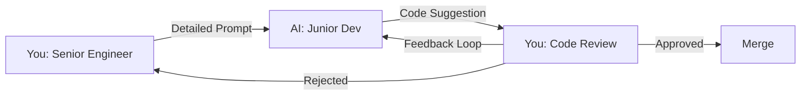

# The Golden Rules of Vibe Coding

> **Source**: Synthesized from the work of Addy Osmani and collective experience of early adopters, as documented in Mani, A. (2025). *Beyond Vibe Coding: From Coder to AI-Era Developer*. O'Reilly Media.

> **Core Principle**: AI accelerates development, but human judgment ensures security and quality.

---

## 📋 The 8 Golden Rules (Quick Reference)

<div style="background: linear-gradient(135deg, #1e293b 0%, #0f172a 100%); border-radius: 16px; padding: 40px; margin: 32px 0; border: 2px solid #4f46e5; page-break-inside: avoid;">

<div style="display: grid; grid-template-columns: repeat(auto-fit, minmax(280px, 1fr)); gap: 20px; color: #f1f5f9;">

<div style="background: rgba(99, 102, 241, 0.2); border-left: 4px solid #6366f1; padding: 20px; border-radius: 8px;">
  <div style="font-size: 28px; margin-bottom: 8px;">1️⃣</div>
  <div style="font-size: 18px; font-weight: 700; margin-bottom: 8px; color: #c7d2fe;">Be Specific and Clear</div>
  <div style="font-size: 14px; line-height: 1.6;">Clear prompts with Role, Context, Requirements, and Task yield secure, correct code.</div>
</div>

<div style="background: rgba(239, 68, 68, 0.2); border-left: 4px solid #ef4444; padding: 20px; border-radius: 8px;">
  <div style="font-size: 28px; margin-bottom: 8px;">2️⃣</div>
  <div style="font-size: 18px; font-weight: 700; margin-bottom: 8px; color: #fca5a5;">Always Validate Output</div>
  <div style="font-size: 14px; line-height: 1.6;">Trust but verify. Test with malicious inputs, review security controls, run scanners.</div>
</div>

<div style="background: rgba(16, 185, 129, 0.2); border-left: 4px solid #10b981; padding: 20px; border-radius: 8px;">
  <div style="font-size: 28px; margin-bottom: 8px;">3️⃣</div>
  <div style="font-size: 18px; font-weight: 700; margin-bottom: 8px; color: #6ee7b7;">Treat AI as Junior Dev</div>
  <div style="font-size: 14px; line-height: 1.6;">Fast and knowledgeable, but needs supervision, clear direction, and code review.</div>
</div>

<div style="background: rgba(251, 146, 60, 0.2); border-left: 4px solid #fb923c; padding: 20px; border-radius: 8px;">
  <div style="font-size: 28px; margin-bottom: 8px;">4️⃣</div>
  <div style="font-size: 18px; font-weight: 700; margin-bottom: 8px; color: #fdba74;">Understand All Code</div>
  <div style="font-size: 14px; line-height: 1.6;">Never merge code you can't explain, debug, or defend in production.</div>
</div>

<div style="background: rgba(139, 92, 246, 0.2); border-left: 4px solid #8b5cf6; padding: 20px; border-radius: 8px;">
  <div style="font-size: 28px; margin-bottom: 8px;">5️⃣</div>
  <div style="font-size: 18px; font-weight: 700; margin-bottom: 8px; color: #c4b5fd;">Isolate AI Changes</div>
  <div style="font-size: 14px; line-height: 1.6;">Separate commits labeled 🤖 enable audits, rollbacks, and quality tracking.</div>
</div>

<div style="background: rgba(6, 182, 212, 0.2); border-left: 4px solid #06b6d4; padding: 20px; border-radius: 8px;">
  <div style="font-size: 28px; margin-bottom: 8px;">6️⃣</div>
  <div style="font-size: 18px; font-weight: 700; margin-bottom: 8px; color: #67e8f9;">Human Review Required</div>
  <div style="font-size: 14px; line-height: 1.6;">AI code goes through same peer review as human code. No rubber-stamping.</div>
</div>

<div style="background: rgba(244, 63, 94, 0.2); border-left: 4px solid #f43f5e; padding: 20px; border-radius: 8px;">
  <div style="font-size: 28px; margin-bottom: 8px;">7️⃣</div>
  <div style="font-size: 18px; font-weight: 700; margin-bottom: 8px; color: #fda4af;">Document Rationale</div>
  <div style="font-size: 14px; line-height: 1.6;">AI can't explain "why" — you must document decisions, tradeoffs, and context.</div>
</div>

<div style="background: rgba(234, 179, 8, 0.2); border-left: 4px solid #eab308; padding: 20px; border-radius: 8px;">
  <div style="font-size: 28px; margin-bottom: 8px;">8️⃣</div>
  <div style="font-size: 18px; font-weight: 700; margin-bottom: 8px; color: #fde047;">Share Effective Prompts</div>
  <div style="font-size: 14px; line-height: 1.6;">Build a team prompt library. Codify best practices, ensure consistency.</div>
</div>

</div>

<div style="margin-top: 32px; padding-top: 24px; border-top: 1px solid rgba(255, 255, 255, 0.2); color: #cbd5e1; font-size: 14px; text-align: center;">
  <strong>Remember</strong>: These rules ensure speed and creativity are balanced with discipline, quality, and accountability.
  <br>
  <em>Print this page for your desk — keep the rules visible during AI-assisted development.</em>
</div>

</div>

---

## Detailed Rule Explanations

These eight rules form the governance framework for ensuring that speed and creativity are balanced with discipline, quality, and accountability in AI-assisted engineering. They are not meant to stifle innovation but to create a sustainable and professional practice around it.

---

## Rule 1: Be Specific and Clear About What You Want

**Principle**: All effective human-AI collaboration begins with a clear expression of intent. The quality of the AI's output is a direct reflection of the quality of the prompt. Vague instructions lead to ambiguous and often incorrect code.

### ❌ Bad Prompt
```
Create a login function
```

### ✅ Good Prompt
```markdown
Role: You are a security engineer implementing authentication.

Context:
- Node 18 + TypeScript + Express
- PostgreSQL for user storage
- Must comply with OWASP A07 (Authentication Failures)

Requirements:
- Use bcrypt for password hashing (cost factor 12)
- Implement rate limiting (5 attempts per 15 minutes)
- Constant-time comparison to prevent timing attacks
- Secure session management with httpOnly cookies
- Return generic error messages (no username enumeration)

Task:
1) Implement login(username: string, password: string) function
2) Hash password check with bcrypt.compare()
3) Add rate limiting with express-rate-limit
4) Set secure session cookie with 1-hour expiration
5) Log failed attempts for monitoring
```

### Why This Works
- **Role** sets security mindset
- **Context** defines tech stack and constraints
- **Requirements** list specific security controls
- **Task** provides step-by-step implementation guidance

---

## Rule 2: Always Validate AI Output Against Your Intent

**Principle**: The core principle of "Trust, but verify" must be rigorously applied. Never assume AI-generated code is correct. It must be tested, reviewed, and measured against the original requirements to ensure it solves the right problem in the right way.

### Before Merging AI-Generated Code

#### ✅ Verification Checklist
```markdown
□ I understand what every line does
□ I've tested with both valid and malicious inputs
□ Security controls match the OWASP category requirements
□ Error messages don't leak sensitive information
□ Logging doesn't expose secrets or PII
□ Dependencies are from trusted sources
□ Tests cover positive and negative cases
□ CodeQL and Snyk scans are clean
□ Code review by a human with security knowledge
```

### Red Flags to Watch For

1. **Hard-coded Secrets**
   ```typescript
   // ❌ AI might generate this
   const apiKey = "sk-1234567890abcdef";

   // ✅ Human must catch and fix
   const apiKey = process.env.API_KEY;
   if (!apiKey) throw new Error('API_KEY not configured');
   ```

2. **Insecure Defaults**
   ```typescript
   // ❌ AI might default to permissive
   app.use(cors({ origin: '*' }));

   // ✅ Human enforces allowlist
   app.use(cors({
     origin: ['https://app.example.com'],
     credentials: true
   }));
   ```

3. **Missing Input Validation**
   ```typescript
   // ❌ AI might skip validation
   async function getUser(id: string) {
     return await db.query(`SELECT * FROM users WHERE id = ${id}`);
   }

   // ✅ Human adds validation + parameterization
   const userIdSchema = z.string().uuid();
   async function getUser(id: string) {
     const validId = userIdSchema.parse(id);
     return await db.query('SELECT * FROM users WHERE id = $1', [validId]);
   }
   ```

---

## Rule 3: Treat AI as a Junior Developer (With Supervision)

**Principle**: This is the most effective mental model for working with current AI assistants. They are knowledgeable, fast, and eager, but they lack context, experience, and critical judgment. They require clear direction, constant oversight, and a senior hand to guide them away from pitfalls.

### Interaction Pattern



### What AI Does Well (Junior Developer Tasks)
- ✅ Boilerplate code generation
- ✅ Implementing known patterns from prompts
- ✅ Unit test scaffolding
- ✅ Documentation from code
- ✅ Refactoring with clear instructions

### What AI Does Poorly (Senior Tasks)
- ❌ Threat modeling and security architecture
- ❌ Complex business logic edge cases
- ❌ Performance optimization decisions
- ❌ Cross-system integration design
- ❌ Balancing security vs. usability tradeoffs

### Example: Pair Programming with AI

**You (Senior)**: "We need to prevent IDOR attacks on the `/api/documents/:id` endpoint."

**AI (Junior)**: *Generates authorization middleware*

**You (Senior)**: "Good start, but you're not logging authorization failures. Also, the error message leaks whether the document exists. Fix both."

**AI (Junior)**: *Refactors with logging and generic errors*

**You (Senior)**: "Better. Now add tests for unauthorized access attempts."

**AI (Junior)**: *Adds test cases*

**You (Senior)**: *Reviews, tests, approves*

---

## Rule 4: Don't Merge Code You Don't Understand

**Principle**: This is the ultimate rule of ownership. A developer is responsible for every line of code in their pull request, regardless of its origin. Merging code without fully comprehending its logic, implications, and potential edge cases is a dereliction of professional duty and a direct path to technical debt and production failures.

### Understanding Checklist

Before merging AI-generated code, ask yourself:

```markdown
□ Can I explain what every line does?
□ Do I understand why this approach was chosen?
□ Can I identify the edge cases this code handles?
□ Do I know what could go wrong with this code?
□ Can I debug this code if it fails in production?
□ Do I understand the security implications?
□ Would I be comfortable explaining this in a code review?
```

### Anti-Patterns to Avoid

❌ **"The AI wrote it, so it must be correct"**
- AI can generate plausible-looking but subtly broken code
- You own the bugs, not the AI

❌ **"I don't have time to understand it all"**
- Time pressure is not an excuse for poor quality
- Technical debt compounds quickly

❌ **"It passed the tests, so it's fine"**
- Tests may not cover all edge cases
- Security issues often hide in untested paths

---

## Rule 5: Isolate AI Changes in Git

**Principle**: When using AI to generate significant chunks of code, commit those changes separately. This practice makes code reviews more manageable, simplifies rollbacks if an issue is discovered, and improves the overall traceability of the codebase.

### Commit Message Pattern

```bash
git commit -m "feat(auth): Add rate limiting to login endpoint

- Implement express-rate-limit (5 attempts per 15 min)
- Add Redis store for distributed rate limiting
- Return 429 status on rate limit exceeded
- Log rate limit violations for monitoring

🤖 AI-assisted with Claude Code using OWASP A07 prompt pack
Refs: #123"
```

### PR Template (AI Disclosure Section)

```markdown
## AI Assistance Disclosure

- [ ] This PR includes AI-generated code
- **AI Tool Used**: Claude Code / GitHub Copilot / ChatGPT
- **Prompt Pack Used**: `prompts/owasp/A07_authn_failures.md`
- **Human Review**: Code reviewed line-by-line, tested with attack vectors
- **Security Verification**: CodeQL and Snyk scans passed

## Changes Made After AI Generation

- Added edge case handling for concurrent login attempts
- Strengthened error messages to prevent username enumeration
- Added integration tests with real Redis instance
```

### Why This Matters

1. **Auditability**: Track which code came from AI for security audits
2. **Learning**: Analyze AI-generated code quality over time
3. **Accountability**: Clear ownership and review trail
4. **Incident Response**: Quickly identify AI-generated code if vulnerability found

---

## Rule 6: Ensure All Code Undergoes Human Review

**Principle**: AI-generated code should be held to the same quality standards as human-written code. It must go through the same rigorous peer review process. This ensures a consistent quality bar and provides a critical check against the AI's potential blind spots.

### Code Review Checklist for AI-Generated Code

```markdown
□ Code follows team patterns and style guide
□ Security controls match requirements
□ Error handling is comprehensive
□ Tests cover positive and negative cases
□ Documentation explains the "why"
□ No hardcoded secrets or credentials
□ Performance is acceptable
□ Code is maintainable and readable
```

### Reviewer Responsibilities

- Treat AI code the same as junior developer code
- Don't rubber-stamp because "AI generated it"
- Ask questions if anything is unclear
- Request changes if quality bar not met
- Verify security controls are correct

---

## Rule 7: Prioritize Documentation and Rationale

**Principle**: AI can generate code, but it cannot explain the why behind a business decision or architectural trade-off. It is the developer's responsibility to document this crucial context. For agentic workflows, this might involve prompting the agent to maintain a decision log, which the developer then reviews and augments.

### ❌ Bad Documentation
```typescript
// Hash the password
const hash = await bcrypt.hash(password, 12);
```

### ✅ Good Documentation
```typescript
/**
 * Hash password using bcrypt with cost factor 12.
 *
 * Why bcrypt?
 * - Adaptive: cost factor can increase as hardware improves
 * - Built-in salt prevents rainbow table attacks
 * - Constant-time comparison prevents timing attacks
 *
 * Why cost factor 12?
 * - OWASP recommendation (2023): minimum 10, prefer 12+
 * - ~250ms on modern hardware (acceptable UX, strong security)
 * - Adjust upward as compute power increases
 *
 * Security: OWASP A02:2021 Cryptographic Failures
 * Last reviewed: 2025-10-10
 */
const hash = await bcrypt.hash(password, 12);
```

### Document Security Decisions

```typescript
/**
 * SECURITY DECISION: Rate limiting strategy
 *
 * Problem: Brute force attacks on login endpoint
 *
 * Considered Options:
 * 1. IP-based rate limiting (5 req/15min)
 *    - Pro: Simple to implement
 *    - Con: Shared IPs (corporate NAT) hit limit for all users
 *
 * 2. Account-based rate limiting (5 failed attempts/15min)
 *    - Pro: Doesn't affect legitimate users on same IP
 *    - Con: Requires tracking per-account state
 *
 * 3. Hybrid: IP-based (100 req/15min) + Account-based (5 fail/15min)
 *    - Pro: Best of both worlds
 *    - Con: More complex
 *
 * DECISION: Option 3 (Hybrid)
 * Rationale: Balances security with UX for shared IP environments
 * Risk: Increased Redis memory usage (acceptable tradeoff)
 *
 * Reference: OWASP A07:2021 Authentication Failures
 * Decided by: [Your Name]
 * Date: 2025-10-10
 */
```

---

## Rule 8: Share and Reuse Effective Prompts

**Principle**: Well-crafted prompts are valuable intellectual assets. Teams should create a shared repository of effective prompt patterns and templates for common tasks. This practice ensures consistency, codifies best practices, and accelerates the entire team's ability to work effectively with AI.

### Building Your Prompt Library

```
/prompts
  /owasp              # Security-focused prompts (this repo)
  /team
    /backend
      - api-endpoint.md
      - database-migration.md
    /frontend
      - react-component.md
      - form-validation.md
    /testing
      - integration-test.md
      - e2e-test.md
```

### Prompt Template Structure

```markdown
# [Prompt Title]

**Category**: Backend / Frontend / Testing / Security
**AI Tools**: Claude Code, Copilot, ChatGPT
**Success Rate**: 85% (based on team usage)
**Maintainer**: @your-name
**Last Updated**: 2025-10-10

## When to Use
[Describe the scenario where this prompt is effective]

## Prerequisites
- [Tech stack requirements]
- [Context needed]

## Prompt

```markdown
[Full copy-paste ready prompt]
```

## Example Output

**Good AI Output** (following the prompt):
```typescript
// Secure login implementation with rate limiting
import bcrypt from 'bcrypt';
import rateLimit from 'express-rate-limit';

const loginLimiter = rateLimit({
  windowMs: 15 * 60 * 1000, // 15 minutes
  max: 5, // 5 attempts
  message: 'Too many login attempts, please try again later'
});

export async function login(username: string, password: string) {
  // Input validation with Zod
  const validated = loginSchema.parse({ username, password });

  // Fetch user with prepared statement
  const user = await db.query(
    'SELECT id, password_hash FROM users WHERE username = $1',
    [validated.username]
  );

  if (!user) {
    // Generic error (no username enumeration)
    throw new Error('Invalid credentials');
  }

  // Constant-time comparison
  const match = await bcrypt.compare(validated.password, user.password_hash);

  if (!match) {
    // Log failed attempt for monitoring
    logger.warn('Failed login attempt', { userId: user.id });
    throw new Error('Invalid credentials');
  }

  return { userId: user.id };
}
```

## Common Pitfalls

**Watch out for these issues in AI-generated code:**
- **Missing rate limiting**: AI may implement auth but forget rate limits
- **Username enumeration**: Error messages like "User not found" vs "Wrong password"
- **Timing attacks**: Using `===` instead of constant-time comparison for passwords
- **Hardcoded secrets**: AI may use example API keys instead of environment variables
- **Insufficient logging**: No failed attempt tracking for security monitoring

**Human Verification Steps:**
1. Test with valid credentials → should succeed
2. Test with invalid password → should return generic error
3. Test with non-existent username → should return same generic error
4. Test 6 rapid login attempts → should be rate-limited on 6th
5. Check logs → failed attempts should be recorded (without passwords)
6. Run CodeQL/Snyk → should pass security scans

## Related Prompts

**Security Prompts:**
- [OWASP A07: Authentication Failures](/docs/prompts/owasp/A07_authn_failures) — Complete authentication security
- [OWASP A01: Broken Access Control](/docs/prompts/owasp/A01_broken_access_control) — Authorization after login
- [OWASP A09: Logging/Monitoring](/docs/prompts/owasp/A09_logging_monitoring) — Security event logging

**Maintainability Prompts:**
- [Fitness Functions](/docs/prompts/maintainability/fitness-functions) — Automated quality gates
- [Technical Debt Management](/docs/prompts/maintainability/technical-debt) — Track refactoring needs
```

### Prompt Iteration Log

Track improvements over time:

```markdown
## Version History

**v3 (2025-10-10)**: Added Zod validation requirement
- Problem: AI was skipping input validation
- Fix: Explicit "use Zod schema" instruction
- Result: Validation now included 100% of time

**v2 (2025-09-15)**: Added error handling checklist
- Problem: Generic errors not being used
- Fix: Added checklist item for generic errors
- Result: Security improved, fewer schema leaks

**v1 (2025-08-01)**: Initial version
```

---

## Measuring Success

Track these metrics to ensure Golden Rules are working:

### Leading Indicators (Process)
- **Prompt Quality Score**: Team rates prompts 1-5 after use
- **AI Code Acceptance Rate**: % of AI suggestions merged without changes
- **Review Cycle Time**: Time from AI generation to merge
- **Prompt Reuse Rate**: % of work using team prompt library

### Lagging Indicators (Outcomes)
- **Security Findings in AI Code**: CodeQL/Snyk issues per 1000 LOC
- **Post-Merge Defects**: Bugs found in AI-generated code after merge
- **Velocity**: Story points delivered (with quality maintained)
- **Team Confidence**: Survey: "I trust AI-generated code" (1-5)

---

## Enforcement in Practice

### During Development
- **Pre-commit Hook**: Checks for `🤖 AI-assisted` label in commit messages
- **PR Template**: Requires AI disclosure section (enforced by CI)
- **Code Review Checklist**: Includes Golden Rules verification

### During Review
- **Automated**: CodeQL, Snyk, ESLint catch technical issues
- **Human**: Reviewer validates Golden Rules compliance:
  1. "Is the prompt specific and clear?" (Rule 1)
  2. "Was AI output validated against intent?" (Rule 2)
  3. "Was AI treated as junior dev with proper oversight?" (Rule 3)
  4. "Do I fully understand this code?" (Rule 4)
  5. "Is AI usage clearly labeled?" (Rule 5)
  6. "Did the code undergo proper human review?" (Rule 6)
  7. "Is the 'why' documented?" (Rule 7)
  8. "Should this prompt be shared?" (Rule 8)

---

## Real-World Example: Full Workflow

### Scenario: Implement A03 Injection Prevention

**Step 1: Use Specific Prompt** (Rule 1)
```markdown
[Use the A03 prompt pack from prompts/owasp/A03_injection.md]
```

**Step 2: Review AI Output** (Rule 2)
- ✅ Parameterized queries used
- ✅ Zod validation present
- ❌ Error message leaks table name → **Fix manually**

**Step 3: Mentor the AI** (Rule 3)
- "Good start, but change error from 'users table query failed' to 'search failed'"
- AI regenerates with generic error

**Step 4: Isolated Commit** (Rule 4)
```bash
git commit -m "fix(A03): Add SQL injection prevention to searchUsers

- Use parameterized queries with $1 placeholder
- Add Zod validation with character allowlist
- Generic error messages prevent schema leaks
- Tests verify attack payloads are blocked

🤖 AI-assisted with Claude Code using OWASP A03 prompt pack"
```

**Step 5: Document Decision** (Rule 5)
```typescript
/**
 * SECURITY: SQL Injection Prevention (OWASP A03:2021)
 *
 * Why parameterized queries?
 * - Prevents injection by separating SQL structure from user data
 * - pg library uses prepared statements for $1, $2 placeholders
 *
 * Why Zod validation?
 * - Defense in depth: catch malicious input before it reaches DB
 * - Allowlist approach: only permit [a-zA-Z0-9 _.-@]
 * - Length limit (100 chars) prevents buffer exploits
 *
 * Attack vectors blocked:
 * - ' OR '1'='1
 * - '; DROP TABLE users--
 * - Unicode/null byte injection
 */
```

**Step 6: Share Success** (Rule 6)
- Prompt worked well → Add to team library
- Log: "A03 prompt v2: Added explicit Zod requirement"
- Team notification: "Great A03 prompt in prompts/owasp/, use for all DB queries"

---

## Getting Started

1. **Print these rules** and post near your workstation
2. **Create prompt library** in your repo (`/docs/prompts/team/`)
3. **Update PR template** to require AI disclosure
4. **Add pre-commit hook** to check for AI labels
5. **Schedule monthly review** of AI-generated code quality
6. **Celebrate wins** when AI+Human collaboration produces great results

---

## The Evolution of the Developer Role

> "The culmination of these practices points to a profound evolution in the role of the software developer. The value is shifting away from the mechanical act of typing code and toward the strategic orchestration of intelligent systems."

Adherence to these Golden Rules fosters a culture of **responsible innovation**. It allows teams to embrace the transformative power of AI while mitigating its risks, ensuring that the software they build is not only created faster but is also more **reliable, secure, and maintainable**.

### The Developer as Conductor

The developer of the future is a **"conductor,"** directing a symphony of AI agents, prompts, and automated verification tools. Their expertise is expressed not through lines of code written, but through:

- **The quality of their high-level designs**
- **The precision of their specifications**
- **The critical depth of their evaluations**
- **Their ability to see the system as a whole**

This is the ultimate mindset required to move **"beyond vibe coding"** and become a true architect of the agentic age.

---

## Further Reading

- [OWASP Top 10 (2021)](https://owasp.org/Top10/)
- [OWASP AI Security and Privacy Guide](https://owasp.org/www-project-ai-security-and-privacy-guide/)
- Mani, A. (2025). *Beyond Vibe Coding: From Coder to AI-Era Developer*. O'Reilly Media.
- Workshop: [Agentic Engineering, Secure by Design](../workshop)
