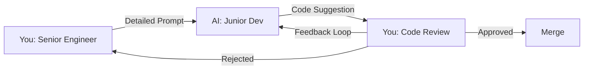

# The Golden Rules of Vibe Coding

> **Core Principle**: AI accelerates development, but human judgment ensures security and quality.

These six rules form the governance framework for security-first AI-assisted engineering. They balance velocity with rigor, ensuring AI becomes a force multiplier rather than a security liability.

---

## Rule 1: Be Specific About Intent and Constraints

**Principle**: Vague prompts produce vague code. Security requires precision.

### ❌ Bad Prompt
```
Create a login function
```

### ✅ Good Prompt
```markdown
Role: You are a security engineer implementing authentication.

Context:
- Node 18 + TypeScript + Express
- PostgreSQL for user storage
- Must comply with OWASP A07 (Authentication Failures)

Requirements:
- Use bcrypt for password hashing (cost factor 12)
- Implement rate limiting (5 attempts per 15 minutes)
- Constant-time comparison to prevent timing attacks
- Secure session management with httpOnly cookies
- Return generic error messages (no username enumeration)

Task:
1) Implement login(username: string, password: string) function
2) Hash password check with bcrypt.compare()
3) Add rate limiting with express-rate-limit
4) Set secure session cookie with 1-hour expiration
5) Log failed attempts for monitoring
```

### Why This Works
- **Role** sets security mindset
- **Context** defines tech stack and constraints
- **Requirements** list specific security controls
- **Task** provides step-by-step implementation guidance

---

## Rule 2: Trust But Verify — Never Merge Code You Don't Understand

**Principle**: AI can write code faster than you can understand it. Slow down for security.

### Before Merging AI-Generated Code

#### ✅ Verification Checklist
```markdown
□ I understand what every line does
□ I've tested with both valid and malicious inputs
□ Security controls match the OWASP category requirements
□ Error messages don't leak sensitive information
□ Logging doesn't expose secrets or PII
□ Dependencies are from trusted sources
□ Tests cover positive and negative cases
□ CodeQL and Snyk scans are clean
□ Code review by a human with security knowledge
```

### Red Flags to Watch For

1. **Hard-coded Secrets**
   ```typescript
   // ❌ AI might generate this
   const apiKey = "sk-1234567890abcdef";

   // ✅ Human must catch and fix
   const apiKey = process.env.API_KEY;
   if (!apiKey) throw new Error('API_KEY not configured');
   ```

2. **Insecure Defaults**
   ```typescript
   // ❌ AI might default to permissive
   app.use(cors({ origin: '*' }));

   // ✅ Human enforces allowlist
   app.use(cors({
     origin: ['https://app.example.com'],
     credentials: true
   }));
   ```

3. **Missing Input Validation**
   ```typescript
   // ❌ AI might skip validation
   async function getUser(id: string) {
     return await db.query(`SELECT * FROM users WHERE id = ${id}`);
   }

   // ✅ Human adds validation + parameterization
   const userIdSchema = z.string().uuid();
   async function getUser(id: string) {
     const validId = userIdSchema.parse(id);
     return await db.query('SELECT * FROM users WHERE id = $1', [validId]);
   }
   ```

---

## Rule 3: Treat AI Like a Keen Junior Dev — Guide and Review

**Principle**: AI is brilliant but inexperienced. It needs mentorship and oversight.

### Interaction Pattern



### What AI Does Well (Junior Developer Tasks)
- ✅ Boilerplate code generation
- ✅ Implementing known patterns from prompts
- ✅ Unit test scaffolding
- ✅ Documentation from code
- ✅ Refactoring with clear instructions

### What AI Does Poorly (Senior Tasks)
- ❌ Threat modeling and security architecture
- ❌ Complex business logic edge cases
- ❌ Performance optimization decisions
- ❌ Cross-system integration design
- ❌ Balancing security vs. usability tradeoffs

### Example: Pair Programming with AI

**You (Senior)**: "We need to prevent IDOR attacks on the `/api/documents/:id` endpoint."

**AI (Junior)**: *Generates authorization middleware*

**You (Senior)**: "Good start, but you're not logging authorization failures. Also, the error message leaks whether the document exists. Fix both."

**AI (Junior)**: *Refactors with logging and generic errors*

**You (Senior)**: "Better. Now add tests for unauthorized access attempts."

**AI (Junior)**: *Adds test cases*

**You (Senior)**: *Reviews, tests, approves*

---

## Rule 4: Isolate AI Changes in Separate Commits/PRs; Label Them

**Principle**: Traceability is security. Always know which code is AI-generated.

### Commit Message Pattern

```bash
git commit -m "feat(auth): Add rate limiting to login endpoint

- Implement express-rate-limit (5 attempts per 15 min)
- Add Redis store for distributed rate limiting
- Return 429 status on rate limit exceeded
- Log rate limit violations for monitoring

🤖 AI-assisted with Claude Code using OWASP A07 prompt pack
Refs: #123"
```

### PR Template (AI Disclosure Section)

```markdown
## AI Assistance Disclosure

- [ ] This PR includes AI-generated code
- **AI Tool Used**: Claude Code / GitHub Copilot / ChatGPT
- **Prompt Pack Used**: `prompts/owasp/A07_authn_failures.md`
- **Human Review**: Code reviewed line-by-line, tested with attack vectors
- **Security Verification**: CodeQL and Snyk scans passed

## Changes Made After AI Generation

- Added edge case handling for concurrent login attempts
- Strengthened error messages to prevent username enumeration
- Added integration tests with real Redis instance
```

### Why This Matters

1. **Auditability**: Track which code came from AI for security audits
2. **Learning**: Analyze AI-generated code quality over time
3. **Accountability**: Clear ownership and review trail
4. **Incident Response**: Quickly identify AI-generated code if vulnerability found

---

## Rule 5: Document Rationale (What/Why), Not Just the Code

**Principle**: Future developers (including AI) need context, not just syntax.

### ❌ Bad Documentation
```typescript
// Hash the password
const hash = await bcrypt.hash(password, 12);
```

### ✅ Good Documentation
```typescript
/**
 * Hash password using bcrypt with cost factor 12.
 *
 * Why bcrypt?
 * - Adaptive: cost factor can increase as hardware improves
 * - Built-in salt prevents rainbow table attacks
 * - Constant-time comparison prevents timing attacks
 *
 * Why cost factor 12?
 * - OWASP recommendation (2023): minimum 10, prefer 12+
 * - ~250ms on modern hardware (acceptable UX, strong security)
 * - Adjust upward as compute power increases
 *
 * Security: OWASP A02:2021 Cryptographic Failures
 * Last reviewed: 2025-10-10
 */
const hash = await bcrypt.hash(password, 12);
```

### Document Security Decisions

```typescript
/**
 * SECURITY DECISION: Rate limiting strategy
 *
 * Problem: Brute force attacks on login endpoint
 *
 * Considered Options:
 * 1. IP-based rate limiting (5 req/15min)
 *    - Pro: Simple to implement
 *    - Con: Shared IPs (corporate NAT) hit limit for all users
 *
 * 2. Account-based rate limiting (5 failed attempts/15min)
 *    - Pro: Doesn't affect legitimate users on same IP
 *    - Con: Requires tracking per-account state
 *
 * 3. Hybrid: IP-based (100 req/15min) + Account-based (5 fail/15min)
 *    - Pro: Best of both worlds
 *    - Con: More complex
 *
 * DECISION: Option 3 (Hybrid)
 * Rationale: Balances security with UX for shared IP environments
 * Risk: Increased Redis memory usage (acceptable tradeoff)
 *
 * Reference: OWASP A07:2021 Authentication Failures
 * Decided by: [Your Name]
 * Date: 2025-10-10
 */
```

---

## Rule 6: Share Winning Prompts — Build a Team Prompt Library

**Principle**: Successful prompts are organizational assets. Capture and reuse them.

### Building Your Prompt Library

```
/prompts
  /owasp              # Security-focused prompts (this repo)
  /team
    /backend
      - api-endpoint.md
      - database-migration.md
    /frontend
      - react-component.md
      - form-validation.md
    /testing
      - integration-test.md
      - e2e-test.md
```

### Prompt Template Structure

```markdown
# [Prompt Title]

**Category**: Backend / Frontend / Testing / Security
**AI Tools**: Claude Code, Copilot, ChatGPT
**Success Rate**: 85% (based on team usage)
**Maintainer**: @your-name
**Last Updated**: 2025-10-10

## When to Use
[Describe the scenario where this prompt is effective]

## Prerequisites
- [Tech stack requirements]
- [Context needed]

## Prompt

```markdown
[Full copy-paste ready prompt]
```

## Example Output
[Show what good output looks like]

## Common Pitfalls
- [Things to watch out for]
- [Human verification steps]

## Related Prompts
- [Link to related prompts]
```

### Prompt Iteration Log

Track improvements over time:

```markdown
## Version History

**v3 (2025-10-10)**: Added Zod validation requirement
- Problem: AI was skipping input validation
- Fix: Explicit "use Zod schema" instruction
- Result: Validation now included 100% of time

**v2 (2025-09-15)**: Added error handling checklist
- Problem: Generic errors not being used
- Fix: Added checklist item for generic errors
- Result: Security improved, fewer schema leaks

**v1 (2025-08-01)**: Initial version
```

---

## Measuring Success

Track these metrics to ensure Golden Rules are working:

### Leading Indicators (Process)
- **Prompt Quality Score**: Team rates prompts 1-5 after use
- **AI Code Acceptance Rate**: % of AI suggestions merged without changes
- **Review Cycle Time**: Time from AI generation to merge
- **Prompt Reuse Rate**: % of work using team prompt library

### Lagging Indicators (Outcomes)
- **Security Findings in AI Code**: CodeQL/Snyk issues per 1000 LOC
- **Post-Merge Defects**: Bugs found in AI-generated code after merge
- **Velocity**: Story points delivered (with quality maintained)
- **Team Confidence**: Survey: "I trust AI-generated code" (1-5)

---

## Enforcement in Practice

### During Development
- **Pre-commit Hook**: Checks for `🤖 AI-assisted` label in commit messages
- **PR Template**: Requires AI disclosure section (enforced by CI)
- **Code Review Checklist**: Includes Golden Rules verification

### During Review
- **Automated**: CodeQL, Snyk, ESLint catch technical issues
- **Human**: Reviewer validates Golden Rules compliance:
  1. "Is the prompt specific enough?" (Rule 1)
  2. "Do I understand this code?" (Rule 2)
  3. "Does this look like junior dev output?" (Rule 3)
  4. "Is AI usage clearly labeled?" (Rule 4)
  5. "Is the 'why' documented?" (Rule 5)
  6. "Should this prompt be shared?" (Rule 6)

---

## Real-World Example: Full Workflow

### Scenario: Implement A03 Injection Prevention

**Step 1: Use Specific Prompt** (Rule 1)
```markdown
[Use the A03 prompt pack from prompts/owasp/A03_injection.md]
```

**Step 2: Review AI Output** (Rule 2)
- ✅ Parameterized queries used
- ✅ Zod validation present
- ❌ Error message leaks table name → **Fix manually**

**Step 3: Mentor the AI** (Rule 3)
- "Good start, but change error from 'users table query failed' to 'search failed'"
- AI regenerates with generic error

**Step 4: Isolated Commit** (Rule 4)
```bash
git commit -m "fix(A03): Add SQL injection prevention to searchUsers

- Use parameterized queries with $1 placeholder
- Add Zod validation with character allowlist
- Generic error messages prevent schema leaks
- Tests verify attack payloads are blocked

🤖 AI-assisted with Claude Code using OWASP A03 prompt pack"
```

**Step 5: Document Decision** (Rule 5)
```typescript
/**
 * SECURITY: SQL Injection Prevention (OWASP A03:2021)
 *
 * Why parameterized queries?
 * - Prevents injection by separating SQL structure from user data
 * - pg library uses prepared statements for $1, $2 placeholders
 *
 * Why Zod validation?
 * - Defense in depth: catch malicious input before it reaches DB
 * - Allowlist approach: only permit [a-zA-Z0-9 _.-@]
 * - Length limit (100 chars) prevents buffer exploits
 *
 * Attack vectors blocked:
 * - ' OR '1'='1
 * - '; DROP TABLE users--
 * - Unicode/null byte injection
 */
```

**Step 6: Share Success** (Rule 6)
- Prompt worked well → Add to team library
- Log: "A03 prompt v2: Added explicit Zod requirement"
- Team notification: "Great A03 prompt in prompts/owasp/, use for all DB queries"

---

## Getting Started

1. **Print these rules** and post near your workstation
2. **Create prompt library** in your repo (`/prompts/team/`)
3. **Update PR template** to require AI disclosure
4. **Add pre-commit hook** to check for AI labels
5. **Schedule monthly review** of AI-generated code quality
6. **Celebrate wins** when AI+Human collaboration produces great results

---

## Further Reading

- [OWASP Top 10 (2021)](https://owasp.org/Top10/)
- [OWASP AI Security and Privacy Guide](https://owasp.org/www-project-ai-security-and-privacy-guide/)
- Workshop: [Agentic Engineering, Secure by Design](../workshop.md)
