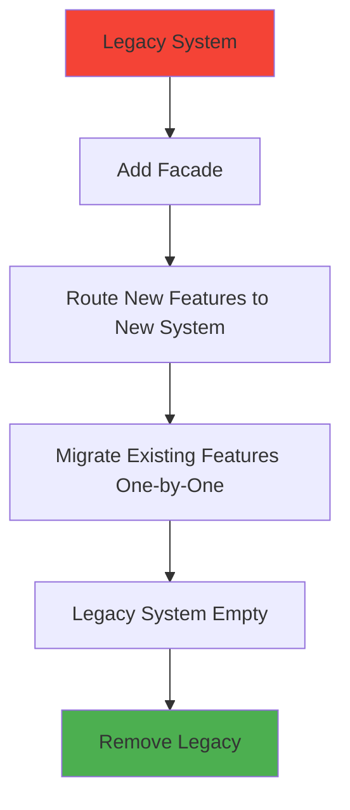

# Evolutionary Architecture

> **Purpose**: Enable incremental, guided architectural change through fitness functions, AI assistance, and systematic technical debt management.

---

## Core Principles

### 1. Incremental Change Over Big-Bang Rewrites


**Why**: Large rewrites fail ~80% of the time. Small, verifiable changes succeed.

### 2. Fitness Functions Guide Evolution

Automated checks ensure architectural goals maintained during change:

```typescript
// Example: Ensure no cyclic dependencies

import { analyzeProject } from 'dependency-cruiser';

function checkNoCyclicDependencies() {
  const result = analyzeProject('src');

  const cycles = result.dependencies.filter(d => d.cycle);

  if (cycles.length > 0) {
    console.error('❌ Cyclic dependencies detected:', cycles);
    return false;
  }

  console.log('✅ No cyclic dependencies');
  return true;
}
```

### 3. Reversible Changes

All changes must be reversible if fitness functions fail:

```markdown
Migration Plan: Auth from MD5 to bcrypt

Phase 1: Dual-write (reversible)
- New: bcrypt
- Existing: MD5
- Rollback: Stop writing bcrypt

Phase 2: Dual-read (reversible)
- Login: Try bcrypt, fall back to MD5
- Rollback: Remove bcrypt reads

Phase 3: Migrate (reversible)
- On login: Rehash MD5 → bcrypt
- Rollback: Keep both hashes

Phase 4: Deprecate MD5 (IRREVERSIBLE - requires backup)
- Delete MD5 hashes
- Rollback: Restore from backup
```

---

## Incremental Change Patterns

### Pattern 1: Strangler Fig

Gradually replace legacy system with new implementation:



**Example: Replace Legacy Auth**

```typescript
// Phase 1: Facade
export function authenticate(username, password) {
  if (isNewUser(username)) {
    return newAuthSystem.authenticate(username, password);  // bcrypt
  } else {
    return legacyAuthSystem.authenticate(username, password);  // MD5
  }
}

// Phase 2: Migrate on use
export async function authenticate(username, password) {
  const user = await db.getUser(username);

  if (user.passwordHash.startsWith('$2b')) {
    // New system (bcrypt)
    return bcrypt.compare(password, user.passwordHash);
  } else {
    // Legacy system (MD5) - migrate on successful login
    const isValid = md5(password) === user.passwordHash;
    if (isValid) {
      await migrateUserToBcrypt(user, password);  // Opportunistic migration
    }
    return isValid;
  }
}

// Phase 3: Remove MD5 (after 100% migration)
export function authenticate(username, password) {
  const user = await db.getUser(username);
  return bcrypt.compare(password, user.passwordHash);  // Only bcrypt
}
```

---

### Pattern 2: Feature Flags

Enable/disable new behavior without deployment:

```typescript
// Feature flag for new algorithm
export function processPayment(amount: number) {
  if (featureFlags.isEnabled('new-payment-processor')) {
    return newPaymentProcessor.process(amount);
  } else {
    return legacyPaymentProcessor.process(amount);
  }
}

// Gradual rollout:
// Day 1: 5% of users
// Day 2: 25% of users
// Day 3: 50% of users
// Day 4: 100% of users
// Day 5: Remove flag, delete legacy code
```

---

### Pattern 3: Branch by Abstraction

Create abstraction, migrate implementations, remove abstraction:

```typescript
// Step 1: Create abstraction
interface EmailService {
  send(to: string, subject: string, body: string): Promise<void>;
}

// Step 2: Implement with legacy
class SendGridEmailService implements EmailService {
  async send(to, subject, body) {
    return sendgrid.send({ to, subject, body });
  }
}

// Step 3: Add new implementation
class SESEmailService implements EmailService {
  async send(to, subject, body) {
    return ses.sendEmail({ to, subject, body });
  }
}

// Step 4: Switch implementations via config
const emailService: EmailService = config.emailProvider === 'ses'
  ? new SESEmailService()
  : new SendGridEmailService();

// Step 5: Migrate all callers to abstraction
emailService.send('user@example.com', 'Subject', 'Body');

// Step 6: Remove legacy implementation
const emailService = new SESEmailService();
```

---

## Refactoring with AI Assistance

### Using Claude for Large-Scale Refactoring

```markdown
Role: Refactoring engineer following evolutionary architecture principles

Context:
- Codebase: 50 TypeScript files using legacy auth (MD5)
- Goal: Migrate to bcrypt
- Constraint: Zero downtime, incremental migration

Task: Create migration plan following strangler fig pattern

Requirements:
1. Phase 1: Add bcrypt alongside MD5 (dual-write)
2. Phase 2: Update login to try bcrypt, fall back to MD5
3. Phase 3: Migrate users opportunistically (on login)
4. Phase 4: Remove MD5 after 100% migration

For each phase:
- List files to modify
- Show code changes
- Provide rollback plan
- Define fitness function to verify phase complete

Output: Step-by-step migration guide with code samples
```

---

### Fitness Functions for Refactoring

```typescript
// Phase 1: Ensure no new MD5 usage
function checkNoNewMD5Usage() {
  const result = execSync("grep -r \"md5(\" src/", { encoding: 'utf-8' });

  // Allow existing MD5 in legacy auth only
  const md5Uses = result.split('\n').filter(line =>
    line && !line.includes('src/auth/legacy')
  );

  if (md5Uses.length > 0) {
    console.error('❌ New MD5 usage detected:', md5Uses);
    return false;
  }

  console.log('✅ No new MD5 usage');
  return true;
}

// Phase 3: Track migration progress
async function checkMigrationProgress() {
  const stats = await db.query(`
    SELECT
      COUNT(*) FILTER (WHERE password_hash LIKE '$2b%') as bcrypt_users,
      COUNT(*) as total_users
    FROM users
  `);

  const pct = (stats.bcrypt_users / stats.total_users) * 100;

  console.log(`Migration: ${pct.toFixed(1)}% complete (${stats.bcrypt_users}/${stats.total_users})`);

  if (pct >= 95) {
    console.log('✅ Migration >95% complete, ready for Phase 4');
    return true;
  }

  return false;
}
```

---

## Technical Debt Management

### Debt Classification

```markdown
| Debt Type | Description | Priority | Remediation |
|-----------|-------------|----------|-------------|
| **Security Debt** | Known CVEs, OWASP violations | Critical | Immediate |
| **Compliance Debt** | Regulatory requirements | High | < 30 days |
| **Complexity Debt** | Cyclomatic complexity >10 | Medium | Next sprint |
| **Dependency Debt** | Packages >3 months old | Medium | Weekly |
| **Test Debt** | Coverage <80% | Low | Opportunistic |
```

### Debt Tracking

```yaml
# tech-debt.yml

security:
  - id: TD-001
    title: Upgrade express 4.x to 5.x (CVE-2024-xxxx)
    owasp: A06
    priority: critical
    effort: 8 hours
    plan: |
      Phase 1: Update package.json
      Phase 2: Fix breaking changes (middleware signatures)
      Phase 3: Test all routes
      Phase 4: Deploy to staging
      Phase 5: Monitor for 24h
      Phase 6: Deploy to production

complexity:
  - id: TD-002
    title: Refactor processPayment() (complexity 15)
    priority: medium
    effort: 4 hours
    plan: |
      Extract validation to validatePayment()
      Extract fraud check to checkFraud()
      Extract processing to executePayment()
      Target complexity: <10 per function
```

---

## "Upgrade All The Things" Kata

### Weekly Upgrade Ritual

```markdown
Every Monday:

1. Audit Dependencies
   ```bash
   npm outdated
   npm audit
   snyk test
   ```

2. Categorize Upgrades
   - Patch (1.2.3 → 1.2.4): Auto-upgrade
   - Minor (1.2.0 → 1.3.0): Review changelog
   - Major (1.x → 2.x): Plan migration

3. Execute Upgrades
   ```bash
   # Patch versions (low risk)
   npm update --depth 0
   npm test

   # Minor versions (review required)
   npm install package@1.3.0
   npm test
   git commit -m "chore: upgrade package 1.2.0 → 1.3.0"

   # Major versions (migration plan required)
   # Create separate branch, follow evolutionary pattern
   ```

4. Verify with Fitness Functions
   ```bash
   npm run fitness-check
   ```

5. Deploy
   ```bash
   git push
   # CI runs, deploys to staging
   # Monitor for 24 hours
   # Deploy to production
   ```
```

---

## Architecture Decision Records (ADRs)

### Template

```markdown
# ADR-NNN: [Title]

**Status**: [Proposed | Accepted | Deprecated | Superseded by ADR-XXX]

**Date**: YYYY-MM-DD

**Deciders**: [Names]

## Context

[What is the issue we're facing? What constraints exist?]

## Decision

[What is the change we're proposing or have agreed to?]

## Consequences

### Positive
- [Benefit 1]
- [Benefit 2]

### Negative
- [Trade-off 1]
- [Trade-off 2]

## Alternatives Considered

### Alternative 1: [Name]
- **Pros**: [...]
- **Cons**: [...]
- **Rejected because**: [...]

### Alternative 2: [Name]
- **Pros**: [...]
- **Cons**: [...]
- **Rejected because**: [...]

## Fitness Functions

[What automated checks ensure this decision is maintained?]

```ql
// Example: Ensure UUID usage
import javascript
from TableDeclaration table
where not table.getPrimaryKey().getType().toString().matches("%UUID%")
select table, "Primary key must be UUID"
```

## OWASP Relevance

[If security-related, which OWASP category does this address?]

## References

- [Link to design doc]
- [Link to POC code]
- [Link to benchmark results]
```

---

## Best Practices

**Do's**:
- Make small, verifiable changes
- Define fitness functions before refactoring
- Use feature flags for risky changes
- Document decisions in ADRs
- Migrate incrementally with rollback plans

**Don'ts**:
- Big-bang rewrites
- Change without tests
- Skip fitness function validation
- Leave technical debt untracked
- Ignore dependency upgrades

---

**Further Reading**:
- [Fitness Functions](fitness-functions.md)
- [SDLC Phase 6: Evolution](../sdlc/phase6-evolution.md)
- [Building Evolutionary Architectures](https://www.oreilly.com/library/view/building-evolutionary-architectures/9781491986356/)
