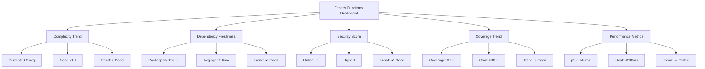

# Architectural Fitness Functions

> **Definition**: An architectural fitness function is an object function used to assess how close an architecture is to achieving an architectural characteristic.

---

## Quick Reference

| Fitness Function | Metric | Threshold | Tool | Enforcement |
|------------------|--------|-----------|------|-------------|
| **Complexity** | Cyclomatic complexity | ≤10 per function | ESLint | Pre-commit + CI |
| **Dependency Freshness** | Package age | <3 months | npm outdated + Snyk | Weekly scan |
| **Security Compliance** | CVE count | 0 high/critical | CodeQL + Snyk | CI (blocking) |
| **Test Coverage** | Line coverage | ≥80% overall, 100% security | Jest | CI (blocking) |
| **Performance** | Response time (p95) | <200ms | Custom tests | CI (warning) |

---

## 1. Code Complexity Fitness Function

### Implementation

```javascript
// .eslintrc.cjs
module.exports = {
  rules: {
    'complexity': ['error', { max: 10 }],
    'max-lines-per-function': ['error', { max: 50 }],
    'max-lines': ['error', { max: 300 }],
    'max-depth': ['error', 4],
    'max-params': ['error', 4]
  }
};
```

### CodeQL Custom Query

```ql
// .github/codeql/high-complexity-functions.ql
import javascript

from Function f
where f.getCyclomaticComplexity() > 10
select f, "Function has complexity " + f.getCyclomaticComplexity() + " (max: 10)"
```

### CI Integration

```yaml
# .github/workflows/fitness.yml
- name: Complexity Check
  run: npm run lint -- --max-warnings=0
```

---

## 2. Dependency Freshness Fitness Function

### The 3-Month Rule

All dependencies must be upgraded within 3 months of release to:
- Receive security patches promptly
- Avoid accumulation of breaking changes
- Maintain compatibility with ecosystem

### Implementation

```javascript
// scripts/dependency-freshness.js
const { execSync } = require('child_process');

function checkDependencyFreshness() {
  const outdated = JSON.parse(
    execSync('npm outdated --json', { encoding: 'utf-8' }) || '{}'
  );

  const threeMonthsAgo = new Date();
  threeMonthsAgo.setMonth(threeMonthsAgo.getMonth() - 3);

  const stalePackages = [];

  for (const [pkg, info] of Object.entries(outdated)) {
    const currentDate = new Date(info.time?.[info.current]);

    if (currentDate < threeMonthsAgo) {
      stalePackages.push({
        package: pkg,
        current: info.current,
        latest: info.latest,
        age: Math.floor((Date.now() - currentDate) / (1000 * 60 * 60 * 24)) + ' days'
      });
    }
  }

  if (stalePackages.length > 0) {
    console.error('❌ Stale dependencies (>3 months):');
    console.table(stalePackages);
    return false;
  }

  console.log('✅ All dependencies are fresh (<3 months)');
  return true;
}
```

### "Upgrade All The Things" Kata

```markdown
Weekly Upgrade Workflow:

Monday:
- Run: npm outdated
- Identify packages >3 months old
- Check for CVEs (Snyk)

Tuesday:
- Upgrade patch versions (e.g., 1.2.3 → 1.2.4)
- Run: npm update --depth 0
- Test: npm test

Wednesday:
- Upgrade minor versions (e.g., 1.2.0 → 1.3.0)
- Review changelogs for breaking changes
- Test: npm test

Thursday:
- Flag major versions for human review (e.g., 1.x → 2.x)
- Create upgrade plan
- Test in staging

Friday:
- Deploy upgrades to production
- Monitor for errors
- Rollback if needed
```

---

## 3. Security Compliance Fitness Function

### CodeQL Security Queries

```yaml
# .github/workflows/codeql.yml
- uses: github/codeql-action/init@v3
  with:
    queries: security-extended
    query-filters:
      - exclude:
          id: js/insecure-randomness  # Acceptable for non-crypto use
```

### Snyk Thresholds

```yaml
# .snyk
version: v1.19.0
ignore: {}
patch: {}
exclude: {}
language-settings:
  javascript:
    severity-threshold: high  # Block on high/critical only
```

### Custom Security Fitness Function

```typescript
// scripts/security-fitness.ts

interface SecurityFindings {
  codeql: { high: number; critical: number };
  snyk: { high: number; critical: number };
}

function checkSecurityCompliance(findings: SecurityFindings): boolean {
  const { codeql, snyk } = findings;

  const totalCritical = codeql.critical + snyk.critical;
  const totalHigh = codeql.high + snyk.high;

  if (totalCritical > 0) {
    console.error(`❌ Security: ${totalCritical} critical findings`);
    return false;
  }

  if (totalHigh > 0) {
    console.error(`❌ Security: ${totalHigh} high findings`);
    return false;
  }

  console.log('✅ Security: 0 high/critical findings');
  return true;
}
```

---

## 4. Test Coverage Fitness Function

### Jest Configuration

```typescript
// jest.config.ts
export default {
  coverageThreshold: {
    global: {
      branches: 80,
      functions: 80,
      lines: 80,
      statements: 80
    },
    // Security-critical code requires 100% coverage
    './src/auth/': {
      branches: 100,
      functions: 100,
      lines: 100,
      statements: 100
    },
    './src/crypto/': {
      branches: 100,
      functions: 100,
      lines: 100,
      statements: 100
    }
  }
};
```

### Coverage Report in CI

```yaml
- name: Test Coverage
  run: |
    npm test -- --coverage
    npx istanbul-badges-readme

- name: Upload Coverage
  uses: codecov/codecov-action@v3
```

---

## 5. Performance Fitness Function

### Implementation

```typescript
// __tests__/performance.test.ts

describe('Performance Fitness Functions', () => {
  it('should complete share creation in <200ms (p95)', async () => {
    const iterations = 100;
    const times: number[] = [];

    for (let i = 0; i < iterations; i++) {
      const start = performance.now();
      await createShare('doc-123', 'user-456', { ... });
      const end = performance.now();
      times.push(end - start);
    }

    times.sort((a, b) => a - b);
    const p95 = times[Math.floor(iterations * 0.95)];

    expect(p95).toBeLessThan(200);
  });

  it('should have no N+1 query problems', async () => {
    const queryCounts: number[] = [];

    // Measure queries for 1, 10, 100 shares
    for (const count of [1, 10, 100]) {
      const queryCount = await measureQueries(() => listShares(count));
      queryCounts.push(queryCount);
    }

    // Query count should be O(1), not O(n)
    expect(queryCounts[0]).toBe(queryCounts[1]);
    expect(queryCounts[1]).toBe(queryCounts[2]);
  });
});
```

---

## Implementing with CodeQL/Snyk

### CodeQL Custom Queries for OWASP

```ql
// .github/codeql/sql-injection.ql (A03)
import javascript

from StringConcatenation concat, SqlQuery query
where concat.flowsTo(query)
select query, "Potential SQL injection via string concatenation"
```

```ql
// .github/codeql/hardcoded-secrets.ql (A02, A05)
import javascript

from StringLiteral s
where s.getValue().regexpMatch("(?i)(password|secret|api[_-]?key)\\s*=\\s*['\"][^'\"]{8,}['\"]")
select s, "Potential hardcoded secret detected"
```

### Snyk Policy File

```yaml
# .snyk
version: v1.19.0

ignore:
  # Example: Acceptable risk (dev dependency only)
  SNYK-JS-LODASH-567890:
    - '*':
        reason: Dev dependency, not in production bundle
        expires: 2025-12-31

patch: {}
```

---

## Fitness Function Monitoring Dashboard

### Visualization



---

## Best Practices

**Do's**:
- Run fitness functions locally before pushing
- Treat failures as blocking (don't accumulate)
- Adjust thresholds based on team capacity
- Monitor trends over time
- Celebrate improvements

**Don'ts**:
- Disable fitness functions to meet deadlines
- Set unrealistic thresholds (100% coverage everywhere)
- Ignore warnings until they become errors
- Skip fitness functions in CI "just this once"

---

**Further Reading**:
- [Evolutionary Architecture](evolutionary-architecture.md)
- [SDLC Phase 3: Verification](../sdlc/phase3-verification.md)
- [Building Evolutionary Architectures](https://www.oreilly.com/library/view/building-evolutionary-architectures/9781491986356/)
