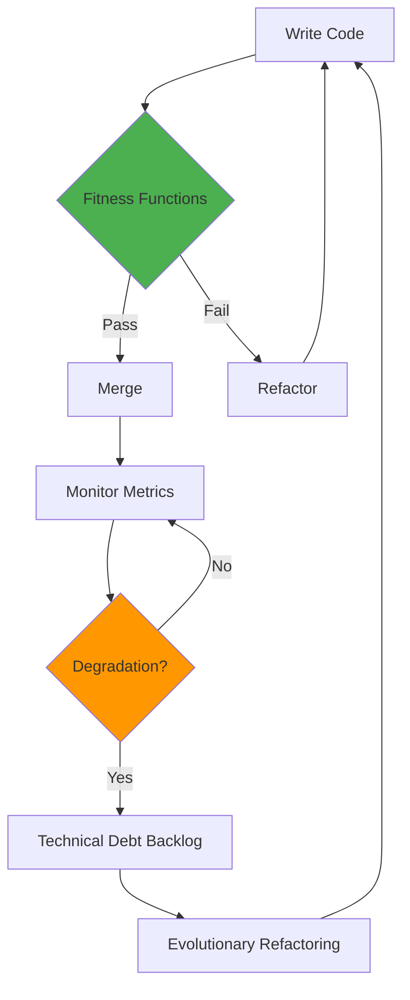
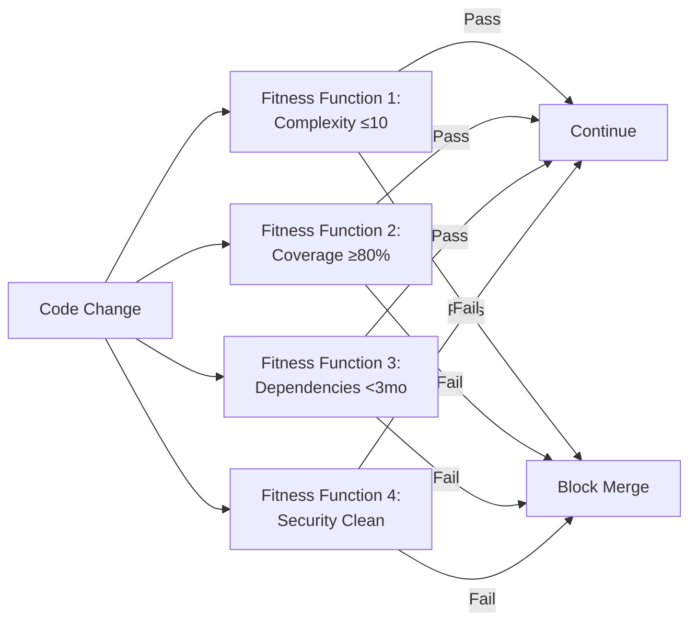
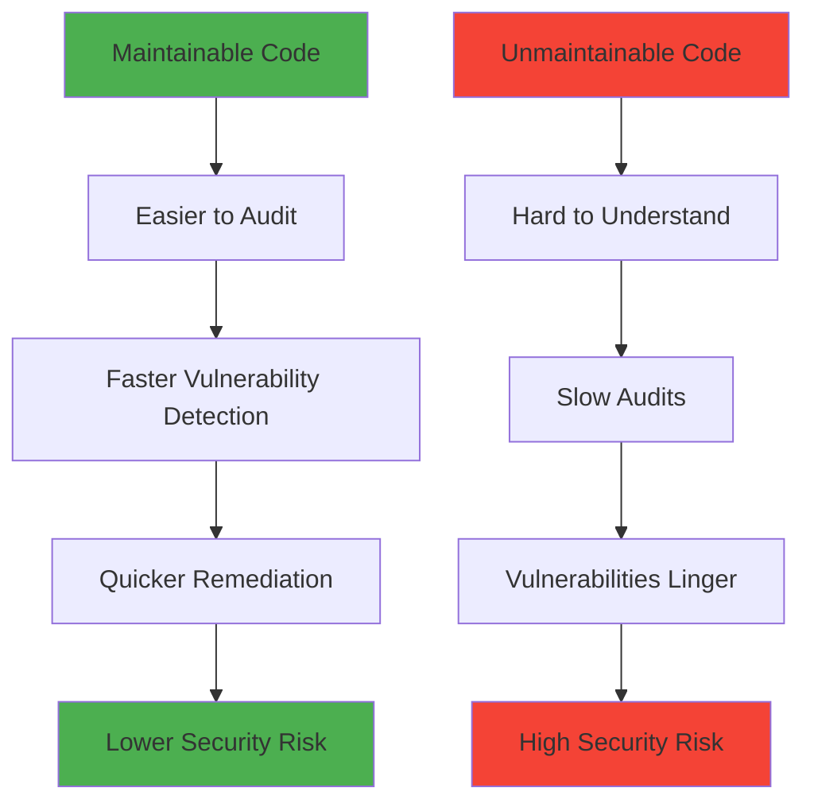
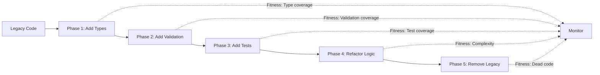
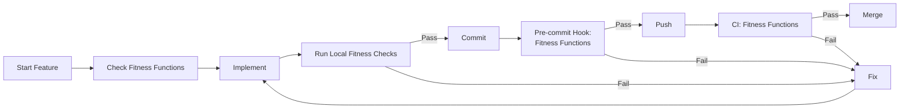

# Maintainability Framework

> **Purpose**: Ensure long-term code health through evolutionary architecture principles, fitness functions, and technical debt management.

---

## Overview

Maintainability is not a one-time achievement—it's an ongoing practice enforced through automated fitness functions and evolutionary architecture principles.



---

## Core Principles

### 1. Evolutionary Architecture

> "An evolutionary architecture supports guided, incremental change across multiple dimensions."
> — Neal Ford, Rebecca Parsons, Patrick Kua

**Key Concepts**:
- **Incremental Change**: Small, verifiable changes over big-bang rewrites
- **Fitness Functions**: Automated checks that guide architectural evolution
- **Technical Debt Management**: Systematic identification and reduction
- **Reversibility**: Changes can be rolled back if fitness functions fail

**Integration with AI**:
- AI agents perform incremental refactoring
- Fitness functions validate AI-generated changes
- Human oversight ensures architecture goals met

### 2. Fitness Functions

Automated, objective checks that verify architectural characteristics:



**Types of Fitness Functions**:
- **Atomic**: Single characteristic (e.g., cyclomatic complexity)
- **Holistic**: Multiple characteristics combined (e.g., security score)
- **Triggered**: Run on specific events (e.g., deployment)
- **Continuous**: Always running (e.g., monitoring)

### 3. Technical Debt as Measured Quantity

Track debt metrics rather than subjective assessments:

| Debt Type | Metric | Threshold | Action |
|-----------|--------|-----------|--------|
| **Complexity Debt** | Cyclomatic complexity | >10 per function | Refactor |
| **Dependency Debt** | Package age | >3 months | Upgrade |
| **Security Debt** | CVE count | >0 high/critical | Patch immediately |
| **Test Debt** | Coverage % | <80% | Add tests |
| **Documentation Debt** | Undocumented public APIs | >10% | Document |

---

## Integration with Security

Maintainability and security are deeply intertwined:



**Security-Maintainability Principles**:

1. **Simple Code is Secure Code**
   - Low complexity → fewer bugs → fewer vulnerabilities
   - Fitness function: Complexity ≤10

2. **Tested Code is Trustworthy Code**
   - High coverage → confidence in changes
   - Fitness function: Coverage ≥80%

3. **Up-to-Date Code is Secure Code**
   - Fresh dependencies → fewer known CVEs
   - Fitness function: All packages <3 months old

4. **Documented Code is Auditable Code**
   - Clear rationale → faster security reviews
   - Fitness function: All security decisions documented

---

## Evolutionary Architecture Concepts

### Guided Change with Fitness Functions

```typescript
// Example: Architecture Decision Record (ADR)

/**
 * ADR-001: Use UUID for All Resource IDs
 *
 * Status: Accepted
 *
 * Context:
 * - Sequential IDs (1, 2, 3) enable IDOR attacks
 * - Need non-guessable identifiers
 *
 * Decision:
 * All new tables use UUID v4 for primary keys
 *
 * Fitness Function:
 * - Check: All CREATE TABLE statements use UUID type
 * - Tool: Custom SQL linter
 * - Enforcement: Pre-commit hook
 *
 * Consequences:
 * - Pro: IDOR prevention (OWASP A01)
 * - Pro: Distributed ID generation
 * - Con: 16 bytes vs 4 bytes storage
 */
```

### Incremental Migration Pattern

When refactoring legacy code:



**Example: Migrate Authentication from MD5 to bcrypt**

```markdown
Phase 1: Add bcrypt (dual-write)
- New users: bcrypt
- Existing users: MD5 (read-only)
- Fitness: 0 new MD5 hashes created

Phase 2: Migrate existing users
- On login: rehash MD5 → bcrypt
- Fitness: % of users migrated

Phase 3: Deprecate MD5
- All users on bcrypt
- Fitness: 0 MD5 hashes in database

Phase 4: Remove MD5 code
- Delete legacy code
- Fitness: No MD5 imports detected
```

---

## Practical Application

### Daily Developer Workflow



**Commands**:
```bash
# Check fitness functions locally
npm run fitness-check

# Auto-fix common issues
npm run fitness-fix

# Generate fitness report
npm run fitness-report
```

---

## Framework Components

### 1. [Fitness Functions](fitness-functions.md)

Detailed implementation guide for:
- Complexity fitness functions (cyclomatic, file size)
- Dependency freshness (3-month rule)
- Security compliance (CodeQL, Snyk)
- Performance thresholds (response time, memory)
- Test coverage (overall, security-critical paths)

### 2. [Evolutionary Architecture](evolutionary-architecture.md)

Patterns for:
- Incremental refactoring with AI assistance
- Technical debt tracking and reduction
- Architecture Decision Records (ADRs)
- "Upgrade All The Things" kata
- Reversible changes

---

## Success Metrics

Track these metrics to measure maintainability:

### Leading Indicators (Process)
- **Fitness Function Pass Rate**: % of commits passing all functions (target: >95%)
- **Refactoring Velocity**: Story points of tech debt resolved per sprint
- **Dependency Freshness**: Average package age (target: <2 months)

### Lagging Indicators (Outcomes)
- **Defect Density**: Bugs per 1000 LOC (target: <5)
- **Time to Fix**: Discovery → fix deployed (target: <7 days)
- **Complexity Trend**: Average cyclomatic complexity over time (target: ↓)
- **Security Incidents**: Production security issues per quarter (target: 0)

---

## Quick Start

1. **Implement Fitness Functions**: See [fitness-functions.md](fitness-functions.md)
2. **Set Up Monitoring**: Track metrics dashboard
3. **Create Tech Debt Backlog**: Identify current debt
4. **Plan Evolution**: Incremental refactoring roadmap
5. **Educate Team**: Share principles and tools

---

## Further Reading

- [Fitness Functions](fitness-functions.md) - Detailed implementation guide
- [Evolutionary Architecture](evolutionary-architecture.md) - Patterns and practices
- [SDLC Framework](../sdlc/) - How maintainability integrates with development lifecycle
- [Building Evolutionary Architectures](https://www.oreilly.com/library/view/building-evolutionary-architectures/9781491986356/) - Book by Ford, Parsons, Kua
