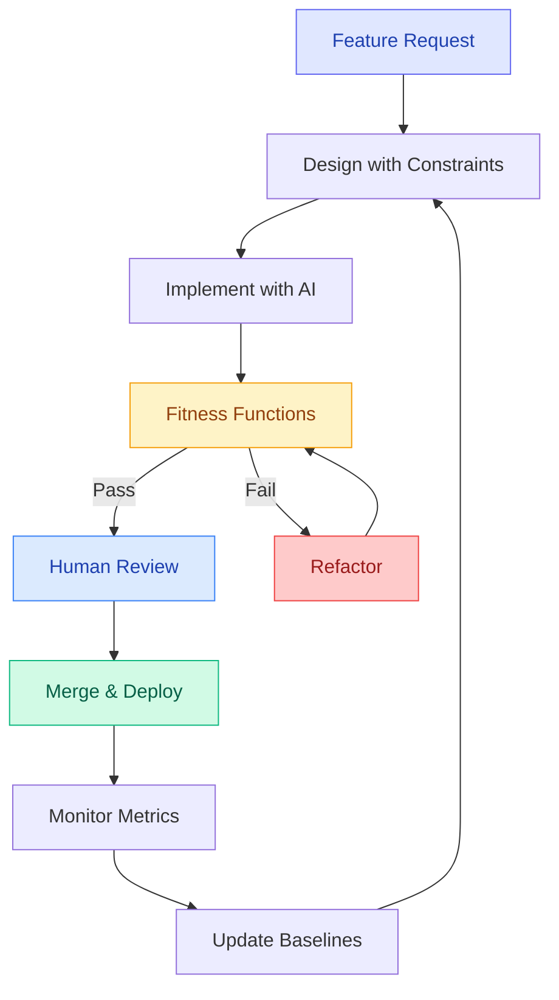

# Maintainability Prompt Packs — Evolutionary Architecture

> **Building software that lasts requires automated governance**. These prompt packs help you implement Evolutionary Architecture patterns using AI assistants — preventing architectural erosion through fitness functions, dependency hygiene, and systematic technical debt management.

---

## 🎯 Fitness Function Metrics Dashboard

  

    
📊

    
Complexity

  

  
≤10

  
Cyclomatic complexity per function

  

    

  

  
✅ 100% functions compliant

  

    
📦

    
Dependencies

  

  
≤90d

  
Dependency freshness rule

  

    

  

  
⚠️ 85% packages current

  

    
🧪

    
Coverage

  

  
≥80%

  
Test coverage threshold

  

    

  

  
✅ 92% coverage achieved

  

    
⚡

    
Performance

  

  
&lt;200ms

  
p95 latency threshold

  

    

  

  
✅ 156ms average p95

  

    
🏆

    
Architecture Health Score

    
89%

    
Based on 4 fitness function metrics

    

      

        
157

        
Functions Analyzed

      

      

        
34

        
Dependencies Tracked

      

      

        
2,847

        
Lines Covered

      

      

        
12

        
Endpoints Monitored

      

    

  

---

## 🏗️ What is Evolutionary Architecture?

**Traditional approach**: Architecture degrades over time
- ❌ Complexity increases unchecked
- ❌ Dependencies age and accumulate CVEs
- ❌ Tests become flaky and ignored
- ❌ Performance slowly degrades

**Evolutionary approach**: Architecture protected by **automated fitness functions**
- ✅ Complexity monitored per-function (≤10)
- ✅ Dependencies auto-updated (≤90 days)
- ✅ Coverage enforced in CI/CD (≥80%)
- ✅ Performance baselines tracked (p95 <200ms)

**Key insight**: Without automation, quality standards exist only in reviewers' heads. With fitness functions, standards are enforced in CI/CD before merge.

---

## 📚 Maintainability Prompt Packs

  

    
📊

    

      <h3 style="margin: 0 0 12px 0; font-size: 24px; color: #111827;"><a href="./fitness-functions" style="color: #6366f1; text-decoration: none;">Fitness Functions</a></h3>
      
Automated quality gates for complexity, dependencies, coverage, and performance

      

        Complexity ≤10
        Deps ≤90 days
        Coverage ≥80%
        p95 &lt;200ms
      

      

        <strong>What you'll build:</strong>
        <ul style="margin: 8px 0; padding-left: 20px;">
          <li>TypeScript complexity analyzer (ts-morph)</li>
          <li>Dependency freshness checker</li>
          <li>Coverage baseline enforcement</li>
          <li>Performance regression detection</li>
          <li>GitHub Actions CI/CD integration</li>
        </ul>
      

      <a href="/docs/workshop/part4-fitness-functions" style="display: inline-block; margin-top: 12px; color: #6366f1; text-decoration: none; font-size: 14px; font-weight: 600;">
        📖 Workshop Part 4 →
      </a>
    

  

  

    
📦

    

      <h3 style="margin: 0 0 12px 0; font-size: 24px; color: #111827;"><a href="./dependency-hygiene" style="color: #ec4899; text-decoration: none;">Dependency Hygiene</a></h3>
      
The 3-month freshness rule and automated dependency updates

      

        
⚠️ Critical Insight

        
80% of breaches involve unpatched dependencies. Upgrading v1.0→v1.1 is easy; v1.0→v5.0 is a nightmare.

      

      

        <strong>What you'll build:</strong>
        <ul style="margin: 8px 0; padding-left: 20px;">
          <li>Renovate bot configuration</li>
          <li>Automated security vulnerability alerts</li>
          <li>Smart merge policies (patch auto-merge, major needs review)</li>
          <li>Dependency age dashboard</li>
        </ul>
      

      

        <strong style="color: #166534; font-size: 13px;">3-Month Rule:</strong>
         No dependency &gt;90 days behind latest version
      

    

  

  

    
🌳

    

      <h3 style="margin: 0 0 12px 0; font-size: 24px; color: #111827;"><a href="./strangler-fig" style="color: #8b5cf6; text-decoration: none;">Strangler Fig Pattern</a></h3>
      
Incremental migration from legacy to modern architecture (no big-bang rewrites)

      

        

          
0%

          
Start

        

        

          
10%

          
Testing

        

        

          
50%

          
Migration

        

        

          
100%

          
Complete

        

      

      

        <strong>The Pattern:</strong> Build new implementation alongside legacy, route traffic gradually (0%→10%→50%→100%), monitor, then decommission old code.
      

      

        <strong style="color: #991b1b; font-size: 13px;">❌ Anti-Pattern:</strong>
         Big bang rewrite (18 months, no releases, 80% failure rate)
      

    

  

  

    
⚠️

    

      <h3 style="margin: 0 0 12px 0; font-size: 24px; color: #111827;"><a href="./technical-debt" style="color: #f59e0b; text-decoration: none;">Technical Debt Management</a></h3>
      
Tracking, prioritizing, and paying down technical debt systematically

      <table style="width: 100%; border-collapse: collapse; font-size: 13px; margin-bottom: 16px;">
        <thead>
          <tr style="background: #f9fafb;">
            <th style="padding: 8px; text-align: left; border: 1px solid #e5e7eb; color: #374151;">Priority</th>
            <th style="padding: 8px; text-align: left; border: 1px solid #e5e7eb; color: #374151;">Timeline</th>
            <th style="padding: 8px; text-align: center; border: 1px solid #e5e7eb; color: #374151;">Blocks Release?</th>
          </tr>
        </thead>
        <tbody>
          <tr>
            <td style="padding: 8px; border: 1px solid #e5e7eb;">P0 Production broken</td>
            <td style="padding: 8px; border: 1px solid #e5e7eb; color: #6b7280;">24-48 hours</td>
            <td style="padding: 8px; border: 1px solid #e5e7eb; text-align: center;">✅ Yes</td>
          </tr>
          <tr style="background: #fefce8;">
            <td style="padding: 8px; border: 1px solid #e5e7eb;">P1 Feature broken</td>
            <td style="padding: 8px; border: 1px solid #e5e7eb; color: #6b7280;">1-2 weeks</td>
            <td style="padding: 8px; border: 1px solid #e5e7eb; text-align: center;">⚠️ Maybe</td>
          </tr>
          <tr>
            <td style="padding: 8px; border: 1px solid #e5e7eb;">P2 Quality issue</td>
            <td style="padding: 8px; border: 1px solid #e5e7eb; color: #6b7280;">Next sprint</td>
            <td style="padding: 8px; border: 1px solid #e5e7eb; text-align: center;">❌ No</td>
          </tr>
          <tr style="background: #f9fafb;">
            <td style="padding: 8px; border: 1px solid #e5e7eb;">P3 Nice-to-have</td>
            <td style="padding: 8px; border: 1px solid #e5e7eb; color: #6b7280;">Backlog</td>
            <td style="padding: 8px; border: 1px solid #e5e7eb; text-align: center;">❌ No</td>
          </tr>
        </tbody>
      </table>
      

        <strong>Key principle:</strong> Budget 20% of sprint capacity for debt paydown. Make debt visible in GitHub Issues with priority labels.
      

    

  

---

## 🎯 How to Use These Prompt Packs

  
1️⃣

  
Choose Pattern

  
Select fitness function, dependency hygiene, strangler fig, or tech debt

  
2️⃣

  
Customize Stack

  
Adapt for Node/Python/Java with your specific tools

  
3️⃣

  
Implement with AI

  
Use Claude, Copilot, or ChatGPT to generate code

  
4️⃣

  
Integrate CI/CD

  
Start in warning mode, establish baselines, then block merges

---

## 🔄 Evolutionary Architecture Workflow

**Key Stages**:
1. **Design with Constraints**: Define quality thresholds upfront
2. **Implement with AI**: Use prompt packs to generate code
3. **Fitness Functions**: Automated validation in CI/CD
4. **Refactor**: Fix violations before merge
5. **Monitor**: Track architectural drift post-deploy
6. **Iterate**: Tighten thresholds over time

---

## 🎓 Learning Path

**New to Evolutionary Architecture?** Start here:

1. **[Workshop Part 4: Fitness Functions](/docs/workshop/part4-fitness-functions)** — Build your first fitness function
2. **[Fitness Functions Prompt Pack](./fitness-functions)** — Implement complexity checks
3. **[Dependency Hygiene Prompt Pack](./dependency-hygiene)** — Automate updates
4. **[Framework Guide](/docs/framework)** — Understand the big picture

**Advanced Topics**:
- **[Strangler Fig Pattern](./strangler-fig)** — Migrate legacy systems safely
- **[Technical Debt Management](./technical-debt)** — Systematize refactoring
- **[SDLC Integration](/docs/sdlc/)** — Embed into development lifecycle

---

## 📖 Recommended Reading

**Books**:
- *Building Evolutionary Architectures* (Ford, Parsons, Kua) — The definitive guide
- *Release It!* (Nygard) — Stability patterns and operational excellence
- *Accelerate* (Forsgren, Humble, Kim) — DORA metrics and high-performing teams
- *Working Effectively with Legacy Code* (Feathers) — Refactoring strategies

**Tools**:
- **ts-morph** (TypeScript AST analysis) | **radon** (Python complexity) | **SonarQube** (Multi-language quality)
- **Renovate** (Dependency automation) | **autocannon** (Performance testing) | **CodeQL** (Security scanning)

---

## 🔗 Related Resources

- **[OWASP Prompt Packs](/docs/prompts/owasp/)** — Security-first development
- **[AI Agent Guides](/docs/agents/)** — Claude, Copilot, ChatGPT integration
- **[Workshop Series](/docs/workshop/)** — Hands-on training modules
- **[SDLC Framework](/docs/sdlc/)** — End-to-end secure development
- **[Framework Guide](/docs/framework)** — Complete methodology

---

  
🚀

  
Ready to Prevent Architectural Erosion?

  
Pick a prompt pack above and start implementing automated governance in your CI/CD pipeline. Remember: <strong>Architecture is not a phase, it's continuous validation.</strong>

  <a href="./fitness-functions" style="display: inline-block; background: white; color: #667eea; padding: 16px 32px; border-radius: 8px; font-weight: 700; text-decoration: none; font-size: 16px; box-shadow: 0 4px 12px rgba(0, 0, 0, 0.2);">
    Start with Fitness Functions →
  </a>

