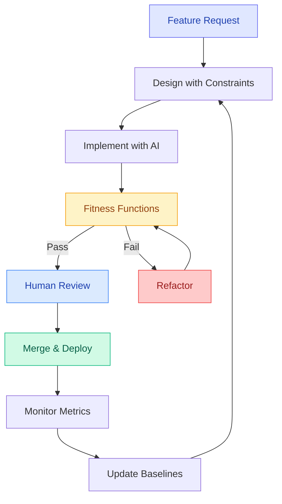

# Maintainability Prompt Packs — Evolutionary Architecture

> **Building software that lasts requires automated governance**. These prompt packs help you implement Evolutionary Architecture patterns using AI assistants — preventing architectural erosion through fitness functions, dependency hygiene, and systematic technical debt management.

---

## 🎯 Fitness Function Metrics Dashboard

  

    
📊

    
Complexity

  

  
≤10

  
Cyclomatic complexity per function

  

    

  

  
✅ 100% functions compliant

  

    
📦

    
Dependencies

  

  
≤90d

  
Dependency freshness rule

  

    

  

  
⚠️ 85% packages current

  

    
🧪

    
Coverage

  

  
≥80%

  
Test coverage threshold

  

    

  

  
✅ 92% coverage achieved

  

    
⚡

    
Performance

  

  
&lt;200ms

  
p95 latency threshold

  

    

  

  
✅ 156ms average p95

  

    
🏆

    
Architecture Health Score

    
89%

    
Based on 4 fitness function metrics

    

      

        
157

        
Functions Analyzed

      

      

        
34

        
Dependencies Tracked

      

      

        
2,847

        
Lines Covered

      

      

        
12

        
Endpoints Monitored

      

    

  

---

## 🏗️ What is Evolutionary Architecture?

**Traditional approach**: Architecture degrades over time
- ❌ Complexity increases unchecked
- ❌ Dependencies age and accumulate CVEs
- ❌ Tests become flaky and ignored
- ❌ Performance slowly degrades

**Evolutionary approach**: Architecture protected by **automated fitness functions**
- ✅ Complexity monitored per-function (≤10)
- ✅ Dependencies auto-updated (≤90 days)
- ✅ Coverage enforced in CI/CD (≥80%)
- ✅ Performance baselines tracked (p95 <200ms)

**Key insight**: Without automation, quality standards exist only in reviewers' heads. With fitness functions, standards are enforced in CI/CD before merge.

---

## 📚 Maintainability Prompt Packs

### Core Principles
| Pattern | Focus | Key Metric | Use Case |
|---------|-------|------------|----------|
| **[🧩 Complexity Reduction](./complexity-reduction)** | Simplifying complex code | Cyclomatic complexity ≤10 per function | Refactoring nested logic, Extract Method pattern, Strategy pattern |
| **[♻️ DRY Principle](./dry-principle)** | Eliminating duplication | Code duplication <3% | Extract reusable functions, centralize constants, abstract patterns |
| **[🎯 Single Responsibility](./single-responsibility)** | One function, one purpose | One reason to change per module | Layered architecture, separation of concerns, focused functions |

### Evolutionary Architecture
| Pattern | Focus | Key Metric | Use Case |
|---------|-------|------------|----------|
| **[📊 Fitness Functions](./fitness-functions)** | Automated quality gates | Complexity ≤10, Coverage ≥80%, Deps <90d, p95 <200ms | CI/CD gates, pre-commit hooks, code quality enforcement |
| **[📦 Dependency Hygiene](./dependency-hygiene)** | 3-month freshness rule | All packages <90 days old | Renovate automation, security patching, version management |
| **[🌳 Strangler Fig Pattern](./strangler-fig)** | Incremental legacy migration | Traffic routing 0%→100% | Avoiding big-bang rewrites, safe modernization |
| **[⚠️ Technical Debt Management](./technical-debt)** | Systematic refactoring | 20% sprint capacity for paydown | Backlog prioritization, debt tracking, quality improvement |

**Quick Start**: New to maintainability? Start with **[Complexity Reduction](./complexity-reduction)** and **[DRY Principle](./dry-principle)** to improve existing code, then implement **[Fitness Functions](./fitness-functions)** to prevent future regressions.

---

## 🎯 How to Use These Prompt Packs

  
1️⃣

  
Choose Pattern

  
Start with core principles (complexity, DRY, SRP) or evolutionary patterns (fitness functions, dependency hygiene)

  
2️⃣

  
Customize Stack

  
Adapt for Node/Python/Java with your specific tools

  
3️⃣

  
Implement with AI

  
Use Claude, Copilot, or ChatGPT to generate code

  
4️⃣

  
Integrate CI/CD

  
Start in warning mode, establish baselines, then block merges

---

## 🔄 Evolutionary Architecture Workflow

**Key Stages**:
1. **Design with Constraints**: Define quality thresholds upfront
2. **Implement with AI**: Use prompt packs to generate code
3. **Fitness Functions**: Automated validation in CI/CD
4. **Refactor**: Fix violations before merge
5. **Monitor**: Track architectural drift post-deploy
6. **Iterate**: Tighten thresholds over time

---

## 🎓 Learning Path

**New to Evolutionary Architecture?** Recommended sequence:

1. **[Workshop Part 4: Fitness Functions](/docs/workshop/part4-fitness-functions)** — Build your first fitness function
2. **[Fitness Functions](./fitness-functions)** → **[Dependency Hygiene](./dependency-hygiene)** — Start with quality gates and automation
3. **[Framework Guide](/docs/framework)** — See how maintainability integrates with security and SDLC

**Advanced**: **[Strangler Fig Pattern](./strangler-fig)** (legacy migration) · **[Technical Debt Management](./technical-debt)** (systematic refactoring) · **[SDLC Integration](/docs/sdlc/)** (full lifecycle)

---

## 📖 Recommended Reading

**Books**:
- *Building Evolutionary Architectures* (Ford, Parsons, Kua) — The definitive guide
- *Release It!* (Nygard) — Stability patterns and operational excellence
- *Accelerate* (Forsgren, Humble, Kim) — DORA metrics and high-performing teams
- *Working Effectively with Legacy Code* (Feathers) — Refactoring strategies

**Tools**:
- **ts-morph** (TypeScript AST analysis) | **radon** (Python complexity) | **SonarQube** (Multi-language quality)
- **Renovate** (Dependency automation) | **autocannon** (Performance testing) | **CodeQL** (Security scanning)

---

## 🔗 Related Resources

- **[STRIDE Threat Modeling](/docs/prompts/threat-modeling/)** — Design-phase security analysis
- **[OWASP Prompt Packs](/docs/prompts/owasp/)** — Security-first development
- **[AI Agent Guides](/docs/agents/)** — Claude, Copilot, ChatGPT integration
- **[Workshop Series](/docs/workshop/)** — Hands-on training modules
- **[SDLC Framework](/docs/sdlc/)** — End-to-end secure development
- **[Framework Guide](/docs/framework)** — Complete methodology

---

  
🚀

  
Ready to Prevent Architectural Erosion?

  
Pick a prompt pack above and start implementing automated governance in your CI/CD pipeline. Remember: <strong style="color: #818cf8;">Architecture is not a phase, it's continuous validation.</strong>

  <a href="./fitness-functions" style="display: inline-block; background: linear-gradient(135deg, #4f46e5 0%, #6366f1 100%); color: #f1f5f9; padding: 16px 32px; border-radius: 8px; font-weight: 700; text-decoration: none; font-size: 16px; box-shadow: 0 4px 12px rgba(79, 70, 229, 0.3);">
    Start with Fitness Functions →
  </a>

