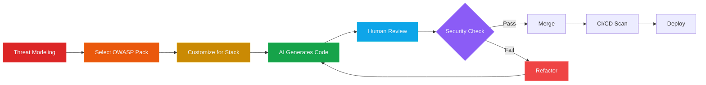

# OWASP Top 10 (2021) — Security-First Prompt Packs

> **AI-powered secure development** starts with security-first prompts. This collection provides ready-to-use prompt packs for each OWASP Top 10 category, designed for Claude Code, GitHub Copilot, and ChatGPT.

---

## 🎯 OWASP Top 10 Security Coverage Dashboard

<div style="display: grid; grid-template-columns: repeat(auto-fit, minmax(240px, 1fr)); gap: 20px; margin: 32px 0;">

<div style="background: linear-gradient(135deg, #dc2626 0%, #ef4444 100%); border-radius: 16px; padding: 24px; box-shadow: 0 8px 24px rgba(220, 38, 38, 0.3); border: 1px solid rgba(239, 68, 68, 0.3);">
  <div style="display: flex; align-items: center; gap: 12px; margin-bottom: 16px;">
    <div style="font-size: 32px;">🔐</div>
    <div style="color: #f1f5f9; font-size: 14px; font-weight: 600; text-transform: uppercase; letter-spacing: 1px;">Access Control</div>
  </div>
  <div style="color: #f1f5f9; font-size: 40px; font-weight: 700; margin-bottom: 8px;">#1</div>
  <div style="color: #cbd5e1; font-size: 14px; margin-bottom: 8px;">Most critical web vulnerability</div>
  <div style="color: #fca5a5; font-size: 12px;">A01 · IDOR · Privilege Escalation</div>
</div>

<div style="background: linear-gradient(135deg, #ea580c 0%, #f97316 100%); border-radius: 16px; padding: 24px; box-shadow: 0 8px 24px rgba(234, 88, 12, 0.3); border: 1px solid rgba(249, 115, 22, 0.3);">
  <div style="display: flex; align-items: center; gap: 12px; margin-bottom: 16px;">
    <div style="font-size: 32px;">🔒</div>
    <div style="color: #f1f5f9; font-size: 14px; font-weight: 600; text-transform: uppercase; letter-spacing: 1px;">Cryptography</div>
  </div>
  <div style="color: #f1f5f9; font-size: 40px; font-weight: 700; margin-bottom: 8px;">#2</div>
  <div style="color: #cbd5e1; font-size: 14px; margin-bottom: 8px;">Password & data encryption</div>
  <div style="color: #fdba74; font-size: 12px;">A02 · bcrypt · AES-256-GCM</div>
</div>

<div style="background: linear-gradient(135deg, #ca8a04 0%, #eab308 100%); border-radius: 16px; padding: 24px; box-shadow: 0 8px 24px rgba(202, 138, 4, 0.3); border: 1px solid rgba(234, 179, 8, 0.3);">
  <div style="display: flex; align-items: center; gap: 12px; margin-bottom: 16px;">
    <div style="font-size: 32px;">💉</div>
    <div style="color: #f1f5f9; font-size: 14px; font-weight: 600; text-transform: uppercase; letter-spacing: 1px;">Injection</div>
  </div>
  <div style="color: #f1f5f9; font-size: 40px; font-weight: 700; margin-bottom: 8px;">#3</div>
  <div style="color: #cbd5e1; font-size: 14px; margin-bottom: 8px;">SQL, NoSQL, command injection</div>
  <div style="color: #fde047; font-size: 12px;">A03 · Parameterized Queries</div>
</div>

<div style="background: linear-gradient(135deg, #16a34a 0%, #22c55e 100%); border-radius: 16px; padding: 24px; box-shadow: 0 8px 24px rgba(22, 163, 74, 0.3); border: 1px solid rgba(34, 197, 94, 0.3);">
  <div style="display: flex; align-items: center; gap: 12px; margin-bottom: 16px;">
    <div style="font-size: 32px;">✅</div>
    <div style="color: #f1f5f9; font-size: 14px; font-weight: 600; text-transform: uppercase; letter-spacing: 1px;">Coverage</div>
  </div>
  <div style="color: #f1f5f9; font-size: 40px; font-weight: 700; margin-bottom: 8px;">10/10</div>
  <div style="color: #cbd5e1; font-size: 14px; margin-bottom: 8px;">Complete OWASP coverage</div>
  <div style="color: #86efac; font-size: 12px;">All categories · Ready to use</div>
</div>

</div>

<div style="background: linear-gradient(135deg, #1e293b 0%, #334155 100%); border-radius: 16px; padding: 32px; margin: 32px 0; box-shadow: 0 8px 32px rgba(15, 23, 42, 0.5); border: 1px solid rgba(100, 116, 139, 0.3);">
  <div style="text-align: center; color: #f1f5f9;">
    <div style="font-size: 48px; margin-bottom: 16px;">🛡️</div>
    <div style="font-size: 28px; font-weight: 700; margin-bottom: 12px;">Security-First AI Development</div>
    <div style="font-size: 16px; color: #cbd5e1; margin-bottom: 24px;">Every prompt pack includes Role → Context → Requirements → Task → Checklist</div>
    <div style="display: flex; justify-content: center; gap: 32px; flex-wrap: wrap;">
      <div>
        <div style="font-size: 24px; font-weight: 700; color: #ef4444;">10</div>
        <div style="font-size: 12px; color: #94a3b8; text-transform: uppercase; letter-spacing: 1px;">OWASP Categories</div>
      </div>
      <div>
        <div style="font-size: 24px; font-weight: 700; color: #f97316;">3</div>
        <div style="font-size: 12px; color: #94a3b8; text-transform: uppercase; letter-spacing: 1px;">AI Platforms</div>
      </div>
      <div>
        <div style="font-size: 24px; font-weight: 700; color: #eab308;">5</div>
        <div style="font-size: 12px; color: #94a3b8; text-transform: uppercase; letter-spacing: 1px;">Components/Pack</div>
      </div>
      <div>
        <div style="font-size: 24px; font-weight: 700; color: #22c55e;">100%</div>
        <div style="font-size: 12px; color: #94a3b8; text-transform: uppercase; letter-spacing: 1px;">Human Review</div>
      </div>
    </div>
  </div>
</div>

---

## 🎯 How to Use These Prompt Packs

<div style="display: grid; grid-template-columns: repeat(auto-fit, minmax(200px, 1fr)); gap: 20px; margin: 32px 0;">

<div style="text-align: center; padding: 24px; background: linear-gradient(135deg, #dc2626 0%, #ef4444 100%); border-radius: 12px; color: #f1f5f9; border: 1px solid rgba(239, 68, 68, 0.3);">
  <div style="font-size: 48px; margin-bottom: 12px;">1️⃣</div>
  <div style="font-size: 18px; font-weight: 700; margin-bottom: 8px;">Select Category</div>
  <div style="font-size: 14px; color: #cbd5e1;">Choose OWASP category for your security work</div>
</div>

<div style="text-align: center; padding: 24px; background: linear-gradient(135deg, #ea580c 0%, #f97316 100%); border-radius: 12px; color: #f1f5f9; border: 1px solid rgba(249, 115, 22, 0.3);">
  <div style="font-size: 48px; margin-bottom: 12px;">2️⃣</div>
  <div style="font-size: 18px; font-weight: 700; margin-bottom: 8px;">Customize Context</div>
  <div style="font-size: 14px; color: #cbd5e1;">Adapt for your tech stack and constraints</div>
</div>

<div style="text-align: center; padding: 24px; background: linear-gradient(135deg, #ca8a04 0%, #eab308 100%); border-radius: 12px; color: #f1f5f9; border: 1px solid rgba(234, 179, 8, 0.3);">
  <div style="font-size: 48px; margin-bottom: 12px;">3️⃣</div>
  <div style="font-size: 18px; font-weight: 700; margin-bottom: 8px;">Generate Code</div>
  <div style="font-size: 14px; color: #cbd5e1;">Use Claude, Copilot, or ChatGPT</div>
</div>

<div style="text-align: center; padding: 24px; background: linear-gradient(135deg, #16a34a 0%, #22c55e 100%); border-radius: 12px; color: #f1f5f9; border: 1px solid rgba(34, 197, 94, 0.3);">
  <div style="font-size: 48px; margin-bottom: 12px;">4️⃣</div>
  <div style="font-size: 18px; font-weight: 700; margin-bottom: 8px;">Human Review</div>
  <div style="font-size: 14px; color: #cbd5e1;">Validate with provided checklist</div>
</div>

</div>

---

## 📚 OWASP Top 10 (2021) Prompt Packs

| Category | Focus | Common Vulnerability | Secure Pattern |
|----------|-------|---------------------|----------------|
| **[A01: Broken Access Control](A01_broken_access_control)** | RBAC/ABAC authorization, IDOR prevention | Missing authorization, horizontal/vertical privilege escalation | Deny-by-default with explicit role and ownership validation |
| **[A02: Cryptographic Failures](A02_crypto_failures)** | Password hashing, encryption at rest | Plain text passwords, weak hashing (MD5, SHA-1), hardcoded keys | bcrypt/Argon2 for passwords, AES-256-GCM for data |
| **[A03: Injection](A03_injection)** | SQL, NoSQL, command injection prevention | String concatenation in queries, unsanitized input | Parameterized queries, input validation with allowlist |
| **[A04: Insecure Design](A04_insecure_design)** | Threat modeling, secure architecture | Missing rate limiting, business logic bypasses | Threat model first, apply security patterns |
| **[A05: Security Misconfiguration](A05_security_misconfig)** | Security headers, CORS policies | Missing CSP/HSTS, overly permissive CORS, debug enabled | Secure defaults, principle of least privilege |
| **[A06: Vulnerable Components](A06_vuln_outdated)** | Dependency scanning, supply chain security | Outdated dependencies with CVEs, no SCA in CI | Lock files, automated scanning, 3-month update rule |
| **[A07: Authentication Failures](A07_authn_failures)** | Password policies, session management, MFA | Weak passwords, session fixation, missing MFA | bcrypt + high cost factor, rate limiting, MFA |
| **[A08: Integrity Failures](A08_integrity_failures)** | CI/CD security, code signing | Unsigned artifacts, compromised build pipeline | Signed commits, SLSA framework, hash verification |
| **[A09: Logging/Monitoring Failures](A09_logging_monitoring)** | Structured logging, PII redaction | No security event logging, PII in logs | Structured logs (JSON), PII redaction, alerting |
| **[A10: SSRF](A10_ssrf)** | URL validation, metadata protection | Unvalidated user URLs, access to cloud metadata | URL allowlist, deny private IPs, validate schemes |

**Quick Start**: New to OWASP? Start with **[A03: Injection](A03_injection)** (most common), then **[A01: Broken Access Control](A01_broken_access_control)** (most critical), followed by **[A07: Authentication Failures](A07_authn_failures)** (essential for login systems).

---

## 🔄 Security-First Development Workflow



**Key Stages**:
1. **Threat Modeling**: Identify OWASP categories that apply to your feature (STRIDE analysis)
2. **Select Pack**: Choose relevant prompt pack (A01-A10)
3. **Customize**: Adapt Context section for your tech stack (Node/Python/Java, etc.)
4. **Generate**: Use AI assistant (Claude/Copilot/ChatGPT) to generate secure code
5. **Review**: Apply human validation using provided checklist (trust but verify)
6. **Security Check**: Ensure all requirements met, no shortcuts taken
7. **CI/CD**: Automated scans (CodeQL, Snyk) validate in pipeline
8. **Deploy**: Ship to production with confidence

---

## 🛠️ Prompt Pack Structure

Each prompt pack follows the **5-component security-first pattern**:

```markdown
1. Role: Define the security engineer persona and OWASP category
2. Context: Tech stack, constraints, threat model
3. Requirements: Specific security controls to implement
4. Task: Step-by-step implementation instructions
5. Checklist: Validation criteria for human review
```

**Why this structure works**:
- **Role** sets the security mindset for the AI
- **Context** prevents AI from making wrong assumptions about your stack
- **Requirements** embed OWASP controls directly into generated code
- **Task** provides concrete, actionable steps
- **Checklist** guides human review (trust but verify)

---

## 🎓 Learning Path

**New to OWASP?** Recommended learning path:

1. **[Workshop Part 2: Security-First Prompting](/docs/workshop/part2-security-prompting)** — Learn the 5-component pattern
2. **[Workshop Part 3: Live Remediation](/docs/workshop/part3-live-remediation)** — Fix A03 SQL injection hands-on
3. **[A03: Injection](A03_injection)** → **[A01: Broken Access Control](A01_broken_access_control)** → **[A07: Authentication Failures](A07_authn_failures)**

**Advanced**: **[A04: Insecure Design](A04_insecure_design)** (threat modeling) · **[A08: Integrity Failures](A08_integrity_failures)** (CI/CD security) · **[Framework Guide](/docs/framework)** (STRIDE with LLMs)

---

## 💡 Customizing Prompt Packs for Your Stack

### Example: Adapting A03 for Python/Django

Original (Node/TypeScript):
```markdown
Context:
- Node 18 + TypeScript
- PostgreSQL using `pg` library
- Use parameterized queries with $1, $2 placeholders
```

Adapted (Python/Django):
```markdown
Context:
- Python 3.11 + Django 4.2
- PostgreSQL using Django ORM
- Use QuerySet methods (filter, exclude) — never raw SQL with string formatting
- If raw SQL required, use params argument
```

### Example: Adding Domain-Specific Constraints

For HIPAA-compliant healthcare app:
```markdown
Additional Requirements:
- PHI (Protected Health Information) must be encrypted at rest (AES-256-GCM)
- All PHI access must be logged to audit table with user ID, timestamp, action
- MRN format validation: ^\d{3}-\d{2}-\d{4}$
- Break-glass emergency access workflow required
```

---

## 🔄 Keeping Prompts Up to Date

OWASP releases a new Top 10 every 3-4 years. When a new version is published:

1. **Review the updated categories** — some may be merged/renamed/replaced
2. **Update prompt pack titles** to reference new OWASP year
3. **Add new categories** if introduced
4. **Deprecate removed categories** but keep for historical reference
5. **Update secure patterns** based on new attack vectors

**Current Version**: OWASP Top 10 (2021)
**Expected Next Release**: 2024/2025

---

## 📦 Downloading for Offline Use

```bash
# Clone the repository
git clone https://github.com/AliceNN-ucdenver/MaintainabilityAI.git
cd MaintainabilityAI

# Access all prompt packs
cd prompts/owasp

# Copy a prompt to clipboard (macOS)
cat A03_injection.md | pbcopy

# Copy a prompt to clipboard (Linux)
cat A03_injection.md | xclip -selection clipboard

# Copy a prompt to clipboard (Windows PowerShell)
Get-Content A03_injection.md | Set-Clipboard
```

---

## 🤝 Contributing

Found a security issue in a prompt pack? Have a better secure pattern?

1. **Open an issue** describing the security concern
2. **Submit a PR** with the fix and explanation
3. **Include test cases** demonstrating the vulnerability
4. **Reference OWASP documentation** supporting the change

**Please follow responsible disclosure** — don't include active exploit code.

---

## 📖 Additional Resources

- **[OWASP Top 10 Official Site](https://owasp.org/Top10/)** — Full documentation
- **[OWASP Cheat Sheet Series](https://cheatsheetseries.owasp.org/)** — Implementation guides
- **[Workshop Series](/docs/workshop/)** — 8-part hands-on training
- **[SDLC Integration](/docs/sdlc/)** — Embedding security in development lifecycle
- **[Framework Guide](/docs/framework)** — Evolutionary architecture + security

---

<div style="background: linear-gradient(135deg, #1e293b 0%, #334155 100%); border-radius: 16px; padding: 40px; text-align: center; color: #f1f5f9; margin: 40px 0; border: 1px solid rgba(100, 116, 139, 0.3);">
  <div style="font-size: 56px; margin-bottom: 16px;">🚀</div>
  <div style="font-size: 28px; font-weight: 700; margin-bottom: 16px;">Ready to Build Secure Software with AI?</div>
  <div style="font-size: 16px; color: #cbd5e1; margin-bottom: 32px; max-width: 600px; margin-left: auto; margin-right: auto;">Pick an OWASP category above and start generating secure code with your AI assistant. Remember: <strong style="color: #ef4444;">AI generates, humans validate.</strong></div>
  <div style="display: flex; justify-content: center; gap: 16px; flex-wrap: wrap;">
    <a href="A03_injection" style="display: inline-block; background: linear-gradient(135deg, #dc2626 0%, #ef4444 100%); color: #f1f5f9; padding: 16px 32px; border-radius: 8px; font-weight: 700; text-decoration: none; font-size: 16px; box-shadow: 0 4px 12px rgba(220, 38, 38, 0.3);">
      Start with A03: Injection →
    </a>
    <a href="/docs/framework" style="display: inline-block; background: linear-gradient(135deg, #4f46e5 0%, #6366f1 100%); color: #f1f5f9; padding: 16px 32px; border-radius: 8px; font-weight: 700; text-decoration: none; font-size: 16px; box-shadow: 0 4px 12px rgba(79, 70, 229, 0.3);">
      View Full Framework →
    </a>
  </div>
</div>
