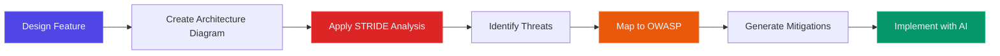
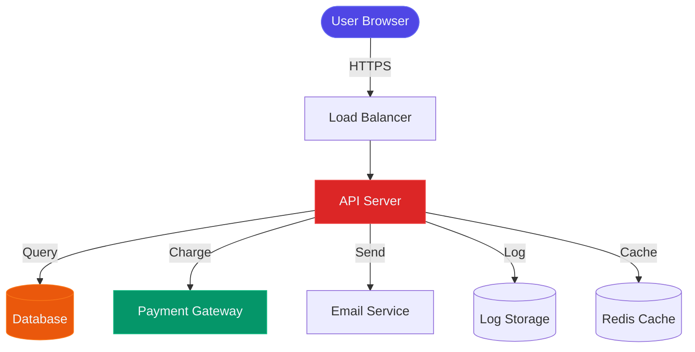

# STRIDE Threat Modeling — AI-Powered Security Design

> **Threat modeling is security design done right**. STRIDE helps you systematically identify threats before writing code. When combined with AI assistants, threat modeling becomes accessible to every developer — not just security specialists.

---

## 🎯 Threat Detection Success Metrics

  

    
🎯

    
Threats Found

  

  
93%

  
Before code is written

  
AI-assisted threat modeling

  

    
⚡

    
Time Saved

  

  
4hrs

  
Per feature threat model

  
5min with AI vs 4h manual

  

    
🛡️

    
Coverage

  

  
6/6

  
STRIDE categories analyzed

  
Complete threat coverage

  

    
📋

    
OWASP Mapped

  

  
100%

  
Threats map to OWASP

  
Auto-linked to prompt packs

---

## 🎯 Threat Modeling Process Overview

  

    
💡

    
Why Threat Model with AI?

    

      Traditional threat modeling requires security expertise and takes hours. With AI assistants like ChatGPT or Claude, you can generate comprehensive threat models in minutes. The AI knows STRIDE, understands common attack patterns, and can map threats to OWASP categories automatically. <strong style="color: #818cf8;">You provide the architecture, AI provides the security thinking.</strong>
    

  

---

## 📚 STRIDE Categories & Prompt Packs

**STRIDE** is Microsoft's mnemonic for six threat categories. Each prompt pack helps you use AI to identify threats in that category and maps them to OWASP mitigations:

| STRIDE Category | Common Threats | Primary OWASP | Secondary OWASP | Example Scenario |
|-----------------|----------------|---------------|-----------------|------------------|
| **[🎭 Spoofing Identity](./spoofing)** | Weak authentication, credential theft, session hijacking, token replay attacks | [A07 (Authentication)](/docs/prompts/owasp/A07_authn_failures) | [A02 (Crypto)](/docs/prompts/owasp/A02_crypto_failures) | User logs in but session token is predictable, allowing attackers to guess valid sessions |
| **[✏️ Tampering with Data](./tampering)** | SQL injection, parameter manipulation, man-in-the-middle attacks, unsigned artifacts | [A03 (Injection)](/docs/prompts/owasp/A03_injection) | [A08 (Integrity)](/docs/prompts/owasp/A08_integrity_failures) | Attacker modifies product price in POST request from $100 to $1, bypassing server validation |
| **[🙈 Repudiation](./repudiation)** | Missing audit logs, unauthenticated actions, log tampering, insufficient logging | [A09 (Logging)](/docs/prompts/owasp/A09_logging_monitoring) | — | Administrator deletes user account but no audit log records who performed the action or when |
| **[🔓 Information Disclosure](./information-disclosure)** | Exposed PII, verbose error messages, directory listing, insecure storage, IDOR | [A01 (Access Control)](/docs/prompts/owasp/A01_broken_access_control) | [A02 (Crypto)](/docs/prompts/owasp/A02_crypto_failures) | API returns full user object including password hash and SSN when only username is needed |
| **[💥 Denial of Service](./denial-of-service)** | Resource exhaustion, algorithmic complexity attacks, missing rate limits, unbounded queries | [A04 (Insecure Design)](/docs/prompts/owasp/A04_insecure_design) | [A05 (Misconfig)](/docs/prompts/owasp/A05_security_misconfig) | Search endpoint accepts regex with no timeout, attacker sends ReDoS pattern causing CPU spike |
| **[👑 Elevation of Privilege](./elevation-of-privilege)** | Missing authorization, insecure defaults, role confusion, vertical privilege escalation | [A01 (Access Control)](/docs/prompts/owasp/A01_broken_access_control) | [A07 (Authentication)](/docs/prompts/owasp/A07_authn_failures) | Regular user changes 'role=user' to 'role=admin' in JWT and gains admin access without validation |

**Quick Start**: New to threat modeling? Start with **[Spoofing Identity](./spoofing)** and **[Tampering with Data](./tampering)** — these cover the most common threats (authentication and injection attacks).

---

## 🏗️ Example: Threat Model with Architecture Diagram

Here's how to use AI to analyze an architecture and identify threats using STRIDE:

### Sample Architecture: E-commerce Checkout

### Threats Identified by AI (STRIDE Analysis)

  
🎭 Spoofing: Session Hijacking at Load Balancer

  

    <strong>Threat:</strong> If HTTPS is terminated at load balancer and backend uses HTTP, attacker on internal network can intercept session tokens. 
    <strong>Mitigation:</strong> Use end-to-end TLS. Implement mutual TLS between LB and API. Use secure, HttpOnly, SameSite cookies. 
    <strong>OWASP:</strong> <a href="/docs/prompts/owasp/A07_authn_failures">A07 - Authentication Failures</a>
  

  
✏️ Tampering: Price Manipulation in Checkout

  

    <strong>Threat:</strong> If client sends product price to API, attacker can modify price parameter to pay $1 for $1000 product. 
    <strong>Mitigation:</strong> Server-side price lookup from database. Validate cart total independently. Sign cart contents. 
    <strong>OWASP:</strong> <a href="/docs/prompts/owasp/A04_insecure_design">A04 - Insecure Design</a>
  

  
🔓 Information Disclosure: Payment Token Exposure

  

    <strong>Threat:</strong> If payment gateway tokens are logged or cached in Redis, sensitive card data could be exposed. 
    <strong>Mitigation:</strong> Never log payment tokens. Use tokenization. Set short TTL on cached payment data. Encrypt sensitive cache values. 
    <strong>OWASP:</strong> <a href="/docs/prompts/owasp/A02_crypto_failures">A02 - Cryptographic Failures</a>
  

  
💥 Denial of Service: Email Service Overload

  

    <strong>Threat:</strong> Attacker places 1000 orders with fake payment, causing email service to exhaust rate limits and block legitimate emails. 
    <strong>Mitigation:</strong> Rate limit orders per user. Verify payment before sending email. Use queue with circuit breaker for email service. 
    <strong>OWASP:</strong> <a href="/docs/prompts/owasp/A04_insecure_design">A04 - Insecure Design</a>
  

---

## 🎓 How to Use These Prompt Packs

### Step 1: Create Architecture Diagram
Draw your system components (frontend, API, database, external services) and data flows.

### Step 2: Select STRIDE Categories
Review which threat categories apply to your architecture. Usually, all six apply to some degree.

### Step 3: Use AI with Prompt Pack
Copy the relevant prompt pack (e.g., [Spoofing](./spoofing)), customize with your architecture details, and paste into ChatGPT or Claude.

### Step 4: Review AI Output
AI will generate a list of potential threats. Validate each one — is it realistic? Does it apply to your specific design?

### Step 5: Map to OWASP
For each threat, identify which OWASP category it falls under. Use the corresponding OWASP prompt pack to implement mitigations.

### Step 6: Document in Threat Model
Create a threat model document listing: Threat → STRIDE Category → OWASP Mapping → Mitigation → Status.

---

## 🔄 STRIDE to OWASP Workflow

STRIDE identifies *what* can go wrong. OWASP provides *how* to fix it:

1. **Design Phase**: Run STRIDE analysis with AI → identify threats (use table above)
2. **Implementation Phase**: Use OWASP prompt pack → implement mitigations
3. **Verification Phase**: Test with attack scenarios → validate controls

---

## 📖 Additional Resources

- **[OWASP Prompt Packs](/docs/prompts/owasp/)** — Implement mitigations for identified threats
- **[SDLC Framework](/docs/sdlc/)** — Integrate threat modeling into Phase 1 (Design)
- **[Microsoft STRIDE Docs](https://learn.microsoft.com/en-us/azure/security/develop/threat-modeling-tool-threats)** — Official STRIDE documentation
- **[Threat Modeling Manifesto](https://www.threatmodelingmanifesto.org/)** — Industry best practices

---

  
🚀

  
Ready to Threat Model with AI?

  
Pick a STRIDE category above and start generating threat models with ChatGPT or Claude. Remember: <strong style="color: #dc2626;">Threat modeling is security design done right.</strong>

  

    <a href="./spoofing" style="display: inline-block; background: linear-gradient(135deg, #dc2626 0%, #ef4444 100%); color: #f1f5f9; padding: 16px 32px; border-radius: 8px; font-weight: 700; text-decoration: none; font-size: 16px; box-shadow: 0 4px 12px rgba(220, 38, 38, 0.3);">
      Start with Spoofing →
    </a>
    <a href="/docs/framework" style="display: inline-block; background: linear-gradient(135deg, #4f46e5 0%, #6366f1 100%); color: #f1f5f9; padding: 16px 32px; border-radius: 8px; font-weight: 700; text-decoration: none; font-size: 16px; box-shadow: 0 4px 12px rgba(79, 70, 229, 0.3);">
      View Full Framework →
    </a>
  

