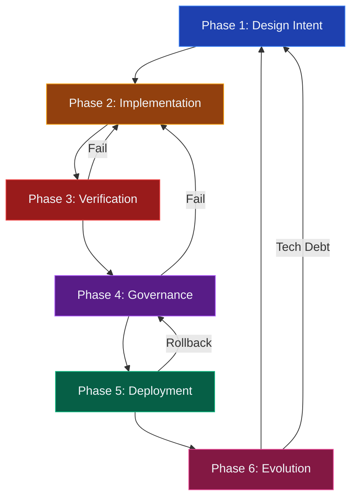
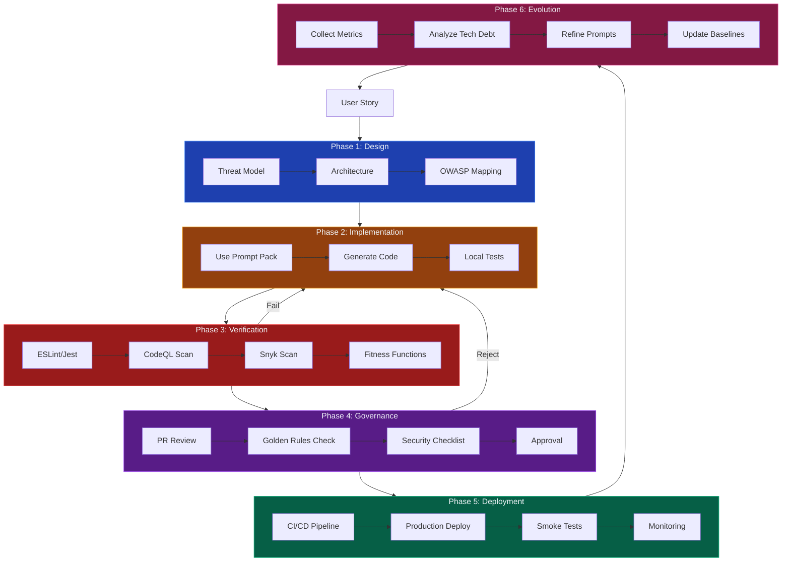
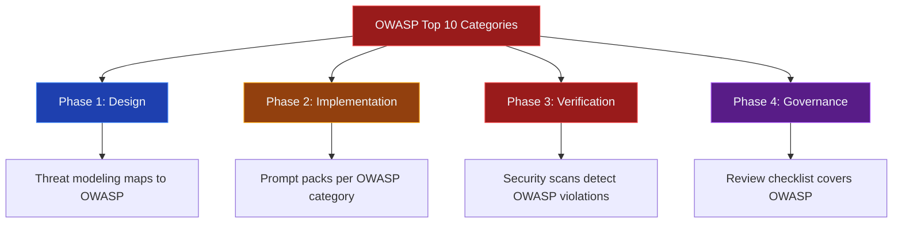
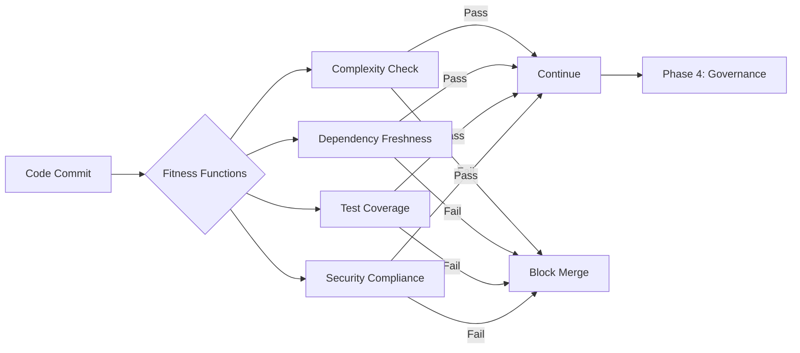
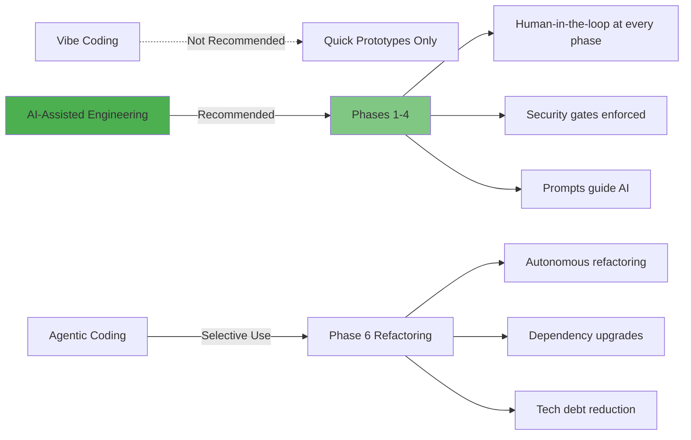
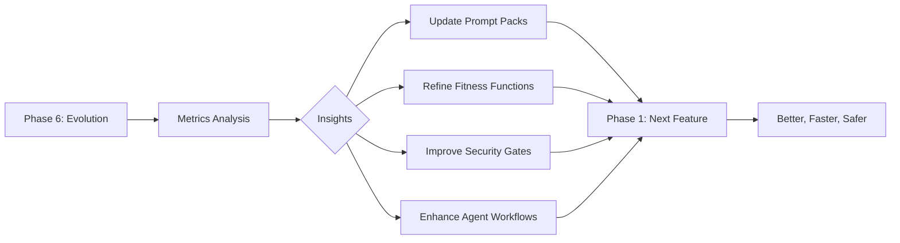

# MaintainabilityAI SDLC Framework

> **Purpose**: A comprehensive, security-first Software Development Lifecycle for AI-assisted engineering.

This framework integrates **OWASP Top 10**, **Evolutionary Architecture** fitness functions, and **multi-agent AI orchestration** into a complete development lifecycle that maintains both velocity and security.

---

## SDLC Overview

The MaintainabilityAI SDLC consists of six phases, each with specific security gates, AI integration points, and fitness function validations:

### Phase Descriptions

| Phase | Purpose | Primary Agents | Key Outputs | Security Gates |
|-------|---------|----------------|-------------|----------------|
| **[Phase 1: Design](phase1-design.md)** | Requirements, threat modeling, architecture | ChatGPT, Claude | Threat model, architecture docs, OWASP mapping | Threat coverage >95% |
| **[Phase 2: Implementation](phase2-implementation.md)** | Secure code generation with AI assistance | Copilot, Claude, ChatGPT | Implementation code, unit tests | ESLint, Jest pass |
| **[Phase 3: Verification](phase3-verification.md)** | Security scanning, testing, fitness functions | CodeQL, Snyk, Claude | Test results, scan reports | No high-severity findings |
| **[Phase 4: Governance](phase4-governance.md)** | Human review, PR approval, compliance check | Human + ChatGPT | Approval decision, audit trail | Golden Rules compliance |
| **[Phase 5: Deployment](phase5-deployment.md)** | CI/CD pipeline, production release, monitoring | GitHub Actions | Production deployment | Zero critical CVEs |
| **[Phase 6: Evolution](phase6-evolution.md)** | Metrics, iteration, technical debt, prompt refinement | Claude, ChatGPT | Metrics dashboard, improved prompts | Fitness functions trending up |

---

## Complete SDLC Flow

---

## How Prompts, Security, and Governance Fit In

### OWASP Integration Points

The OWASP Top 10 (2021) is integrated at every phase:

**Phase 1 (Design)**: Threat model identifies which OWASP categories apply
- Example: Auth feature → A07 (Authentication), A01 (Access Control)

**Phase 2 (Implementation)**: OWASP prompt packs guide secure code generation
- Use `/prompts/owasp/A07_authn_failures.md` for authentication
- Use `/prompts/owasp/A01_broken_access_control.md` for authorization

**Phase 3 (Verification)**: Security scans validate OWASP compliance
- CodeQL detects injection, XSS, access control issues
- Snyk identifies vulnerable dependencies (A06)

**Phase 4 (Governance)**: Human review verifies OWASP requirements met
- Checklist ensures all identified categories addressed
- Golden Rules enforce security-first thinking

### Fitness Functions Integration

Evolutionary Architecture fitness functions run continuously:

**Fitness Functions Applied**:

1. **Complexity Fitness Function** (Phase 3)
   - Cyclomatic complexity ≤10 per function
   - File size ≤300 lines
   - Function length ≤50 lines

2. **Dependency Freshness** (Phase 6)
   - All dependencies <3 months old
   - Zero critical CVEs
   - Security patches applied within 7 days

3. **Security Compliance** (Phase 3)
   - CodeQL: No high/critical findings
   - Snyk: No high/critical vulnerabilities
   - ESLint security rules pass

4. **Test Coverage** (Phase 3)
   - Overall coverage ≥80%
   - Security-critical paths: 100%
   - All OWASP attack vectors tested

See [/docs/maintainability/fitness-functions.md](../maintainability/fitness-functions.md) for implementation details.

---

## AI Agent Usage by Phase

**Use the AI tools available to you** — this framework works with Claude Code, GitHub Copilot, ChatGPT, or any AI assistant.

**Key principle**: Security-first prompts matter more than which AI tool you use. Any major AI assistant can generate secure code when given proper OWASP prompt packs.

### When Each Tool Excels (If You Have Multiple)

| Phase | Your Task | Best Tool | Why |
|-------|-----------|-----------|-----|
| **1: Design** | Threat modeling (STRIDE) | ChatGPT or Claude | Structured analysis and documentation |
| **2: Implementation** | Real-time coding | GitHub Copilot | Autocomplete as you type in IDE |
| **2: Implementation** | Large refactoring | Claude Code | Handles complex multi-file edits |
| **3: Verification** | Test generation | Claude Code or ChatGPT | Comprehensive test coverage |
| **4: Governance** | Code review checklist | ChatGPT or Claude | Structured validation |
| **5: Deployment** | CI/CD automation | GitHub Actions | Automated, auditable pipeline |
| **6: Evolution** | Refactoring tech debt | Claude Code | Large-scale codebase analysis |

**Remember**: The prompt pack you use (e.g., [A03_injection.md](/prompts/owasp/A03_injection.md)) is more important than the AI tool. A security-first prompt produces secure code in any AI assistant.

---

## Security Gates at Each Phase

Every phase has specific security gates that must pass:

### Phase 1: Design Gates
- [ ] Threat model covers all STRIDE categories
- [ ] OWASP categories identified for feature
- [ ] Architecture includes security controls
- [ ] Fitness functions defined

### Phase 2: Implementation Gates
- [ ] OWASP prompt packs used
- [ ] Local tests pass (ESLint, Jest)
- [ ] Code follows security patterns
- [ ] AI-assistance documented in commits

### Phase 3: Verification Gates
- [ ] CodeQL: No high/critical findings
- [ ] Snyk: No high/critical vulnerabilities
- [ ] Test coverage ≥80%
- [ ] Fitness functions pass
- [ ] Attack vector tests included

### Phase 4: Governance Gates
- [ ] Human code review completed
- [ ] Golden Rules checklist passed
- [ ] OWASP requirements validated
- [ ] AI disclosure in PR
- [ ] Security rationale documented

### Phase 5: Deployment Gates
- [ ] All Phase 3 scans re-run and pass
- [ ] Production smoke tests pass
- [ ] Monitoring configured
- [ ] Rollback plan documented

### Phase 6: Evolution Gates
- [ ] Metrics collected and analyzed
- [ ] Technical debt prioritized
- [ ] Prompts updated with learnings
- [ ] Fitness functions trending positively

---

## Workflow Examples

### Example 1: New Feature (User Authentication)

**Phase 1: Design** (2 hours)
- ChatGPT threat models authentication flow → 8 threats identified
- Maps to OWASP A07 (Authentication), A02 (Crypto), A09 (Logging)
- Claude designs architecture with security controls

**Phase 2: Implementation** (3 hours)
- Copilot implements login function using `/prompts/owasp/A07_authn_failures.md`
- Adds bcrypt hashing, rate limiting, secure sessions
- Local Jest tests pass

**Phase 3: Verification** (1 hour)
- CodeQL scan: Clean
- Snyk scan: Clean
- Fitness functions: All pass
- Claude generates comprehensive security tests

**Phase 4: Governance** (30 min)
- Human reviews code against Golden Rules
- ChatGPT validates OWASP A07 checklist
- PR approved with AI disclosure label

**Phase 5: Deployment** (15 min)
- CI/CD pipeline runs all gates
- Deploys to production
- Monitoring confirms healthy

**Phase 6: Evolution** (Ongoing)
- Collect auth metrics (login success rate, failed attempts)
- Refine A07 prompt pack based on learnings
- Add "MFA requirement" to fitness functions

**Total: 6 hours 45 minutes** (vs. estimated 16 hours manual)

### Example 2: Security Remediation (A03 Injection)

**Phase 1: Design** (30 min)
- Identify vulnerable functions: searchUsers, updateProfile, deleteAccount
- Map to OWASP A03 (Injection)
- Threat model specific injection vectors

**Phase 2: Implementation** (2 hours)
- Copilot refactors using `/prompts/owasp/A03_injection.md`
- Adds parameterized queries, Zod validation, length limits
- Parallel: 3 functions updated simultaneously

**Phase 3: Verification** (45 min)
- CodeQL detects no remaining injection vectors
- Claude generates attack vector tests (SQL injection payloads)
- All tests pass

**Phase 4: Governance** (20 min)
- Human spot-checks one function in detail
- ChatGPT validates all three against A03 checklist
- Approved

**Phase 5: Deployment** (10 min)
- Deploy with feature flag (gradual rollout)
- Monitor for errors
- Full rollout after 24 hours

**Phase 6: Evolution** (Ongoing)
- Update A03 prompt with edge cases discovered
- Add "injection prevention" fitness function to CI
- Share successful remediation pattern with team

**Total: 3 hours 45 minutes** for 3 functions

---

## Integration with Iasa Workshop Concepts

The MaintainabilityAI SDLC aligns with the [Iasa workshop](../workshop/part1-spectrum.md) spectrum:

### Vibe → Assisted → Agentic Mapping

**Vibe Coding**: Only for throwaway prototypes (not in production SDLC)

**AI-Assisted Engineering**: Primary mode for Phases 1-5
- Human defines architecture and constraints
- AI generates implementation within guardrails
- Human reviews and approves
- Example: Phase 2 implementation with Copilot

**Agentic Coding**: Limited use in Phase 6
- Well-defined refactoring tasks
- "Upgrade All The Things" kata
- Technical debt reduction
- Example: Claude autonomously migrates 50 files to new pattern

---

## Continuous Improvement Loop

The SDLC is circular, with Phase 6 feeding back to Phase 1:

**Metrics → Insights → Improvements**:

1. **Prompt Pack Iteration**
   - Track which prompts produce secure code on first try
   - Update prompts with edge cases discovered in production
   - Share successful patterns across team

2. **Fitness Function Refinement**
   - Add new checks based on vulnerabilities found
   - Adjust thresholds based on team performance
   - Remove checks that provide no value

3. **Security Gate Enhancement**
   - Add CodeQL custom queries for domain-specific risks
   - Update Snyk policies with acceptable exceptions
   - Improve ESLint security rules

4. **Agent Workflow Optimization**
   - Measure time-to-delivery per agent
   - Identify best agent for each task type
   - Refine handoff patterns between agents

---

## Quick Start Guide

### For Your First Feature

1. **Read Phase Documentation**: Start with [Phase 1: Design](phase1-design.md)

2. **Select OWASP Categories**: Which apply to your feature?
   - Authentication? → A07
   - Database queries? → A03
   - User uploads? → A08
   - Access control? → A01

3. **Choose Your Agents**:
   - Design: ChatGPT for threat modeling
   - Implementation: Copilot in VS Code
   - Verification: Claude for test generation
   - Governance: Human + ChatGPT review

4. **Use Prompt Packs**: Copy from `/prompts/owasp/[category].md`

5. **Follow Gates**: Don't skip security checks

6. **Document**: Label commits with `🤖 AI-assisted` and OWASP category

7. **Iterate**: Refine prompts based on what worked

---

## Phase-Specific Documentation

Detailed guides for each phase:

1. **[Phase 1: Design Intent](phase1-design.md)**
   - Requirements gathering
   - Threat modeling with STRIDE
   - Architecture design
   - OWASP category mapping

2. **[Phase 2: Implementation](phase2-implementation.md)**
   - Agent selection guide
   - Using OWASP prompt packs
   - Code generation with security constraints
   - Incremental development patterns

3. **[Phase 3: Verification](phase3-verification.md)**
   - Local testing (Jest, ESLint)
   - Security scanning (CodeQL, Snyk)
   - Fitness function validation
   - Attack vector testing

4. **[Phase 4: Governance](phase4-governance.md)**
   - PR review process
   - Golden Rules checklist
   - Human-in-the-loop validation
   - Merge criteria

5. **[Phase 5: Deployment](phase5-deployment.md)**
   - CI/CD pipeline configuration
   - Production deployment process
   - Monitoring and alerting
   - Rollback procedures

6. **[Phase 6: Evolution](phase6-evolution.md)**
   - Metrics collection and analysis
   - Prompt library iteration
   - Technical debt management
   - "Upgrade All The Things" kata

---

## Supporting Resources

### Framework Integration
- **[Master Framework Document](../framework.md)**: Complete integration of all concepts
- **[Maintainability Index](../maintainability/)**: Fitness functions and evolutionary architecture
- **[OWASP Prompt Packs](/prompts/owasp/)**: Security-first prompts for each category

### Agent Guides
- **[COPILOT.md](/COPILOT.md)**: GitHub Copilot integration patterns
- **[CHATGPT.md](/CHATGPT.md)**: ChatGPT usage guidelines
- **[AGENTS.md](/AGENTS.md)**: Multi-agent orchestration

### Governance
- **[Golden Rules](../governance/vibe-golden-rules.md)**: Core principles for AI-assisted development
- **[Security Workflow](../security-workflow.md)**: Defense-in-depth strategy

---

## Success Metrics

Track these metrics to measure SDLC effectiveness:

### Velocity Metrics
- **Time to Delivery**: Feature start to production (target: <5 days)
- **Cycle Time**: Implementation to merge (target: <24 hours)
- **Deployment Frequency**: Deploys per week (target: >10)

### Quality Metrics
- **Security Scan Pass Rate**: First-time pass on CodeQL/Snyk (target: >90%)
- **Test Coverage**: Overall coverage (target: >80%)
- **Defect Rate**: Production bugs per 1000 LOC (target: <5)

### Security Metrics
- **OWASP Coverage**: % of applicable categories addressed (target: 100%)
- **Vulnerability Remediation Time**: Discovery to fix (target: <7 days)
- **False Positive Rate**: Invalid security findings (target: <10%)

### Process Metrics
- **Prompt Reuse Rate**: % of work using prompt library (target: >70%)
- **Agent Effectiveness**: AI code acceptance rate (target: >85%)
- **Review Time**: Human review duration (target: <30 min)

---

## Getting Started

1. **Install Tools**
   - GitHub Copilot (VS Code extension)
   - Claude Code (VS Code extension)
   - ChatGPT Plus (for Projects feature)
   - CodeQL and Snyk (GitHub Actions)

2. **Set Up Repository**
   - Copy OWASP prompt packs to `/prompts/owasp/`
   - Configure ESLint with security rules
   - Set up Jest with coverage thresholds
   - Add CodeQL and Snyk workflows

3. **Team Training**
   - Review [Golden Rules](../governance/vibe-golden-rules.md)
   - Complete [Workshop modules](../workshop/)
   - Practice with [OWASP examples](/examples/owasp/)

4. **Start with Phase 1**
   - Pick a feature to implement
   - Follow [Phase 1: Design](phase1-design.md)
   - Use threat modeling template
   - Progress through all 6 phases

5. **Iterate and Improve**
   - Collect metrics
   - Refine prompts
   - Update fitness functions
   - Share learnings with team

---

**Ready to start? Begin with [Phase 1: Design Intent →](phase1-design.md)**
