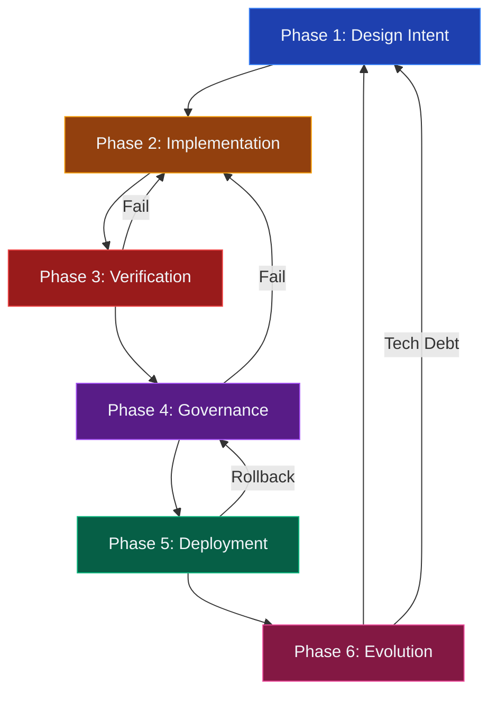

# MaintainabilityAI SDLC Framework

> **Purpose**: A comprehensive, security-first Software Development Lifecycle for AI-assisted engineering.

This framework integrates **OWASP Top 10**, **Evolutionary Architecture** fitness functions, and **multi-agent AI orchestration** into a complete development lifecycle that maintains both velocity and security.

---

## 🔄 SDLC Overview

  

    
🔄

    
6-Phase Continuous Development Cycle

    
Security gates, AI integration, and fitness functions at every phase

  

## 📊 SDLC Phases

  

    
1️⃣

    

      <h3 style="margin: 0; font-size: 22px; color: #f1f5f9;">Phase 1: Design Intent</h3>
      
Requirements & Threat Modeling

    

  

  

    <strong style="color: #f1f5f9;">Purpose:</strong> Requirements gathering, STRIDE threat modeling, architecture design, OWASP category mapping
  

  

    

      
Primary Agents

      
ChatGPT, Claude

    

    

      
Security Gate

      
Threat coverage >95%

    

  

  <a href="./phase1-design" style="display: inline-block; background: rgba(255, 255, 255, 0.15); color: #f1f5f9; padding: 10px 20px; border-radius: 8px; text-decoration: none; font-size: 14px; font-weight: 600;">
    View Phase 1 Details →
  </a>

  

    
2️⃣

    

      <h3 style="margin: 0; font-size: 22px; color: #f1f5f9;">Phase 2: Implementation</h3>
      
Secure Code Generation with AI

    

  

  

    <strong style="color: #f1f5f9;">Purpose:</strong> OWASP prompt pack usage, secure code generation, unit test creation, local validation
  

  

    

      
Primary Agents

      
Copilot, Claude

    

    

      
Security Gate

      
ESLint, Jest pass

    

  

  <a href="./phase2-implementation" style="display: inline-block; background: rgba(255, 255, 255, 0.15); color: #f1f5f9; padding: 10px 20px; border-radius: 8px; text-decoration: none; font-size: 14px; font-weight: 600;">
    View Phase 2 Details →
  </a>

  

    
3️⃣

    

      <h3 style="margin: 0; font-size: 22px; color: #f1f5f9;">Phase 3: Verification</h3>
      
Security Scanning & Testing

    

  

  

    <strong style="color: #f1f5f9;">Purpose:</strong> CodeQL/Snyk scans, fitness function validation, attack vector testing, coverage enforcement
  

  

    

      
Primary Agents

      
CodeQL, Snyk, Claude

    

    

      
Security Gate

      
No high-severity findings

    

  

  <a href="./phase3-verification" style="display: inline-block; background: rgba(255, 255, 255, 0.15); color: #f1f5f9; padding: 10px 20px; border-radius: 8px; text-decoration: none; font-size: 14px; font-weight: 600;">
    View Phase 3 Details →
  </a>

  

    
4️⃣

    

      <h3 style="margin: 0; font-size: 22px; color: #f1f5f9;">Phase 4: Governance</h3>
      
Human Review & Approval

    

  

  

    <strong style="color: #f1f5f9;">Purpose:</strong> PR review process, Golden Rules validation, OWASP checklist verification, merge approval
  

  

    

      
Primary Agents

      
Human + ChatGPT

    

    

      
Security Gate

      
Golden Rules compliance

    

  

  <a href="./phase4-governance" style="display: inline-block; background: rgba(255, 255, 255, 0.15); color: #f1f5f9; padding: 10px 20px; border-radius: 8px; text-decoration: none; font-size: 14px; font-weight: 600;">
    View Phase 4 Details →
  </a>

  

    
5️⃣

    

      <h3 style="margin: 0; font-size: 22px; color: #f1f5f9;">Phase 5: Deployment</h3>
      
CI/CD & Production Release

    

  

  

    <strong style="color: #f1f5f9;">Purpose:</strong> Automated CI/CD pipeline, production deployment, smoke tests, monitoring setup
  

  

    

      
Primary Agents

      
GitHub Actions

    

    

      
Security Gate

      
Zero critical CVEs

    

  

  <a href="./phase5-deployment" style="display: inline-block; background: rgba(255, 255, 255, 0.15); color: #f1f5f9; padding: 10px 20px; border-radius: 8px; text-decoration: none; font-size: 14px; font-weight: 600;">
    View Phase 5 Details →
  </a>

  

    
6️⃣

    

      <h3 style="margin: 0; font-size: 22px; color: #f1f5f9;">Phase 6: Evolution</h3>
      
Metrics & Continuous Improvement

    

  

  

    <strong style="color: #f1f5f9;">Purpose:</strong> Metrics analysis, technical debt management, prompt refinement, fitness function updates
  

  

    

      
Primary Agents

      
Claude, ChatGPT

    

    

      
Security Gate

      
Metrics trending up

    

  

  <a href="./phase6-evolution" style="display: inline-block; background: rgba(255, 255, 255, 0.15); color: #f1f5f9; padding: 10px 20px; border-radius: 8px; text-decoration: none; font-size: 14px; font-weight: 600;">
    View Phase 6 Details →
  </a>

---

## 🔁 Complete SDLC Flow

---

## 🔒 Security Gates Summary

  
Phase 1: Design Gates

  

    ☐ Threat model covers all STRIDE categories 
    ☐ OWASP categories identified for feature 
    ☐ Architecture includes security controls 
    ☐ Fitness functions defined
  

  
Phase 2: Implementation Gates

  

    ☐ OWASP prompt packs used 
    ☐ Local tests pass (ESLint, Jest) 
    ☐ Code follows security patterns 
    ☐ AI-assistance documented in commits
  

  
Phase 3: Verification Gates

  

    ☐ CodeQL: No high/critical findings 
    ☐ Snyk: No high/critical vulnerabilities 
    ☐ Test coverage ≥80% 
    ☐ Fitness functions pass 
    ☐ Attack vector tests included
  

  
Phase 4: Governance Gates

  

    ☐ Human code review completed 
    ☐ Golden Rules checklist passed 
    ☐ OWASP requirements validated 
    ☐ AI disclosure in PR 
    ☐ Security rationale documented
  

  
Phase 5: Deployment Gates

  

    ☐ All Phase 3 scans re-run and pass 
    ☐ Production smoke tests pass 
    ☐ Monitoring configured 
    ☐ Rollback plan documented
  

  
Phase 6: Evolution Gates

  

    ☐ Metrics collected and analyzed 
    ☐ Technical debt prioritized 
    ☐ Prompts updated with learnings 
    ☐ Fitness functions trending positively
  

---

## 🤖 AI Agent Usage by Phase

**Use the AI tools available to you** — this framework works with Claude Code, GitHub Copilot, ChatGPT, or any AI assistant.

**Key principle**: Security-first prompts matter more than which AI tool you use.

  <table style="width: 100%; border-collapse: collapse;">
    <thead>
      <tr style="background: rgba(71, 85, 105, 0.3);">
        <th style="padding: 12px; text-align: left; border: 1px solid rgba(100, 116, 139, 0.3); color: #f1f5f9;">Phase</th>
        <th style="padding: 12px; text-align: left; border: 1px solid rgba(100, 116, 139, 0.3); color: #f1f5f9;">Your Task</th>
        <th style="padding: 12px; text-align: left; border: 1px solid rgba(100, 116, 139, 0.3); color: #f1f5f9;">Best Tool</th>
        <th style="padding: 12px; text-align: left; border: 1px solid rgba(100, 116, 139, 0.3); color: #f1f5f9;">Why</th>
      </tr>
    </thead>
    <tbody>
      <tr>
        <td style="padding: 12px; border: 1px solid rgba(100, 116, 139, 0.3); color: #cbd5e1;">1: Design</td>
        <td style="padding: 12px; border: 1px solid rgba(100, 116, 139, 0.3); color: #cbd5e1;">Threat modeling (STRIDE)</td>
        <td style="padding: 12px; border: 1px solid rgba(100, 116, 139, 0.3); color: #cbd5e1;">ChatGPT or Claude</td>
        <td style="padding: 12px; border: 1px solid rgba(100, 116, 139, 0.3); color: #94a3b8;">Structured analysis and documentation</td>
      </tr>
      <tr style="background: rgba(71, 85, 105, 0.2);">
        <td style="padding: 12px; border: 1px solid rgba(100, 116, 139, 0.3); color: #cbd5e1;">2: Implement</td>
        <td style="padding: 12px; border: 1px solid rgba(100, 116, 139, 0.3); color: #cbd5e1;">Real-time coding</td>
        <td style="padding: 12px; border: 1px solid rgba(100, 116, 139, 0.3); color: #cbd5e1;">GitHub Copilot</td>
        <td style="padding: 12px; border: 1px solid rgba(100, 116, 139, 0.3); color: #94a3b8;">Autocomplete as you type in IDE</td>
      </tr>
      <tr>
        <td style="padding: 12px; border: 1px solid rgba(100, 116, 139, 0.3); color: #cbd5e1;">2: Implement</td>
        <td style="padding: 12px; border: 1px solid rgba(100, 116, 139, 0.3); color: #cbd5e1;">Large refactoring</td>
        <td style="padding: 12px; border: 1px solid rgba(100, 116, 139, 0.3); color: #cbd5e1;">Claude Code</td>
        <td style="padding: 12px; border: 1px solid rgba(100, 116, 139, 0.3); color: #94a3b8;">Handles complex multi-file edits</td>
      </tr>
      <tr style="background: rgba(71, 85, 105, 0.2);">
        <td style="padding: 12px; border: 1px solid rgba(100, 116, 139, 0.3); color: #cbd5e1;">3: Verify</td>
        <td style="padding: 12px; border: 1px solid rgba(100, 116, 139, 0.3); color: #cbd5e1;">Test generation</td>
        <td style="padding: 12px; border: 1px solid rgba(100, 116, 139, 0.3); color: #cbd5e1;">Claude Code or ChatGPT</td>
        <td style="padding: 12px; border: 1px solid rgba(100, 116, 139, 0.3); color: #94a3b8;">Comprehensive test coverage</td>
      </tr>
      <tr>
        <td style="padding: 12px; border: 1px solid rgba(100, 116, 139, 0.3); color: #cbd5e1;">4: Govern</td>
        <td style="padding: 12px; border: 1px solid rgba(100, 116, 139, 0.3); color: #cbd5e1;">Code review checklist</td>
        <td style="padding: 12px; border: 1px solid rgba(100, 116, 139, 0.3); color: #cbd5e1;">ChatGPT or Claude</td>
        <td style="padding: 12px; border: 1px solid rgba(100, 116, 139, 0.3); color: #94a3b8;">Structured validation</td>
      </tr>
      <tr style="background: rgba(71, 85, 105, 0.2);">
        <td style="padding: 12px; border: 1px solid rgba(100, 116, 139, 0.3); color: #cbd5e1;">5: Deploy</td>
        <td style="padding: 12px; border: 1px solid rgba(100, 116, 139, 0.3); color: #cbd5e1;">CI/CD automation</td>
        <td style="padding: 12px; border: 1px solid rgba(100, 116, 139, 0.3); color: #cbd5e1;">GitHub Actions</td>
        <td style="padding: 12px; border: 1px solid rgba(100, 116, 139, 0.3); color: #94a3b8;">Automated, auditable pipeline</td>
      </tr>
      <tr>
        <td style="padding: 12px; border: 1px solid rgba(100, 116, 139, 0.3); color: #cbd5e1;">6: Evolve</td>
        <td style="padding: 12px; border: 1px solid rgba(100, 116, 139, 0.3); color: #cbd5e1;">Refactoring tech debt</td>
        <td style="padding: 12px; border: 1px solid rgba(100, 116, 139, 0.3); color: #cbd5e1;">Claude Code</td>
        <td style="padding: 12px; border: 1px solid rgba(100, 116, 139, 0.3); color: #94a3b8;">Large-scale codebase analysis</td>
      </tr>
    </tbody>
  </table>

---

## 📈 Success Metrics

  
⚡

  
Velocity Metrics

  

    <strong style="color: #818cf8;">Time to Delivery:</strong> &lt;5 days 
    <strong style="color: #818cf8;">Cycle Time:</strong> &lt;24 hours 
    <strong style="color: #818cf8;">Deploy Frequency:</strong> &gt;10/week
  

  
🎯

  
Quality Metrics

  

    <strong style="color: #a78bfa;">Scan Pass Rate:</strong> &gt;90% 
    <strong style="color: #a78bfa;">Test Coverage:</strong> &gt;80% 
    <strong style="color: #a78bfa;">Defect Rate:</strong> &lt;5/1000 LOC
  

  
🔒

  
Security Metrics

  

    <strong style="color: #22d3ee;">OWASP Coverage:</strong> 100% 
    <strong style="color: #22d3ee;">Remediation Time:</strong> &lt;7 days 
    <strong style="color: #22d3ee;">False Positives:</strong> &lt;10%
  

  
📊

  
Process Metrics

  

    <strong style="color: #5eead4;">Prompt Reuse:</strong> &gt;70% 
    <strong style="color: #5eead4;">Agent Effectiveness:</strong> &gt;85% 
    <strong style="color: #5eead4;">Review Time:</strong> &lt;30 min
  

---

## 🚀 Quick Start Guide

  
📖

  
1. Read Phase Docs

  
Start with Phase 1: Design

  
🔒

  
2. Select OWASP

  
Which categories apply?

  
🤖

  
3. Choose Agents

  
ChatGPT, Copilot, Claude

  
📦

  
4. Use Prompts

  
Reference from /prompts/

  
✅

  
5. Follow Gates

  
Don't skip security checks

  
🔄

  
6. Iterate

  
Refine prompts based on results

---

## 📚 Phase-Specific Documentation

<a href="./phase1-design" style="display: flex; align-items: center; gap: 16px; background: linear-gradient(135deg, #1e293b 0%, #0f172a 100%); border: 1px solid rgba(100, 116, 139, 0.3); border-radius: 8px; padding: 20px; text-decoration: none; transition: all 0.2s;">
  
📋

  

    
Phase 1: Design Intent

    
Requirements gathering, threat modeling with STRIDE, architecture design, OWASP mapping

  

  
→

</a>

<a href="./phase2-implementation" style="display: flex; align-items: center; gap: 16px; background: linear-gradient(135deg, #1e293b 0%, #0f172a 100%); border: 1px solid rgba(100, 116, 139, 0.3); border-radius: 8px; padding: 20px; text-decoration: none; transition: all 0.2s;">
  
💻

  

    
Phase 2: Implementation

    
Agent selection guide, OWASP prompt packs, secure code generation, incremental development

  

  
→

</a>

<a href="./phase3-verification" style="display: flex; align-items: center; gap: 16px; background: linear-gradient(135deg, #1e293b 0%, #0f172a 100%); border: 1px solid rgba(100, 116, 139, 0.3); border-radius: 8px; padding: 20px; text-decoration: none; transition: all 0.2s;">
  
🔍

  

    
Phase 3: Verification

    
Local testing (Jest, ESLint), security scanning (CodeQL, Snyk), fitness functions, attack vectors

  

  
→

</a>

<a href="./phase4-governance" style="display: flex; align-items: center; gap: 16px; background: linear-gradient(135deg, #1e293b 0%, #0f172a 100%); border: 1px solid rgba(100, 116, 139, 0.3); border-radius: 8px; padding: 20px; text-decoration: none; transition: all 0.2s;">
  
👥

  

    
Phase 4: Governance

    
PR review process, Golden Rules checklist, human-in-the-loop validation, merge criteria

  

  
→

</a>

<a href="./phase5-deployment" style="display: flex; align-items: center; gap: 16px; background: linear-gradient(135deg, #1e293b 0%, #0f172a 100%); border: 1px solid rgba(100, 116, 139, 0.3); border-radius: 8px; padding: 20px; text-decoration: none; transition: all 0.2s;">
  
🚀

  

    
Phase 5: Deployment

    
CI/CD pipeline configuration, production deployment, monitoring and alerting, rollback procedures

  

  
→

</a>

<a href="./phase6-evolution" style="display: flex; align-items: center; gap: 16px; background: linear-gradient(135deg, #1e293b 0%, #0f172a 100%); border: 1px solid rgba(100, 116, 139, 0.3); border-radius: 8px; padding: 20px; text-decoration: none; transition: all 0.2s;">
  
📈

  

    
Phase 6: Evolution

    
Metrics collection and analysis, prompt library iteration, technical debt management

  

  
→

</a>

---

  
🎯

  
Ready to Start?

  
Begin your secure AI-assisted development journey with Phase 1. Follow the six phases systematically for maximum velocity and security.

  <a href="./phase1-design" style="display: inline-block; background: linear-gradient(135deg, #4f46e5 0%, #6366f1 100%); color: #f1f5f9; padding: 16px 32px; border-radius: 8px; font-weight: 700; text-decoration: none; font-size: 16px; box-shadow: 0 4px 12px rgba(79, 70, 229, 0.3);">
    Begin with Phase 1: Design Intent →
  </a>

