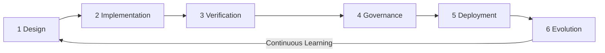

# MaintainabilityAI SDLC Framework

> **Purpose**: A comprehensive, security-first Software Development Lifecycle for AI-assisted engineering.

This framework integrates **OWASP Top 10**, **Evolutionary Architecture** fitness functions, and **multi-agent AI orchestration** into a complete development lifecycle that maintains both velocity and security.

---

## The Engineering Imperative

In a world where AI can generate code at unprecedented speed, the critical question isn't whether to use AI. It's how to maintain engineering excellence while leveraging it.

[Recent research shows](https://arxiv.org/abs/2502.11844) that **62% of AI-generated code contains design flaws or security vulnerabilities**, even with the latest models. This isn't a temporary limitation. It's the fundamental nature of pattern-based learning systems.

The organizations that win won't be those that generate the most code or adopt AI fastest. They'll be **those that maintain engineering discipline while leveraging AI's capabilities**.

Your competitive advantage lies not in the speed of code generation but in the quality of architectural decisions, the robustness of security implementations, and the elegance of solutions that only experienced engineers can provide.

### The 70/30 Rule

As documented in [Addy Osmani's *Beyond Vibe Coding*](https://www.oreilly.com/library/view/beyond-vibe-coding/9798341634749/) (O'Reilly, 2025), every developer using AI tools has discovered the same pattern: **AI can get you 70% of the way there, but the last 30% requires human expertise**.

This framework operationalizes that insight:

✓ What AI Handles Well (The Commoditized 70%)

<ul style="color: #cbd5e1; font-size: 14px; line-height: 1.8; margin: 0; padding-left: 20px;">
<li>Boilerplate code and scaffolding</li>
<li>Standard CRUD operations</li>
<li>Common design patterns</li>
<li>API endpoint generation</li>
<li>Basic test creation</li>
<li>Documentation templates</li>
<li>Code formatting consistency</li>
<li>Simple refactoring tasks</li>
</ul>

⚠️ What Requires Human Expertise (The Differentiating 30%)

<ul style="color: #cbd5e1; font-size: 14px; line-height: 1.8; margin: 0; padding-left: 20px;">
<li>Edge case identification and handling</li>
<li>Security architecture and threat modeling</li>
<li>Performance optimization at scale</li>
<li>Business logic validation</li>
<li>System integration boundaries</li>
<li>Architectural decisions</li>
<li>Technical debt management</li>
<li>Regulatory compliance implementation</li>
</ul>

**This framework ensures humans own the architecture and governance gates** (where systems succeed or fail), while AI handles implementation and verification (where speed matters most). Like building architects who ensure structures are safe, sound, and secure at scale, your engineering architects maintain oversight at critical decision points.

---

## SDLC Overview

6-Phase Continuous Development Cycle

Security gates, AI integration, and fitness functions at every phase

```mermaid
flowchart LR
    P1["1 Design"] --> P2["2 Implementation"]
    P2 --> P3["3 Verification"]
    P3 --> P4["4 Governance"]
    P4 --> P5["5 Deployment"]
    P5 --> P6["6 Evolution"]
    P6 -->|"Continuous Learning"| P1
```

Phase 6 feeds continuous learnings back to Phase 1

---

## Quick Start

Get started in 3 steps

  
Step 1: Read the Framework

  
Start with <a href="./phase1-design" style="color: #93c5fd;">Phase 1: Design</a> to understand how threat modeling, OWASP mapping, and fitness functions shape your feature before code is written.

  
Step 2: Scaffold with Cheshire

  
Install the <a href="https://marketplace.visualstudio.com/items?itemName=chiefarcheologist.maintainabilityai" style="color: #fcd34d;">VSCode extension</a> and run <strong>Scaffold SDLC Structure</strong> to set up CLAUDE.md, CodeQL, fitness functions, and PR templates.

  
Step 3: Follow the Phases

  
Walk through phases 2-6 for each feature: implement with AI agents, verify with scanners, review with Golden Rules, deploy, and iterate.

## MaintainabilityAI — The VSCode Extension

  

  
Two panels. One mission. Ship secure code.

  

    A <strong style="color: #c4b5fd;">VSCode extension</strong> that brings the MaintainabilityAI framework directly into your editor. The <strong style="color: #93c5fd;">Looking Glass</strong> governs your portfolio — architecture, scoring, and AI-assisted analysis. The <strong style="color: #c4b5fd;">Cheshire Cat</strong> secures your code — scaffolding, scorecards, and agent-driven remediation.
  

  
v0.1.4

<!-- ═══════════════════════════════════════════════ -->
<!-- LOOKING GLASS — Governance & Architecture      -->
<!-- ═══════════════════════════════════════════════ -->

  
The Looking Glass — Governance & Architecture

  
The mirror that shows you what your organization really looks like.

  

    
🔮 Watch Absolem in Action

    
Architecture modeling → governance mesh → AI-assisted analysis

  

  <a href="https://youtu.be/Ua_4Msx2DYQ" target="_blank" rel="noopener noreferrer" style="display: inline-block; background: #0f172a; color: #93c5fd; padding: 10px 24px; border-radius: 8px; text-decoration: none; font-size: 14px; font-weight: 600; box-shadow: 0 4px 12px rgba(15, 23, 42, 0.4); white-space: nowrap;">▶️ Watch the Demo</a>

  <h4 style="color: #93c5fd; margin: 0 0 8px 0; font-size: 16px; font-weight: 700;">Governance Mesh & Scoring</h4>
  
Portfolio → Platform → BAR hierarchy with live governance scoring across four pillars: Architecture, Security, Information Risk, and Operations. Track score history with sparklines, manage ADRs, and sync to git — all from a single dashboard.

  <h4 style="color: #60a5fa; margin: 0 0 8px 0; font-size: 16px; font-weight: 700;">CALM Architecture Diagrams</h4>
  
Interactive ReactFlow canvas with ELK.js auto-layout, custom node types for services, databases, actors, and networks. Drag-and-drop palette, inline editing, container collapse, and PNG export. Start from Three-Tier, Event-Driven, or Data Pipeline archetypes.

  <h4 style="color: #818cf8; margin: 0 0 8px 0; font-size: 16px; font-weight: 700;">Absolem — AI Governance Assistant</h4>
  
A floating chat assistant with 7 commands: drift analysis, component creation, CALM validation, gap analysis, ADR suggestions, image-to-CALM conversion, and freeform architecture questions. Generates structured patches you can preview, accept, or reject.

<!-- ═══════════════════════════════════════════════ -->
<!-- CHESHIRE CAT — Code & Security                 -->
<!-- ═══════════════════════════════════════════════ -->

  
The Cheshire Cat — Code & Security

  
The grin that stays with your repo long after the session ends.

  

    
🎥 Watch Cheshire in Action

    
Feature description → RCTRO generation → GitHub issue → agent implementation

  

  <a href="https://youtu.be/WtSRfwKrcFU?si=eapuXusdWhIa8Mor" target="_blank" rel="noopener noreferrer" style="display: inline-block; background: #0f172a; color: #c4b5fd; padding: 10px 24px; border-radius: 8px; text-decoration: none; font-size: 14px; font-weight: 600; box-shadow: 0 4px 12px rgba(15, 23, 42, 0.4); white-space: nowrap;">▶️ Watch the Demo</a>

  <h4 style="color: #c4b5fd; margin: 0 0 8px 0; font-size: 16px; font-weight: 700;">SDLC Scaffolding</h4>
  
One command sets up your entire security-first pipeline: CLAUDE.md agent instructions, CodeQL workflows, fitness function automation, PR templates with AI disclosure, and OWASP prompt packs — all tailored to your detected tech stack.

  <h4 style="color: #a5b4fc; margin: 0 0 8px 0; font-size: 16px; font-weight: 700;">Issue Management</h4>
  
Describe a feature in plain text and Cheshire generates a complete RCTRO-formatted GitHub issue with collapsible prompt pack guidance, auto-created labels, and implementation zones for both Claude and Copilot.

  <h4 style="color: #93c5fd; margin: 0 0 8px 0; font-size: 16px; font-weight: 700;">Security Scorecard</h4>
  
Six fitness functions score every repo: security compliance, dependency freshness, test coverage, cyclomatic complexity, technical debt, and CI/CD health. Action buttons on every tile let you create remediation issues directly from the dashboard.

  
  

    
Coming Next: The Red Queen

    

      Prompts are advisory. Agents can ignore them. The Red Queen adds <strong style="color: #f87171;">deterministic governance enforcement</strong> — an MCP server for architecture awareness, NeMo Guardrails for constraint enforcement, and a policy engine that ties agent autonomy to governance scores.
    

    <a href="/docs/impossible-things#whats-coming-the-red-queen---governance-enforced-agent-intelligence" style="color: #f87171; font-size: 13px; font-weight: 600; text-decoration: none;">Read the Red Queen roadmap →</a>
  

---

## SDLC Framework: Phases & Security Gates

<!-- Phase 1: Design & Architecture Gates -->

  <h3 style="margin: 0 0 8px 0; font-size: 18px; display: flex; align-items: center; gap: 10px; color: #f1f5f9;">
    1&#xFE0F;&#x20E3;
    Design & Architecture Gates
  </h3>
  
The Architectural Layer (100% Human)

  
<strong style="color: #93c5fd;">Purpose:</strong> Requirements gathering, threat modeling with STRIDE, architecture design, OWASP category mapping, fitness function definitions

  

    
Security Gate

    
Threat coverage >95%

  

  <ul style="margin: 0 0 16px 0; padding-left: 20px; list-style: none;">
    <li style="margin: 8px 0; font-size: 14px; line-height: 1.4; position: relative; padding-left: 20px; color: #cbd5e1;">
      ▸
      Threat modeling for all STRIDE categories
      HUMAN
    </li>
    <li style="margin: 8px 0; font-size: 14px; line-height: 1.4; position: relative; padding-left: 20px; color: #cbd5e1;">
      ▸
      OWASP Top 10 risk assessment
      HUMAN
    </li>
    <li style="margin: 8px 0; font-size: 14px; line-height: 1.4; position: relative; padding-left: 20px; color: #cbd5e1;">
      ▸
      Architecture fitness functions defined
      HUMAN
    </li>
    <li style="margin: 8px 0; font-size: 14px; line-height: 1.4; position: relative; padding-left: 20px; color: #cbd5e1;">
      ▸
      Security controls blueprint
      HUMAN
    </li>
    <li style="margin: 8px 0; font-size: 14px; line-height: 1.4; position: relative; padding-left: 20px; color: #cbd5e1;">
      ▸
      AI assistance boundaries established
      HUMAN
    </li>
  </ul>

  <!-- Flow Indicators -->
  

    

      
✓ Success

      
→ Phase 2

    

  

  <a href="./phase1-design" style="display: inline-block; background: rgba(59, 130, 246, 0.2); color: #3b82f6; padding: 8px 16px; border-radius: 6px; text-decoration: none; font-size: 13px; font-weight: 600;">View Phase 1 Details →</a>

<!-- Phase 2: Implementation Gates -->

  <h3 style="margin: 0 0 8px 0; font-size: 18px; display: flex; align-items: center; gap: 10px; color: #f1f5f9;">
    2&#xFE0F;&#x20E3;
    Implementation Gates
  </h3>
  
The 70% Layer (AI-Assisted)

  
<strong style="color: #fcd34d;">Purpose:</strong> Agent selection, OWASP prompt packs, secure code generation, incremental development with local validation

  

    
Security Gate

    
ESLint, Jest pass

  

  <ul style="margin: 0 0 16px 0; padding-left: 20px; list-style: none;">
    <li style="margin: 8px 0; font-size: 14px; line-height: 1.4; position: relative; padding-left: 20px; color: #cbd5e1;">
      ▸
      OWASP prompt packs deployment
      AI
    </li>
    <li style="margin: 8px 0; font-size: 14px; line-height: 1.4; position: relative; padding-left: 20px; color: #cbd5e1;">
      ▸
      Boilerplate code generation
      AI
    </li>
    <li style="margin: 8px 0; font-size: 14px; line-height: 1.4; position: relative; padding-left: 20px; color: #cbd5e1;">
      ▸
      Unit test creation (ESLint, Jest)
      AI
    </li>
    <li style="margin: 8px 0; font-size: 14px; line-height: 1.4; position: relative; padding-left: 20px; color: #cbd5e1;">
      ▸
      Security pattern implementation
      AI
    </li>
    <li style="margin: 8px 0; font-size: 14px; line-height: 1.4; position: relative; padding-left: 20px; color: #cbd5e1;">
      ▸
      Documentation generation
      AI
    </li>
  </ul>

  <!-- Flow Indicators -->
  

    

      
✓ Success

      
→ Phase 3

    

  

  <a href="./phase2-implementation" style="display: inline-block; background: rgba(245, 158, 11, 0.2); color: #f59e0b; padding: 8px 16px; border-radius: 6px; text-decoration: none; font-size: 13px; font-weight: 600;">View Phase 2 Details →</a>

<!-- Phase 3: Verification Gates -->

  <h3 style="margin: 0 0 8px 0; font-size: 18px; display: flex; align-items: center; gap: 10px; color: #f1f5f9;">
    3&#xFE0F;&#x20E3;
    Verification Gates
  </h3>
  
AI-Powered Analysis

  
<strong style="color: #fca5a5;">Purpose:</strong> Local testing (Jest, ESLint), security scanning (CodeQL, Snyk), fitness function validation, attack vector testing

  

    
Security Gate

    
No high-severity findings

  

  <ul style="margin: 0 0 16px 0; padding-left: 20px; list-style: none;">
    <li style="margin: 8px 0; font-size: 14px; line-height: 1.4; position: relative; padding-left: 20px; color: #cbd5e1;">
      ▸
      CodeQL security scanning
      AI
    </li>
    <li style="margin: 8px 0; font-size: 14px; line-height: 1.4; position: relative; padding-left: 20px; color: #cbd5e1;">
      ▸
      Snyk vulnerability detection
      AI
    </li>
    <li style="margin: 8px 0; font-size: 14px; line-height: 1.4; position: relative; padding-left: 20px; color: #cbd5e1;">
      ▸
      Test coverage validation (≥80%)
      AI
    </li>
    <li style="margin: 8px 0; font-size: 14px; line-height: 1.4; position: relative; padding-left: 20px; color: #cbd5e1;">
      ▸
      Fitness function automation
      AI
    </li>
    <li style="margin: 8px 0; font-size: 14px; line-height: 1.4; position: relative; padding-left: 20px; color: #cbd5e1;">
      ▸
      Attack vector simulation
      AI
    </li>
  </ul>

  <!-- Flow Indicators -->
  

    

      
✓ Pass

      
→ Phase 4

    

    

      
✗ Fail

      
↩ Phase 2

    

  

  <a href="./phase3-verification" style="display: inline-block; background: rgba(239, 68, 68, 0.2); color: #ef4444; padding: 8px 16px; border-radius: 6px; text-decoration: none; font-size: 13px; font-weight: 600;">View Phase 3 Details →</a>

<!-- Phase 4: Governance Gates -->

  <h3 style="margin: 0 0 8px 0; font-size: 18px; display: flex; align-items: center; gap: 10px; color: #f1f5f9;">
    4&#xFE0F;&#x20E3;
    Governance Gates
  </h3>
  
The Critical 30% (Human Judgment)

  
<strong style="color: #d8b4fe;">Purpose:</strong> PR review process, Golden Rules checklist, human-in-the-loop validation, OWASP compliance, merge criteria

  

    
Security Gate

    
Golden Rules compliance

  

  <ul style="margin: 0 0 16px 0; padding-left: 20px; list-style: none;">
    <li style="margin: 8px 0; font-size: 14px; line-height: 1.4; position: relative; padding-left: 20px; color: #cbd5e1;">
      ▸
      Architectural review & approval
      HUMAN
    </li>
    <li style="margin: 8px 0; font-size: 14px; line-height: 1.4; position: relative; padding-left: 20px; color: #cbd5e1;">
      ▸
      Security risk acceptance
      HUMAN
    </li>
    <li style="margin: 8px 0; font-size: 14px; line-height: 1.4; position: relative; padding-left: 20px; color: #cbd5e1;">
      ▸
      Business logic validation
      HUMAN
    </li>
    <li style="margin: 8px 0; font-size: 14px; line-height: 1.4; position: relative; padding-left: 20px; color: #cbd5e1;">
      ▸
      Compliance certification
      HUMAN
    </li>
    <li style="margin: 8px 0; font-size: 14px; line-height: 1.4; position: relative; padding-left: 20px; color: #cbd5e1;">
      ▸
      AI disclosure documentation
      HUMAN
    </li>
  </ul>

  <!-- Flow Indicators -->
  

    

      
✓ Approve

      
→ Phase 5

    

    

      
✗ Reject

      
↩ Phase 2

    

  

  <a href="./phase4-governance" style="display: inline-block; background: rgba(168, 85, 247, 0.2); color: #a855f7; padding: 8px 16px; border-radius: 6px; text-decoration: none; font-size: 13px; font-weight: 600;">View Phase 4 Details →</a>

<!-- Phase 5: Deployment Gates -->

  <h3 style="margin: 0 0 8px 0; font-size: 18px; display: flex; align-items: center; gap: 10px; color: #f1f5f9;">
    5&#xFE0F;&#x20E3;
    Deployment Gates
  </h3>
  
Automated with Human Override

  
<strong style="color: #6ee7b7;">Purpose:</strong> CI/CD pipeline configuration, production deployment, monitoring and alerting, rollback procedures

  

    
Security Gate

    
Zero critical CVEs

  

  <ul style="margin: 0 0 16px 0; padding-left: 20px; list-style: none;">
    <li style="margin: 8px 0; font-size: 14px; line-height: 1.4; position: relative; padding-left: 20px; color: #cbd5e1;">
      ▸
      All verification scans re-run
      AI
    </li>
    <li style="margin: 8px 0; font-size: 14px; line-height: 1.4; position: relative; padding-left: 20px; color: #cbd5e1;">
      ▸
      Production smoke tests
      AI
    </li>
    <li style="margin: 8px 0; font-size: 14px; line-height: 1.4; position: relative; padding-left: 20px; color: #cbd5e1;">
      ▸
      Monitoring configuration
      AI
    </li>
    <li style="margin: 8px 0; font-size: 14px; line-height: 1.4; position: relative; padding-left: 20px; color: #cbd5e1;">
      ▸
      Rollback strategy approval
      HUMAN
    </li>
    <li style="margin: 8px 0; font-size: 14px; line-height: 1.4; position: relative; padding-left: 20px; color: #cbd5e1;">
      ▸
      Go/No-go decision
      HUMAN
    </li>
  </ul>

  <!-- Flow Indicators -->
  

    

      
✓ Success

      
→ Phase 6

    

    

      
✗ Rollback

      
↩ Phase 4

    

  

  <a href="./phase5-deployment" style="display: inline-block; background: rgba(16, 185, 129, 0.2); color: #10b981; padding: 8px 16px; border-radius: 6px; text-decoration: none; font-size: 13px; font-weight: 600;">View Phase 5 Details →</a>

<!-- Phase 6: Evolution Gates -->

  <h3 style="margin: 0 0 8px 0; font-size: 18px; display: flex; align-items: center; gap: 10px; color: #f1f5f9;">
    6&#xFE0F;&#x20E3;
    Evolution Gates
  </h3>
  
Continuous Learning Loop

  
<strong style="color: #f9a8d4;">Purpose:</strong> Metrics collection and analysis, prompt library iteration, technical debt management, fitness function refinement

  

    
Security Gate

    
Metrics trending up

  

  <ul style="margin: 0 0 16px 0; padding-left: 20px; list-style: none;">
    <li style="margin: 8px 0; font-size: 14px; line-height: 1.4; position: relative; padding-left: 20px; color: #cbd5e1;">
      ▸
      Performance metrics analysis
      AI
    </li>
    <li style="margin: 8px 0; font-size: 14px; line-height: 1.4; position: relative; padding-left: 20px; color: #cbd5e1;">
      ▸
      Technical debt tracking
      AI
    </li>
    <li style="margin: 8px 0; font-size: 14px; line-height: 1.4; position: relative; padding-left: 20px; color: #cbd5e1;">
      ▸
      Prompt optimization
      HUMAN
    </li>
    <li style="margin: 8px 0; font-size: 14px; line-height: 1.4; position: relative; padding-left: 20px; color: #cbd5e1;">
      ▸
      Fitness function refinement
      HUMAN
    </li>
    <li style="margin: 8px 0; font-size: 14px; line-height: 1.4; position: relative; padding-left: 20px; color: #cbd5e1;">
      ▸
      Architecture evolution
      HUMAN
    </li>
  </ul>

  <!-- Flow Indicators -->
  

    

      
↻ Loop

      
→ Phase 1

    

  

  <a href="./phase6-evolution" style="display: inline-block; background: rgba(236, 72, 153, 0.2); color: #ec4899; padding: 8px 16px; border-radius: 6px; text-decoration: none; font-size: 13px; font-weight: 600;">View Phase 6 Details →</a>

<!-- Flow Legend -->

→

Forward Flow

Normal progression through phases 1 → 2 → 3 → 4 → 5 → 6, then back to 1 for continuous improvement

↩

Feedback Loops

Phase 3 (Verification) failures return to Phase 2. Phase 4 (Governance) rejections return to Phase 2. Phase 5 (Deployment) rollbacks return to Phase 4

<h3 style="margin: 0 0 12px 0; color: #4a9eff; font-size: 20px;">🎯 Framework Core Principles</h3>

As <a href="https://www.deloitte.com/nz/en/services/consulting/perspectives/ai-assisted-software-engineering.html" style="color: #60a5fa; text-decoration: none;">Aravind Subramanian, Deloitte Partner and AI Advisor</a>, argues: "AI governance is more than just rules; it's about creating a foundation of trust that supports innovation. By keeping humans in the loop, we inject empathy and judgment, crucial for navigating complex ethical landscapes. Governance isn't a barrier; it's a facilitator that empowers us to explore new ideas responsibly."

✓

<strong style="color: #4a9eff;">Humans Own Architecture:</strong> All system design and architectural decisions remain under human control

✓

<strong style="color: #4a9eff;">AI Accelerates Implementation:</strong> Leverage AI for the 70% routine work while maintaining quality gates

✓

<strong style="color: #4a9eff;">Security by Design:</strong> OWASP Top 10 and threat modeling integrated at every phase

✓

<strong style="color: #4a9eff;">Fitness Functions:</strong> Automated architectural governance ensures maintainability

✓

<strong style="color: #4a9eff;">Transparent AI Usage:</strong> Clear documentation of where and how AI assistance was utilized

✓

<strong style="color: #4a9eff;">Continuous Evolution:</strong> Learn from each cycle to optimize the human-AI partnership

---

## AI Agent Usage by Phase

**Two modes, one framework** — use in-editor AI assistance (Copilot) for real-time coding and agentic AI (Claude Code) for complex, multi-file tasks.

**Key principle**: Security-first prompts matter more than which mode you use.

  <table style="width: 100%; border-collapse: collapse;">
    <thead>
      <tr style="background: rgba(71, 85, 105, 0.3);">
        <th style="padding: 12px; text-align: left; border: 1px solid rgba(100, 116, 139, 0.3); color: #f1f5f9;">Phase</th>
        <th style="padding: 12px; text-align: left; border: 1px solid rgba(100, 116, 139, 0.3); color: #f1f5f9;">Your Task</th>
        <th style="padding: 12px; text-align: left; border: 1px solid rgba(100, 116, 139, 0.3); color: #f1f5f9;">Mode</th>
        <th style="padding: 12px; text-align: left; border: 1px solid rgba(100, 116, 139, 0.3); color: #f1f5f9;">Why</th>
      </tr>
    </thead>
    <tbody>
      <tr>
        <td style="padding: 12px; border: 1px solid rgba(100, 116, 139, 0.3); color: #cbd5e1;">1: Design</td>
        <td style="padding: 12px; border: 1px solid rgba(100, 116, 139, 0.3); color: #cbd5e1;">Threat modeling (STRIDE)</td>
        <td style="padding: 12px; border: 1px solid rgba(100, 116, 139, 0.3); color: #cbd5e1;">In-Editor Claude Code | Copilot</td>
        <td style="padding: 12px; border: 1px solid rgba(100, 116, 139, 0.3); color: #94a3b8;">Structured analysis and documentation across files</td>
      </tr>
      <tr style="background: rgba(71, 85, 105, 0.2);">
        <td style="padding: 12px; border: 1px solid rgba(100, 116, 139, 0.3); color: #cbd5e1;">2: Implement</td>
        <td style="padding: 12px; border: 1px solid rgba(100, 116, 139, 0.3); color: #cbd5e1;">Real-time coding</td>
        <td style="padding: 12px; border: 1px solid rgba(100, 116, 139, 0.3); color: #cbd5e1;">In-Editor Claude Code | Copilot</td>
        <td style="padding: 12px; border: 1px solid rgba(100, 116, 139, 0.3); color: #94a3b8;">Autocomplete and inline suggestions as you type</td>
      </tr>
      <tr>
        <td style="padding: 12px; border: 1px solid rgba(100, 116, 139, 0.3); color: #cbd5e1;">2: Implement</td>
        <td style="padding: 12px; border: 1px solid rgba(100, 116, 139, 0.3); color: #cbd5e1;">Large refactoring</td>
        <td style="padding: 12px; border: 1px solid rgba(100, 116, 139, 0.3); color: #cbd5e1;">Agentic Claude Code | Copilot Coding Agent</td>
        <td style="padding: 12px; border: 1px solid rgba(100, 116, 139, 0.3); color: #94a3b8;">Handles complex multi-file edits autonomously</td>
      </tr>
      <tr style="background: rgba(71, 85, 105, 0.2);">
        <td style="padding: 12px; border: 1px solid rgba(100, 116, 139, 0.3); color: #cbd5e1;">3: Verify</td>
        <td style="padding: 12px; border: 1px solid rgba(100, 116, 139, 0.3); color: #cbd5e1;">Test generation</td>
        <td style="padding: 12px; border: 1px solid rgba(100, 116, 139, 0.3); color: #cbd5e1;">Agentic Claude Code | Copilot Coding Agent</td>
        <td style="padding: 12px; border: 1px solid rgba(100, 116, 139, 0.3); color: #94a3b8;">Comprehensive test suites with attack vector coverage</td>
      </tr>
      <tr>
        <td style="padding: 12px; border: 1px solid rgba(100, 116, 139, 0.3); color: #cbd5e1;">4: Govern</td>
        <td style="padding: 12px; border: 1px solid rgba(100, 116, 139, 0.3); color: #cbd5e1;">Code review checklist</td>
        <td style="padding: 12px; border: 1px solid rgba(100, 116, 139, 0.3); color: #cbd5e1;">In-Editor Claude Code | Copilot</td>
        <td style="padding: 12px; border: 1px solid rgba(100, 116, 139, 0.3); color: #94a3b8;">Inline review comments and validation suggestions</td>
      </tr>
      <tr style="background: rgba(71, 85, 105, 0.2);">
        <td style="padding: 12px; border: 1px solid rgba(100, 116, 139, 0.3); color: #cbd5e1;">5: Deploy</td>
        <td style="padding: 12px; border: 1px solid rgba(100, 116, 139, 0.3); color: #cbd5e1;">CI/CD automation</td>
        <td style="padding: 12px; border: 1px solid rgba(100, 116, 139, 0.3); color: #cbd5e1;">Pipeline GitHub Actions</td>
        <td style="padding: 12px; border: 1px solid rgba(100, 116, 139, 0.3); color: #94a3b8;">Automated, auditable pipeline</td>
      </tr>
      <tr>
        <td style="padding: 12px; border: 1px solid rgba(100, 116, 139, 0.3); color: #cbd5e1;">6: Evolve</td>
        <td style="padding: 12px; border: 1px solid rgba(100, 116, 139, 0.3); color: #cbd5e1;">Refactoring tech debt</td>
        <td style="padding: 12px; border: 1px solid rgba(100, 116, 139, 0.3); color: #cbd5e1;">Agentic Claude Code | Copilot Coding Agent</td>
        <td style="padding: 12px; border: 1px solid rgba(100, 116, 139, 0.3); color: #94a3b8;">Large-scale codebase analysis and refactoring</td>
      </tr>
    </tbody>
  </table>

---

## 📈 Success Metrics

  
⚡

  
Velocity Metrics

  

    <strong style="color: #818cf8;">Time to Delivery:</strong> &lt;5 days 
    <strong style="color: #818cf8;">Cycle Time:</strong> &lt;24 hours 
    <strong style="color: #818cf8;">Deploy Frequency:</strong> &gt;10/week
  

  
🎯

  
Quality Metrics

  

    <strong style="color: #a78bfa;">Scan Pass Rate:</strong> &gt;90% 
    <strong style="color: #a78bfa;">Test Coverage:</strong> &gt;80% 
    <strong style="color: #a78bfa;">Defect Rate:</strong> &lt;5/1000 LOC
  

  
🔒

  
Security Metrics

  

    <strong style="color: #22d3ee;">OWASP Coverage:</strong> 100% 
    <strong style="color: #22d3ee;">Remediation Time:</strong> &lt;7 days 
    <strong style="color: #22d3ee;">False Positives:</strong> &lt;10%
  

  
📊

  
Process Metrics

  

    <strong style="color: #5eead4;">Prompt Reuse:</strong> &gt;70% 
    <strong style="color: #5eead4;">Agent Effectiveness:</strong> &gt;85% 
    <strong style="color: #5eead4;">Review Time:</strong> &lt;30 min
  

---

  
🎯

  
Ready to Start?

  
Begin your secure AI-assisted development journey with Phase 1. Follow the six phases systematically for maximum velocity and security.

  <a href="./phase1-design" style="display: inline-block; background: linear-gradient(135deg, #4f46e5 0%, #6366f1 100%); color: #f1f5f9; padding: 16px 32px; border-radius: 8px; font-weight: 700; text-decoration: none; font-size: 16px; box-shadow: 0 4px 12px rgba(79, 70, 229, 0.3);">
    Begin with Phase 1: Design Intent →
  </a>

