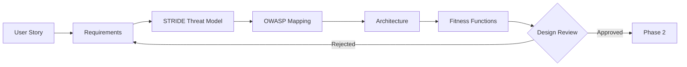

# Phase 1: Design Intent

<div style="background: linear-gradient(135deg, #1e40af 0%, #3b82f6 100%); border-radius: 16px; padding: 32px; margin: 32px 0; box-shadow: 0 8px 32px rgba(30, 64, 175, 0.4); border: 1px solid rgba(59, 130, 246, 0.3);">
  <div style="display: flex; align-items: center; gap: 20px; margin-bottom: 20px;">
    <div style="font-size: 56px;">1&#xFE0F;&#x20E3;</div>
    <div>
      <h2 style="margin: 0; font-size: 32px; color: #f1f5f9; font-weight: 800;">Design Intent</h2>
      <div style="font-size: 16px; color: #bfdbfe; margin-top: 8px;">Requirements, Threat Modeling & Architecture</div>
    </div>
  </div>
  <div style="color: #dbeafe; font-size: 15px; line-height: 1.7;">
    Define requirements, identify threats via STRIDE, map to OWASP categories, design secure architecture, and establish fitness functions — all before writing code.
  </div>
</div>

## Phase Overview



<div style="display: grid; grid-template-columns: repeat(auto-fit, minmax(200px, 1fr)); gap: 16px; margin: 24px 0;">
  <div style="background: linear-gradient(135deg, #1e293b 0%, #334155 100%); border-radius: 12px; padding: 20px; border: 1px solid rgba(100, 116, 139, 0.3);">
    <div style="font-size: 11px; color: #94a3b8; text-transform: uppercase; letter-spacing: 1px; margin-bottom: 6px;">Duration</div>
    <div style="font-size: 20px; color: #f1f5f9; font-weight: 700;">1-4 hours</div>
  </div>
  <div style="background: linear-gradient(135deg, #1e293b 0%, #334155 100%); border-radius: 12px; padding: 20px; border: 1px solid rgba(100, 116, 139, 0.3);">
    <div style="font-size: 11px; color: #94a3b8; text-transform: uppercase; letter-spacing: 1px; margin-bottom: 6px;">Agents</div>
    <div style="font-size: 20px; color: #f1f5f9; font-weight: 700;">ChatGPT, Claude</div>
  </div>
  <div style="background: linear-gradient(135deg, #1e293b 0%, #334155 100%); border-radius: 12px; padding: 20px; border: 1px solid rgba(100, 116, 139, 0.3);">
    <div style="font-size: 11px; color: #94a3b8; text-transform: uppercase; letter-spacing: 1px; margin-bottom: 6px;">Outputs</div>
    <div style="font-size: 14px; color: #cbd5e1; line-height: 1.6;">Threat model, OWASP map, architecture, fitness functions</div>
  </div>
  <div style="background: linear-gradient(135deg, #1e293b 0%, #334155 100%); border-radius: 12px; padding: 20px; border: 1px solid rgba(100, 116, 139, 0.3);">
    <div style="font-size: 11px; color: #94a3b8; text-transform: uppercase; letter-spacing: 1px; margin-bottom: 6px;">Security Gate</div>
    <div style="font-size: 14px; color: #cbd5e1; line-height: 1.6;">Threat coverage >95%, all STRIDE categories addressed</div>
  </div>
</div>

---

## Step 1: Requirements Analysis

Extract structured requirements from a user story. Use the RCTRO prompt below.

<div style="background: linear-gradient(135deg, #1e293b 0%, #0f172a 100%); border-radius: 12px; padding: 28px; margin: 24px 0; border: 1px solid rgba(59, 130, 246, 0.3);">
<div style="font-size: 12px; color: #93c5fd; text-transform: uppercase; letter-spacing: 1px; margin-bottom: 16px; font-weight: 700;">RCTRO Prompt — Requirements Elicitation</div>

```
Role: You are a senior product analyst extracting security-aware requirements.

Context:
- Feature request or user story provided below
- Tech stack: Node 18, TypeScript, PostgreSQL
- Must comply with OWASP Top 10

Task:
Extract and organize functional, non-functional, and security requirements
from the feature request. Identify applicable OWASP categories.

Requirements:
1. **Functional Requirements**
   - Enumerate all user-facing behaviors (FR1, FR2, ...)
   - Include acceptance criteria for each
   - Validation: All behaviors from the user story are captured

2. **Non-Functional Requirements**
   - Performance targets (response time, throughput)
   - Availability and scalability expectations
   - Validation: Each NFR has a measurable threshold

3. **Security Requirements**
   - Map to specific OWASP categories (A01-A10)
   - Identify data classification (PII, credentials, etc.)
   - Identify auth/authz needs
   - Validation: At least one OWASP category identified

4. **Scope Boundary**
   - Explicitly list what is out of scope
   - Validation: No ambiguity in scope

Output:
Structured markdown with sections: Functional Requirements,
Non-Functional Requirements, Security Requirements,
Acceptance Criteria, Out of Scope.
```

</div>

<details>
<summary style="cursor: pointer; color: #93c5fd; font-weight: 600; padding: 8px 0;">Example: Document Sharing requirements output</summary>

```markdown
Feature: User document sharing

## Functional Requirements
- FR1: Users can share documents with other users by email
- FR2: Share permissions include read, write, or admin
- FR3: Users can revoke shares at any time
- FR4: Shared users receive email notification

## Non-Functional Requirements
- NFR1: Share operation < 500ms
- NFR2: Support 10,000 shares/day
- NFR3: 99.9% uptime

## Security Requirements
- OWASP A01: Verify ownership before allowing share
- OWASP A03: Validate email addresses (injection prevention)
- OWASP A07: Authenticate both sharer and recipient
- OWASP A09: Log all share/revoke actions for audit

## Acceptance Criteria
- AC1: Owner can share document with valid user
- AC2: Non-owner cannot share document
- AC3: Recipient receives notification email
- AC4: Revocation removes access immediately

## Out of Scope
- Public sharing, time-limited shares, folder-level sharing
```

</details>

---

## Step 2: STRIDE Threat Modeling

Systematically identify threats across all six STRIDE categories.

<div style="background: linear-gradient(135deg, #1e293b 0%, #0f172a 100%); border-radius: 12px; padding: 28px; margin: 24px 0; border: 1px solid rgba(124, 58, 237, 0.3);">
<div style="font-size: 12px; color: #d8b4fe; text-transform: uppercase; letter-spacing: 1px; margin-bottom: 16px; font-weight: 700;">RCTRO Prompt — STRIDE Threat Model</div>

```
Role: You are a security threat modeler using STRIDE methodology.

Context:
- Feature: [paste requirements from Step 1]
- Tech Stack: Node 18, TypeScript, Express, PostgreSQL
- Authentication: JWT tokens
- Authorization: RBAC (owner, admin, user roles)

Task:
Perform STRIDE threat analysis. For each of the 6 categories
(Spoofing, Tampering, Repudiation, Information Disclosure,
Denial of Service, Elevation of Privilege), identify specific threats.

Requirements:
1. **Threat Identification**
   - At least one threat per STRIDE category
   - Each threat has a unique ID (T1, T2, ...)
   - Validation: All 6 STRIDE categories covered

2. **Risk Assessment**
   - Rate each threat: High / Medium / Low
   - Map each threat to an OWASP Top 10 category
   - Validation: Every threat has risk + OWASP mapping

3. **Mitigation Strategy**
   - Specific technical mitigation for each threat
   - Reference OWASP prompt packs where applicable
   - Validation: No threat left without mitigation

Output:
Structured threat model with format per threat:
- ID, Category, Scenario, Risk, OWASP mapping, Mitigation
```

</div>

<div style="display: grid; grid-template-columns: repeat(auto-fit, minmax(140px, 1fr)); gap: 8px; margin: 16px 0;">
  <div style="background: rgba(124, 58, 237, 0.15); border-radius: 8px; padding: 10px; text-align: center; font-size: 13px; color: #d8b4fe; font-weight: 600;">Spoofing</div>
  <div style="background: rgba(124, 58, 237, 0.15); border-radius: 8px; padding: 10px; text-align: center; font-size: 13px; color: #d8b4fe; font-weight: 600;">Tampering</div>
  <div style="background: rgba(124, 58, 237, 0.15); border-radius: 8px; padding: 10px; text-align: center; font-size: 13px; color: #d8b4fe; font-weight: 600;">Repudiation</div>
  <div style="background: rgba(124, 58, 237, 0.15); border-radius: 8px; padding: 10px; text-align: center; font-size: 13px; color: #d8b4fe; font-weight: 600;">Info Disclosure</div>
  <div style="background: rgba(124, 58, 237, 0.15); border-radius: 8px; padding: 10px; text-align: center; font-size: 13px; color: #d8b4fe; font-weight: 600;">DoS</div>
  <div style="background: rgba(124, 58, 237, 0.15); border-radius: 8px; padding: 10px; text-align: center; font-size: 13px; color: #d8b4fe; font-weight: 600;">Privilege Escalation</div>
</div>

<details>
<summary style="cursor: pointer; color: #d8b4fe; font-weight: 600; padding: 8px 0;">Example: Document Sharing threat model output</summary>

```markdown
## STRIDE Threat Model: Document Sharing

### Spoofing
**T1: JWT token forgery** — Risk: HIGH — OWASP: A07
Mitigation: Validate JWT signature, check expiration, verify issuer

**T2: Email address spoofing** — Risk: MEDIUM — OWASP: A03, A04
Mitigation: Validate email format, require recipient confirmation

### Tampering
**T3: Permission escalation after share** — Risk: HIGH — OWASP: A01
Mitigation: Immutable permissions, only owner can modify

**T4: SQL injection in share parameters** — Risk: HIGH — OWASP: A03
Mitigation: Parameterized queries, Zod validation

### Repudiation
**T5: No audit trail** — Risk: MEDIUM — OWASP: A09
Mitigation: Comprehensive audit logging, immutable logs

### Information Disclosure
**T6: IDOR on share IDs** — Risk: HIGH — OWASP: A01
Mitigation: Authorization checks, non-sequential UUIDs

**T7: Metadata leaks in notifications** — Risk: MEDIUM — OWASP: A01
Mitigation: Generic notifications, require login for details

### Denial of Service
**T8: Share flooding** — Risk: MEDIUM — OWASP: A04
Mitigation: Rate limiting (10/min per user)

### Elevation of Privilege
**T9: Recipient re-shares documents** — Risk: MEDIUM — OWASP: A01
Mitigation: Owner-only sharing, prevent re-sharing
```

</details>

---

## Step 3: OWASP Category Mapping

Map threats to specific OWASP prompt packs for Phase 2 implementation.

<div style="background: linear-gradient(135deg, #1e293b 0%, #0f172a 100%); border-radius: 12px; padding: 24px; margin: 24px 0; border: 1px solid rgba(100, 116, 139, 0.3);">

| OWASP Category | Threats | Prompt Pack | Key Controls |
|---|---|---|---|
| A01: Broken Access Control | T3, T6, T7, T9 | [A01 Pack](/docs/prompts/owasp/A01_broken_access_control) | Ownership verification, deny-by-default, RBAC |
| A03: Injection | T2, T4 | [A03 Pack](/docs/prompts/owasp/A03_injection) | Parameterized queries, Zod validation |
| A07: Authentication Failures | T1 | [A07 Pack](/docs/prompts/owasp/A07_authn_failures) | JWT validation, token expiration |
| A09: Logging/Monitoring | T5 | [A09 Pack](/docs/prompts/owasp/A09_logging_monitoring) | Audit logging, security event tracking |

</div>

---

## Step 4: Architecture Design

Design the secure architecture addressing all identified threats.

<div style="background: linear-gradient(135deg, #1e293b 0%, #0f172a 100%); border-radius: 12px; padding: 28px; margin: 24px 0; border: 1px solid rgba(16, 185, 129, 0.3);">
<div style="font-size: 12px; color: #6ee7b7; text-transform: uppercase; letter-spacing: 1px; margin-bottom: 16px; font-weight: 700;">RCTRO Prompt — Secure Architecture</div>

```
Role: You are a senior software architect designing a secure system.

Context:
- Requirements: [from Step 1]
- Threat Model: [9 threats from Step 2]
- OWASP Categories: A01, A03, A07, A09
- Stack: Node 18, TypeScript, Express, PostgreSQL (pg library)
- Existing tables: users, documents (cannot modify)
- Stateless auth via JWT

Task:
Design secure architecture that addresses all identified threats
while meeting functional and non-functional requirements.

Requirements:
1. **Data Model**
   - SQL schema for new tables
   - Non-sequential IDs (UUIDs) to prevent IDOR
   - Audit log table for repudiation defense
   - Validation: Schema addresses T5, T6

2. **API Design**
   - RESTful endpoints with clear authorization rules
   - Rate limiting on write operations
   - Validation: Each endpoint maps to specific threats

3. **Security Controls**
   - One control per identified threat (T1-T9)
   - Parameterized queries only (no string concat)
   - Generic error messages (no schema leaks)
   - Validation: All 9 threats have mapped controls

4. **Authorization Flow**
   - Mermaid sequence diagram showing auth flow
   - Deny-by-default: verify ownership on every operation
   - Validation: Flow covers happy path + rejection

Output:
Architecture document with: SQL schema, API endpoints table,
security controls mapping (threat → control → code pattern),
authorization sequence diagram, error handling strategy.
```

</div>

<details>
<summary style="cursor: pointer; color: #6ee7b7; font-weight: 600; padding: 8px 0;">Example: Architecture output — Data Model</summary>

```sql
CREATE TABLE document_shares (
  id UUID PRIMARY KEY DEFAULT gen_random_uuid(),
  document_id UUID NOT NULL REFERENCES documents(id) ON DELETE CASCADE,
  owner_id UUID NOT NULL REFERENCES users(id),
  shared_with_email VARCHAR(255) NOT NULL,
  permission VARCHAR(10) NOT NULL CHECK (permission IN ('read', 'write', 'admin')),
  created_at TIMESTAMP NOT NULL DEFAULT NOW(),
  revoked_at TIMESTAMP,
  UNIQUE(document_id, shared_with_email)
);

CREATE TABLE share_audit_log (
  id SERIAL PRIMARY KEY,
  share_id UUID REFERENCES document_shares(id),
  action VARCHAR(20) NOT NULL,
  user_id UUID REFERENCES users(id),
  ip_address INET,
  timestamp TIMESTAMP NOT NULL DEFAULT NOW(),
  metadata JSONB
);
```

</details>

<details>
<summary style="cursor: pointer; color: #6ee7b7; font-weight: 600; padding: 8px 0;">Example: Architecture output — Security Controls Mapping</summary>

| Threat | Control | Pattern |
|---|---|---|
| T1: JWT forgery | Validate signature + expiration | `jwt.verify(token, secret)` |
| T3: Permission escalation | Immutable permissions, owner-only | Check `owner_id` before mutation |
| T4: SQL injection | Parameterized queries + Zod | `$1, $2` placeholders, `z.string().email()` |
| T5: No audit trail | Log all share operations | Insert to `share_audit_log` on every action |
| T6: IDOR | UUID IDs + authorization check | Verify requester is owner OR recipient |
| T7: Metadata leaks | Generic error messages | Map error types to safe messages |
| T8: Share flooding | Rate limiting | `express-rate-limit` at 10/min per user |
| T9: Re-sharing | Owner-only sharing | Reject if `requester !== owner` |

</details>

---

## Step 5: Fitness Function Definitions

Define automated quality gates enforced in Phase 3.

<div style="display: grid; grid-template-columns: repeat(auto-fit, minmax(250px, 1fr)); gap: 16px; margin: 24px 0;">

<div style="background: linear-gradient(135deg, #1e293b 0%, #0f172a 100%); border-radius: 12px; padding: 20px; border-left: 4px solid #3b82f6;">
  <div style="font-size: 15px; font-weight: 700; color: #93c5fd; margin-bottom: 8px;">Complexity</div>
  <div style="color: #cbd5e1; font-size: 13px; line-height: 1.7;">
    Cyclomatic complexity ≤ 10 per function<br/>
    Function length ≤ 50 lines<br/>
    <span style="color: #94a3b8;">Enforced via: ESLint + CI</span>
  </div>
</div>

<div style="background: linear-gradient(135deg, #1e293b 0%, #0f172a 100%); border-radius: 12px; padding: 20px; border-left: 4px solid #ef4444;">
  <div style="font-size: 15px; font-weight: 700; color: #fca5a5; margin-bottom: 8px;">Security</div>
  <div style="color: #cbd5e1; font-size: 13px; line-height: 1.7;">
    Zero high/critical CodeQL + Snyk findings<br/>
    All STRIDE threats (T1-T9) mitigated<br/>
    <span style="color: #94a3b8;">Enforced via: CodeQL + Snyk in CI</span>
  </div>
</div>

<div style="background: linear-gradient(135deg, #1e293b 0%, #0f172a 100%); border-radius: 12px; padding: 20px; border-left: 4px solid #f59e0b;">
  <div style="font-size: 15px; font-weight: 700; color: #fcd34d; margin-bottom: 8px;">Test Coverage</div>
  <div style="color: #cbd5e1; font-size: 13px; line-height: 1.7;">
    Overall ≥ 80%, security functions 100%<br/>
    All threats have attack vector tests<br/>
    <span style="color: #94a3b8;">Enforced via: Jest thresholds in CI</span>
  </div>
</div>

<div style="background: linear-gradient(135deg, #1e293b 0%, #0f172a 100%); border-radius: 12px; padding: 20px; border-left: 4px solid #a855f7;">
  <div style="font-size: 15px; font-weight: 700; color: #d8b4fe; margin-bottom: 8px;">Dependencies</div>
  <div style="color: #cbd5e1; font-size: 13px; line-height: 1.7;">
    All deps < 3 months old, zero known CVEs<br/>
    Security patches within 7 days<br/>
    <span style="color: #94a3b8;">Enforced via: Snyk monitor + npm outdated</span>
  </div>
</div>

<div style="background: linear-gradient(135deg, #1e293b 0%, #0f172a 100%); border-radius: 12px; padding: 20px; border-left: 4px solid #10b981;">
  <div style="font-size: 15px; font-weight: 700; color: #6ee7b7; margin-bottom: 8px;">Performance</div>
  <div style="color: #cbd5e1; font-size: 13px; line-height: 1.7;">
    Write ops < 200ms (p95)<br/>
    Read ops < 100ms (p95)<br/>
    <span style="color: #94a3b8;">Enforced via: Performance tests in CI</span>
  </div>
</div>

</div>

See [Fitness Functions guide](/docs/maintainability/fitness-functions) for implementation details.

---

## Step 6: Design Review Checklist

Before proceeding to Phase 2, verify all gates pass:

<div style="background: linear-gradient(135deg, #1e293b 0%, #0f172a 100%); border-radius: 12px; padding: 24px; margin: 24px 0; border: 1px solid rgba(100, 116, 139, 0.3);">
<div style="color: #cbd5e1; font-size: 14px; line-height: 2.2;">

- [ ] All functional requirements have implementation plan
- [ ] Non-functional requirements have measurable criteria
- [ ] All 6 STRIDE categories analyzed
- [ ] Every threat has risk rating + OWASP mapping + mitigation
- [ ] Architecture addresses all identified threats
- [ ] API design follows RESTful principles with authorization rules
- [ ] Error handling prevents information disclosure
- [ ] Fitness functions defined with measurable thresholds
- [ ] OWASP prompt packs selected for Phase 2

</div>
</div>

---

## Phase Handoff → Phase 2

<div style="background: rgba(30, 64, 175, 0.1); border-left: 4px solid #3b82f6; border-radius: 8px; padding: 24px; margin: 24px 0;">

```
===== PHASE 1 → PHASE 2 HANDOFF =====

Feature: [Feature name]

OWASP Prompt Packs:
- /prompts/owasp/[applicable packs]

Threats to Mitigate:
- [T1-Tn with one-line mitigation each]

Architecture Reference:
- Data model, API endpoints, security controls

Fitness Functions:
- Complexity ≤ 10, Coverage ≥ 80%
- CodeQL/Snyk clean, Performance < 200ms

===== END HANDOFF =====
```

</div>

---

<div style="display: flex; justify-content: space-between; align-items: center; margin: 32px 0;">
  <span style="color: #94a3b8; font-size: 14px;">Further reading: <a href="/docs/maintainability/evolutionary-architecture" style="color: #93c5fd;">Evolutionary Architecture</a> · <a href="/docs/maintainability/fitness-functions" style="color: #93c5fd;">Fitness Functions</a></span>
  <a href="/docs/sdlc/phase2-implementation" style="display: inline-block; background: linear-gradient(135deg, #f59e0b 0%, #d97706 100%); color: #f1f5f9; padding: 12px 24px; border-radius: 8px; text-decoration: none; font-size: 14px; font-weight: 600;">Phase 2: Implementation →</a>
</div>
