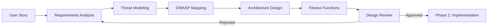
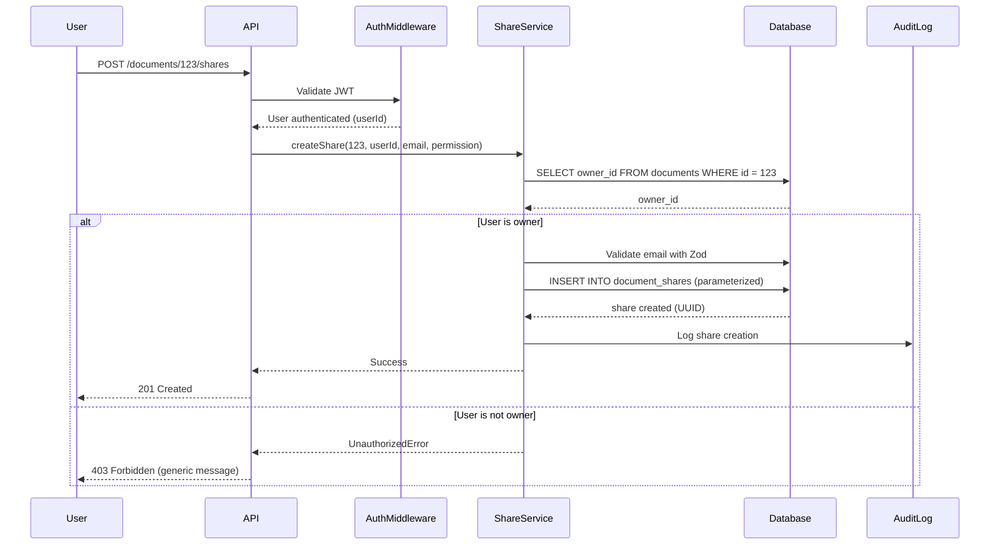

# Phase 1: Design Intent

> **Purpose**: Define requirements, identify threats, design secure architecture, and establish fitness functions before writing code.

This phase transforms user stories into security-aware technical specifications using threat modeling, OWASP mapping, and evolutionary architecture principles.

---

## Phase Overview



**Duration**: 1-4 hours (depending on feature complexity)

**Primary Agents**: ChatGPT (threat modeling), Claude (architecture)

**Outputs**:
- Requirements document
- Threat model (STRIDE analysis)
- OWASP category mapping
- Architecture design with security controls
- Fitness function definitions

---

## Step 1: Requirements Analysis

### Inputs
- User story or feature request
- Business requirements
- Acceptance criteria

### Process

Use **ChatGPT** for structured requirements elicitation:

```markdown
Role: You are a senior product analyst.

Feature Request:
[Paste user story or feature description]

Task: Extract and organize requirements.

Output Format:
## Functional Requirements
- FR1: [Requirement]
- FR2: [Requirement]

## Non-Functional Requirements
- NFR1: Performance (response time <200ms)
- NFR2: Security (OWASP Top 10 compliance)
- NFR3: Maintainability (cyclomatic complexity <10)

## Security Requirements (Preliminary)
- Which OWASP categories likely apply?
- What data is being processed (PII, credentials, etc.)?
- What authentication/authorization is needed?

## Acceptance Criteria
- AC1: [Criterion]
- AC2: [Criterion]

## Out of Scope
- What is explicitly NOT included?
```

### Example Output

```markdown
Feature: User document sharing

## Functional Requirements
- FR1: Users can share documents with other users by email
- FR2: Share permissions include read, write, or admin
- FR3: Users can revoke shares at any time
- FR4: Shared users receive email notification

## Non-Functional Requirements
- NFR1: Share operation completes in <500ms
- NFR2: Support 10,000 shares per day
- NFR3: 99.9% uptime

## Security Requirements
- OWASP A01: Verify ownership before allowing share
- OWASP A03: Validate email addresses (injection prevention)
- OWASP A07: Authenticate both sharer and recipient
- OWASP A09: Log all share/revoke actions for audit

## Acceptance Criteria
- AC1: Owner can share document with valid user
- AC2: Non-owner cannot share document
- AC3: Recipient receives notification email
- AC4: Revocation removes access immediately

## Out of Scope
- Public sharing (external users)
- Time-limited shares
- Folder-level sharing
```

---

## Step 2: Threat Modeling

### STRIDE Methodology

Use **ChatGPT** to systematically identify threats:

```markdown
Role: You are a security threat modeler using STRIDE methodology.

Feature: [Paste feature description from Step 1]

Context:
- Tech Stack: Node 18, TypeScript, Express, PostgreSQL
- Authentication: JWT tokens
- Authorization: RBAC (owner, admin, user roles)

Task: Perform STRIDE threat analysis.

For each STRIDE category, identify specific threats:

## Spoofing
- Could an attacker impersonate another user to share/access documents?

## Tampering
- Could an attacker modify share permissions or document content?

## Repudiation
- Could a user deny they shared a document?

## Information Disclosure
- Could an attacker access documents they shouldn't?

## Denial of Service
- Could sharing be abused to exhaust resources?

## Elevation of Privilege
- Could a recipient gain owner-level permissions?

For each threat:
1. Describe the threat scenario
2. Rate risk (High/Medium/Low)
3. Map to OWASP Top 10 category
4. Suggest mitigation
```

### Threat Model Output

```markdown
## STRIDE Threat Model: Document Sharing

### Spoofing Threats
**T1: User impersonation during share creation**
- Scenario: Attacker forges JWT token to share documents as another user
- Risk: HIGH
- OWASP: A07 (Authentication Failures)
- Mitigation: Validate JWT signature, check token expiration, verify issuer

**T2: Email address spoofing**
- Scenario: Attacker shares document to email they don't control
- Risk: MEDIUM
- OWASP: A03 (Injection), A04 (Insecure Design)
- Mitigation: Validate email format, require recipient confirmation

### Tampering Threats
**T3: Permission escalation after share**
- Scenario: Recipient modifies their own permissions from read to admin
- Risk: HIGH
- OWASP: A01 (Broken Access Control)
- Mitigation: Immutable share permissions, only owner can modify

**T4: SQL injection in share parameters**
- Scenario: Attacker injects SQL in email or permission fields
- Risk: HIGH
- OWASP: A03 (Injection)
- Mitigation: Parameterized queries, input validation with Zod

### Repudiation Threats
**T5: No audit trail of share actions**
- Scenario: User shares sensitive document then denies it
- Risk: MEDIUM
- OWASP: A09 (Logging/Monitoring Failures)
- Mitigation: Comprehensive audit logging, immutable logs

### Information Disclosure Threats
**T6: IDOR - Access other users' shares**
- Scenario: Attacker enumerates share IDs to access unrelated shares
- Risk: HIGH
- OWASP: A01 (Broken Access Control)
- Mitigation: Authorization checks on every operation, non-sequential IDs

**T7: Share notification leaks document metadata**
- Scenario: Email notification reveals document title/content to unauthorized user
- Risk: MEDIUM
- OWASP: A01 (Broken Access Control)
- Mitigation: Generic notification, require login to view details

### Denial of Service Threats
**T8: Share flooding**
- Scenario: Attacker creates millions of shares to exhaust database
- Risk: MEDIUM
- OWASP: A04 (Insecure Design)
- Mitigation: Rate limiting (10 shares per minute per user)

### Elevation of Privilege Threats
**T9: Recipient grants shares to others**
- Scenario: Read-only recipient shares document with additional users
- Risk: MEDIUM
- OWASP: A01 (Broken Access Control)
- Mitigation: Only owner can share, prevent re-sharing
```

---

## Step 3: OWASP Category Mapping

Map identified threats to OWASP prompt packs:

```markdown
Feature: Document Sharing

Applicable OWASP Categories:

1. **A01: Broken Access Control**
   - Threats: T3, T6, T7, T9
   - Prompt Pack: /prompts/owasp/A01_broken_access_control.md
   - Controls: Ownership verification, deny-by-default, RBAC

2. **A03: Injection**
   - Threats: T4
   - Prompt Pack: /prompts/owasp/A03_injection.md
   - Controls: Parameterized queries, Zod validation

3. **A07: Authentication Failures**
   - Threats: T1
   - Prompt Pack: /prompts/owasp/A07_authn_failures.md
   - Controls: JWT validation, token expiration

4. **A09: Logging/Monitoring Failures**
   - Threats: T5
   - Prompt Pack: /prompts/owasp/A09_logging_monitoring.md
   - Controls: Audit logging, security event tracking

Priority: High (4 OWASP categories, 9 threats identified)
```

---

## Step 4: Architecture Design

Use **Claude** to design secure architecture:

```markdown
Role: You are a senior software architect.

Inputs:
- Requirements: [From Step 1]
- Threat Model: [From Step 2]
- OWASP Categories: A01, A03, A07, A09

Task: Design secure architecture for document sharing feature.

Include:
1. Data model (database schema)
2. API endpoints (REST)
3. Security controls (per threat)
4. Authorization flow diagram
5. Error handling strategy

Constraints:
- Existing tables: users, documents (cannot modify schema)
- Must use PostgreSQL with pg library
- RESTful API design
- Stateless (JWT authentication)

Security Requirements:
- Address all 9 threats from threat model
- Follow OWASP best practices for A01, A03, A07, A09
- Deny-by-default access control
- Generic error messages
```

### Architecture Output

```markdown
## Document Sharing Architecture

### Data Model

```sql
-- New table: document_shares
CREATE TABLE document_shares (
  id UUID PRIMARY KEY DEFAULT gen_random_uuid(),  -- Non-sequential to prevent IDOR (T6)
  document_id UUID NOT NULL REFERENCES documents(id) ON DELETE CASCADE,
  owner_id UUID NOT NULL REFERENCES users(id),
  shared_with_email VARCHAR(255) NOT NULL,
  permission VARCHAR(10) NOT NULL CHECK (permission IN ('read', 'write', 'admin')),
  created_at TIMESTAMP NOT NULL DEFAULT NOW(),
  revoked_at TIMESTAMP,  -- NULL = active, non-NULL = revoked
  created_by_ip INET,  -- For audit trail (T5)
  UNIQUE(document_id, shared_with_email),  -- Prevent duplicate shares
  INDEX idx_shares_document (document_id),
  INDEX idx_shares_email (shared_with_email)
);

-- Audit log table
CREATE TABLE share_audit_log (
  id SERIAL PRIMARY KEY,
  share_id UUID REFERENCES document_shares(id),
  action VARCHAR(20) NOT NULL,  -- 'created', 'revoked', 'accessed'
  user_id UUID REFERENCES users(id),
  ip_address INET,
  timestamp TIMESTAMP NOT NULL DEFAULT NOW(),
  metadata JSONB  -- Additional context
);
```

### API Endpoints

```
POST   /api/documents/:documentId/shares       Create share (T1,T3,T4,T6)
GET    /api/documents/:documentId/shares       List shares for document (T6)
DELETE /api/documents/:documentId/shares/:id   Revoke share (T3,T6,T9)
GET    /api/shares/received                    List shares user received (T6,T7)
```

### Security Controls Mapping

**T1 (JWT Forgery)**:
```typescript
// Middleware: Validate JWT on every request
function authenticateJWT(req, res, next) {
  const token = req.headers.authorization?.split(' ')[1];
  if (!token) return res.status(401).json({ error: 'Unauthorized' });

  try {
    const decoded = jwt.verify(token, process.env.JWT_SECRET);
    req.user = decoded;  // { id, email, role }
    next();
  } catch (err) {
    return res.status(401).json({ error: 'Invalid token' });
  }
}
```

**T3 (Permission Escalation)**:
```typescript
// Immutable permissions: only owner can create/modify
async function createShare(documentId, ownerId, email, permission) {
  // Verify requester is document owner
  const doc = await db.query(
    'SELECT owner_id FROM documents WHERE id = $1',
    [documentId]
  );

  if (doc.rows[0].owner_id !== ownerId) {
    throw new UnauthorizedError('Only owner can share');  // Generic error (T7)
  }

  // Permission is set once, cannot be modified later
  // To change: revoke old share, create new share
}
```

**T4 (SQL Injection)**:
```typescript
// Parameterized queries + Zod validation
const shareSchema = z.object({
  email: z.string().email().max(255),
  permission: z.enum(['read', 'write', 'admin'])
});

async function createShare(documentId, ownerId, data) {
  const validated = shareSchema.parse(data);  // Throws if invalid

  const result = await db.query(
    'INSERT INTO document_shares (document_id, owner_id, shared_with_email, permission) VALUES ($1, $2, $3, $4) RETURNING id',
    [documentId, ownerId, validated.email, validated.permission]
  );

  return result.rows[0];
}
```

**T5 (No Audit Trail)**:
```typescript
// Log all share operations
async function auditShareAction(shareId, action, userId, ip) {
  await db.query(
    'INSERT INTO share_audit_log (share_id, action, user_id, ip_address, metadata) VALUES ($1, $2, $3, $4, $5)',
    [shareId, action, userId, ip, { timestamp: new Date() }]
  );
}
```

**T6 (IDOR)**:
```typescript
// UUID IDs (non-sequential) + Authorization check
async function getShare(shareId, requesterId) {
  const share = await db.query(
    'SELECT * FROM document_shares WHERE id = $1',
    [shareId]
  );

  if (!share.rows.length) {
    throw new NotFoundError('Share not found');  // Generic error
  }

  // Verify requester is owner OR recipient
  const isOwner = share.rows[0].owner_id === requesterId;
  const isRecipient = share.rows[0].shared_with_email === requesterEmail;

  if (!isOwner && !isRecipient) {
    throw new UnauthorizedError('Access denied');  // Generic error (T7)
  }

  return share.rows[0];
}
```

**T8 (Share Flooding)**:
```typescript
// Rate limiting: 10 shares per minute per user
import rateLimit from 'express-rate-limit';

const shareLimiter = rateLimit({
  windowMs: 60 * 1000,  // 1 minute
  max: 10,
  message: 'Too many shares, try again later',
  keyGenerator: (req) => req.user.id  // Per-user limiting
});

app.post('/api/documents/:documentId/shares', shareLimiter, createShareHandler);
```

**T9 (Permission Escalation via Re-sharing)**:
```typescript
// Only document owner can share (prevent re-sharing)
async function createShare(documentId, requesterId, ...) {
  const doc = await db.query(
    'SELECT owner_id FROM documents WHERE id = $1',
    [documentId]
  );

  if (doc.rows[0].owner_id !== requesterId) {
    // Requester is not owner (even if they have a share)
    throw new UnauthorizedError('Only owner can share');
  }

  // Proceed with share creation
}
```

### Authorization Flow



### Error Handling Strategy

```typescript
// Generic errors prevent information disclosure (T7)
const errorMessages = {
  UnauthorizedError: 'Access denied',  // Never say "not owner" vs "document not found"
  NotFoundError: 'Resource not found',
  ValidationError: 'Invalid input',
  RateLimitError: 'Too many requests'
};

function errorHandler(err, req, res, next) {
  // Log detailed error server-side
  logger.error('Error', { error: err.message, stack: err.stack, user: req.user?.id });

  // Return generic error to client
  const status = err.statusCode || 500;
  const message = errorMessages[err.constructor.name] || 'An error occurred';

  res.status(status).json({ error: message });
}
```
```

---

## Step 5: Fitness Function Definitions

Define architectural fitness functions that will be enforced in Phase 3:

```markdown
## Fitness Functions: Document Sharing

### 1. Complexity Fitness Function
**Goal**: Maintain code simplicity
- Cyclomatic complexity ≤ 10 per function
- Function length ≤ 50 lines
- File size ≤ 300 lines

**Implementation**: ESLint complexity rule
**Enforcement**: Pre-commit hook + CI

### 2. Security Fitness Function
**Goal**: Zero high-severity findings
- CodeQL: No high/critical issues
- Snyk: No high/critical vulnerabilities
- All OWASP threats (T1-T9) mitigated

**Implementation**: CodeQL + Snyk scans
**Enforcement**: CI blocks merge on failure

### 3. Test Coverage Fitness Function
**Goal**: Comprehensive testing
- Overall coverage ≥ 80%
- Security-critical functions: 100% coverage
- All 9 threats have attack vector tests

**Implementation**: Jest coverage thresholds
**Enforcement**: CI blocks merge if coverage drops

### 4. Dependency Freshness Fitness Function
**Goal**: Keep dependencies current
- All dependencies < 3 months old
- Zero known CVEs in dependencies
- Security patches applied within 7 days

**Implementation**: Snyk monitor + npm outdated
**Enforcement**: Weekly automated PR for updates

### 5. Performance Fitness Function
**Goal**: Fast response times
- Share creation: < 200ms (p95)
- Share listing: < 100ms (p95)
- No N+1 query problems

**Implementation**: Performance tests in Jest
**Enforcement**: CI fails if regression > 20%
```

See [/docs/maintainability/fitness-functions.md](../maintainability/fitness-functions.md) for implementation details.

---

## Step 6: Design Review

### Checklist

Before proceeding to Phase 2, verify:

#### Requirements Coverage
- [ ] All functional requirements have corresponding implementation plan
- [ ] Non-functional requirements have measurable criteria
- [ ] Security requirements mapped to OWASP categories

#### Threat Model Completeness
- [ ] All STRIDE categories analyzed
- [ ] Each threat has risk rating
- [ ] Each threat mapped to OWASP category
- [ ] Each threat has mitigation strategy

#### Architecture Quality
- [ ] Data model supports all requirements
- [ ] API design follows RESTful principles
- [ ] Security controls address all threats
- [ ] Error handling prevents information disclosure
- [ ] Authorization flow documented

#### Fitness Functions
- [ ] Fitness functions defined for complexity, security, coverage, dependencies, performance
- [ ] Each function has measurable threshold
- [ ] Enforcement mechanism specified (ESLint, CodeQL, Jest, etc.)

#### OWASP Compliance
- [ ] All applicable OWASP categories identified
- [ ] Prompt packs selected for Phase 2
- [ ] Security controls mapped to categories

---

## Outputs to Phase 2

Hand off these artifacts to Phase 2 (Implementation):

```markdown
===== PHASE 1 → PHASE 2 HANDOFF =====

Feature: Document Sharing

OWASP Prompt Packs to Use:
- /prompts/owasp/A01_broken_access_control.md
- /prompts/owasp/A03_injection.md
- /prompts/owasp/A07_authn_failures.md
- /prompts/owasp/A09_logging_monitoring.md

Threats to Mitigate:
- T1: JWT validation
- T3: Immutable permissions
- T4: Parameterized queries
- T5: Audit logging
- T6: Authorization checks
- T7: Generic errors
- T8: Rate limiting
- T9: Owner-only sharing

Architecture Reference:
- Data model: See design doc section "Data Model"
- API endpoints: POST/GET/DELETE /documents/:id/shares
- Security controls: See "Security Controls Mapping"

Fitness Functions:
- Complexity ≤ 10
- Coverage ≥ 80%
- CodeQL/Snyk clean
- Performance < 200ms

Success Criteria:
- All 9 threats mitigated
- All fitness functions pass
- Implementation matches architecture design

===== END HANDOFF =====
```

---

## Real-World Example

See the complete [A03 Injection example](/examples/owasp/A03_injection/) for:
- Threat model identifying SQL injection vectors
- Architecture design with parameterized queries
- Fitness functions enforcing security

---

## Best Practices

### Do's
- Involve security expertise early (threat modeling)
- Map every threat to specific OWASP category
- Design security controls before writing code
- Define measurable fitness functions
- Document architecture decisions and rationale

### Don'ts
- Skip threat modeling ("we'll secure it later")
- Generic threats without specific mitigations
- Vague security requirements ("make it secure")
- Missing fitness functions (no automated enforcement)
- Rush to implementation without design approval

---

## Tools and Templates

### Threat Modeling Template

Use this ChatGPT prompt template:

```markdown
Role: Security Threat Modeler

Feature: [Feature name and description]

Context:
- Tech Stack: [Node, TypeScript, etc.]
- Data Handled: [PII, credentials, etc.]
- Users: [Roles and permissions]

Perform STRIDE analysis:
1. Spoofing: [Threats]
2. Tampering: [Threats]
3. Repudiation: [Threats]
4. Information Disclosure: [Threats]
5. Denial of Service: [Threats]
6. Elevation of Privilege: [Threats]

For each threat:
- ID: T[number]
- Scenario: [Description]
- Risk: High/Medium/Low
- OWASP: [Category]
- Mitigation: [Strategy]

Output as structured JSON.
```

### Architecture Design Template

Use this Claude prompt template:

```markdown
Role: Software Architect

Inputs:
- Requirements: [From requirements doc]
- Threat Model: [From STRIDE analysis]
- OWASP Categories: [A01, A03, etc.]

Design:
1. Data Model (SQL schema)
2. API Endpoints (REST)
3. Security Controls (map to threats)
4. Authorization Flow (Mermaid diagram)
5. Error Handling (prevent info disclosure)

Constraints:
- [Tech stack]
- [Existing systems]
- [Performance requirements]

Output architecture that addresses all threats.
```

---

## Next Steps

**[Proceed to Phase 2: Implementation →](phase2-implementation.md)**

With design complete, use OWASP prompt packs to generate secure code that implements the architecture and mitigates all identified threats.

---

**Further Reading**:
- [Evolutionary Architecture](../maintainability/evolutionary-architecture.md)
- [Fitness Functions](../maintainability/fitness-functions.md)
- [OWASP Insecure Design](https://owasp.org/Top10/A04_2021-Insecure_Design/)
