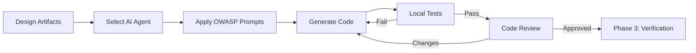
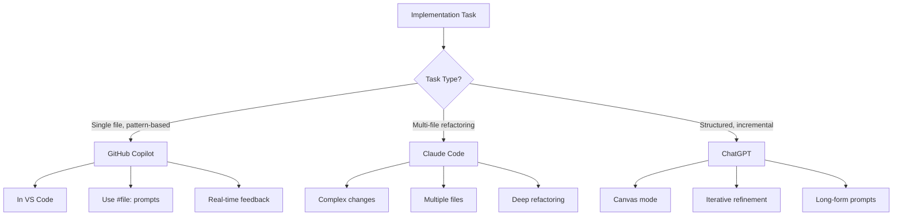
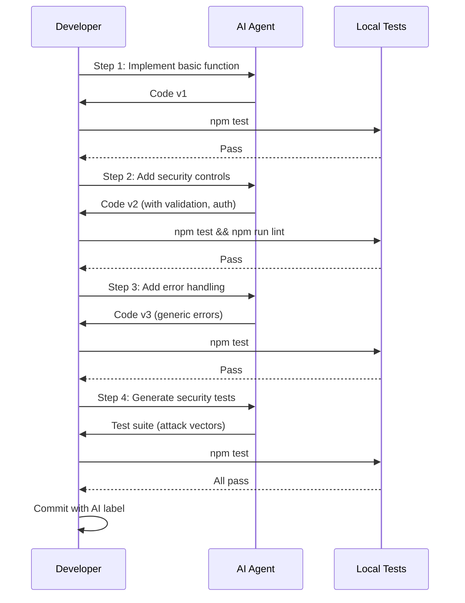

# Phase 2: Implementation

> **Purpose**: Generate secure code using AI agents guided by OWASP prompt packs and architectural constraints from Phase 1.

This phase transforms architecture designs into production-ready code while maintaining security controls and fitness function compliance.

---

## Phase Overview



**Duration**: 2-6 hours (feature-dependent)

**Primary Agents**: Copilot (in-editor generation), Claude (complex refactoring), ChatGPT (structured implementation)

**Outputs**:
- Implementation code (TypeScript/JavaScript)
- Unit tests (Jest)
- Security controls (per threat model)
- Documentation (inline comments, ADRs)

---

## Agent Selection Guide

Choose the right agent for your implementation task:



### When to Use Each Agent

| Agent | Best For | Example Task |
|-------|----------|--------------|
| **Copilot** | Single-function implementation, boilerplate, following existing patterns | "Implement `createShare()` function using A01 prompt pack" |
| **Claude** | Multi-file features, large refactorings, comprehensive testing | "Refactor entire auth module to use bcrypt and add tests" |
| **ChatGPT** | Incremental development, learning new patterns, structured iteration | "Build document sharing step-by-step with security review after each step" |

See [COPILOT.md](/COPILOT.md), [CLAUDE.md](/CLAUDE.md), [CHATGPT.md](/CHATGPT.md) for detailed guides.

---

## Using OWASP Prompt Packs

### Step 1: Identify Applicable Prompt Packs

From Phase 1 threat model, you identified OWASP categories. Now select the corresponding prompt packs:

```markdown
Threats from Phase 1:
- T1: JWT validation → A07 (Authentication)
- T4: SQL injection → A03 (Injection)
- T6: IDOR attacks → A01 (Access Control)
- T5: No audit trail → A09 (Logging)

Prompt Packs Needed:
1. /prompts/owasp/A01_broken_access_control.md
2. /prompts/owasp/A03_injection.md
3. /prompts/owasp/A07_authn_failures.md
4. /prompts/owasp/A09_logging_monitoring.md
```

### Step 2: Apply Prompt Pack with Context

**Example with Copilot**:

```markdown
#file:/prompts/owasp/A01_broken_access_control.md
#file:/prompts/owasp/A03_injection.md

Context from Phase 1:
- Feature: Document sharing
- Architecture: See design doc (data model, API endpoints)
- Threats to mitigate: T1, T3, T4, T5, T6, T7, T8, T9

Implement createShare() function:
1. Verify requester is document owner (T3, T6, T9)
2. Validate email and permission with Zod (T4)
3. Use parameterized query to insert share (T4)
4. Log share creation for audit (T5)
5. Return generic success message (T7)
6. Handle errors without info leakage (T7)

TypeScript, Express.js, PostgreSQL (pg library)
```

**Example with ChatGPT**:

```markdown
[Paste /prompts/owasp/A01_broken_access_control.md]

Feature Context:
From Phase 1 threat model, I need to implement document sharing with these security controls:
- T3: Immutable permissions (only owner can share)
- T6: Authorization checks prevent IDOR
- T9: Prevent re-sharing (only document owner can share)

Architecture from Phase 1:
```sql
CREATE TABLE document_shares (
  id UUID PRIMARY KEY DEFAULT gen_random_uuid(),
  document_id UUID NOT NULL,
  owner_id UUID NOT NULL,
  shared_with_email VARCHAR(255),
  permission VARCHAR(10)
);
```

Implement POST /api/documents/:documentId/shares endpoint:
1. Authenticate requester (JWT middleware)
2. Verify requester owns document
3. Validate input (Zod schema)
4. Create share (parameterized query)
5. Return success (generic message)

Show me the implementation step-by-step.
```

---

## Code Generation with Security Constraints

### Pattern: Security-First Prompting

Every implementation prompt should include:

1. **Role**: "You are a security engineer implementing OWASP [category]"
2. **Context**: Tech stack, existing architecture, data model
3. **Requirements**: Specific security controls from threat model
4. **Task**: Step-by-step implementation guidance
5. **Checklist**: OWASP compliance items

### Example: Implementing A03 Injection Prevention

```markdown
Role: You are a security engineer implementing OWASP A03:2021 - Injection.

Context:
- Node 18, TypeScript, Express, PostgreSQL (pg library)
- Feature: User search endpoint
- Threat: T4 - SQL injection via search query parameter

Architecture:
- Endpoint: GET /api/users/search?q=<query>
- Table: users (id, email, name)
- Max results: 50
- Authentication: Required (JWT)

Security Requirements (from threat model):
1. Use parameterized queries only (no string concatenation)
2. Validate query parameter with Zod:
   - Only alphanumeric, space, dash, underscore, @ allowed
   - Max length: 100 characters
   - Trim whitespace
3. Generic error messages (never expose SQL or schema)
4. Log blocked injection attempts for monitoring
5. Rate limit: 60 requests per minute per user

Task:
Implement searchUsers(query: string, userId: string) function.

Security Checklist:
□ Parameterized query with $1 placeholder
□ Zod validation with character allowlist
□ Length limit enforced (≤100 chars)
□ Generic error on validation failure
□ Injection attempts logged
□ Rate limiting applied to endpoint
□ Tests include SQL injection payloads
```

### Generated Secure Code

```typescript
import { z } from 'zod';
import { Client } from 'pg';
import rateLimit from 'express-rate-limit';

// Zod validation schema (T4: Injection prevention)
const searchQuerySchema = z.string()
  .trim()
  .max(100, 'Search query too long')
  .regex(/^[a-zA-Z0-9 _\-@]*$/, 'Invalid characters in search query');

/**
 * SECURITY: OWASP A03 - Injection Prevention
 * Threat: T4 - SQL injection via search parameter
 *
 * Controls:
 * - Parameterized query ($1 placeholder)
 * - Zod validation with character allowlist
 * - Length limit (100 chars)
 * - Generic error messages
 * - Security logging
 */
export async function searchUsers(query: string, userId: string) {
  // Validate input (defense in depth)
  let validated: string;
  try {
    validated = searchQuerySchema.parse(query);
  } catch (err) {
    // Log potential injection attempt
    logger.security('search_validation_failed', {
      userId,
      query: query.substring(0, 50),  // Truncate for logging
      error: err.message
    });

    // Generic error (no schema/validation leaks)
    throw new ValidationError('Invalid search query');
  }

  const client = new Client({
    connectionString: process.env.DATABASE_URL
  });

  await client.connect();

  try {
    // Parameterized query prevents injection (T4)
    const sql = 'SELECT id, email, name FROM users WHERE email ILIKE $1 OR name ILIKE $1 LIMIT 50';
    const res = await client.query(sql, [`%${validated}%`]);

    return res.rows;
  } catch (err) {
    // Log error server-side (detailed)
    logger.error('search_query_failed', {
      userId,
      error: err.message,
      stack: err.stack
    });

    // Generic error client-side (no SQL/schema leaks)
    throw new Error('Search failed');
  } finally {
    await client.end();
  }
}

// Rate limiting middleware (T8: DoS prevention)
export const searchRateLimiter = rateLimit({
  windowMs: 60 * 1000,  // 1 minute
  max: 60,  // 60 requests per minute
  keyGenerator: (req) => req.user.id,  // Per-user limiting
  handler: (req, res) => {
    logger.security('rate_limit_exceeded', {
      userId: req.user.id,
      endpoint: '/api/users/search'
    });
    res.status(429).json({ error: 'Too many requests' });
  }
});

// Express route
app.get('/api/users/search',
  authenticateJWT,  // Ensure authenticated
  searchRateLimiter,  // Apply rate limit
  async (req, res) => {
    try {
      const results = await searchUsers(req.query.q as string, req.user.id);
      res.json({ users: results });
    } catch (err) {
      if (err instanceof ValidationError) {
        res.status(400).json({ error: err.message });
      } else {
        res.status(500).json({ error: 'An error occurred' });
      }
    }
  }
);
```

---

## Incremental Development Pattern

Build features incrementally with validation at each step:



### Incremental Steps Example

**Step 1: Basic Implementation**
```markdown
Implement basic createShare() function that:
- Accepts documentId, ownerId, email, permission
- Inserts into document_shares table
- Returns share ID

No security yet, just working implementation.
```

**Step 2: Add Authorization**
```markdown
Add OWASP A01 access control:
- Verify ownerId matches document owner
- Throw UnauthorizedError if not owner
- Use generic error message
```

**Step 3: Add Input Validation**
```markdown
Add OWASP A03 injection prevention:
- Zod schema for email and permission
- Character allowlist for email
- Parameterized query for INSERT
```

**Step 4: Add Audit Logging**
```markdown
Add OWASP A09 logging:
- Log share creation to audit table
- Include userId, IP, timestamp
- Redact PII (email domain only)
```

**Step 5: Generate Tests**
```markdown
Generate Jest tests including:
- Valid share creation (authorized owner)
- Unauthorized attempt (non-owner blocked)
- Invalid email (validation fails)
- SQL injection attempt (blocked)
- Audit log verification
```

---

## Local Testing (ESLint + Jest)

Before committing, run local quality gates:

### ESLint Security Rules

```javascript
// .eslintrc.cjs
module.exports = {
  extends: [
    'eslint:recommended',
    'plugin:@typescript-eslint/recommended',
    'plugin:security/recommended'
  ],
  plugins: ['security'],
  rules: {
    // Complexity fitness function
    'complexity': ['error', 10],
    'max-lines-per-function': ['error', 50],

    // Security rules
    'security/detect-sql-injection': 'error',
    'security/detect-non-literal-regexp': 'warn',
    'security/detect-unsafe-regex': 'error',
    'security/detect-buffer-noassert': 'error',
    'security/detect-possible-timing-attacks': 'warn'
  }
};
```

Run: `npm run lint`

### Jest Unit Tests

```typescript
// createShare.test.ts

import { createShare } from './shares';
import { UnauthorizedError, ValidationError } from './errors';

describe('createShare - OWASP A01, A03, A09', () => {
  describe('Authorization (A01)', () => {
    it('should allow owner to create share', async () => {
      const share = await createShare('doc-123', 'owner-456', {
        email: 'user@example.com',
        permission: 'read'
      });

      expect(share.id).toBeDefined();
      expect(share.permission).toBe('read');
    });

    it('should block non-owner from creating share (T3, T9)', async () => {
      await expect(
        createShare('doc-123', 'attacker-789', {
          email: 'user@example.com',
          permission: 'read'
        })
      ).rejects.toThrow(UnauthorizedError);

      // Verify generic error message (T7)
      await expect(
        createShare('doc-123', 'attacker-789', { ... })
      ).rejects.toThrow('Access denied');  // Not "not owner" or "document not found"
    });
  });

  describe('Injection Prevention (A03)', () => {
    it('should block SQL injection in email (T4)', async () => {
      const maliciousEmail = "test@example.com'; DROP TABLE users--";

      await expect(
        createShare('doc-123', 'owner-456', {
          email: maliciousEmail,
          permission: 'read'
        })
      ).rejects.toThrow(ValidationError);
    });

    it('should block excessively long input (T4)', async () => {
      const longEmail = 'a'.repeat(256) + '@example.com';

      await expect(
        createShare('doc-123', 'owner-456', {
          email: longEmail,
          permission: 'read'
        })
      ).rejects.toThrow(ValidationError);
    });

    it('should block invalid characters in email (T4)', async () => {
      const invalidEmail = 'test<script>alert(1)</script>@example.com';

      await expect(
        createShare('doc-123', 'owner-456', {
          email: invalidEmail,
          permission: 'read'
        })
      ).rejects.toThrow(ValidationError);
    });
  });

  describe('Audit Logging (A09)', () => {
    it('should log share creation (T5)', async () => {
      const share = await createShare('doc-123', 'owner-456', {
        email: 'user@example.com',
        permission: 'read'
      });

      // Verify audit log entry exists
      const auditLog = await getAuditLog(share.id);
      expect(auditLog.action).toBe('created');
      expect(auditLog.user_id).toBe('owner-456');
    });
  });
});
```

Run: `npm test`

**Coverage threshold** (in `jest.config.ts`):
```typescript
export default {
  coverageThreshold: {
    global: {
      branches: 80,
      functions: 80,
      lines: 80,
      statements: 80
    },
    './src/security/': {  // Security-critical code
      branches: 100,
      functions: 100,
      lines: 100,
      statements: 100
    }
  }
};
```

---

## Documentation Requirements

### Inline Security Comments

Document security decisions in code:

```typescript
/**
 * SECURITY: OWASP A01 - Broken Access Control
 * Threat: T3, T9 - Permission escalation, re-sharing prevention
 *
 * Design Decision: Only document owner can create shares
 *
 * Rationale:
 * - Prevents recipients from re-sharing (cascade of permissions)
 * - Simplifies permission model (single source of authority)
 * - Aligns with principle of least privilege
 *
 * Trade-offs:
 * - Users cannot delegate sharing (UX limitation)
 * - Alternative considered: "can_reshare" flag (rejected: too complex)
 *
 * Reference: Phase 1 threat model (T9)
 * Decided by: [Your Name]
 * Date: 2025-10-10
 */
export async function createShare(documentId, requesterId, data) {
  // Verify requester is document owner
  const doc = await getDocument(documentId);

  if (doc.owner_id !== requesterId) {
    throw new UnauthorizedError('Access denied');
  }

  // Proceed with share creation...
}
```

### Architecture Decision Records (ADRs)

For significant design choices, create ADRs:

```markdown
# ADR-001: Use UUID for Share IDs (IDOR Prevention)

## Status: Accepted

## Context
Document sharing feature needs to prevent IDOR attacks (T6 from threat model).

Sequential IDs (1, 2, 3...) allow attackers to enumerate shares:
- GET /api/shares/1
- GET /api/shares/2
- etc.

## Decision
Use UUIDv4 for share IDs instead of auto-increment integers.

## Consequences
Positive:
- Non-sequential IDs prevent enumeration attacks
- 128-bit space makes brute force infeasible
- PostgreSQL has native UUID support (gen_random_uuid())

Negative:
- Slightly larger storage (16 bytes vs 4 bytes for int)
- Cannot infer creation order from ID alone

## Alternatives Considered
1. Sequential IDs + authorization check
   - Rejected: Defense in depth requires non-guessable IDs
2. Obfuscated IDs (hashids)
   - Rejected: UUIDs are standard and well-supported

## OWASP Category
A01 - Broken Access Control

## References
- Phase 1 threat model (T6)
- OWASP Cheat Sheet: [Access Control](https://cheatsheetseries.owasp.org/cheatsheets/Access_Control_Cheat_Sheet.html)
```

---

## Commit Guidelines

### Commit Message Format

```bash
git commit -m "feat(shares): Implement secure document sharing

Security Controls:
- [A01] Authorization check (owner-only sharing)
- [A03] Parameterized queries, Zod validation
- [A09] Audit logging for compliance

Threats Mitigated:
- T3: Permission escalation prevention
- T4: SQL injection blocked
- T5: Audit trail created
- T6: IDOR protection via UUIDs
- T7: Generic error messages
- T9: Re-sharing prevented

Tests: 95% coverage, all attack vectors tested

🤖 AI-assisted with GitHub Copilot using OWASP A01/A03/A09 prompt packs
Refs: #42"
```

### AI Disclosure Labels

Label all AI-assisted commits:

```bash
🤖 AI-assisted with [Agent Name] using [Prompt Pack]
```

Examples:
- `🤖 AI-assisted with GitHub Copilot using OWASP A03 prompt pack`
- `🤖 AI-assisted with Claude Code for refactoring + test generation`
- `🤖 AI-assisted with ChatGPT Canvas (incremental implementation)`

---

## Integration with Fitness Functions

Ensure implementation meets fitness function criteria:

### Complexity Check

```bash
# Run ESLint complexity rule
npm run lint

# If failure:
# Function 'createShare' has complexity 12, exceeding limit of 10.
# Refactor: Extract authorization check into separate function
```

### Test Coverage Check

```bash
# Run Jest with coverage
npm test -- --coverage

# Verify thresholds met:
# ✓ Branches: 92% (≥80% required)
# ✓ Functions: 95% (≥80% required)
# ✓ Lines: 94% (≥80% required)
```

### Security Scan (Local)

```bash
# Run npm audit
npm audit --audit-level=high

# Should show: 0 high or critical vulnerabilities
```

---

## Handoff to Phase 3

After local tests pass, hand off to Phase 3 (Verification):

```markdown
===== PHASE 2 → PHASE 3 HANDOFF =====

Feature: Document Sharing

Implementation Complete:
- Files: src/shares/createShare.ts, src/shares/routes.ts
- Tests: src/shares/__tests__/createShare.test.ts
- Coverage: 95%

OWASP Categories Implemented:
- A01: Authorization checks (owner-only sharing)
- A03: Parameterized queries, Zod validation
- A09: Audit logging

Threats Mitigated:
✅ T1: JWT validation (middleware)
✅ T3: Immutable permissions
✅ T4: SQL injection prevention
✅ T5: Audit trail
✅ T6: UUID IDs, authorization checks
✅ T7: Generic error messages
✅ T8: Rate limiting (60/min)
✅ T9: Owner-only sharing

Local Tests:
✅ ESLint: Pass (no security warnings)
✅ Jest: 95% coverage, 42 tests pass
✅ npm audit: 0 high/critical vulnerabilities

Next: Run CodeQL and Snyk scans in CI (Phase 3)

===== END HANDOFF =====
```

---

## Best Practices

### Do's
- Use OWASP prompt packs for every security-related task
- Test incrementally (don't wait until end)
- Document security decisions inline
- Label AI-assisted commits
- Run local tests before committing
- Apply fitness function checks continuously

### Don'ts
- Skip threat-to-code mapping (implement without design)
- Accept AI code without understanding it (Rule 2: Trust but Verify)
- Commit untested code
- Forget AI disclosure labels
- Ignore ESLint/Jest failures ("I'll fix later")
- Mix multiple features in one commit

---

## Next Steps

**[Proceed to Phase 3: Verification →](phase3-verification.md)**

With implementation complete and local tests passing, move to comprehensive security scanning and fitness function validation.

---

**Further Reading**:
- [COPILOT.md](/COPILOT.md) - GitHub Copilot integration
- [CHATGPT.md](/CHATGPT.md) - ChatGPT structured development
- [CLAUDE.md](/CLAUDE.md) - Claude Code for refactoring
- [Golden Rules](../governance/vibe-golden-rules.md) - AI development governance
