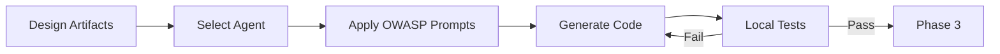
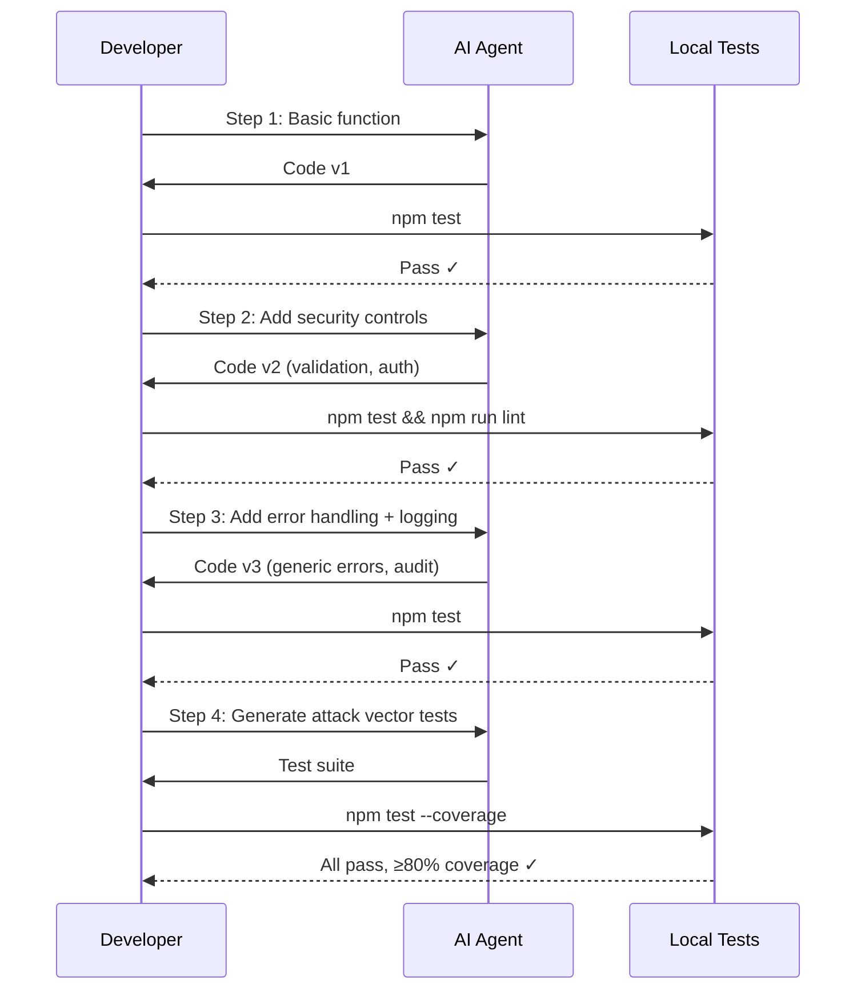

# Phase 2: Implementation

<div style="background: linear-gradient(135deg, #92400e 0%, #f59e0b 100%); border-radius: 16px; padding: 32px; margin: 32px 0; box-shadow: 0 8px 32px rgba(245, 158, 11, 0.4); border: 1px solid rgba(251, 191, 36, 0.3);">
  <div style="display: flex; align-items: center; gap: 20px; margin-bottom: 20px;">
    <div style="font-size: 56px;">2&#xFE0F;&#x20E3;</div>
    <div>
      <h2 style="margin: 0; font-size: 32px; color: #f1f5f9; font-weight: 800;">Implementation</h2>
      <div style="font-size: 16px; color: #fef3c7; margin-top: 8px;">AI-Guided Secure Code Generation</div>
    </div>
  </div>
  <div style="color: #fef3c7; font-size: 15px; line-height: 1.7;">
    Generate secure code using AI agents guided by OWASP prompt packs and architectural constraints from Phase 1. This is the "70% layer" where AI accelerates implementation.
  </div>
</div>

## Phase Overview



<div style="display: grid; grid-template-columns: repeat(auto-fit, minmax(200px, 1fr)); gap: 16px; margin: 24px 0;">
  <div style="background: linear-gradient(135deg, #1e293b 0%, #334155 100%); border-radius: 12px; padding: 20px; border: 1px solid rgba(100, 116, 139, 0.3);">
    <div style="font-size: 11px; color: #94a3b8; text-transform: uppercase; letter-spacing: 1px; margin-bottom: 6px;">Duration</div>
    <div style="font-size: 20px; color: #f1f5f9; font-weight: 700;">2-6 hours</div>
  </div>
  <div style="background: linear-gradient(135deg, #1e293b 0%, #334155 100%); border-radius: 12px; padding: 20px; border: 1px solid rgba(100, 116, 139, 0.3);">
    <div style="font-size: 11px; color: #94a3b8; text-transform: uppercase; letter-spacing: 1px; margin-bottom: 6px;">Agents</div>
    <div style="font-size: 20px; color: #f1f5f9; font-weight: 700;">Copilot, Claude, ChatGPT</div>
  </div>
  <div style="background: linear-gradient(135deg, #1e293b 0%, #334155 100%); border-radius: 12px; padding: 20px; border: 1px solid rgba(100, 116, 139, 0.3);">
    <div style="font-size: 11px; color: #94a3b8; text-transform: uppercase; letter-spacing: 1px; margin-bottom: 6px;">Outputs</div>
    <div style="font-size: 14px; color: #cbd5e1; line-height: 1.6;">Implementation code, unit tests, security controls, docs</div>
  </div>
  <div style="background: linear-gradient(135deg, #1e293b 0%, #334155 100%); border-radius: 12px; padding: 20px; border: 1px solid rgba(100, 116, 139, 0.3);">
    <div style="font-size: 11px; color: #94a3b8; text-transform: uppercase; letter-spacing: 1px; margin-bottom: 6px;">Security Gate</div>
    <div style="font-size: 14px; color: #cbd5e1; line-height: 1.6;">ESLint + Jest pass, coverage ≥ 80%</div>
  </div>
</div>

---

## Agent Selection Guide

| Agent | Best For | Example |
|---|---|---|
| **Copilot** | Single-function impl, boilerplate, pattern following | `createShare()` using A01 prompt pack |
| **Claude Code** | Multi-file features, large refactorings, test generation | Refactor entire auth module + add tests |
| **ChatGPT** | Incremental development, learning patterns, iteration | Build feature step-by-step with review |

See [Copilot Guide](/docs/agents/copilot), [Claude Guide](/docs/agents/claude), [ChatGPT Guide](/docs/agents/chatgpt) for detailed guides.

---

## Step 1: Apply OWASP Prompt Packs

From Phase 1 threat model, select the corresponding OWASP prompt packs for your identified threats. Use this RCTRO prompt to generate secure implementation code.

<div style="background: linear-gradient(135deg, #1e293b 0%, #0f172a 100%); border-radius: 12px; padding: 28px; margin: 24px 0; border: 1px solid rgba(245, 158, 11, 0.3);">
<div style="font-size: 12px; color: #fcd34d; text-transform: uppercase; letter-spacing: 1px; margin-bottom: 16px; font-weight: 700;">RCTRO Prompt — Secure Code Generation</div>

```
Role: You are a security engineer implementing OWASP [category]:2021.

Context:
- Node 18, TypeScript, Express, PostgreSQL (pg library)
- Feature: [from Phase 1 requirements]
- Architecture: [from Phase 1 design — data model, API endpoints]
- Threats to mitigate: [T1-Tn from Phase 1 threat model]

Task:
Implement the feature following the architecture design from Phase 1.
Apply security controls for each identified threat.

Requirements:
1. **Parameterized Queries**
   - Use pg query with $1, $2 placeholders (never string concatenation)
   - Validation: All queries use parameterized placeholders

2. **Input Validation**
   - Zod schemas with character allowlists
   - Max length enforcement on all string inputs
   - Validation: All user input validated before processing

3. **Authorization Controls**
   - Deny-by-default: verify ownership on every mutation
   - Generic error messages (no schema/data leaks)
   - Validation: Non-owners receive 403 with generic message

4. **Audit Logging**
   - Log all security-relevant operations
   - Redact PII (email → domain only)
   - Validation: Audit trail exists for every mutation

5. **Test Coverage**
   - Unit tests with attack payloads (SQL injection, IDOR)
   - Coverage ≥ 80% overall, 100% on security functions
   - Validation: All attack vectors tested and blocked

Output:
Complete TypeScript implementation with:
- Feature code (parameterized queries, Zod validation)
- Jest test suite (including attack vector tests)
- Security comments referencing threat IDs
```

</div>

<details>
<summary style="cursor: pointer; color: #fcd34d; font-weight: 600; padding: 8px 0;">Example: Generated secure implementation (A03 injection prevention)</summary>

```typescript
import { z } from 'zod';
import { Client } from 'pg';

// Zod validation schema (T4: Injection prevention)
const searchQuerySchema = z.string()
  .trim()
  .max(100, 'Search query too long')
  .regex(/^[a-zA-Z0-9 _\-@]*$/, 'Invalid characters');

/**
 * SECURITY: OWASP A03 - Injection Prevention
 * Threat: T4 - SQL injection via search parameter
 * Controls: Parameterized query, Zod validation, generic errors
 */
export async function searchUsers(query: string, userId: string) {
  const validated = searchQuerySchema.parse(query);

  const sql = 'SELECT id, email, name FROM users WHERE email ILIKE $1 LIMIT 50';
  const res = await client.query(sql, [`%${validated}%`]);
  return res.rows;
}
```

</details>

---

## Step 2: Incremental Development

Build features incrementally — validate at each step before proceeding.



<div style="background: linear-gradient(135deg, #1e293b 0%, #0f172a 100%); border-radius: 12px; padding: 28px; margin: 24px 0; border: 1px solid rgba(245, 158, 11, 0.3);">
<div style="font-size: 12px; color: #fcd34d; text-transform: uppercase; letter-spacing: 1px; margin-bottom: 16px; font-weight: 700;">RCTRO Prompt — Attack Vector Tests</div>

```
Role: You are a security test engineer writing OWASP attack vector tests.

Context:
- Feature: [feature name]
- OWASP Categories: [A01, A03, etc. from Phase 1]
- Implementation: [paste code from Step 1]
- Threats: [T1-Tn from Phase 1 threat model]

Task:
Generate comprehensive Jest test suite covering all identified
threats with actual attack payloads.

Requirements:
1. **Access Control Tests (A01)**
   - Unauthorized user attempts blocked
   - IDOR attacks return generic errors
   - Privilege escalation prevented
   - Validation: Each threat ID has at least one test

2. **Injection Tests (A03)**
   - SQL injection payloads: ' OR '1'='1, ; DROP TABLE, UNION SELECT
   - Command injection payloads: ; cat /etc/passwd, && rm -rf
   - All payloads return 400 with generic message
   - Validation: ≥5 injection payloads tested

3. **Logging Tests (A09)**
   - Security events logged on blocked attacks
   - PII redacted in log entries
   - Audit trail exists for all mutations
   - Validation: Every security event verified in logs

Output:
Jest test file with describe blocks per OWASP category,
attack payloads as test data, assertion on generic error messages.
```

</div>

<details>
<summary style="cursor: pointer; color: #fcd34d; font-weight: 600; padding: 8px 0;">Example: Attack vector test suite</summary>

```typescript
describe('Document Sharing - Attack Vector Tests', () => {
  describe('[A01] Access Control', () => {
    it('should block IDOR attack (T6)', async () => {
      const response = await request(app)
        .post('/api/documents/doc-victim-123/shares')
        .set('Authorization', `Bearer ${attackerToken}`)
        .send({ email: 'accomplice@evil.com', permission: 'admin' });

      expect(response.status).toBe(403);
      expect(response.body.error).toBe('Access denied');
      expect(response.body.error).not.toContain('not owner');
    });
  });

  describe('[A03] Injection', () => {
    const payloads = [
      "'; DROP TABLE users--",
      "' OR '1'='1",
      "' UNION SELECT * FROM users--",
    ];

    payloads.forEach(payload => {
      it(`should block: ${payload}`, async () => {
        const response = await request(app)
          .post('/api/documents/doc-123/shares')
          .set('Authorization', `Bearer ${ownerToken}`)
          .send({ email: payload, permission: 'read' });

        expect(response.status).toBe(400);
        expect(response.body.error).toBe('Invalid input');
      });
    });
  });

  describe('[A09] Audit Logging', () => {
    it('should log share creation (T5)', async () => {
      const response = await request(app)
        .post('/api/documents/doc-123/shares')
        .set('Authorization', `Bearer ${ownerToken}`)
        .send({ email: 'user@example.com', permission: 'read' });

      const auditLog = await db.query(
        'SELECT * FROM share_audit_log WHERE share_id = $1',
        [response.body.id]
      );
      expect(auditLog.rows[0].action).toBe('created');
    });
  });
});
```

</details>

---

## Step 3: Local Quality Gates

Before committing, run all local checks:

```bash
npm run lint        # ESLint: 0 errors, complexity ≤ 10
npm test           # Jest: all pass, coverage ≥ 80%
npm audit          # 0 high/critical vulnerabilities
```

---

## Step 4: Commit with AI Disclosure

```bash
git commit -m "feat(shares): Implement secure document sharing

Security Controls: [A01] auth checks, [A03] parameterized queries, [A09] audit logging
Threats Mitigated: T3, T4, T5, T6, T7, T9
Tests: 95% coverage, all attack vectors tested

🤖 AI-assisted with [Agent] using OWASP A01/A03/A09 prompt packs"
```

---

## Phase Handoff → Phase 3

<div style="background: rgba(245, 158, 11, 0.1); border-left: 4px solid #f59e0b; border-radius: 8px; padding: 24px; margin: 24px 0;">

```
===== PHASE 2 → PHASE 3 HANDOFF =====

Feature: [Feature name]

Implementation Complete:
- Files: [list implementation + test files]
- Coverage: [percentage]

OWASP Categories Implemented: [A01, A03, etc.]
Threats Mitigated: [T1-Tn with status]

Local Tests:
✅ ESLint: Pass
✅ Jest: [X] tests pass, [Y]% coverage
✅ npm audit: 0 high/critical

Next: CodeQL + Snyk scans in CI (Phase 3)

===== END HANDOFF =====
```

</div>

---

<div style="display: flex; justify-content: space-between; align-items: center; margin: 32px 0;">
  <a href="/docs/sdlc/phase1-design" style="color: #93c5fd; font-size: 14px; text-decoration: none;">← Phase 1: Design</a>
  <a href="/docs/sdlc/phase3-verification" style="display: inline-block; background: linear-gradient(135deg, #ef4444 0%, #dc2626 100%); color: #f1f5f9; padding: 12px 24px; border-radius: 8px; text-decoration: none; font-size: 14px; font-weight: 600;">Phase 3: Verification →</a>
</div>
