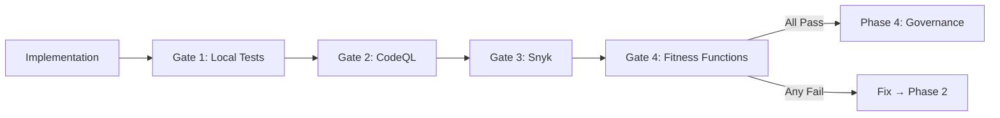

# Phase 3: Verification

<div style="background: linear-gradient(135deg, #991b1b 0%, #ef4444 100%); border-radius: 16px; padding: 32px; margin: 32px 0; box-shadow: 0 8px 32px rgba(239, 68, 68, 0.4); border: 1px solid rgba(248, 113, 113, 0.3);">
  <div style="display: flex; align-items: center; gap: 20px; margin-bottom: 20px;">
    <div style="font-size: 56px;">3&#xFE0F;&#x20E3;</div>
    <div>
      <h2 style="margin: 0; font-size: 32px; color: #f1f5f9; font-weight: 800;">Verification</h2>
      <div style="font-size: 16px; color: #fecaca; margin-top: 8px;">Automated Security Scanning & Fitness Functions</div>
    </div>
  </div>
  <div style="color: #fecaca; font-size: 15px; line-height: 1.7;">
    Validate implementation through 4 automated gates: local tests, CodeQL SAST, Snyk SCA, and fitness function enforcement. All gates must pass before human review.
  </div>
</div>

## Phase Overview



<div style="display: grid; grid-template-columns: repeat(auto-fit, minmax(200px, 1fr)); gap: 16px; margin: 24px 0;">
  <div style="background: linear-gradient(135deg, #1e293b 0%, #334155 100%); border-radius: 12px; padding: 20px; border: 1px solid rgba(100, 116, 139, 0.3);">
    <div style="font-size: 11px; color: #94a3b8; text-transform: uppercase; letter-spacing: 1px; margin-bottom: 6px;">Duration</div>
    <div style="font-size: 20px; color: #f1f5f9; font-weight: 700;">30-60 min</div>
  </div>
  <div style="background: linear-gradient(135deg, #1e293b 0%, #334155 100%); border-radius: 12px; padding: 20px; border: 1px solid rgba(100, 116, 139, 0.3);">
    <div style="font-size: 11px; color: #94a3b8; text-transform: uppercase; letter-spacing: 1px; margin-bottom: 6px;">Tools</div>
    <div style="font-size: 20px; color: #f1f5f9; font-weight: 700;">ESLint, Jest, CodeQL, Snyk</div>
  </div>
  <div style="background: linear-gradient(135deg, #1e293b 0%, #334155 100%); border-radius: 12px; padding: 20px; border: 1px solid rgba(100, 116, 139, 0.3);">
    <div style="font-size: 11px; color: #94a3b8; text-transform: uppercase; letter-spacing: 1px; margin-bottom: 6px;">Mode</div>
    <div style="font-size: 14px; color: #cbd5e1; line-height: 1.6;">Automated (CI/CD pipeline)</div>
  </div>
  <div style="background: linear-gradient(135deg, #1e293b 0%, #334155 100%); border-radius: 12px; padding: 20px; border: 1px solid rgba(100, 116, 139, 0.3);">
    <div style="font-size: 11px; color: #94a3b8; text-transform: uppercase; letter-spacing: 1px; margin-bottom: 6px;">Security Gate</div>
    <div style="font-size: 14px; color: #cbd5e1; line-height: 1.6;">0 high/critical findings across all scanners</div>
  </div>
</div>

---

## The 4 Verification Gates

<div style="display: grid; grid-template-columns: repeat(auto-fit, minmax(250px, 1fr)); gap: 16px; margin: 24px 0;">

<div style="background: linear-gradient(135deg, #1e293b 0%, #0f172a 100%); border-radius: 12px; padding: 20px; border-left: 4px solid #3b82f6;">
  <div style="font-size: 15px; font-weight: 700; color: #93c5fd; margin-bottom: 8px;">Gate 1: Local Tests</div>
  <div style="color: #cbd5e1; font-size: 13px; line-height: 1.7;">
    ESLint: 0 errors, complexity ≤ 10<br/>
    Jest: all pass, coverage ≥ 80%<br/>
    npm audit: 0 high/critical
  </div>
  <div style="color: #64748b; font-size: 12px; margin-top: 8px;">Run: <code>npm run lint && npm test && npm audit</code></div>
</div>

<div style="background: linear-gradient(135deg, #1e293b 0%, #0f172a 100%); border-radius: 12px; padding: 20px; border-left: 4px solid #ef4444;">
  <div style="font-size: 15px; font-weight: 700; color: #fca5a5; margin-bottom: 8px;">Gate 2: CodeQL (SAST)</div>
  <div style="color: #cbd5e1; font-size: 13px; line-height: 1.7;">
    SQL injection, XSS, path traversal<br/>
    Hardcoded credentials, weak crypto<br/>
    0 high/critical findings
  </div>
  <div style="color: #64748b; font-size: 12px; margin-top: 8px;">Runs in: GitHub Actions CI</div>
</div>

<div style="background: linear-gradient(135deg, #1e293b 0%, #0f172a 100%); border-radius: 12px; padding: 20px; border-left: 4px solid #f59e0b;">
  <div style="font-size: 15px; font-weight: 700; color: #fcd34d; margin-bottom: 8px;">Gate 3: Snyk (SCA)</div>
  <div style="color: #cbd5e1; font-size: 13px; line-height: 1.7;">
    Known CVEs in dependencies (A06)<br/>
    License compliance<br/>
    0 high/critical vulnerabilities
  </div>
  <div style="color: #64748b; font-size: 12px; margin-top: 8px;">Runs in: GitHub Actions CI + weekly</div>
</div>

<div style="background: linear-gradient(135deg, #1e293b 0%, #0f172a 100%); border-radius: 12px; padding: 20px; border-left: 4px solid #a855f7;">
  <div style="font-size: 15px; font-weight: 700; color: #d8b4fe; margin-bottom: 8px;">Gate 4: Fitness Functions</div>
  <div style="color: #cbd5e1; font-size: 13px; line-height: 1.7;">
    Complexity ≤ 10, Coverage ≥ 80%<br/>
    Dependencies < 3 months old<br/>
    All thresholds from Phase 1 met
  </div>
  <div style="color: #64748b; font-size: 12px; margin-top: 8px;">Run: <code>node scripts/fitness-functions.js</code></div>
</div>

</div>

---

## CI Configuration

<details>
<summary style="cursor: pointer; color: #fca5a5; font-weight: 600; padding: 8px 0;">CodeQL workflow (.github/workflows/codeql.yml)</summary>

```yaml
name: CodeQL Security Analysis
on:
  push:
    branches: [main]
  pull_request:
    branches: [main]

jobs:
  analyze:
    runs-on: ubuntu-latest
    permissions:
      security-events: write
    steps:
      - uses: actions/checkout@v4
      - uses: github/codeql-action/init@v3
        with:
          languages: javascript, typescript
          queries: security-extended
      - uses: github/codeql-action/analyze@v3
```

</details>

<details>
<summary style="cursor: pointer; color: #fcd34d; font-weight: 600; padding: 8px 0;">Snyk workflow (.github/workflows/snyk.yml)</summary>

```yaml
name: Snyk Security Scan
on:
  push:
    branches: [main]
  pull_request:
    branches: [main]
  schedule:
    - cron: '0 0 * * 0'

jobs:
  security:
    runs-on: ubuntu-latest
    steps:
      - uses: actions/checkout@v4
      - uses: snyk/actions/node@master
        env:
          SNYK_TOKEN: ${{ secrets.SNYK_TOKEN }}
        with:
          args: --severity-threshold=high
```

</details>

<details>
<summary style="cursor: pointer; color: #d8b4fe; font-weight: 600; padding: 8px 0;">Fitness functions script (scripts/fitness-functions.js)</summary>

```javascript
const { execSync } = require('child_process');
const fs = require('fs');

function checkComplexity() {
  try {
    execSync('npm run lint -- --max-warnings=0', { stdio: 'inherit' });
    console.log('✅ Complexity: PASS');
    return true;
  } catch { console.error('❌ Complexity: FAIL'); return false; }
}

function checkCoverage() {
  execSync('npm test -- --coverage --silent');
  const coverage = JSON.parse(fs.readFileSync('./coverage/coverage-summary.json'));
  const { lines, branches, functions } = coverage.total;
  const pass = lines.pct >= 80 && branches.pct >= 80 && functions.pct >= 80;
  console.log(pass ? '✅ Coverage: PASS' : `❌ Coverage: FAIL (${lines.pct}%)`);
  return pass;
}

function checkSecurity() {
  try {
    execSync('npm audit --audit-level=high', { stdio: 'inherit' });
    console.log('✅ Security: PASS');
    return true;
  } catch { console.error('❌ Security: FAIL'); return false; }
}

const results = [checkComplexity(), checkCoverage(), checkSecurity()];
process.exit(results.every(r => r) ? 0 : 1);
```

</details>

---

## Remediation with AI

When a gate fails, use this RCTRO prompt to fix findings.

<div style="background: linear-gradient(135deg, #1e293b 0%, #0f172a 100%); border-radius: 12px; padding: 28px; margin: 24px 0; border: 1px solid rgba(239, 68, 68, 0.3);">
<div style="font-size: 12px; color: #fca5a5; text-transform: uppercase; letter-spacing: 1px; margin-bottom: 16px; font-weight: 700;">RCTRO Prompt — Finding Remediation</div>

```
Role: You are a security engineer remediating scanner findings.

Context:
- Scanner: [CodeQL / Snyk / ESLint]
- Finding: [paste finding details — rule ID, severity, location]
- Current code: [paste affected code]
- OWASP Category: [mapped category]

Task:
Fix the identified finding while maintaining existing functionality
and security controls from Phase 1 threat model.

Requirements:
1. **Root Cause**
   - Identify why the scanner flagged this code
   - Validation: Explain the attack vector

2. **Fix Implementation**
   - Apply the minimum change to resolve the finding
   - Maintain all existing security controls
   - Validation: Scanner no longer flags this code

3. **Regression Prevention**
   - Add or update tests to cover the fixed scenario
   - Validation: Test fails if vulnerability reintroduced

Output:
- Fixed code with inline comment explaining the fix
- New or updated test case
- Verification command to confirm fix
```

</div>

<details>
<summary style="cursor: pointer; color: #fca5a5; font-weight: 600; padding: 8px 0;">Example: Complexity refactoring (fitness function failure)</summary>

```typescript
// ❌ Before: complexity 12
export async function createShare(documentId, requesterId, data) {
  const doc = await getDocument(documentId);
  if (!doc) throw new NotFoundError('Not found');
  if (doc.owner_id !== requesterId) throw new UnauthorizedError('Access denied');
  let validated;
  try { validated = shareSchema.parse(data); }
  catch (err) { throw new ValidationError('Invalid input'); }
  const existing = await db.query('SELECT * FROM shares WHERE document_id = $1 AND email = $2', [documentId, validated.email]);
  if (existing.rows.length) throw new ConflictError('Share exists');
  const share = await db.query('INSERT INTO shares (...) VALUES ($1, $2, $3)', [documentId, requesterId, validated.email]);
  await auditLog('share_created', { shareId: share.id, userId: requesterId });
  return share.rows[0];
}

// ✅ After: complexity 4, 3, 2 (extracted functions)
export async function createShare(documentId, requesterId, data) {
  await verifyOwnership(documentId, requesterId);
  const validated = validateShareInput(data);
  const share = await insertShare(documentId, requesterId, validated);
  await auditLog('share_created', { shareId: share.id, userId: requesterId });
  return share;
}
```

</details>

---

## Verification Report Template

Generate this report for Phase 4 handoff:

```markdown
# Verification Report: [Feature Name]

## Gate 1: Local Tests — [PASS/FAIL]
- ESLint: [X] errors, [X] warnings
- Jest: [X] tests, [X]% coverage
- npm audit: [X] vulnerabilities

## Gate 2: CodeQL — [PASS/FAIL]
- Findings: [X] high, [X] critical
- Queries: security-extended

## Gate 3: Snyk — [PASS/FAIL]
- Dependencies: [X] scanned
- Vulnerabilities: [X] high, [X] critical

## Gate 4: Fitness Functions — [PASS/FAIL]
- Complexity: max [X] (threshold 10)
- Coverage: [X]% (threshold 80%)
- Dependencies: all < [X] months (threshold 3)

## Threat Coverage
[T1-Tn]: ✅/❌ verified

## Recommendation: [APPROVED/BLOCKED] for Phase 4
```

---

## Phase Handoff → Phase 4

<div style="background: rgba(239, 68, 68, 0.1); border-left: 4px solid #ef4444; border-radius: 8px; padding: 24px; margin: 24px 0;">

```
===== PHASE 3 → PHASE 4 HANDOFF =====

Feature: [Feature name]

Verification Complete:
✅ All 4 gates passed
✅ [X]% coverage with attack vector tests
✅ 0 high/critical findings
✅ All threats from Phase 1 verified

Artifacts:
- Verification report (attached)
- Files for review: [list]

Next: Human code review with Golden Rules (Phase 4)

===== END HANDOFF =====
```

</div>

---

<div style="display: flex; justify-content: space-between; align-items: center; margin: 32px 0;">
  <a href="/docs/sdlc/phase2-implementation" style="color: #fcd34d; font-size: 14px; text-decoration: none;">← Phase 2: Implementation</a>
  <a href="/docs/sdlc/phase4-governance" style="display: inline-block; background: linear-gradient(135deg, #a855f7 0%, #9333ea 100%); color: #f1f5f9; padding: 12px 24px; border-radius: 8px; text-decoration: none; font-size: 14px; font-weight: 600;">Phase 4: Governance →</a>
</div>
