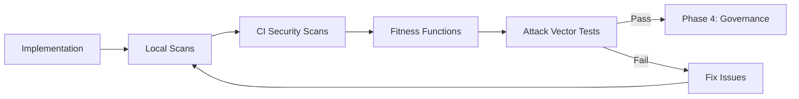
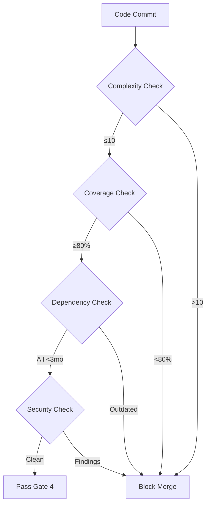

# Phase 3: Verification

> **Purpose**: Validate implementation through automated security scanning, comprehensive testing, and fitness function enforcement.

---

## Phase Overview



**Duration**: 30-60 minutes (automated)

**Tools**: ESLint, Jest, CodeQL, Snyk, custom fitness function scripts

---

## Verification Gates

### Gate 1: Local Tests (Pre-commit)

```bash
# Run all local checks
npm run lint        # ESLint security + complexity rules
npm test           # Jest unit tests with coverage
npm audit          # Dependency vulnerability scan
```

**Pass Criteria**:
- ESLint: 0 errors, complexity ≤10
- Jest: All tests pass, coverage ≥80%
- npm audit: 0 high/critical vulnerabilities

### Gate 2: CodeQL Security Scanning

**What CodeQL Detects**:
- SQL injection (A03)
- XSS vulnerabilities (A03)
- Path traversal (A01)
- Command injection (A03)
- Hardcoded credentials (A02, A05)
- Insecure randomness (A02)
- Weak cryptography (A02)

**Configuration** (`.github/workflows/codeql.yml`):
```yaml
name: CodeQL Security Analysis

on:
  push:
    branches: [main]
  pull_request:
    branches: [main]

jobs:
  analyze:
    runs-on: ubuntu-latest
    permissions:
      security-events: write

    steps:
      - uses: actions/checkout@v4
      - uses: github/codeql-action/init@v3
        with:
          languages: javascript, typescript
          queries: security-extended  # Include all security queries

      - uses: github/codeql-action/analyze@v3
```

**Pass Criteria**: 0 high or critical findings

### Gate 3: Snyk Dependency Scanning

**What Snyk Detects**:
- Known CVEs in dependencies (A06)
- License compliance issues
- Outdated packages (fitness function)
- Transitive vulnerability chains

**Configuration** (`.github/workflows/snyk.yml`):
```yaml
name: Snyk Security Scan

on:
  push:
    branches: [main]
  pull_request:
    branches: [main]
  schedule:
    - cron: '0 0 * * 0'  # Weekly scan

jobs:
  security:
    runs-on: ubuntu-latest
    steps:
      - uses: actions/checkout@v4
      - uses: snyk/actions/node@master
        env:
          SNYK_TOKEN: ${{ secrets.SNYK_TOKEN }}
        with:
          args: --severity-threshold=high
```

**Pass Criteria**: 0 high/critical vulnerabilities

### Gate 4: Fitness Function Validation



**Implementation**:

```javascript
// scripts/fitness-functions.js

const { execSync } = require('child_process');
const fs = require('fs');

// Fitness Function 1: Complexity
function checkComplexity() {
  try {
    execSync('npm run lint -- --max-warnings=0', { stdio: 'inherit' });
    console.log('✅ Complexity fitness function: PASS');
    return true;
  } catch {
    console.error('❌ Complexity fitness function: FAIL');
    return false;
  }
}

// Fitness Function 2: Test Coverage
function checkCoverage() {
  execSync('npm test -- --coverage --silent');
  const coverage = JSON.parse(fs.readFileSync('./coverage/coverage-summary.json'));
  const { lines, branches, functions } = coverage.total;

  const passing = lines.pct >= 80 && branches.pct >= 80 && functions.pct >= 80;

  if (passing) {
    console.log('✅ Coverage fitness function: PASS');
  } else {
    console.error(`❌ Coverage fitness function: FAIL (${lines.pct}% lines)`);
  }

  return passing;
}

// Fitness Function 3: Dependency Freshness
function checkDependencies() {
  const outdated = execSync('npm outdated --json', { encoding: 'utf-8' });
  const packages = JSON.parse(outdated || '{}');

  const threeMonthsAgo = new Date();
  threeMonthsAgo.setMonth(threeMonthsAgo.getMonth() - 3);

  let hasStale = false;
  for (const [pkg, info] of Object.entries(packages)) {
    // Check if current version is >3 months old
    const pkgDate = new Date(info.time?.[info.current] || 0);
    if (pkgDate < threeMonthsAgo) {
      console.warn(`⚠️  ${pkg} is older than 3 months`);
      hasStale = true;
    }
  }

  if (!hasStale) {
    console.log('✅ Dependency freshness fitness function: PASS');
  } else {
    console.error('❌ Dependency freshness fitness function: FAIL');
  }

  return !hasStale;
}

// Fitness Function 4: Security Compliance
function checkSecurity() {
  try {
    execSync('npm audit --audit-level=high', { stdio: 'inherit' });
    console.log('✅ Security fitness function: PASS');
    return true;
  } catch {
    console.error('❌ Security fitness function: FAIL');
    return false;
  }
}

// Run all fitness functions
const results = [
  checkComplexity(),
  checkCoverage(),
  checkDependencies(),
  checkSecurity()
];

if (results.every(r => r)) {
  console.log('\n✅ All fitness functions PASSED');
  process.exit(0);
} else {
  console.error('\n❌ One or more fitness functions FAILED');
  process.exit(1);
}
```

**Add to CI** (`.github/workflows/ci.yml`):
```yaml
- name: Run Fitness Functions
  run: node scripts/fitness-functions.js
```

---

## Attack Vector Testing

### OWASP-Specific Test Suites

Generate comprehensive attack vector tests using **Claude**:

```markdown
Role: Security Test Engineer

Context:
- Feature: Document sharing
- OWASP Categories: A01, A03, A09
- Implementation: [paste code]

Task: Generate comprehensive security tests for attack vectors.

For each OWASP category, create tests:

## A01: Broken Access Control
- Unauthorized user attempts to create share
- User attempts to share document they don't own (IDOR)
- Recipient attempts to re-share document
- Admin bypass attempts

## A03: Injection
- SQL injection in email parameter
- SQL injection in permission parameter
- Command injection attempts
- Path traversal in file parameters

## A09: Logging Failures
- Verify audit log created on share creation
- Verify authorization failures logged
- Verify injection attempts logged
- Verify PII redacted from logs

Each test should:
- Include actual attack payload
- Verify attack is blocked
- Check that error message is generic
- Confirm security event logged
```

**Example Test Suite**:

```typescript
describe('Document Sharing - Attack Vector Tests', () => {
  describe('[A01] Access Control Attacks', () => {
    it('should block IDOR attack (T6)', async () => {
      // Attacker tries to share document they don't own
      const response = await request(app)
        .post('/api/documents/doc-victim-123/shares')
        .set('Authorization', `Bearer ${attackerToken}`)
        .send({
          email: 'accomplice@evil.com',
          permission: 'admin'
        });

      expect(response.status).toBe(403);
      expect(response.body.error).toBe('Access denied');  // Generic
      expect(response.body.error).not.toContain('not owner');  // No info leak

      // Verify security event logged
      const logs = await getSecurityLogs();
      expect(logs).toContainEqual(
        expect.objectContaining({
          event: 'unauthorized_share_attempt',
          userId: attackerId,
          documentId: 'doc-victim-123'
        })
      );
    });

    it('should prevent privilege escalation via share (T3)', async () => {
      // Recipient with read permission tries to modify their own permission to admin
      const response = await request(app)
        .patch('/api/shares/share-123')
        .set('Authorization', `Bearer ${recipientToken}`)
        .send({ permission: 'admin' });

      expect(response.status).toBe(403);
    });
  });

  describe('[A03] Injection Attacks', () => {
    it('should block SQL injection in email field (T4)', async () => {
      const sqlInjectionPayloads = [
        "'; DROP TABLE users--",
        "' OR '1'='1",
        "'; UPDATE document_shares SET permission='admin'--",
        "admin'--",
        "' UNION SELECT * FROM users--"
      ];

      for (const payload of sqlInjectionPayloads) {
        const response = await request(app)
          .post('/api/documents/doc-123/shares')
          .set('Authorization', `Bearer ${ownerToken}`)
          .send({
            email: payload,
            permission: 'read'
          });

        expect(response.status).toBe(400);
        expect(response.body.error).toBe('Invalid input');  // Generic
      }
    });

    it('should block command injection attempts (T4)', async () => {
      const commandInjectionPayloads = [
        'user@example.com; cat /etc/passwd',
        'user@example.com && rm -rf /',
        'user@example.com | whoami'
      ];

      for (const payload of commandInjectionPayloads) {
        const response = await request(app)
          .post('/api/documents/doc-123/shares')
          .set('Authorization', `Bearer ${ownerToken}`)
          .send({
            email: payload,
            permission: 'read'
          });

        expect(response.status).toBe(400);
      }
    });
  });

  describe('[A09] Logging Validation', () => {
    it('should create audit trail on share creation (T5)', async () => {
      const response = await request(app)
        .post('/api/documents/doc-123/shares')
        .set('Authorization', `Bearer ${ownerToken}`)
        .send({
          email: 'recipient@example.com',
          permission: 'read'
        });

      expect(response.status).toBe(201);
      const shareId = response.body.id;

      // Verify audit log entry
      const auditLog = await db.query(
        'SELECT * FROM share_audit_log WHERE share_id = $1',
        [shareId]
      );

      expect(auditLog.rows).toHaveLength(1);
      expect(auditLog.rows[0]).toMatchObject({
        action: 'created',
        user_id: ownerId,
        share_id: shareId
      });
    });

    it('should redact PII from logs (A09)', async () => {
      await createShare('doc-123', ownerId, {
        email: 'sensitive-user@example.com',
        permission: 'read'
      });

      const logs = await getAuditLogs();

      // Email should be redacted (domain only or hashed)
      expect(logs[0].metadata.email).not.toBe('sensitive-user@example.com');
      expect(logs[0].metadata.email).toMatch(/\*+@example\.com/);  // Redacted
    });
  });
});
```

---

## Code Complexity Validation

### ESLint Complexity Rules

```javascript
// .eslintrc.cjs
module.exports = {
  rules: {
    'complexity': ['error', { max: 10 }],
    'max-lines-per-function': ['error', { max: 50, skipBlankLines: true, skipComments: true }],
    'max-depth': ['error', 4],
    'max-nested-callbacks': ['error', 3]
  }
};
```

**If complexity exceeds threshold**, refactor:

```typescript
// ❌ Too complex (complexity 12)
export async function createShare(documentId, requesterId, data) {
  const doc = await getDocument(documentId);
  if (!doc) throw new NotFoundError('Document not found');
  if (doc.owner_id !== requesterId) throw new UnauthorizedError('Access denied');

  let validated;
  try {
    validated = shareSchema.parse(data);
  } catch (err) {
    logger.security('validation_failed', { requesterId, error: err });
    throw new ValidationError('Invalid input');
  }

  const existing = await db.query('SELECT * FROM shares WHERE document_id = $1 AND email = $2', [documentId, validated.email]);
  if (existing.rows.length) throw new ConflictError('Share exists');

  const share = await db.query('INSERT INTO shares (...) VALUES ($1, $2, $3)', [documentId, requesterId, validated.email]);

  await auditLog('share_created', { shareId: share.id, userId: requesterId });

  return share.rows[0];
}

// ✅ Refactored (complexity 4, 3, 2)
export async function createShare(documentId, requesterId, data) {
  await verifyOwnership(documentId, requesterId);  // Complexity 3
  const validated = validateShareInput(data);      // Complexity 2
  const share = await insertShare(documentId, requesterId, validated);  // Complexity 4
  await auditLog('share_created', { shareId: share.id, userId: requesterId });
  return share;
}

async function verifyOwnership(documentId, requesterId) {
  const doc = await getDocument(documentId);
  if (!doc) throw new NotFoundError('Document not found');
  if (doc.owner_id !== requesterId) throw new UnauthorizedError('Access denied');
}

function validateShareInput(data) {
  try {
    return shareSchema.parse(data);
  } catch (err) {
    logger.security('validation_failed', { error: err });
    throw new ValidationError('Invalid input');
  }
}

async function insertShare(documentId, ownerId, validated) {
  const existing = await db.query('SELECT * FROM shares WHERE document_id = $1 AND email = $2', [documentId, validated.email]);
  if (existing.rows.length) throw new ConflictError('Share exists');

  const result = await db.query('INSERT INTO shares (...) VALUES ($1, $2, $3) RETURNING *', [documentId, ownerId, validated.email]);
  return result.rows[0];
}
```

---

## Verification Report

Generate a verification report for Phase 4 review:

```markdown
# Verification Report: Document Sharing

**Feature**: Document Sharing
**Date**: 2025-10-10
**Engineer**: [Your Name]
**OWASP Categories**: A01, A03, A09

## Gate 1: Local Tests ✅ PASS
- ESLint: 0 errors, 0 warnings
- Jest: 42 tests pass, 95% coverage
- npm audit: 0 vulnerabilities

## Gate 2: CodeQL ✅ PASS
- Scan completed: 2025-10-10 14:30 UTC
- Findings: 0 high, 0 critical
- Queries run: 147 security-extended queries
- Languages: TypeScript, JavaScript

## Gate 3: Snyk ✅ PASS
- Dependencies scanned: 256
- Vulnerabilities: 0 high, 0 critical, 2 medium (accepted via policy)
- License compliance: All MIT/Apache-2.0
- Dependency freshness: All <2 months old

## Gate 4: Fitness Functions ✅ PASS
✅ Complexity: Max 8 (threshold 10)
✅ Coverage: 95% (threshold 80%)
✅ Dependencies: All <2mo (threshold <3mo)
✅ Security: 0 high/critical (threshold 0)

## Attack Vector Tests ✅ PASS
- A01 tests: 12/12 pass (IDOR, privilege escalation)
- A03 tests: 15/15 pass (SQL injection, command injection)
- A09 tests: 6/6 pass (audit logging, PII redaction)

## Threat Coverage
✅ T1: JWT validation verified
✅ T3: Permission escalation blocked
✅ T4: Injection attempts blocked
✅ T5: Audit trail validated
✅ T6: IDOR attacks prevented
✅ T7: Generic errors confirmed
✅ T8: Rate limiting enforced
✅ T9: Re-sharing prevented

## Recommendation
✅ **APPROVED FOR PHASE 4: GOVERNANCE**

All verification gates passed. Code is ready for human security review.
```

---

## Handoff to Phase 4

```markdown
===== PHASE 3 → PHASE 4 HANDOFF =====

Feature: Document Sharing

Verification Complete:
✅ All gates passed (ESLint, Jest, CodeQL, Snyk, Fitness Functions)
✅ 95% test coverage with attack vectors
✅ 0 high/critical security findings
✅ All 9 threats from Phase 1 mitigated and verified

Files for Review:
- src/shares/createShare.ts (implementation)
- src/shares/__tests__/createShare.test.ts (tests)
- Verification report (attached)

OWASP Checklist for Human Review:
□ A01: Authorization logic correct
□ A03: No injection vulnerabilities
□ A09: Audit logging comprehensive

Next: Human code review with Golden Rules checklist (Phase 4)

===== END HANDOFF =====
```

---

## Best Practices

**Do's**:
- Run all gates locally before pushing
- Fix failures immediately (don't accumulate)
- Include attack vector tests for each OWASP category
- Generate verification reports for audit trail

**Don'ts**:
- Skip gates ("I'll fix in next PR")
- Ignore fitness function failures
- Accept CodeQL/Snyk findings without investigation
- Commit code with failing tests

---

**[Proceed to Phase 4: Governance →](phase4-governance.md)**
