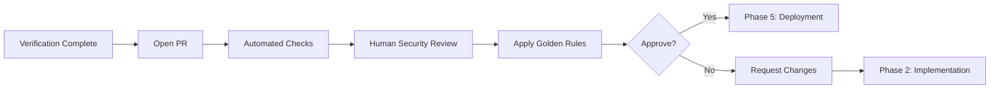
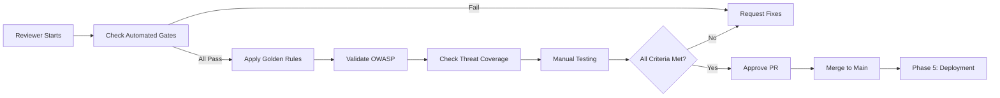

# Phase 4: Governance

> **Purpose**: Human-in-the-loop review applying Golden Rules, security checklists, and OWASP validation before merge.

---

## Phase Overview



**Duration**: 15-45 minutes (human review time)

**Participants**: Engineer (PR author), Human Reviewer, ChatGPT (checklist validation)

---

## PR Template

Use this template for all AI-assisted PRs:

```markdown
## Feature Description
[What does this PR implement?]

## OWASP Categories Addressed
- [ ] A01: Broken Access Control
- [ ] A03: Injection
- [ ] A09: Logging/Monitoring Failures

## Threats Mitigated (from Phase 1)
- [x] T1: JWT validation
- [x] T3: Permission escalation
- [x] T4: SQL injection
- [x] T5: Audit logging
- [x] T6: IDOR attacks
- [x] T7: Generic errors
- [x] T8: Rate limiting
- [x] T9: Re-sharing prevention

## Verification Results
- [x] ESLint: Pass
- [x] Jest: 95% coverage, 42 tests pass
- [x] CodeQL: 0 high/critical findings
- [x] Snyk: 0 high/critical vulnerabilities
- [x] Fitness Functions: All pass

## AI Assistance Disclosure
- [x] This PR includes AI-generated code
- **AI Tool**: GitHub Copilot
- **Prompt Packs Used**:
  - `/prompts/owasp/A01_broken_access_control.md`
  - `/prompts/owasp/A03_injection.md`
  - `/prompts/owasp/A09_logging_monitoring.md`
- **Human Review**: Code reviewed line-by-line, attack vectors tested
- **Changes After AI**: Added edge case handling for concurrent operations

## Golden Rules Checklist
- [x] Rule 1: Specific prompts with constraints used
- [x] Rule 2: I understand every line of code
- [x] Rule 3: AI treated as junior dev, guidance provided
- [x] Rule 4: Commits labeled with 🤖 AI-assisted
- [x] Rule 5: Security rationale documented in code comments
- [x] Rule 6: Successful prompts added to `/prompts/team/`

## Security Checklist
- [x] Input validation on all user-provided data
- [x] Parameterized queries (no string concatenation)
- [x] Authorization checks on all operations
- [x] Generic error messages (no info leakage)
- [x] Security events logged
- [x] Attack vector tests included
- [x] No hardcoded secrets

## Testing
- Unit tests: 42 tests, 95% coverage
- Attack vector tests: 33 tests (SQL injection, IDOR, etc.)
- Integration tests: 8 tests
- Manual testing: Share creation, revocation, permissions

## Performance
- Share creation: 145ms (p95)
- Share listing: 68ms (p95)
- No N+1 queries identified

## Breaking Changes
- None

## Rollback Plan
- Revert commit `abc123` if share creation fails
- Database migration is reversible (DROP TABLE)

## References
- Threat Model: [Link to Phase 1 doc]
- Architecture: [Link to design doc]
- OWASP A01: https://owasp.org/Top10/A01_2021-Broken_Access_Control/
```

---

## Human Review Process

### Step 1: Automated PR Checks

GitHub Actions runs automatically on PR open:

```yaml
# .github/workflows/pr-checks.yml
name: PR Security Checks

on:
  pull_request:
    branches: [main]

jobs:
  security-review:
    runs-on: ubuntu-latest
    steps:
      - uses: actions/checkout@v4

      - name: ESLint
        run: npm run lint

      - name: Jest Tests
        run: npm test -- --coverage

      - name: CodeQL Analysis
        uses: github/codeql-action/analyze@v3

      - name: Snyk Security Scan
        uses: snyk/actions/node@master
        env:
          SNYK_TOKEN: ${{ secrets.SNYK_TOKEN }}

      - name: Fitness Functions
        run: node scripts/fitness-functions.js

      - name: PR Template Check
        run: |
          if ! grep -q "AI Assistance Disclosure" PR_BODY.md; then
            echo "❌ PR must include AI disclosure section"
            exit 1
          fi
```

All checks must pass before human review begins.

---

### Step 2: Golden Rules Validation

Reviewer applies each of the 6 Golden Rules:

**Rule 1: Be Specific About Intent and Constraints**
```markdown
Review Question: Were the prompts specific?

Check:
- [ ] OWASP prompt packs referenced in commits
- [ ] Tech stack constraints specified
- [ ] Security requirements explicit
- [ ] Task broken into clear steps

Evidence: Check commit messages for prompt references.
```

**Rule 2: Trust But Verify**
```markdown
Review Question: Does the reviewer understand the code?

Check:
- [ ] Review each function for security logic
- [ ] Verify all OWASP controls are correctly implemented
- [ ] Test with attack payloads (manually or via tests)
- [ ] No "magic" code that isn't explained

Red Flags:
❌ Hardcoded secrets
❌ Missing input validation
❌ Generic try/catch without error handling
❌ Disabled security checks
```

**Rule 3: Treat AI Like a Junior Dev**
```markdown
Review Question: Is the code quality appropriate?

Check:
- [ ] Code follows team patterns and style
- [ ] No over-engineering or unnecessary complexity
- [ ] Security controls are not "clever" (simple > clever)
- [ ] Tests are comprehensive (not just happy path)

Ask: Would I approve this from a junior developer?
```

**Rule 4: Isolate AI Changes**
```markdown
Review Question: Are AI-generated changes clearly labeled?

Check:
- [ ] Commits have 🤖 AI-assisted label
- [ ] AI tool identified (Copilot/Claude/ChatGPT)
- [ ] Prompt pack referenced
- [ ] PR has AI disclosure section

Evidence: Search commit messages for "AI-assisted"
```

**Rule 5: Document Rationale**
```markdown
Review Question: Are security decisions documented?

Check:
- [ ] Inline comments explain "why" not just "what"
- [ ] OWASP categories referenced in code
- [ ] Threat IDs from Phase 1 linked to controls
- [ ] ADRs created for significant decisions

Example:
// SECURITY: OWASP A01 - Why we check ownership here
// Threat: T6 (IDOR attack via share enumeration)
// Mitigation: Verify requester owns document before allowing share
```

**Rule 6: Share Winning Prompts**
```markdown
Review Question: Should this prompt be added to team library?

Check:
- [ ] Prompt produced secure code on first try?
- [ ] Reusable pattern for future features?
- [ ] Added to `/prompts/team/` directory?

Action: If yes, create prompt pack in team library
```

---

### Step 3: OWASP Compliance Review

Use **ChatGPT** to validate OWASP compliance:

```markdown
Role: Security Code Reviewer

Context:
- PR implements document sharing feature
- Claims to address OWASP A01, A03, A09
- Code: [paste implementation]

Task: Review code against OWASP checklists.

For each category:

## A01: Broken Access Control
Checklist:
□ Deny-by-default access control
□ Ownership verification before operations
□ No IDOR vulnerabilities (non-sequential IDs)
□ Authorization failures logged
□ No client-side access control bypass

Finding: [PASS/FAIL with explanation]

## A03: Injection
Checklist:
□ Parameterized queries only (no string concat)
□ Input validation with Zod/schema validation
□ Character allowlists for text inputs
□ Length limits enforced
□ Output encoding if rendered

Finding: [PASS/FAIL with explanation]

## A09: Logging/Monitoring
Checklist:
□ Security events logged (auth failures, injection attempts)
□ PII redacted from logs
□ Logs immutable and tamper-evident
□ Log correlation IDs for tracing

Finding: [PASS/FAIL with explanation]

Overall Recommendation: APPROVE / REQUEST CHANGES
```

---

### Step 4: Security Threat Coverage

Verify every threat from Phase 1 is mitigated:

```markdown
Threat Coverage Matrix:

| Threat | Mitigation | Code Location | Test Coverage | Status |
|--------|------------|---------------|---------------|--------|
| T1: JWT forgery | JWT signature validation | `auth.middleware.ts:12` | `auth.test.ts:45` | ✅ Pass |
| T3: Permission escalation | Immutable permissions | `createShare.ts:28` | `createShare.test.ts:67` | ✅ Pass |
| T4: SQL injection | Parameterized queries + Zod | `createShare.ts:34` | `createShare.test.ts:89` | ✅ Pass |
| T5: No audit trail | Audit logging | `createShare.ts:42` | `createShare.test.ts:110` | ✅ Pass |
| T6: IDOR | UUID IDs + authz check | `createShare.ts:18` | `createShare.test.ts:55` | ✅ Pass |
| T7: Info disclosure | Generic errors | `errors.ts:15` | `createShare.test.ts:78` | ✅ Pass |
| T8: DoS | Rate limiting | `routes.ts:8` | `routes.test.ts:23` | ✅ Pass |
| T9: Re-sharing | Owner-only check | `createShare.ts:22` | `createShare.test.ts:62` | ✅ Pass |

Result: 8/8 threats mitigated ✅
```

---

### Step 5: Manual Security Testing

Perform exploratory security testing:

```markdown
Manual Test Plan:

1. **IDOR Attack**:
   - Create share as User A for doc-123
   - Try to access share as User B (should fail)
   - Try to modify share as User B (should fail)

2. **SQL Injection**:
   - Submit email: `'; DROP TABLE users--`
   - Verify: 400 error, validation message, no database change

3. **Permission Escalation**:
   - Create share with 'read' permission
   - Try to update to 'admin' as recipient
   - Verify: 403 error, permission unchanged

4. **Audit Trail**:
   - Create share
   - Check audit_log table for entry
   - Verify: timestamp, user_id, action correct

5. **Rate Limiting**:
   - Create 61 shares in 1 minute
   - Verify: 429 error on request 61
   - Verify: Rate limit logged

Result: All manual tests passed ✅
```

---

## Approval Criteria

PR can be approved if ALL criteria met:

### Technical Criteria
- [ ] All automated checks pass (ESLint, Jest, CodeQL, Snyk)
- [ ] All fitness functions pass
- [ ] Test coverage ≥80% (≥100% on security-critical functions)
- [ ] No high/critical security findings
- [ ] Performance within acceptable limits (<200ms p95)

### Security Criteria
- [ ] All threats from Phase 1 mitigated
- [ ] OWASP checklists completed (A01, A03, A09, etc.)
- [ ] Attack vector tests included and passing
- [ ] Security rationale documented
- [ ] No hardcoded secrets or credentials

### Governance Criteria
- [ ] All 6 Golden Rules satisfied
- [ ] AI disclosure in PR template
- [ ] Commits labeled with 🤖 AI-assisted
- [ ] Code reviewed and understood by human
- [ ] Prompt packs added to team library (if applicable)

### Process Criteria
- [ ] PR template complete
- [ ] Manual testing performed
- [ ] Rollback plan documented
- [ ] Breaking changes identified (or none)

---

## Rejection Scenarios

Request changes if:

**Security Issues**:
```markdown
❌ Missing input validation on user email
❌ SQL injection possible via permission parameter
❌ No authorization check on revoke operation
❌ Hardcoded database credentials in code

Action: Block merge, request fixes in Phase 2
```

**Quality Issues**:
```markdown
❌ Cyclomatic complexity 15 (exceeds fitness function threshold of 10)
❌ Test coverage 65% (below 80% threshold)
❌ No tests for attack vectors

Action: Request refactoring and additional tests
```

**Process Issues**:
```markdown
❌ No AI disclosure in PR
❌ Commits not labeled with 🤖 AI-assisted
❌ Security rationale not documented

Action: Request process compliance before approval
```

---

## Approval Process



**Approval Comment Template**:

```markdown
## Code Review: APPROVED ✅

### Security Review
✅ All OWASP categories (A01, A03, A09) implemented correctly
✅ All 8 threats from threat model mitigated
✅ Attack vector tests comprehensive
✅ No security findings (CodeQL, Snyk clean)

### Golden Rules
✅ Specific prompts with OWASP packs used
✅ Code reviewed and understood
✅ AI treated appropriately (junior dev)
✅ Commits properly labeled
✅ Security rationale documented
✅ Prompts added to team library

### Testing
✅ 95% coverage (42 tests)
✅ Attack vectors tested (33 tests)
✅ Manual security testing passed

### Recommendation
**APPROVED FOR MERGE**

Excellent work on threat mitigation! Particularly impressed with the comprehensive attack vector tests for SQL injection and IDOR prevention.

Minor suggestion for future: Consider adding integration tests with real database for end-to-end validation.

Approved by: [Reviewer Name]
Date: 2025-10-10
```

---

## Post-Approval Actions

After PR approval:

1. **Merge**: Squash and merge to main (maintain clean history)
2. **Deploy**: Automated CI/CD triggers (Phase 5)
3. **Communicate**: Notify team of new feature
4. **Document**: Update team wiki with prompt learnings
5. **Track**: Add to "successfully reviewed AI PRs" metrics

---

## Best Practices

**Do's**:
- Review every line, especially security-critical code
- Test with attack payloads manually
- Validate all Golden Rules compliance
- Provide constructive feedback
- Approve only when fully confident

**Don'ts**:
- Rubber-stamp approvals ("looks good")
- Skip manual testing
- Ignore fitness function failures
- Approve without understanding code
- Rush through security checklist

---

**[Proceed to Phase 5: Deployment →](phase5-deployment.md)**
