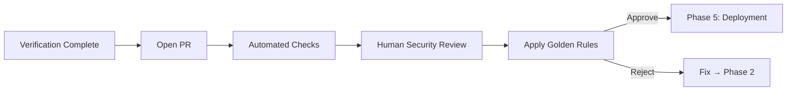

# Phase 4: Governance

<div style="background: linear-gradient(135deg, #581c87 0%, #a855f7 100%); border-radius: 16px; padding: 32px; margin: 32px 0; box-shadow: 0 8px 32px rgba(168, 85, 247, 0.4); border: 1px solid rgba(192, 132, 252, 0.3);">
  <div style="display: flex; align-items: center; gap: 20px; margin-bottom: 20px;">
    <div style="font-size: 56px;">4&#xFE0F;&#x20E3;</div>
    <div>
      <h2 style="margin: 0; font-size: 32px; color: #f1f5f9; font-weight: 800;">Governance</h2>
      <div style="font-size: 16px; color: #e9d5ff; margin-top: 8px;">Human Code Review & Golden Rules</div>
    </div>
  </div>
  <div style="color: #e9d5ff; font-size: 15px; line-height: 1.7;">
    Human-in-the-loop review applying the 6 Golden Rules, OWASP compliance validation, and threat coverage verification before merge. This is the "30% layer" where humans validate AI work.
  </div>
</div>

## Phase Overview



<div style="display: grid; grid-template-columns: repeat(auto-fit, minmax(200px, 1fr)); gap: 16px; margin: 24px 0;">
  <div style="background: linear-gradient(135deg, #1e293b 0%, #334155 100%); border-radius: 12px; padding: 20px; border: 1px solid rgba(100, 116, 139, 0.3);">
    <div style="font-size: 11px; color: #94a3b8; text-transform: uppercase; letter-spacing: 1px; margin-bottom: 6px;">Duration</div>
    <div style="font-size: 20px; color: #f1f5f9; font-weight: 700;">15-45 min</div>
  </div>
  <div style="background: linear-gradient(135deg, #1e293b 0%, #334155 100%); border-radius: 12px; padding: 20px; border: 1px solid rgba(100, 116, 139, 0.3);">
    <div style="font-size: 11px; color: #94a3b8; text-transform: uppercase; letter-spacing: 1px; margin-bottom: 6px;">Participants</div>
    <div style="font-size: 20px; color: #f1f5f9; font-weight: 700;">Engineer + Reviewer</div>
  </div>
  <div style="background: linear-gradient(135deg, #1e293b 0%, #334155 100%); border-radius: 12px; padding: 20px; border: 1px solid rgba(100, 116, 139, 0.3);">
    <div style="font-size: 11px; color: #94a3b8; text-transform: uppercase; letter-spacing: 1px; margin-bottom: 6px;">Mode</div>
    <div style="font-size: 14px; color: #cbd5e1; line-height: 1.6;">Manual review + AI-assisted validation</div>
  </div>
  <div style="background: linear-gradient(135deg, #1e293b 0%, #334155 100%); border-radius: 12px; padding: 20px; border: 1px solid rgba(100, 116, 139, 0.3);">
    <div style="font-size: 11px; color: #94a3b8; text-transform: uppercase; letter-spacing: 1px; margin-bottom: 6px;">Gate</div>
    <div style="font-size: 14px; color: #cbd5e1; line-height: 1.6;">All 6 Golden Rules + OWASP compliance</div>
  </div>
</div>

---

## Step 1: Open PR with AI Disclosure

Use the PR template that includes AI disclosure, OWASP coverage, and verification results.

<details>
<summary style="cursor: pointer; color: #d8b4fe; font-weight: 600; padding: 8px 0;">PR template</summary>

```markdown
## Feature Description
[What does this PR implement?]

## OWASP Categories Addressed
- [ ] A01: Broken Access Control
- [ ] A03: Injection
- [ ] A09: Logging/Monitoring Failures

## Threats Mitigated (from Phase 1)
- [x] T1-Tn: [list with status]

## Verification Results
- [x] ESLint: Pass
- [x] Jest: [X]% coverage, [X] tests pass
- [x] CodeQL: 0 high/critical findings
- [x] Snyk: 0 high/critical vulnerabilities
- [x] Fitness Functions: All pass

## AI Assistance Disclosure
- [x] This PR includes AI-generated code
- **AI Tool**: [Copilot / Claude / ChatGPT]
- **Prompt Packs Used**: [list prompt pack files]
- **Human Review**: Code reviewed line-by-line
- **Changes After AI**: [describe manual modifications]

## Golden Rules Checklist
- [x] Rule 1: Specific prompts with constraints used
- [x] Rule 2: I understand every line of code
- [x] Rule 3: AI treated as junior dev, guidance provided
- [x] Rule 4: Commits labeled with AI-assisted tag
- [x] Rule 5: Security rationale documented in code comments
- [x] Rule 6: Successful prompts added to team library
```

</details>

---

## Step 2: Golden Rules Validation

Reviewer checks each of the [6 Golden Rules](/docs/governance/vibe-golden-rules) against the PR:

<div style="display: grid; grid-template-columns: repeat(auto-fit, minmax(250px, 1fr)); gap: 16px; margin: 24px 0;">

<div style="background: linear-gradient(135deg, #1e293b 0%, #0f172a 100%); border-radius: 12px; padding: 20px; border-left: 4px solid #3b82f6;">
  <div style="font-size: 15px; font-weight: 700; color: #93c5fd; margin-bottom: 8px;">Rule 1: Be Specific</div>
  <div style="color: #cbd5e1; font-size: 13px; line-height: 1.7;">
    OWASP prompt packs referenced in commits?<br/>
    Tech stack constraints specified?<br/>
    Security requirements explicit?
  </div>
</div>

<div style="background: linear-gradient(135deg, #1e293b 0%, #0f172a 100%); border-radius: 12px; padding: 20px; border-left: 4px solid #ef4444;">
  <div style="font-size: 15px; font-weight: 700; color: #fca5a5; margin-bottom: 8px;">Rule 2: Trust But Verify</div>
  <div style="color: #cbd5e1; font-size: 13px; line-height: 1.7;">
    Reviewer understands every function?<br/>
    OWASP controls correctly implemented?<br/>
    No unexplained "magic" code?
  </div>
</div>

<div style="background: linear-gradient(135deg, #1e293b 0%, #0f172a 100%); border-radius: 12px; padding: 20px; border-left: 4px solid #f59e0b;">
  <div style="font-size: 15px; font-weight: 700; color: #fcd34d; margin-bottom: 8px;">Rule 3: Junior Dev Treatment</div>
  <div style="color: #cbd5e1; font-size: 13px; line-height: 1.7;">
    Code follows team patterns?<br/>
    No over-engineering or unnecessary complexity?<br/>
    Tests are comprehensive (not just happy path)?
  </div>
</div>

<div style="background: linear-gradient(135deg, #1e293b 0%, #0f172a 100%); border-radius: 12px; padding: 20px; border-left: 4px solid #a855f7;">
  <div style="font-size: 15px; font-weight: 700; color: #d8b4fe; margin-bottom: 8px;">Rule 4: Isolate AI Changes</div>
  <div style="color: #cbd5e1; font-size: 13px; line-height: 1.7;">
    Commits labeled with AI-assisted tag?<br/>
    AI tool identified?<br/>
    PR has AI disclosure section?
  </div>
</div>

<div style="background: linear-gradient(135deg, #1e293b 0%, #0f172a 100%); border-radius: 12px; padding: 20px; border-left: 4px solid #10b981;">
  <div style="font-size: 15px; font-weight: 700; color: #6ee7b7; margin-bottom: 8px;">Rule 5: Document Rationale</div>
  <div style="color: #cbd5e1; font-size: 13px; line-height: 1.7;">
    Inline comments explain "why" not "what"?<br/>
    OWASP categories referenced in code?<br/>
    Threat IDs linked to controls?
  </div>
</div>

<div style="background: linear-gradient(135deg, #1e293b 0%, #0f172a 100%); border-radius: 12px; padding: 20px; border-left: 4px solid #ec4899;">
  <div style="font-size: 15px; font-weight: 700; color: #f9a8d4; margin-bottom: 8px;">Rule 6: Share Winning Prompts</div>
  <div style="color: #cbd5e1; font-size: 13px; line-height: 1.7;">
    Prompt produced secure code on first try?<br/>
    Reusable for future features?<br/>
    Added to team prompt library?
  </div>
</div>

</div>

---

## Step 3: OWASP Compliance Review

Use AI to validate OWASP compliance against the implementation.

<div style="background: linear-gradient(135deg, #1e293b 0%, #0f172a 100%); border-radius: 12px; padding: 28px; margin: 24px 0; border: 1px solid rgba(168, 85, 247, 0.3);">
<div style="font-size: 12px; color: #d8b4fe; text-transform: uppercase; letter-spacing: 1px; margin-bottom: 16px; font-weight: 700;">RCTRO Prompt — OWASP Compliance Review</div>

```
Role: You are a security code reviewer validating OWASP compliance.

Context:
- Feature: [feature name from PR]
- OWASP Categories: [A01, A03, etc. from Phase 1]
- Implementation: [paste code from PR]
- Threat Model: [T1-Tn from Phase 1]

Task:
Review the implementation against OWASP checklists for each
identified category. Report PASS/FAIL per category with evidence.

Requirements:
1. **Access Control Validation (A01)**
   - Deny-by-default, ownership verification, no IDOR
   - Authorization failures logged
   - Validation: Each control has code evidence

2. **Injection Prevention (A03)**
   - Parameterized queries only, Zod validation
   - Character allowlists, length limits
   - Validation: No string concatenation in queries

3. **Logging Compliance (A09)**
   - Security events logged, PII redacted
   - Log correlation IDs present
   - Validation: Every mutation has audit trail

Output:
Per-category PASS/FAIL with code references.
Overall recommendation: APPROVE or REQUEST CHANGES.
```

</div>

---

## Step 4: Threat Coverage Verification

Verify every threat from Phase 1 has a mitigation, code location, and test:

```markdown
| Threat | Mitigation | Code Location | Test | Status |
|--------|------------|---------------|------|--------|
| T1: [description] | [control] | `file:line` | `test:line` | ✅/❌ |
| T2: [description] | [control] | `file:line` | `test:line` | ✅/❌ |
| ...    | ...        | ...           | ...  | ...    |

Result: [X]/[Y] threats mitigated
```

---

## Approval Criteria

PR can be approved when ALL criteria are met:

<div style="background: linear-gradient(135deg, #1e293b 0%, #0f172a 100%); border-radius: 12px; padding: 28px; margin: 24px 0; border: 1px solid rgba(168, 85, 247, 0.3);">

**Technical**
- All automated checks pass (ESLint, Jest, CodeQL, Snyk)
- All fitness functions pass
- Coverage ≥80% (≥100% on security functions)
- Performance within limits (<200ms p95)

**Security**
- All Phase 1 threats mitigated
- OWASP checklists completed
- Attack vector tests included and passing
- No hardcoded secrets or credentials

**Governance**
- All 6 Golden Rules satisfied
- AI disclosure in PR template
- Commits labeled with AI-assisted tag
- Code reviewed and understood by human

</div>

**Reject if**: Missing input validation, SQL injection possible, no authorization checks, hardcoded credentials, complexity >10, coverage <80%, no AI disclosure, or security rationale not documented. Route back to Phase 2 for fixes.

---

## Phase Handoff → Phase 5

<div style="background: rgba(168, 85, 247, 0.1); border-left: 4px solid #a855f7; border-radius: 8px; padding: 24px; margin: 24px 0;">

```
===== PHASE 4 → PHASE 5 HANDOFF =====

Feature: [Feature name]

Governance Complete:
✅ All 6 Golden Rules validated
✅ OWASP compliance reviewed (A01, A03, A09)
✅ [X]/[X] threats verified with code + tests
✅ AI disclosure documented
✅ PR approved by [Reviewer]

Artifacts:
- Approved PR: [link]
- Threat coverage matrix: [attached]

Next: Merge and deploy via CI/CD (Phase 5)

===== END HANDOFF =====
```

</div>

---

<div style="display: flex; justify-content: space-between; align-items: center; margin: 32px 0;">
  <a href="/docs/sdlc/phase3-verification" style="color: #fca5a5; font-size: 14px; text-decoration: none;">← Phase 3: Verification</a>
  <a href="/docs/sdlc/phase5-deployment" style="display: inline-block; background: linear-gradient(135deg, #10b981 0%, #059669 100%); color: #f1f5f9; padding: 12px 24px; border-radius: 8px; text-decoration: none; font-size: 14px; font-weight: 600;">Phase 5: Deployment →</a>
</div>
