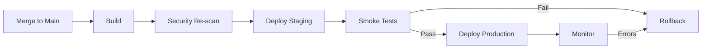

# Phase 5: Deployment

<div style="background: linear-gradient(135deg, #065f46 0%, #10b981 100%); border-radius: 16px; padding: 32px; margin: 32px 0; box-shadow: 0 8px 32px rgba(16, 185, 129, 0.4); border: 1px solid rgba(52, 211, 153, 0.3);">
  <div style="display: flex; align-items: center; gap: 20px; margin-bottom: 20px;">
    <div style="font-size: 56px;">5&#xFE0F;&#x20E3;</div>
    <div>
      <h2 style="margin: 0; font-size: 32px; color: #f1f5f9; font-weight: 800;">Deployment</h2>
      <div style="font-size: 16px; color: #d1fae5; margin-top: 8px;">Automated CI/CD with Security Re-scanning</div>
    </div>
  </div>
  <div style="color: #d1fae5; font-size: 15px; line-height: 1.7;">
    Merge triggers automated build, security re-scan, staging deployment, smoke tests, and production release. Monitoring and rollback procedures ensure safe delivery.
  </div>
</div>

## Phase Overview



<div style="display: grid; grid-template-columns: repeat(auto-fit, minmax(200px, 1fr)); gap: 16px; margin: 24px 0;">
  <div style="background: linear-gradient(135deg, #1e293b 0%, #334155 100%); border-radius: 12px; padding: 20px; border: 1px solid rgba(100, 116, 139, 0.3);">
    <div style="font-size: 11px; color: #94a3b8; text-transform: uppercase; letter-spacing: 1px; margin-bottom: 6px;">Duration</div>
    <div style="font-size: 20px; color: #f1f5f9; font-weight: 700;">10-30 min</div>
  </div>
  <div style="background: linear-gradient(135deg, #1e293b 0%, #334155 100%); border-radius: 12px; padding: 20px; border: 1px solid rgba(100, 116, 139, 0.3);">
    <div style="font-size: 11px; color: #94a3b8; text-transform: uppercase; letter-spacing: 1px; margin-bottom: 6px;">Tools</div>
    <div style="font-size: 20px; color: #f1f5f9; font-weight: 700;">GitHub Actions, Sentry</div>
  </div>
  <div style="background: linear-gradient(135deg, #1e293b 0%, #334155 100%); border-radius: 12px; padding: 20px; border: 1px solid rgba(100, 116, 139, 0.3);">
    <div style="font-size: 11px; color: #94a3b8; text-transform: uppercase; letter-spacing: 1px; margin-bottom: 6px;">Mode</div>
    <div style="font-size: 14px; color: #cbd5e1; line-height: 1.6;">Automated (CI/CD pipeline)</div>
  </div>
  <div style="background: linear-gradient(135deg, #1e293b 0%, #334155 100%); border-radius: 12px; padding: 20px; border: 1px solid rgba(100, 116, 139, 0.3);">
    <div style="font-size: 11px; color: #94a3b8; text-transform: uppercase; letter-spacing: 1px; margin-bottom: 6px;">Gate</div>
    <div style="font-size: 14px; color: #cbd5e1; line-height: 1.6;">Smoke tests pass + monitoring healthy</div>
  </div>
</div>

---

## Step 1: CI/CD Pipeline

Merge to main triggers the deployment pipeline automatically.

<details>
<summary style="cursor: pointer; color: #6ee7b7; font-weight: 600; padding: 8px 0;">GitHub Actions deployment workflow</summary>

```yaml
# .github/workflows/deploy.yml
name: Deploy to Production

on:
  push:
    branches: [main]

jobs:
  build:
    runs-on: ubuntu-latest
    steps:
      - uses: actions/checkout@v4
      - uses: actions/setup-node@v4
        with:
          node-version: '18'
      - run: npm ci
      - run: npm run build

  security-scan:
    needs: build
    runs-on: ubuntu-latest
    steps:
      - uses: github/codeql-action/analyze@v3
      - uses: snyk/actions/node@master
        env:
          SNYK_TOKEN: ${{ secrets.SNYK_TOKEN }}

  deploy-staging:
    needs: security-scan
    runs-on: ubuntu-latest
    steps:
      - name: Deploy to Staging
        run: npm run deploy:staging

  smoke-tests:
    needs: deploy-staging
    runs-on: ubuntu-latest
    steps:
      - name: Run Smoke Tests
        run: npm run test:smoke

  deploy-production:
    needs: smoke-tests
    runs-on: ubuntu-latest
    environment: production
    steps:
      - name: Deploy to Production
        run: npm run deploy:production
      - name: Verify Health
        run: curl -f https://app.example.com/health
```

</details>

---

## Step 2: Post-Deployment Validation

Run smoke tests and health checks against the deployed environment.

<div style="background: linear-gradient(135deg, #1e293b 0%, #0f172a 100%); border-radius: 12px; padding: 28px; margin: 24px 0; border: 1px solid rgba(16, 185, 129, 0.3);">
<div style="font-size: 12px; color: #6ee7b7; text-transform: uppercase; letter-spacing: 1px; margin-bottom: 16px; font-weight: 700;">RCTRO Prompt — Smoke Test Generation</div>

```
Role: You are a deployment engineer writing production smoke tests.

Context:
- Feature: [feature name just deployed]
- Environment: [staging / production URL]
- Critical paths: [list user-facing endpoints]
- Security controls: [from Phase 1 threat model]

Task:
Generate smoke tests that validate the deployment is healthy
and security controls are active in the deployed environment.

Requirements:
1. **Health Check**
   - Verify /health endpoint returns 200
   - Database, cache, and external API connections healthy
   - Validation: All subsystem checks pass

2. **Critical Path Tests**
   - Test primary user flows end-to-end
   - Verify security controls are enforced (auth, validation)
   - Validation: All critical paths return expected responses

3. **Security Validation**
   - Confirm unauthorized requests are rejected
   - Verify rate limiting is active
   - Validation: Attack payloads blocked in production

Output:
Executable test suite (Jest or curl commands) for CI/CD pipeline.
```

</div>

<details>
<summary style="cursor: pointer; color: #6ee7b7; font-weight: 600; padding: 8px 0;">Example: Smoke test suite</summary>

```typescript
describe('Production Smoke Tests', () => {
  it('should respond to health check', async () => {
    const res = await fetch(`${BASE_URL}/health`);
    expect(res.status).toBe(200);
    const health = await res.json();
    expect(health.status).toBe('healthy');
  });

  it('should reject unauthorized requests', async () => {
    const res = await fetch(`${BASE_URL}/api/documents/123/shares`, {
      method: 'POST',
      body: JSON.stringify({ email: 'test@example.com' })
    });
    expect(res.status).toBe(401);
  });

  it('should block injection attempts', async () => {
    const res = await fetch(`${BASE_URL}/api/search?q=' OR '1'='1`);
    expect(res.status).toBe(400);
  });
});
```

</details>

---

## Step 3: Monitoring & Alerting

Configure monitoring for security events and performance degradation.

<div style="display: grid; grid-template-columns: repeat(auto-fit, minmax(250px, 1fr)); gap: 16px; margin: 24px 0;">

<div style="background: linear-gradient(135deg, #1e293b 0%, #0f172a 100%); border-radius: 12px; padding: 20px; border-left: 4px solid #ef4444;">
  <div style="font-size: 15px; font-weight: 700; color: #fca5a5; margin-bottom: 8px;">Security Alerts</div>
  <div style="color: #cbd5e1; font-size: 13px; line-height: 1.7;">
    Auth failures >100/min → notify security team<br/>
    Injection attempts >10/hr → notify + investigate<br/>
    Critical CVE deployed → auto-rollback
  </div>
</div>

<div style="background: linear-gradient(135deg, #1e293b 0%, #0f172a 100%); border-radius: 12px; padding: 20px; border-left: 4px solid #f59e0b;">
  <div style="font-size: 15px; font-weight: 700; color: #fcd34d; margin-bottom: 8px;">Performance Alerts</div>
  <div style="color: #cbd5e1; font-size: 13px; line-height: 1.7;">
    p95 latency >200ms → investigate<br/>
    Error rate >1% → notify on-call<br/>
    Error rate >5% → auto-rollback
  </div>
</div>

<div style="background: linear-gradient(135deg, #1e293b 0%, #0f172a 100%); border-radius: 12px; padding: 20px; border-left: 4px solid #3b82f6;">
  <div style="font-size: 15px; font-weight: 700; color: #93c5fd; margin-bottom: 8px;">Error Tracking</div>
  <div style="color: #cbd5e1; font-size: 13px; line-height: 1.7;">
    Sentry/Datadog for exception tracking<br/>
    PII redacted before capture<br/>
    Alerts on new error types post-deploy
  </div>
</div>

</div>

---

## Step 4: Rollback Procedures

```bash
# Automatic rollback (triggered by failed smoke tests or monitoring alerts)
npm run rollback -- --to-version=v1.2.3

# Manual rollback
git revert HEAD && git push origin main
```

**Rollback triggers**: Smoke test failure, error rate >5%, critical security alert, health check failure.

---

## Phase Handoff → Phase 6

<div style="background: rgba(16, 185, 129, 0.1); border-left: 4px solid #10b981; border-radius: 8px; padding: 24px; margin: 24px 0;">

```
===== PHASE 5 → PHASE 6 HANDOFF =====

Feature: [Feature name]

Deployment Complete:
✅ Build + security re-scan passed
✅ Staging smoke tests passed
✅ Production deployment successful
✅ Health checks healthy
✅ Monitoring active

Artifacts:
- Deployment URL: [production URL]
- Monitoring dashboard: [link]
- Rollback version: [previous version]

Next: Collect metrics and iterate (Phase 6)

===== END HANDOFF =====
```

</div>

---

<div style="display: flex; justify-content: space-between; align-items: center; margin: 32px 0;">
  <a href="/docs/sdlc/phase4-governance" style="color: #d8b4fe; font-size: 14px; text-decoration: none;">← Phase 4: Governance</a>
  <a href="/docs/sdlc/phase6-evolution" style="display: inline-block; background: linear-gradient(135deg, #ec4899 0%, #db2777 100%); color: #f1f5f9; padding: 12px 24px; border-radius: 8px; text-decoration: none; font-size: 14px; font-weight: 600;">Phase 6: Evolution →</a>
</div>
