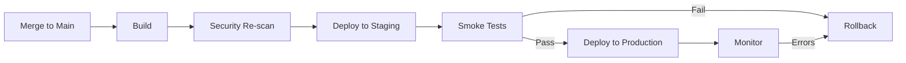

# Phase 5: Deployment

<div style="background: linear-gradient(135deg, #065f46 0%, #10b981 100%); border-radius: 16px; padding: 32px; margin: 32px 0; box-shadow: 0 8px 32px rgba(16, 185, 129, 0.4); border: 1px solid rgba(52, 211, 153, 0.3);">
  <div style="display: flex; align-items: center; gap: 20px; margin-bottom: 20px;">
    <div style="font-size: 56px;">5️⃣</div>
    <div>
      <h2 style="margin: 0; font-size: 32px; color: #f1f5f9; font-weight: 800;">Deployment</h2>
      <div style="font-size: 16px; color: #d1fae5; margin-top: 8px;">Automated CI/CD Pipeline</div>
    </div>
  </div>
  <div style="color: #d1fae5; font-size: 15px; line-height: 1.7; margin-bottom: 24px;">
    <strong style="color: #f1f5f9;">Purpose:</strong> Automated CI/CD pipeline deploys approved code to production with monitoring and rollback capabilities.
  </div>
  <div style="background: rgba(255, 255, 255, 0.1); border-radius: 12px; padding: 20px;">
    <div style="display: grid; grid-template-columns: repeat(auto-fit, minmax(140px, 1fr)); gap: 12px;">
      <div style="text-align: center; color: #d1fae5; font-size: 13px; font-weight: 600;">Build</div>
      <div style="text-align: center; color: #d1fae5; font-size: 13px; font-weight: 600;">Security Scan</div>
      <div style="text-align: center; color: #d1fae5; font-size: 13px; font-weight: 600;">Staging</div>
      <div style="text-align: center; color: #d1fae5; font-size: 13px; font-weight: 600;">Smoke Tests</div>
      <div style="text-align: center; color: #d1fae5; font-size: 13px; font-weight: 600;">Production</div>
    </div>
  </div>
</div>

## CI/CD Pipeline



---

## GitHub Actions Workflow

```yaml
# .github/workflows/deploy.yml
name: Deploy to Production

on:
  push:
    branches: [main]

jobs:
  build:
    runs-on: ubuntu-latest
    steps:
      - uses: actions/checkout@v4
      - uses: actions/setup-node@v4
        with:
          node-version: '18'
      - run: npm ci
      - run: npm run build

  security-scan:
    needs: build
    runs-on: ubuntu-latest
    steps:
      - uses: github/codeql-action/analyze@v3
      - uses: snyk/actions/node@master
        env:
          SNYK_TOKEN: ${{ secrets.SNYK_TOKEN }}

  deploy-staging:
    needs: security-scan
    runs-on: ubuntu-latest
    steps:
      - name: Deploy to Staging
        run: |
          npm run deploy:staging
          echo "STAGING_URL=https://staging.example.com" >> $GITHUB_ENV

  smoke-tests:
    needs: deploy-staging
    runs-on: ubuntu-latest
    steps:
      - name: Run Smoke Tests
        run: |
          curl -f ${{ env.STAGING_URL }}/health || exit 1
          npm run test:smoke -- --url=${{ env.STAGING_URL }}

  deploy-production:
    needs: smoke-tests
    runs-on: ubuntu-latest
    environment: production
    steps:
      - name: Deploy to Production
        run: npm run deploy:production

      - name: Verify Deployment
        run: |
          curl -f https://app.example.com/health
          npm run test:smoke -- --url=https://app.example.com

  monitor:
    needs: deploy-production
    runs-on: ubuntu-latest
    steps:
      - name: Set up Monitoring Alerts
        run: |
          # Enable error tracking
          # Set up synthetic monitoring
          echo "Monitoring active"
```

---

## Post-Deployment Validation

### Health Checks

```typescript
// health.ts
export async function healthCheck() {
  return {
    status: 'healthy',
    timestamp: new Date().toISOString(),
    version: process.env.VERSION,
    checks: {
      database: await checkDatabase(),
      redis: await checkRedis(),
      externalAPIs: await checkExternalAPIs()
    }
  };
}

// Smoke test
describe('Production Smoke Tests', () => {
  it('should respond to health check', async () => {
    const res = await fetch('https://app.example.com/health');
    expect(res.status).toBe(200);
    const health = await res.json();
    expect(health.status).toBe('healthy');
  });

  it('should create share successfully', async () => {
    // Test critical path
    const res = await fetch('https://app.example.com/api/documents/123/shares', {
      method: 'POST',
      headers: { Authorization: `Bearer ${testToken}` },
      body: JSON.stringify({ email: 'test@example.com', permission: 'read' })
    });
    expect(res.status).toBe(201);
  });
});
```

---

## Monitoring

### Error Tracking

```typescript
// Configure Sentry, Datadog, or similar
import * as Sentry from '@sentry/node';

Sentry.init({
  dsn: process.env.SENTRY_DSN,
  environment: process.env.NODE_ENV,
  tracesSampleRate: 0.1,
  beforeSend(event) {
    // Redact PII
    if (event.user) {
      delete event.user.email;
    }
    return event;
  }
});
```

### Security Alerts

```yaml
# Alert on security events
alerts:
  - name: High rate of authorization failures
    condition: rate(unauthorized_access) > 100/min
    action: notify_security_team

  - name: SQL injection attempt detected
    condition: count(injection_blocked) > 10/hr
    action: notify_security_team

  - name: Critical vulnerability deployed
    condition: snyk_critical_count > 0
    action: auto_rollback
```

---

## Rollback Procedures

```bash
# Automatic rollback on deployment failure
if [ $SMOKE_TEST_RESULT != "pass" ]; then
  echo "Smoke tests failed, rolling back"
  git revert HEAD
  npm run deploy:production
  exit 1
fi

# Manual rollback
npm run rollback -- --to-version=v1.2.3
```

---

**[Proceed to Phase 6: Evolution →](phase6-evolution)**
