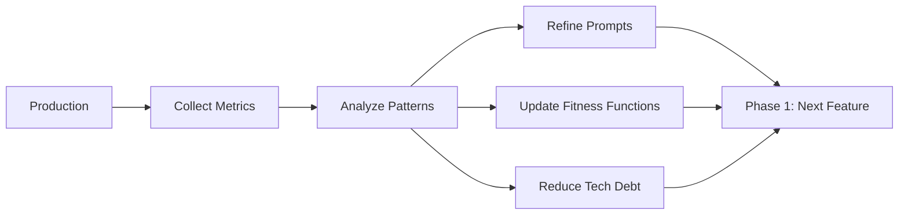

# Phase 6: Evolution

<div style="background: linear-gradient(135deg, #831843 0%, #ec4899 100%); border-radius: 16px; padding: 32px; margin: 32px 0; box-shadow: 0 8px 32px rgba(236, 72, 153, 0.4); border: 1px solid rgba(244, 114, 182, 0.3);">
  <div style="display: flex; align-items: center; gap: 20px; margin-bottom: 20px;">
    <div style="font-size: 56px;">6&#xFE0F;&#x20E3;</div>
    <div>
      <h2 style="margin: 0; font-size: 32px; color: #f1f5f9; font-weight: 800;">Evolution</h2>
      <div style="font-size: 16px; color: #fce7f3; margin-top: 8px;">Metrics, Iteration & Continuous Improvement</div>
    </div>
  </div>
  <div style="color: #fce7f3; font-size: 15px; line-height: 1.7;">
    Collect metrics, refine prompt packs, manage technical debt, update fitness functions, and feed learnings back into Phase 1 for the next feature cycle.
  </div>
</div>

## Phase Overview



<div style="display: grid; grid-template-columns: repeat(auto-fit, minmax(200px, 1fr)); gap: 16px; margin: 24px 0;">
  <div style="background: linear-gradient(135deg, #1e293b 0%, #334155 100%); border-radius: 12px; padding: 20px; border: 1px solid rgba(100, 116, 139, 0.3);">
    <div style="font-size: 11px; color: #94a3b8; text-transform: uppercase; letter-spacing: 1px; margin-bottom: 6px;">Cadence</div>
    <div style="font-size: 20px; color: #f1f5f9; font-weight: 700;">Weekly + Quarterly</div>
  </div>
  <div style="background: linear-gradient(135deg, #1e293b 0%, #334155 100%); border-radius: 12px; padding: 20px; border: 1px solid rgba(100, 116, 139, 0.3);">
    <div style="font-size: 11px; color: #94a3b8; text-transform: uppercase; letter-spacing: 1px; margin-bottom: 6px;">Participants</div>
    <div style="font-size: 20px; color: #f1f5f9; font-weight: 700;">Full Team</div>
  </div>
  <div style="background: linear-gradient(135deg, #1e293b 0%, #334155 100%); border-radius: 12px; padding: 20px; border: 1px solid rgba(100, 116, 139, 0.3);">
    <div style="font-size: 11px; color: #94a3b8; text-transform: uppercase; letter-spacing: 1px; margin-bottom: 6px;">Outputs</div>
    <div style="font-size: 14px; color: #cbd5e1; line-height: 1.6;">Updated prompts, thresholds, dependency upgrades</div>
  </div>
  <div style="background: linear-gradient(135deg, #1e293b 0%, #334155 100%); border-radius: 12px; padding: 20px; border: 1px solid rgba(100, 116, 139, 0.3);">
    <div style="font-size: 11px; color: #94a3b8; text-transform: uppercase; letter-spacing: 1px; margin-bottom: 6px;">Goal</div>
    <div style="font-size: 14px; color: #cbd5e1; line-height: 1.6;">Continuous improvement across all phases</div>
  </div>
</div>

---

## Step 1: Metrics Collection

Track three categories of metrics from production:

<div style="display: grid; grid-template-columns: repeat(auto-fit, minmax(250px, 1fr)); gap: 16px; margin: 24px 0;">

<div style="background: linear-gradient(135deg, #1e293b 0%, #0f172a 100%); border-radius: 12px; padding: 20px; border-left: 4px solid #ef4444;">
  <div style="font-size: 15px; font-weight: 700; color: #fca5a5; margin-bottom: 8px;">Security Metrics</div>
  <div style="color: #cbd5e1; font-size: 13px; line-height: 1.7;">
    Vulnerability remediation time<br/>
    Security scan pass rate<br/>
    Attack prevention rate<br/>
    Incident count (target: 0)
  </div>
</div>

<div style="background: linear-gradient(135deg, #1e293b 0%, #0f172a 100%); border-radius: 12px; padding: 20px; border-left: 4px solid #f59e0b;">
  <div style="font-size: 15px; font-weight: 700; color: #fcd34d; margin-bottom: 8px;">Quality Metrics</div>
  <div style="color: #cbd5e1; font-size: 13px; line-height: 1.7;">
    Defect density<br/>
    Test coverage trend<br/>
    Fitness function compliance<br/>
    Code complexity trend
  </div>
</div>

<div style="background: linear-gradient(135deg, #1e293b 0%, #0f172a 100%); border-radius: 12px; padding: 20px; border-left: 4px solid #3b82f6;">
  <div style="font-size: 15px; font-weight: 700; color: #93c5fd; margin-bottom: 8px;">Efficiency Metrics</div>
  <div style="color: #cbd5e1; font-size: 13px; line-height: 1.7;">
    Time to delivery<br/>
    AI acceptance rate<br/>
    Prompt reuse rate<br/>
    Cycle time
  </div>
</div>

</div>

---

## Step 2: Prompt Library Iteration

Refine prompts based on success/failure patterns.

<div style="background: linear-gradient(135deg, #1e293b 0%, #0f172a 100%); border-radius: 12px; padding: 28px; margin: 24px 0; border: 1px solid rgba(236, 72, 153, 0.3);">
<div style="font-size: 12px; color: #f9a8d4; text-transform: uppercase; letter-spacing: 1px; margin-bottom: 16px; font-weight: 700;">RCTRO Prompt — Prompt Refinement</div>

```
Role: You are a prompt engineer improving OWASP security prompts.

Context:
- Prompt pack: [A01/A03/etc. current version]
- Usage stats: [X] uses, [Y]% first-try success rate
- Common failures: [list failure patterns]
- Example failures: [paste 2-3 failed outputs]

Task:
Analyze failure patterns and produce an improved version of the
prompt pack that addresses the identified gaps.

Requirements:
1. **Failure Analysis**
   - Identify root cause of each failure pattern
   - Categorize: missing requirement, ambiguous instruction, or missing example
   - Validation: Each failure mapped to a specific prompt gap

2. **Prompt Improvement**
   - Add missing requirements or examples
   - Clarify ambiguous instructions
   - Validation: Improved prompt addresses all failure patterns

3. **Version Control**
   - Archive current version, increment version number
   - Document changes in changelog
   - Validation: New version tested against previous failures

Output:
Updated prompt pack (vN+1) with changelog and projected success rate.
```

</div>

<details>
<summary style="cursor: pointer; color: #f9a8d4; font-weight: 600; padding: 8px 0;">Example: Prompt improvement cycle</summary>

```markdown
## A03 Injection Prevention Prompt

### v2 → v3 Changelog
- Added: Explicit max length requirement (was missing → caused 20% of failures)
- Added: Example of z.string().max(100)
- Clarified: "parameterized queries" → "pg $1 placeholders, never string concat"

### Results
- v2: 80% first-try success (15 uses)
- v3: 95% first-try success (20 uses)
- Improvement: +15%
```

</details>

---

## Step 3: Dependency Management

Keep dependencies fresh (< 3 months old) to prevent A06 vulnerabilities.

<div style="background: linear-gradient(135deg, #1e293b 0%, #0f172a 100%); border-radius: 12px; padding: 28px; margin: 24px 0; border: 1px solid rgba(236, 72, 153, 0.3);">
<div style="font-size: 12px; color: #f9a8d4; text-transform: uppercase; letter-spacing: 1px; margin-bottom: 16px; font-weight: 700;">RCTRO Prompt — Dependency Upgrade</div>

```
Role: You are a technical debt engineer managing dependency freshness.

Context:
- Project: Node.js / TypeScript
- Outdated packages: [paste npm outdated output]
- Known CVEs: [paste Snyk findings]
- Fitness function threshold: dependencies < 3 months old

Task:
Plan and execute a safe dependency upgrade cycle.

Requirements:
1. **Triage**
   - Categorize: patch (auto-upgrade), minor (review changelog), major (human review)
   - Check CVEs for each outdated package
   - Validation: All packages categorized with risk level

2. **Upgrade Execution**
   - Upgrade patch/minor versions, run tests after each
   - Flag major versions with breaking change assessment
   - Validation: All tests pass after each upgrade

3. **Verification**
   - Run full fitness function suite
   - Confirm 0 high/critical Snyk findings
   - Validation: Fitness function compliance restored

Output:
Upgrade report with packages updated, tests passed, and remaining items.
```

</div>

**Weekly schedule**: Monday scan → Tuesday patch upgrades → Wednesday minor upgrades → Thursday test → Friday deploy.

---

## Step 4: Fitness Function Refinement

Adjust thresholds based on team data:

```markdown
| Fitness Function | Current Threshold | PR Failure Rate | Adjustment |
|-----------------|-------------------|-----------------|------------|
| Complexity      | ≤ 10              | 15%             | Consider ≤ 12 |
| Coverage        | ≥ 80%             | 2%              | Consider ≥ 85% |
| Dependencies    | < 3 months        | 8%              | Keep as-is |
| Performance     | < 200ms p95       | 1%              | Keep as-is |
| Security        | 0 high/critical   | 0%              | Keep as-is |
```

**Rule**: If a fitness function fails >10% of PRs, it may be too strict. If it fails 0%, it may be too lenient. Review quarterly.

---

## Step 5: Quarterly Review

<div style="background: linear-gradient(135deg, #1e293b 0%, #0f172a 100%); border-radius: 12px; padding: 28px; margin: 24px 0; border: 1px solid rgba(236, 72, 153, 0.3);">

```markdown
## Q[X] Evolution Review

### What Worked Well
✅ [list successes — e.g., prompt packs reduced findings by X%]

### What Needs Improvement
❌ [list gaps — e.g., dependency upgrades still manual]

### Actions for Next Quarter
1. [specific action + owner + target metric]
2. [specific action + owner + target metric]
3. [specific action + owner + target metric]

### Metrics to Track
- Dependency age (target: < 2 months average)
- Prompt first-try success rate (target: > 90%)
- Security scan pass rate (target: 100%)
```

</div>

---

## Phase Handoff → Phase 1

<div style="background: rgba(236, 72, 153, 0.1); border-left: 4px solid #ec4899; border-radius: 8px; padding: 24px; margin: 24px 0;">

```
===== PHASE 6 → PHASE 1 HANDOFF (CYCLE COMPLETE) =====

Evolution Cycle Complete:
✅ Metrics collected and analyzed
✅ Prompt packs updated to v[X]
✅ Dependencies upgraded (all < 3 months)
✅ Fitness function thresholds reviewed
✅ Technical debt items prioritized

Improvements Applied:
- [list prompt/threshold/process changes]

Next: Begin Phase 1 for next feature with updated tooling.

===== END HANDOFF =====
```

</div>

---

<div style="display: flex; justify-content: space-between; align-items: center; margin: 32px 0;">
  <a href="/docs/sdlc/phase5-deployment" style="color: #6ee7b7; font-size: 14px; text-decoration: none;">← Phase 5: Deployment</a>
  <a href="/docs/sdlc/phase1-design" style="display: inline-block; background: linear-gradient(135deg, #3b82f6 0%, #2563eb 100%); color: #f1f5f9; padding: 12px 24px; border-radius: 8px; text-decoration: none; font-size: 14px; font-weight: 600;">Phase 1: Design → (Complete the cycle!)</a>
</div>
