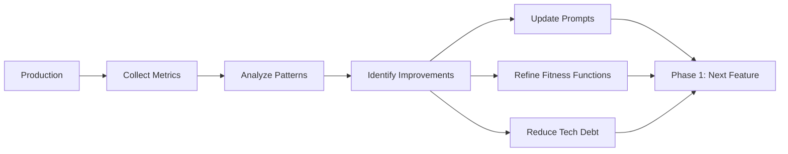

# Phase 6: Evolution

<div style="background: linear-gradient(135deg, #831843 0%, #ec4899 100%); border-radius: 16px; padding: 32px; margin: 32px 0; box-shadow: 0 8px 32px rgba(236, 72, 153, 0.4); border: 1px solid rgba(244, 114, 182, 0.3);">
  <div style="display: flex; align-items: center; gap: 20px; margin-bottom: 20px;">
    <div style="font-size: 56px;">6️⃣</div>
    <div>
      <h2 style="margin: 0; font-size: 32px; color: #f1f5f9; font-weight: 800;">Evolution</h2>
      <div style="font-size: 16px; color: #fce7f3; margin-top: 8px;">Continuous Improvement & Learning</div>
    </div>
  </div>
  <div style="color: #fce7f3; font-size: 15px; line-height: 1.7; margin-bottom: 24px;">
    <strong style="color: #f1f5f9;">Purpose:</strong> Collect metrics, manage technical debt, refine prompts, and continuously improve the development process.
  </div>
  <div style="background: rgba(255, 255, 255, 0.1); border-radius: 12px; padding: 20px;">
    <div style="display: grid; grid-template-columns: repeat(auto-fit, minmax(140px, 1fr)); gap: 12px;">
      <div style="text-align: center; color: #fce7f3; font-size: 13px; font-weight: 600;">Metrics</div>
      <div style="text-align: center; color: #fce7f3; font-size: 13px; font-weight: 600;">Tech Debt</div>
      <div style="text-align: center; color: #fce7f3; font-size: 13px; font-weight: 600;">Prompt Refinement</div>
      <div style="text-align: center; color: #fce7f3; font-size: 13px; font-weight: 600;">Dependencies</div>
      <div style="text-align: center; color: #fce7f3; font-size: 13px; font-weight: 600;">Retrospectives</div>
    </div>
  </div>
</div>

## Metrics Collection



---

## Key Metrics Dashboard

<div style="display: grid; grid-template-columns: repeat(auto-fit, minmax(300px, 1fr)); gap: 20px; margin: 32px 0;">
  <div style="background: linear-gradient(135deg, #1e293b 0%, #0f172a 100%); border-radius: 12px; padding: 24px; border: 1px solid rgba(100, 116, 139, 0.3);">
    <div style="font-size: 32px; margin-bottom: 12px;">🔒</div>
    <h3 style="margin: 0 0 16px 0; font-size: 18px; color: #f1f5f9; font-weight: 700;">Security Metrics</h3>
    <div style="color: #cbd5e1; font-size: 13px; line-height: 1.8;">
      • Vulnerability remediation time<br/>
      • Security scan pass rate<br/>
      • Attack prevention rate<br/>
      • Incident count
    </div>
  </div>

  <div style="background: linear-gradient(135deg, #1e293b 0%, #0f172a 100%); border-radius: 12px; padding: 24px; border: 1px solid rgba(100, 116, 139, 0.3);">
    <div style="font-size: 32px; margin-bottom: 12px;">✨</div>
    <h3 style="margin: 0 0 16px 0; font-size: 18px; color: #f1f5f9; font-weight: 700;">Quality Metrics</h3>
    <div style="color: #cbd5e1; font-size: 13px; line-height: 1.8;">
      • Defect density<br/>
      • Test coverage<br/>
      • Fitness function compliance<br/>
      • Code complexity
    </div>
  </div>

  <div style="background: linear-gradient(135deg, #1e293b 0%, #0f172a 100%); border-radius: 12px; padding: 24px; border: 1px solid rgba(100, 116, 139, 0.3);">
    <div style="font-size: 32px; margin-bottom: 12px;">⚡</div>
    <h3 style="margin: 0 0 16px 0; font-size: 18px; color: #f1f5f9; font-weight: 700;">Efficiency Metrics</h3>
    <div style="color: #cbd5e1; font-size: 13px; line-height: 1.8;">
      • Time to delivery<br/>
      • AI acceptance rate<br/>
      • Prompt reuse rate<br/>
      • Cycle time
    </div>
  </div>
</div>

---

## Prompt Library Iteration

### Tracking Prompt Effectiveness

```markdown
# Prompt Effectiveness Log

## A01: Broken Access Control Prompt (v3)

**Usage Stats**:
- Used: 15 times
- First-try success: 13/15 (87%)
- Failures: 2 (both missing rate limiting)

**Improvements for v4**:
- Add explicit rate limiting requirement
- Include example of rate limiting middleware
- Add checklist item for rate limit tests

**Updated**: 2025-10-10
**Version**: v4
**Success Rate**: Projected 95%
```

### Version Control for Prompts

```bash
/prompts
  /owasp
    /A01_broken_access_control.md  # v4 (latest)
    /archive
      /A01_v3.md
      /A01_v2.md
  /team
    /secure-file-upload.md  # Team-specific
    /api-authentication.md
```

---

## Technical Debt Management

### "Upgrade All The Things" Kata

```markdown
Role: Technical Debt Engineer

Task: Automated dependency upgrade workflow

Process:
1. Run `npm outdated` to identify packages >3 months old
2. For each package:
   a. Check CVEs (Snyk)
   b. Review changelog for breaking changes
   c. Upgrade if patch/minor version
   d. Flag major versions for human review
3. Run tests after each upgrade
4. Revert if tests fail
5. Generate upgrade report

Weekly Schedule:
- Monday: Scan for outdated dependencies
- Tuesday: Upgrade patch versions
- Wednesday: Upgrade minor versions (with review)
- Thursday: Test upgrades
- Friday: Deploy if all tests pass
```

### Technical Debt Backlog

```markdown
| ID | Type | Description | OWASP | Priority | Age |
|----|------|-------------|-------|----------|-----|
| TD-001 | Security | Add MFA to authentication | A07 | High | 2 weeks |
| TD-002 | Complexity | Refactor `processPayment` (complexity 15) | - | Medium | 1 month |
| TD-003 | Dependency | Upgrade `express` 4.x → 5.x | A06 | Medium | 3 months |
| TD-004 | Coverage | Add tests to `legacy-auth` module | - | Low | 6 months |
```

---

## Fitness Function Refinement

### Adjusting Thresholds

```javascript
// Monthly review: Are fitness functions too strict or too loose?

// Before:
complexity: { max: 10 }  // 15% of PRs fail

// After analysis: Reduce false positives
complexity: { max: 12 }  // 5% of PRs fail

// Before:
coverage: { threshold: 80 }  // All PRs pass

// After analysis: Increase rigor
coverage: { threshold: 85 }  // Maintain quality
```

### Adding New Fitness Functions

```markdown
New Fitness Function: API Response Time

Rationale:
- Recent production incidents related to slow queries
- No automated check for performance regressions

Implementation:
```javascript
// scripts/fitness-functions.js

async function checkPerformance() {
  const performanceTests = await runPerformanceTests();

  const p95Threshold = 200; // ms
  const slowEndpoints = performanceTests.filter(t => t.p95 > p95Threshold);

  if (slowEndpoints.length > 0) {
    console.error(`❌ Performance fitness function: FAIL`);
    console.error(`Slow endpoints (p95 > ${p95Threshold}ms):`, slowEndpoints);
    return false;
  }

  console.log('✅ Performance fitness function: PASS');
  return true;
}
```

Enforcement: CI blocks merge if p95 > 200ms
```

---

## Continuous Improvement Examples

### Example 1: Prompt Improvement Cycle

**Week 1**: Use A03 injection prompt (v2)
- Success rate: 80%
- Common failure: Missing length limits

**Week 2**: Update prompt to v3
- Add explicit: "Enforce max length 100 chars"
- Add example: `z.string().max(100)`

**Week 3**: Use A03 injection prompt (v3)
- Success rate: 95%
- Improvement: +15%

**Action**: Promote v3 to standard, archive v2

---

### Example 2: Security Metric → Process Change

**Month 1 Metrics**:
- SQL injection attempts blocked: 250/month
- Source: User search endpoint

**Analysis**:
- High attack rate indicates endpoint is targeted
- Existing controls working (all attempts blocked)
- Opportunity: Add extra layer (WAF)

**Action**:
- Deploy Web Application Firewall
- Add specific rule for SQL injection patterns
- Monitor for reduction in attempts

**Month 2 Metrics**:
- SQL injection attempts blocked: 50/month (80% reduction)
- WAF blocked 200 attempts before reaching app

**Outcome**: Defense-in-depth validated, update SDLC to include WAF config

---

## Evolution Planning

### Quarterly Reviews

```markdown
## Q4 2025 Evolution Review

### What Worked Well
✅ OWASP prompt packs reduced security findings by 60%
✅ Fitness functions caught complexity regressions early
✅ Multi-agent workflows improved large refactoring speed

### What Needs Improvement
❌ Dependency upgrades still manual (time-consuming)
❌ Some prompts too generic (need domain-specific versions)
❌ Test coverage dips on legacy modules

### Actions for Q1 2026
1. Automate dependency upgrades (weekly schedule)
2. Create domain-specific prompts (payments, auth)
3. Target 90% coverage on legacy modules
4. Add performance fitness function to CI

### Metrics to Track
- Dependency age (target: <2 months average)
- Prompt first-try success rate (target: >90%)
- Legacy module coverage (target: 90%)
```

---

## Best Practices

**Do's**:
- Review metrics monthly
- Update prompts based on failures
- Address technical debt incrementally
- Celebrate improvements with team
- Share learnings across organization

**Don'ts**:
- Let dependencies age >3 months
- Ignore patterns in security metrics
- Keep ineffective prompts
- Accumulate technical debt without plan
- Skip retrospectives

---

**[Return to Phase 1: Design →](phase1-design)** (Complete the cycle!)
