# Security Workflow & Golden Rules

This document explains the comprehensive security pipeline for MaintainabilityAI, including CI gates (CodeQL/Snyk), governance, review checklists, and incident response procedures.

---

## Table of Contents

1. [Security Pipeline Overview](#security-pipeline-overview)
2. [Layer 1: IDE Security](#layer-1-ide-security)
3. [Layer 2: Local Checks](#layer-2-local-checks)
4. [Layer 3: Pre-commit Hooks](#layer-3-pre-commit-hooks)
5. [Layer 4: CI/CD Gates](#layer-4-cicd-gates)
6. [Layer 5: Human Review](#layer-5-human-review)
7. [Layer 6: Production Monitoring](#layer-6-production-monitoring)
8. [Integrating Snyk Locally](#integrating-snyk-locally)
9. [PR Security Checklist](#pr-security-checklist)
10. [Incident Response](#incident-response)
11. [Tool Comparison](#tool-comparison)
12. [Best Practices](#best-practices)

---

## Security Pipeline Overview

MaintainabilityAI implements **defense-in-depth** security through six layers:

```mermaid
sequenceDiagram
    participant Dev as Developer
    participant IDE as VS Code<br/>(Claude/Copilot)
    participant Local as Local Checks<br/>(ESLint/Jest)
    participant Git as Pre-commit<br/>(Snyk Code)
    participant CI as CI/CD<br/>(CodeQL/Snyk)
    participant Human as Human Review
    participant Prod as Production

    Dev->>IDE: Write prompt with security constraints
    IDE->>Dev: Generate code suggestion
    Dev->>Local: npm test && npm run lint
    Local-->>Dev: ✅ Pass / ❌ Fail
    Dev->>Git: git commit
    Git->>Git: Run Snyk code scan
    Git-->>Dev: ✅ Pass / ❌ Fail
    Dev->>CI: git push (open PR)
    CI->>CI: CodeQL security analysis
    CI->>CI: Snyk dependency scan
    CI-->>Dev: ✅ Pass / ❌ Fail
    Dev->>Human: Request review
    Human->>Human: Apply Golden Rules checklist
    Human-->>Dev: Approve / Request changes
    Human->>Prod: Merge & Deploy
```



**Key Principle**: Each layer provides overlapping protection. If one layer misses a vulnerability, subsequent layers should catch it.

---

## Layer 1: IDE Security

### Purpose
Prevent vulnerabilities from being written in the first place by using security-first prompts.

### Tools
- **Claude Code** (VS Code extension)
- **GitHub Copilot** (Agent mode)
- **ChatGPT** (VS Code extension)

### How It Works

1. **Use Security-First Prompts**
   - Reference OWASP category: "You are a security engineer implementing A03 - Injection"
   - Specify technology constraints: "Use parameterized queries, no string concatenation"
   - Include security checklist in prompt

2. **Example: Secure by Default**

   **Bad Prompt:**
   ```markdown
   "Create a login function"
   ```

   **Good Prompt:**
   ```markdown
   Role: Security engineer implementing OWASP A07 - Authentication Failures

   Context: Node 18, bcrypt, express-session

   Security Requirements:
   - bcrypt with cost factor 12
   - Rate limiting (5 attempts/15 min)
   - HttpOnly, Secure, SameSite=Strict cookies
   - Cryptographically secure session tokens

   Task: Create login function with these controls
   Checklist: [...]
   ```

3. **Review AI Suggestions Before Accepting**
   - Read generated code line-by-line
   - Verify security controls are present
   - Check for dangerous patterns (eval, SQL concatenation, plaintext secrets)

### Effectiveness
- **Prevents**: 60-70% of common vulnerabilities
- **Catches**: Design-level security issues
- **Fast**: Immediate feedback during coding

---

## Layer 2: Local Checks

### Purpose
Fast feedback loop for code quality and basic security patterns before committing.

### Tools

#### ESLint
**Configuration:** `.eslintrc.cjs`

**Security Rules Enabled:**
- `no-eval`: Prevents eval() usage
- `no-implied-eval`: Prevents Function() constructor
- `@typescript-eslint/no-unsafe-*`: Prevents type-unsafe operations

**Run Command:**
```bash
npm run lint
```

**What It Catches:**
- Dangerous language features (eval, with)
- Type safety violations
- Code quality issues that could mask bugs

**What It Misses:**
- Business logic vulnerabilities
- SQL injection in string templates
- Complex security patterns

---

#### Jest
**Configuration:** `jest.config.ts`

**Security Testing:**
- Unit tests for OWASP vulnerabilities
- Attack payload validation
- Error handling verification

**Run Command:**
```bash
npm test
```

**Example Security Test:**
```typescript
describe('A03 Injection Tests', () => {
  it('should block SQL injection attempts', () => {
    const attackPayloads = [
      "' OR '1'='1",
      "'; DROP TABLE users--",
    ];

    attackPayloads.forEach(payload => {
      expect(() => searchUsers(payload)).toThrow('Invalid search query');
    });
  });
});
```

**What It Catches:**
- Functional security bugs
- Input validation failures
- Error handling issues
- Attack scenarios

**What It Misses:**
- Vulnerabilities in dependencies
- Static code patterns without runtime context

---

### Workflow

```bash
# Before committing, always run:
npm test && npm run lint

# Fix any issues before proceeding
```

### Effectiveness
- **Prevents**: 20-30% of vulnerabilities (catches basic issues)
- **Catches**: Code patterns and functional bugs
- **Fast**: 5-30 seconds execution time

---

## Layer 3: Pre-commit Hooks

### Purpose
Automated security scans before code enters version control.

### Tool: Snyk Code (SAST)

**Setup:**
```bash
# Install Snyk CLI
npm install -g snyk

# Configure pre-commit hook
cat > .git/hooks/pre-commit << 'EOF'
#!/bin/sh
echo "Running Snyk Code scan..."
snyk code test --severity-threshold=high || {
  echo "❌ Snyk found security issues. Fix or run 'git commit --no-verify' to bypass."
  exit 1
}
EOF

chmod +x .git/hooks/pre-commit
```

**What It Catches:**
- SQL injection patterns
- XSS vulnerabilities
- Insecure deserialization
- Path traversal
- Hardcoded secrets

**Example Output:**
```
Testing /path/to/file.ts...

✗ High severity issues:
  [SQL Injection] Unsanitized input in SQL query
    Path: src/users.ts:42
    Issue: User input directly concatenated into SQL query

✗ Medium severity issues:
  [Hardcoded Secret] Potential secret in code
    Path: src/config.ts:15
```

**Bypass (Emergency Only):**
```bash
git commit --no-verify -m "Emergency fix"
```

**Warning:** Only bypass for non-security changes. Document reason in commit message.

### Effectiveness
- **Prevents**: 30-40% of vulnerabilities
- **Catches**: Static code patterns (injection, XSS, secrets)
- **Fast**: 10-60 seconds execution time

---

## Layer 4: CI/CD Gates

### Purpose
Automated security analysis on all PRs before merge.

### Tools

#### CodeQL (SAST)
**Configuration:** `.github/workflows/codeql.yml`

**What It Does:**
- Static analysis security testing (SAST)
- Data flow analysis for vulnerabilities
- Security-extended query pack

**Runs On:**
- Pull requests
- Push to main branch

**What It Catches:**
- SQL injection
- XSS
- Command injection
- Path traversal
- Insecure randomness
- Weak cryptography

**Example Finding:**
```
Query: SQL query built from user-controlled sources
Severity: Error
Path: examples/owasp/A03_injection/insecure.ts:42:15

This query depends on user-provided data:
  42 | const sql = `SELECT * FROM users WHERE email = '${query}'`;
     |             ^^^^^^^^^^^^^^^^^^^^^^^^^^^^^^^^^^^^^^^^^^^

Consider using parameterized queries instead.
```

**Configuration Options:**
```yaml
# .github/workflows/codeql.yml
- uses: github/codeql-action/init@v3
  with:
    languages: javascript
    queries: security-extended  # More thorough than default
```

---

#### Snyk (SCA + SAST)
**Configuration:** `.github/workflows/snyk.yml`

**Two Scan Types:**

1. **Dependency Scanning (SCA)**
   ```bash
   npx snyk test --all-projects --severity-threshold=medium
   ```

   **What It Catches:**
   - Known CVEs in npm packages
   - License compliance issues
   - Outdated dependencies with security fixes

   **Example Finding:**
   ```
   ✗ High severity vulnerability found in express@4.17.1
     CVE-2022-24999: Open Redirect vulnerability
     Fix: Upgrade to express@4.17.3 or later
   ```

2. **Code Scanning (SAST)**
   ```bash
   npx snyk code test --severity-threshold=medium
   ```

   **What It Catches:**
   - Security anti-patterns in your code
   - Similar to CodeQL but different rule sets (complementary)

**Workflow Behavior:**
```yaml
continue-on-error: true  # Doesn't block PR merge
```

**Why Non-Blocking?**
- Allows team to review findings and make informed decisions
- Prevents false positives from blocking legitimate work
- Results uploaded as artifacts for review

**Artifacts:**
- `snyk-test-results.json` - Dependency vulnerabilities
- `snyk-code-results.json` - Code security issues

---

### CI/CD Workflow


### Effectiveness
- **Prevents**: 40-50% of vulnerabilities
- **Catches**: Complex patterns, dependencies, data flow issues
- **Fast**: 2-5 minutes execution time

---

## Layer 5: Human Review

### Purpose
Final security validation using domain expertise and critical thinking.

### The Golden Rules

1. **Be Specific** - Security requirements must be explicit
2. **Trust but Verify** - Never merge code you don't understand
3. **Treat AI Like a Junior Dev** - Guide, review, and mentor
4. **Isolate AI Changes** - Separate commits/PRs, label them
5. **Document Rationale** - Explain the "why", not just the "what"
6. **Share Winning Prompts** - Build team prompt library

See [`governance/vibe-golden-rules.md`](governance/vibe-golden-rules.md) for detailed examples.

---

### PR Review Checklist

#### Security Review

- [ ] **Understand Every Line**
  - Can I explain this code to a teammate?
  - Do I understand the security implications?
  - Are there any patterns I don't recognize?

- [ ] **Verify Security Controls**
  - Input validation present and correct?
  - Output encoding appropriate for context?
  - Error messages don't leak sensitive info?
  - Authentication/authorization checks in place?

- [ ] **Check Edge Cases**
  - What happens with empty input?
  - What happens with null/undefined?
  - What happens when external service fails?
  - What happens under high load/concurrency?

- [ ] **Review Dependencies**
  - Are new dependencies necessary?
  - Are versions pinned in package.json?
  - Any known vulnerabilities in new dependencies?

- [ ] **Verify Tests**
  - Do tests cover security scenarios?
  - Do tests validate error conditions?
  - Are attack payloads tested?

#### AI Disclosure Review

- [ ] **AI Usage Documented**
  - Commit message includes 🤖 AI-assisted label?
  - Which tool was used (Claude Code, Copilot, ChatGPT)?
  - Which prompt pack was referenced?

- [ ] **Prompt Quality**
  - Was security-first prompting used?
  - Were OWASP categories referenced?
  - Were constraints and checklists included?

#### Code Quality Review

- [ ] **Maintainability**
  - Code is readable and well-structured?
  - Comments explain "why", not just "what"?
  - No unnecessary complexity?

- [ ] **Performance**
  - No obvious performance issues?
  - Database queries optimized?
  - No N+1 query patterns?

---

### Review Comments Examples

**Good Review Comments:**

```markdown
💬 Security Concern: This regex allows unicode characters which could bypass validation.
Consider: `/^[a-zA-Z0-9 _.-@]+$/` (explicit allowlist)

💬 Edge Case: What happens if `userId` is undefined? Add null check before database query.

💬 Test Coverage: Please add test case for SQL injection payload: "' OR '1'='1"

✅ Approved: Security controls look good. Nice use of parameterized queries!
```

**Avoid Vague Comments:**

```markdown
❌ "Looks fine" - Too vague, no security review
❌ "Fix the security issue" - Not specific enough
❌ "Use prepared statements" - Better: "Replace line 42 with parameterized query: db.query($1)"
```

---

### When to Request Changes

**Block Merge If:**
- Security vulnerability present (SQL injection, XSS, etc.)
- No tests for security-critical code
- Hardcoded secrets or credentials
- AI-generated code not properly reviewed
- Dependencies with known critical CVEs

**Request Changes (Non-Blocking) If:**
- Edge cases not handled
- Error messages could be improved
- Tests could be more comprehensive
- Code could be more readable
- Documentation missing

---

### Effectiveness
- **Prevents**: 10-20% of vulnerabilities (catches what automation misses)
- **Catches**: Business logic flaws, domain-specific issues, novel attacks
- **Slow**: 15-60 minutes per PR

---

## Layer 6: Production Monitoring

### Purpose
Detect and respond to security issues in production.

### Monitoring Strategies

#### Application Logs
```typescript
// Log security events
logger.warn('Blocked invalid search query', {
  userId: req.user?.id,
  error: 'Invalid characters in search query',
  // Note: NOT logging the actual query (could contain attack payload)
});
```

**Monitor For:**
- High frequency of blocked inputs (possible attack)
- Unusual error rates (possible exploit attempt)
- Failed authentication attempts (brute force)

#### Error Tracking
- Monitor generic error rates: "Search failed", "Operation failed"
- Investigate spikes (could indicate new attack vector)
- Correlate with deployment times (regression detection)

#### Security Metrics
- Track vulnerabilities found at each layer
- Measure time-to-fix for security issues
- Monitor dependency vulnerability counts

#### Incident Response
See [Incident Response](#incident-response) section below.

---

## Integrating Snyk Locally

### Installation

```bash
# Install Snyk CLI globally
npm install -g snyk

# Authenticate (optional for public repos, required for private)
snyk auth
```

### Local Scanning Workflow

#### 1. Before Starting Work
```bash
# Scan dependencies for vulnerabilities
snyk test

# Expected output:
# ✓ Tested 543 dependencies for known issues, no vulnerable paths found.
```

#### 2. During Development
```bash
# Scan your code changes
snyk code test

# Expected output:
# ✓ No issues found
# or
# ✗ 2 issues found:
#   [Medium] SQL Injection in src/users.ts:42
```

#### 3. Before Committing
```bash
# Run both scans
snyk test && snyk code test

# Or add to pre-commit hook (see Layer 3)
```

### Snyk Policy File

**Purpose:** Configure Snyk behavior (ignore false positives, set thresholds)

**File:** `snyk.policy` (root directory)

**Example:**
```yaml
# Snyk policy file
version: v1.25.0

# Ignore specific vulnerabilities (with justification)
ignore:
  SNYK-JS-LODASH-567746:
    - lodash:
      reason: "False positive - we don't use vulnerable function"
      expires: 2025-12-31

# Fail build on high/critical only
fail-on:
  - high
  - critical

# Patch rules
patch: {}
```

### Snyk Autofix

**Feature:** Automatically upgrade vulnerable dependencies

```bash
# Generate fix PR (if using Snyk GitHub integration)
snyk wizard

# Or manually apply fixes
snyk fix
```

**Example:**
```bash
$ snyk fix

Fixing vulnerabilities...

✓ Upgraded express from 4.17.1 to 4.18.2
✓ Upgraded lodash from 4.17.20 to 4.17.21

2 vulnerabilities fixed
```

---

## PR Security Checklist

Use this checklist when reviewing security-related PRs:

### Pre-Review

- [ ] All CI checks passed (CodeQL, Snyk, Jest, ESLint)
- [ ] Review Snyk artifacts if any issues found
- [ ] Read PR description and understand the changes

### Security Controls

- [ ] **Input Validation**
  - All user inputs validated?
  - Allowlist validation used (not blocklist)?
  - Length limits enforced?
  - Type checking present?

- [ ] **Output Encoding**
  - Output encoded for context (HTML, SQL, JSON, etc.)?
  - No raw user input in responses?

- [ ] **Authentication/Authorization**
  - Auth checks present on protected endpoints?
  - Horizontal access control verified (user can only access their data)?
  - Vertical access control verified (role/permission checks)?

- [ ] **Error Handling**
  - Generic error messages to clients?
  - Detailed logging server-side?
  - No stack traces or schema details exposed?

- [ ] **Cryptography**
  - Strong algorithms used (AES-256, bcrypt, etc.)?
  - Cryptographically secure random values (crypto.randomBytes)?
  - No hardcoded secrets or keys?

- [ ] **Dependencies**
  - New dependencies justified?
  - Versions pinned in package.json?
  - No known CVEs in dependencies?

### Testing

- [ ] **Security Tests Present**
  - Tests for attack scenarios?
  - Tests for error conditions?
  - Tests for edge cases?

- [ ] **Test Coverage**
  - Critical paths covered?
  - Both positive and negative test cases?

### Documentation

- [ ] **AI Disclosure**
  - If AI-assisted, commit labeled with 🤖?
  - Tool and prompt pack documented?

- [ ] **Security Rationale**
  - Why these controls were chosen?
  - What threats are being mitigated?

### Approval Decision

**Approve If:**
- ✅ All security controls present and correct
- ✅ Tests comprehensive
- ✅ No vulnerabilities found
- ✅ Code is understandable

**Request Changes If:**
- ❌ Security vulnerability present
- ❌ Missing tests for security-critical code
- ❌ Unclear or complex code
- ❌ CI checks failing

**Comment (Non-Blocking) If:**
- 💬 Minor improvements possible
- 💬 Edge cases could be handled better
- 💬 Documentation could be improved

---

## Incident Response

### Security Finding in Production

#### Phase 1: Detection (Minutes)

1. **Identify the Issue**
   - Alert triggered (monitoring, user report, security researcher)
   - Determine severity (Critical, High, Medium, Low)
   - Affected component(s) and versions

2. **Immediate Actions**
   - Log incident with timestamp and details
   - Notify security team
   - Create incident ticket

#### Phase 2: Containment (Hours)

1. **Assess Impact**
   - What data could be exposed?
   - How many users affected?
   - Is exploit active in the wild?

2. **Stop the Bleeding**
   - Disable affected feature (feature flag)?
   - Deploy emergency patch?
   - Rollback to safe version?

3. **Document Timeline**
   - When was vulnerability introduced?
   - When was it first exploited (if known)?
   - What actions taken when?

#### Phase 3: Remediation (Days)

1. **Fix the Vulnerability**
   - Apply security patch
   - Add regression tests
   - Run full security scan

2. **Verify Fix**
   - Penetration testing
   - Code review
   - Run all security gates (CodeQL, Snyk)

3. **Deploy to Production**
   - Emergency deployment process
   - Monitor for issues
   - Verify fix in production

#### Phase 4: Recovery (Weeks)

1. **Data Breach Response (if applicable)**
   - Identify affected users
   - Notify users per legal requirements
   - Offer remediation (password reset, credit monitoring, etc.)

2. **Post-Incident Review**
   - What went wrong?
   - Why didn't our security layers catch it?
   - How can we prevent similar issues?

3. **Process Improvements**
   - Update security gates?
   - Add new test cases?
   - Update prompt library?
   - Enhanced monitoring?

---

### Example Incident: SQL Injection Found in Production

**Timeline:**

```
T+0h:   Security researcher reports SQL injection in search endpoint
T+0.5h: Severity assessed as Critical, incident team assembled
T+1h:   Affected code identified (searchUsers function)
T+2h:   Emergency patch developed using A03 prompt pack
T+3h:   Patch reviewed and tested
T+4h:   Patch deployed to production
T+6h:   Fix verified, monitoring for exploitation
T+24h:  No exploitation detected, incident review scheduled
T+1w:   Post-incident review completed, processes updated
```

**Root Cause:**
- AI-generated code without security-first prompt
- Insufficient code review (Golden Rule #2 violated)
- Missing test case for SQL injection

**Preventive Measures:**
- Mandatory security-first prompts for all AI-assisted code
- Enhanced PR checklist with SQL injection test requirement
- Added pre-commit hook for Snyk Code scan
- Updated prompt library with A03 examples

---

## Tool Comparison

### When to Use Each Tool

| Tool | Type | Best For | Speed | Coverage |
|------|------|----------|-------|----------|
| **ESLint** | Linter | Code quality, basic security patterns | Fast (seconds) | Low |
| **Jest** | Testing | Functional security, attack scenarios | Fast (seconds) | Medium |
| **Snyk Code** | SAST | Code vulnerabilities, secrets | Fast (1-2 min) | Medium |
| **CodeQL** | SAST | Deep data flow analysis | Medium (3-5 min) | High |
| **Snyk Test** | SCA | Dependency vulnerabilities | Fast (1-2 min) | High |

### Overlapping Coverage

```
ESLint: [eval(), unsafe types]
Jest:   [SQL injection (runtime), validation logic, errors]
Snyk:   [SQL injection (static), secrets, dependencies]
CodeQL: [SQL injection (data flow), XSS, command injection]
```

**Key Insight:** Tools are complementary, not redundant. Each catches different aspects of security issues.

---

### Tool Selection by Project Phase

| Phase | Primary Tools | Secondary Tools |
|-------|---------------|-----------------|
| **Development** | IDE prompts, ESLint | Snyk Code (local) |
| **Pre-commit** | Snyk Code, Jest | ESLint |
| **CI/CD** | CodeQL, Snyk, Jest | ESLint |
| **Review** | Human, PR checklist | All tool outputs |
| **Production** | Monitoring, logs | Snyk (ongoing scans) |

---

## Best Practices

### For Developers

1. **Write Security-First Prompts**
   - Use OWASP prompt packs from `/prompts/owasp/`
   - Include role, context, requirements, task, checklist
   - Reference specific CVEs or attack vectors

2. **Run Local Checks Before Committing**
   ```bash
   npm test && npm run lint && snyk code test
   ```

3. **Label AI-Assisted Commits**
   ```bash
   git commit -m "fix(A03): SQL injection remediation

   🤖 AI-assisted with Claude Code using prompts/owasp/A03_injection.md"
   ```

4. **Don't Bypass Security Gates**
   - If pre-commit hook fails, fix the issue
   - Only use `--no-verify` for emergencies (and document why)

---

### For Reviewers

1. **Apply Golden Rules**
   - Trust but verify (Rule #2)
   - Treat AI like junior dev (Rule #3)

2. **Check CI Artifacts**
   - Review Snyk results even if non-blocking
   - Investigate any CodeQL warnings

3. **Verify AI-Assisted Code**
   - Extra scrutiny for AI-generated security code
   - Ensure security-first prompt was used
   - Check that all checklist items addressed

4. **Be Specific in Feedback**
   - Point to specific lines
   - Explain the security concern
   - Suggest concrete fixes

---

### For Teams

1. **Build Prompt Library**
   - Document successful prompts
   - Customize OWASP packs for your stack
   - Share learnings across team

2. **Track Security Metrics**
   - Vulnerabilities found at each layer
   - Time-to-fix for security issues
   - False positive rates

3. **Regular Security Training**
   - OWASP Top 10 review
   - Secure coding workshops
   - Prompt engineering for security

4. **Incident Response Drills**
   - Practice security incident response
   - Test escalation procedures
   - Review and update playbooks

---

## Additional Resources

- **OWASP Top 10 (2021)**: https://owasp.org/Top10/
- **OWASP Cheat Sheet Series**: https://cheatsheetseries.owasp.org/
- **Snyk Documentation**: https://docs.snyk.io/
- **CodeQL Documentation**: https://codeql.github.com/docs/
- **This Repo's Prompt Packs**: `/prompts/owasp/`
- **This Repo's Golden Rules**: `/docs/governance/vibe-golden-rules.md`

---

## Summary

**Defense-in-Depth Security Pipeline:**

1. **IDE**: Security-first prompts (60-70% prevention)
2. **Local**: ESLint + Jest (20-30% prevention)
3. **Pre-commit**: Snyk Code (30-40% prevention)
4. **CI/CD**: CodeQL + Snyk (40-50% prevention)
5. **Human**: Code review with Golden Rules (10-20% prevention)
6. **Production**: Monitoring and incident response

**Total Coverage:** ~90-95% of common vulnerabilities prevented or caught before production

**Key Takeaway:** Security is a team sport. Tools automate detection, but humans provide context, judgment, and adaptation to novel threats.

---

**Questions?** Open an issue or see the workshop modules in `/docs/workshop/`.
